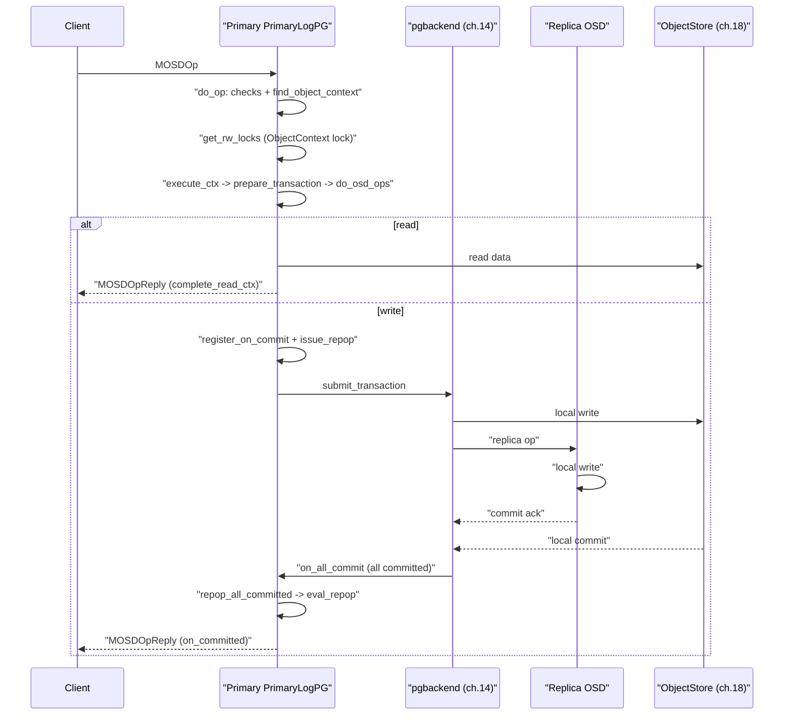

# 第13章 PrimaryLogPG の I/O パイプライン

> **本章で読むソース**
>
> - [`src/osd/PrimaryLogPG.h`](https://github.com/ceph/ceph/blob/v20.2.2/src/osd/PrimaryLogPG.h)
> - [`src/osd/PrimaryLogPG.cc`](https://github.com/ceph/ceph/blob/v20.2.2/src/osd/PrimaryLogPG.cc)
> - [`src/osd/OpRequest.h`](https://github.com/ceph/ceph/blob/v20.2.2/src/osd/OpRequest.h)

## この章の狙い

RADOS に届いたクライアントの read/write は、最終的に PG のプライマリ OSD 上で `PrimaryLogPG` が処理する。
本章はその中核を追う。
`do_op` が op を受け取り、`OpContext` を作り、`prepare_transaction` と `do_osd_ops` で ObjectStore へのトランザクションを組み立て、`issue_repop` でレプリカへ送り、全レプリカのコミットと自身のコミットが揃った時点でクライアントへ応答するまでの一続きの流れを、実際のコードで確認する。

read と write では経路が分かれる。
read は自 OSD 内で完結し、write はレプリケーションを伴う。
この分岐がどこで生じ、write の応答条件がどう表現されているかを読み解くことが本章の主題である。

レプリカへ実際にトランザクションを送り届ける下位層である `ReplicatedBackend` の内部は第14章に委ね、本章はプライマリ側のパイプラインに集中する。

## 前提

第11章で OSD デーモンが op をシャードのワークキューへ載せ、`PGOpItem` として PG へディスパッチする流れを扱った。
第12章で `PeeringState` が acting セットと up セットを定め、PG が active になる過程を扱った。
本章はその先、active な PG のプライマリがクライアント op を処理する段である。
ObjectStore の `Transaction` の中身は第18章、`ObjectContext`（obc）が保持するオブジェクトのメタデータ（`object_info_t`、`SnapSet`）の扱いは recovery を扱う第16章とも関わる。

## do_op：op の受け口と前処理

クライアント op の入口は `do_op` である。
引数は op をラップした `OpRequestRef` で、中身は `MOSDOp` メッセージである。

[`src/osd/PrimaryLogPG.cc` L2001-L2007](https://github.com/ceph/ceph/blob/v20.2.2/src/osd/PrimaryLogPG.cc#L2001-L2007)

```cpp
void PrimaryLogPG::do_op(OpRequestRef& op)
{
  FUNCTRACE(cct);
  // NOTE: take a non-const pointer here; we must be careful not to
  // change anything that will break other reads on m (operator<<).
  MOSDOp *m = static_cast<MOSDOp*>(op->get_nonconst_req());
  ceph_assert(m->get_type() == CEPH_MSG_OSD_OP);
```

`do_op` の前半は防御的な検査の連続である。
対象オブジェクトがこの PG に属するか、自 OSD がこの op を処理すべきプライマリか、cap（`Capability`）が十分か、オブジェクト名が長すぎないかを順に確かめ、いずれかに反すればここでエラー応答するか誤配送として扱う。
op が read か write かは `OpRequest` が `OpInfo` から判定する。

[`src/osd/OpRequest.h` L37-L40](https://github.com/ceph/ceph/blob/v20.2.2/src/osd/OpRequest.h#L37-L40)

```cpp
  bool may_read() const { return op_info.may_read(); }
  bool may_read_data() const { return op_info.may_read_data(); }
  bool may_write() const { return op_info.may_write(); }
  bool may_cache() const { return op_info.may_cache(); }
```

前処理を抜けると、対象オブジェクトの `ObjectContext` を取得する。
`find_object_context` は obc をキャッシュから引くか読み込み、snap 指定があればクローンを解決する。

[`src/osd/PrimaryLogPG.cc` L2360-L2363](https://github.com/ceph/ceph/blob/v20.2.2/src/osd/PrimaryLogPG.cc#L2360-L2363)

```cpp
  int r = find_object_context(
    oid, &obc, can_create,
    m->has_flag(CEPH_OSD_FLAG_MAP_SNAP_CLONE),
    &missing_oid);
```

オブジェクトがまだ手元になく recovery を待つ必要があるなら、この段で op はキューへ戻され、後で再実行される。

## OpContext：1つの op の作業台

obc が揃うと、この op 1回分の作業状態をまとめる `OpContext` を確保する。

[`src/osd/PrimaryLogPG.cc` L2479-L2499](https://github.com/ceph/ceph/blob/v20.2.2/src/osd/PrimaryLogPG.cc#L2479-L2499)

```cpp
  OpContext *ctx = new OpContext(op, m->get_reqid(), &m->ops, obc, this);

  if (m->has_flag(CEPH_OSD_FLAG_SKIPRWLOCKS)) {
    dout(20) << __func__ << ": skipping rw locks" << dendl;
  } else if (m->get_flags() & CEPH_OSD_FLAG_FLUSH) {
    dout(20) << __func__ << ": part of flush, will ignore write lock" << dendl;

    // verify there is in fact a flush in progress
    // FIXME: we could make this a stronger test.
    map<hobject_t,FlushOpRef>::iterator p = flush_ops.find(obc->obs.oi.soid);
    if (p == flush_ops.end()) {
      dout(10) << __func__ << " no flush in progress, aborting" << dendl;
      reply_ctx(ctx, -EINVAL);
      return;
    }
  } else if (!get_rw_locks(write_ordered, ctx)) {
    dout(20) << __func__ << " waiting for rw locks " << dendl;
    op->mark_delayed("waiting for rw locks");
    close_op_ctx(ctx);
    return;
  }
```

`OpContext` は old と new の `ObjectState`、組み立て中のトランザクション `op_t`、統計差分、PG ログエントリ、そして「コミット時」「成功時」「終了時」に走らせるコールバックのリストを1つに束ねる。

[`src/osd/PrimaryLogPG.h` L678-L691](https://github.com/ceph/ceph/blob/v20.2.2/src/osd/PrimaryLogPG.h#L678-L691)

```cpp
  struct OpContext {
    OpRequestRef op;
    osd_reqid_t reqid;
    std::vector<OSDOp> *ops;

    const ObjectState *obs; // Old objectstate
    const SnapSet *snapset; // Old snapset

    ObjectState new_obs;  // resulting ObjectState
    SnapSet new_snapset;  // resulting SnapSet (in case of a write)
    //pg_stat_t new_stats;  // resulting Stats
    object_stat_sum_t delta_stats;

    bool modify;          // (force) modification (even if op_t is empty)
```

## ordering：ObjectContext ロックによる直列化

同一オブジェクトへの複数の op が並行して走ると、更新の順序が乱れる。
`PrimaryLogPG` はこれを `ObjectContext` に紐づく read/write ロックで直列化する。
`get_rw_locks` が op の種別からロック種別を選ぶ。

[`src/osd/PrimaryLogPG.cc` L1698-L1709](https://github.com/ceph/ceph/blob/v20.2.2/src/osd/PrimaryLogPG.cc#L1698-L1709)

```cpp
  if (write_ordered && ctx->op->may_read()) {
    if (ctx->op->may_read_data()) {
      ctx->lock_type = RWState::RWEXCL;
    } else {
      ctx->lock_type = RWState::RWWRITE;
    }
  } else if (write_ordered) {
    ctx->lock_type = RWState::RWWRITE;
  } else {
    ceph_assert(ctx->op->may_read());
    ctx->lock_type = RWState::RWREAD;
  }
```

純粋な read は `RWREAD` を取り、他の read と共存できる。
write は `RWWRITE` を取り、同じオブジェクトへの他の write を排他する。
read と write を同時に含む op は `RWEXCL` を取り、read も write もすべて排他する。
ロックが取れなければ、先ほどの `do_op` の分岐で `OpContext` を破棄し、op を待機列へ戻す。
このロックは write が完了するまで保持される。
複数レプリカへの伝播が完了する前に次の write が同じオブジェクトへ割り込むと版が逆転するため、直列化はプライマリ側で write の完了まで維持しなければならない。

ロックまで取れた write op は `execute_ctx` へ進む。

[`src/osd/PrimaryLogPG.cc` L2543](https://github.com/ceph/ceph/blob/v20.2.2/src/osd/PrimaryLogPG.cc#L2543)

```cpp
  execute_ctx(ctx);
```

## execute_ctx：トランザクションの組み立てと分岐

`execute_ctx` はパイプラインの本体である。
冒頭で結果トランザクション `op_t` を作り直す。
このメソッドは EC の非同期 read などで複数回呼ばれうるため、べき等であることが求められる。

[`src/osd/PrimaryLogPG.cc` L4196-L4208](https://github.com/ceph/ceph/blob/v20.2.2/src/osd/PrimaryLogPG.cc#L4196-L4208)

```cpp
void PrimaryLogPG::execute_ctx(OpContext *ctx)
{
  FUNCTRACE(cct);
  dout(10) << __func__ << " " << ctx << dendl;
  ctx->reset_obs(ctx->obc);
  ctx->update_log_only = false; // reset in case finish_copyfrom() is re-running execute_ctx
  OpRequestRef op = ctx->op;
  auto m = op->get_req<MOSDOp>();
  ObjectContextRef obc = ctx->obc;
  const hobject_t& soid = obc->obs.oi.soid;

  // this method must be idempotent since we may call it several times
  // before we finally apply the resulting transaction.
  ctx->op_t.reset(new PGTransaction);
```

write の場合はここで snap context を確定し、`at_version`（このオブジェクトの次の版）を割り当てる。
続いて `prepare_transaction` を呼び、実際の op 群を処理してトランザクションを構築する。

[`src/osd/PrimaryLogPG.cc` L4260](https://github.com/ceph/ceph/blob/v20.2.2/src/osd/PrimaryLogPG.cc#L4260)

```cpp
  int result = prepare_transaction(ctx);
```

`prepare_transaction` の結果、トランザクションが空なら（read か、書き込みを伴わない op なら）write の経路には入らない。

[`src/osd/PrimaryLogPG.cc` L4315-L4322](https://github.com/ceph/ceph/blob/v20.2.2/src/osd/PrimaryLogPG.cc#L4315-L4322)

```cpp
  // read or error?
  if ((ctx->op_t->empty() || result < 0) && !ctx->update_log_only) {
    // finish side-effects
    if (result >= 0)
      do_osd_op_effects(ctx, m->get_connection());

    complete_read_ctx(result, ctx);
    return;
  }
```

read はここで `complete_read_ctx` に入り、応答をその場でクライアントへ送って `OpContext` を閉じる。
レプリカへの往復は発生しない。

[`src/osd/PrimaryLogPG.cc` L9217-L9221](https://github.com/ceph/ceph/blob/v20.2.2/src/osd/PrimaryLogPG.cc#L9217-L9221)

```cpp
  reply->set_result(result);
  reply->add_flags(CEPH_OSD_FLAG_ACK | CEPH_OSD_FLAG_ONDISK);
  osd->send_message_osd_client(reply, m->get_connection());
  close_op_ctx(ctx);
}
```

## do_osd_ops と prepare_transaction：op コードごとの処理

`prepare_transaction` はまず `do_osd_ops` を呼んで、op に含まれる各サブ op を1つずつ処理する。

[`src/osd/PrimaryLogPG.cc` L8977-L8988](https://github.com/ceph/ceph/blob/v20.2.2/src/osd/PrimaryLogPG.cc#L8977-L8988)

```cpp
int PrimaryLogPG::prepare_transaction(OpContext *ctx)
{
  ceph_assert(!ctx->ops->empty());

  // valid snap context?
  if (!ctx->snapc.is_valid()) {
    dout(10) << " invalid snapc " << ctx->snapc << dendl;
    return -EINVAL;
  }

  // prepare the actual mutation
  int result = do_osd_ops(ctx, *ctx->ops);
```

`do_osd_ops` は `ctx->ops` を先頭から走査し、op コードごとに `switch` で分岐して処理する巨大なループである。
1つの `MOSDOp` は複数のサブ op を運べる。
`CEPH_OSD_OP_READ`、`CEPH_OSD_OP_WRITE`、`CEPH_OSD_OP_SETXATTR`、`CEPH_OSD_OP_CALL` などがそれぞれの `case` に対応する。

[`src/osd/PrimaryLogPG.cc` L6039-L6041](https://github.com/ceph/ceph/blob/v20.2.2/src/osd/PrimaryLogPG.cc#L6039-L6041)

```cpp
  ctx->current_osd_subop_num = 0;
  for (auto p = ops.begin(); p != ops.end(); ++p, ctx->current_osd_subop_num++, ctx->processed_subop_count++) {
    OSDOp& osd_op = *p;
```

read サブ op はオブジェクトからデータを読んで応答バッファへ積む。
write サブ op は `ctx->op_t`（`PGTransaction`）へ変更を追記するだけで、まだディスクには書かない。
1つの op に含まれる複数のサブ op はこの単一の `PGTransaction` にまとめて積まれ、後で一括して ObjectStore へ渡る。

`do_osd_ops` が成功すると、write では `make_writeable` でクローン生成の要否を判断し、`finish_ctx` で PG ログエントリを組み立てて `OpContext` を write 用に仕上げる。

[`src/osd/PrimaryLogPG.cc` L9031-L9040](https://github.com/ceph/ceph/blob/v20.2.2/src/osd/PrimaryLogPG.cc#L9031-L9040)

```cpp
  const hobject_t& soid = ctx->obs->oi.soid;
  // clone, if necessary
  if (soid.snap == CEPH_NOSNAP)
    make_writeable(ctx);

  finish_ctx(ctx,
	     ctx->new_obs.exists ? pg_log_entry_t::MODIFY :
	     pg_log_entry_t::DELETE,
	     result);
```

## write の応答条件とコールバックの登録

`execute_ctx` に戻ると、write の経路では応答をすぐには送らない。
代わりに、コミットが揃ったときに走らせるコールバックを `OpContext` へ登録する。

[`src/osd/PrimaryLogPG.cc` L4379-L4412](https://github.com/ceph/ceph/blob/v20.2.2/src/osd/PrimaryLogPG.cc#L4379-L4412)

```cpp
  ctx->register_on_commit(
    [m, ctx, this](){
      if (ctx->op)
	log_op_stats(*ctx->op, ctx->bytes_written, ctx->bytes_read);

      if (m && !ctx->sent_reply) {
	MOSDOpReply *reply = ctx->reply;
	ctx->reply = nullptr;
	reply->add_flags(CEPH_OSD_FLAG_ACK | CEPH_OSD_FLAG_ONDISK);
	dout(10) << " sending reply on " << *m << " " << reply << dendl;
	osd->send_message_osd_client(reply, m->get_connection());
	ctx->sent_reply = true;
	ctx->op->mark_commit_sent();
      }
    });
  ctx->register_on_success(
    [ctx, this]() {
      do_osd_op_effects(
	ctx,
	ctx->op ? ctx->op->get_req()->get_connection() :
	ConnectionRef());
    });
  ctx->register_on_finish(
    [ctx]() {
      delete ctx;
    });

  // issue replica writes
  ceph_tid_t rep_tid = osd->get_tid();

  RepGather *repop = new_repop(ctx, rep_tid);

  issue_repop(repop, ctx);
  eval_repop(repop);
  repop->put();
```

クライアントへの応答は `register_on_commit` に登録したラムダの中にある。
この時点では応答は送られず、コミットが揃った将来のタイミングまで遅延される。
`register_on_commit` は `on_committed` リストへコールバックを積むだけである。

[`src/osd/PrimaryLogPG.h` L769-L771](https://github.com/ceph/ceph/blob/v20.2.2/src/osd/PrimaryLogPG.h#L769-L771)

```cpp
    void register_on_commit(F &&f) {
      on_committed.emplace_back(std::forward<F>(f));
    }
```

続いて `new_repop` で `RepGather`（この write の複製進行を追う構造体）を作り、`OpContext` からコールバック群を引き取る。
そして `issue_repop` でレプリカへ送り、`eval_repop` で完了判定を1度試みる。

## issue_repop：レプリカへの伝播

`issue_repop` は `OpContext` が握るトランザクション `op_t` と PG ログ `log` を `pgbackend`（`ReplicatedBackend` か `ECBackend`）へ渡す。

[`src/osd/PrimaryLogPG.cc` L11512-L11537](https://github.com/ceph/ceph/blob/v20.2.2/src/osd/PrimaryLogPG.cc#L11512-L11537)

```cpp
  Context *on_all_commit = new C_OSD_RepopCommit(this, repop);
  if (!(ctx->log.empty())) {
    ceph_assert(ctx->at_version >= projected_last_update);
    projected_last_update = ctx->at_version;
  }
  for (auto &&entry: ctx->log) {
    projected_log.add(entry);
  }

  recovery_state.pre_submit_op(
    soid,
    ctx->log,
    ctx->at_version);
  pgbackend->submit_transaction(
    soid,
    ctx->delta_stats,
    ctx->at_version,
    std::move(ctx->op_t),
    recovery_state.get_pg_trim_to(),
    recovery_state.get_pg_committed_to(),
    std::move(ctx->log),
    ctx->updated_hset_history,
    on_all_commit,
    repop->rep_tid,
    ctx->reqid,
    ctx->op);
```

ここで作る `on_all_commit`（`C_OSD_RepopCommit`）が要である。
`pgbackend` はプライマリ自身のローカル書き込みを ObjectStore へ発行し、同時にレプリカ OSD へトランザクションを送る。
すべての適用先からコミット確認が返ったとき、バックエンドがこの `on_all_commit` を呼ぶ。
プライマリのローカル書き込みとレプリカへの送信をどう進め、コミット確認をどう集約するかが `ReplicatedBackend` の役割であり、第14章で扱う。

## コミット集約とクライアント応答

`C_OSD_RepopCommit` が呼ばれると `repop_all_committed` に入り、`RepGather` の `all_committed` を立てる。

[`src/osd/PrimaryLogPG.cc` L11417-L11427](https://github.com/ceph/ceph/blob/v20.2.2/src/osd/PrimaryLogPG.cc#L11417-L11427)

```cpp
void PrimaryLogPG::repop_all_committed(RepGather *repop)
{
  dout(10) << __func__ << ": repop tid " << repop->rep_tid << " all committed "
	   << dendl;
  repop->all_committed = true;
  if (!repop->rep_aborted) {
    if (repop->v != eversion_t()) {
      recovery_state.complete_write(repop->v, repop->pg_local_last_complete);
    }
    eval_repop(repop);
  }
}
```

`all_committed` は「自 OSD を含む全レプリカがこの write を永続化した」ことを表す1つのフラグである。

[`src/osd/PrimaryLogPG.h` L873-L874](https://github.com/ceph/ceph/blob/v20.2.2/src/osd/PrimaryLogPG.h#L873-L874)

```cpp
    bool rep_aborted;
    bool all_committed;
```

`eval_repop` はこのフラグを見て、立っていれば `on_committed` に積まれたコールバックを実行する。
そのコールバックの中身が、先ほど `register_on_commit` で登録したクライアント応答である。

[`src/osd/PrimaryLogPG.cc` L11444-L11456](https://github.com/ceph/ceph/blob/v20.2.2/src/osd/PrimaryLogPG.cc#L11444-L11456)

```cpp
void PrimaryLogPG::eval_repop(RepGather *repop)
{
  dout(10) << "eval_repop " << *repop
    << (repop->op && repop->op->get_req<MOSDOp>() ? "" : " (no op)") << dendl;

  // ondisk?
  if (repop->all_committed) {
    dout(10) << " commit: " << *repop << dendl;
    for (auto p = repop->on_committed.begin();
	 p != repop->on_committed.end();
	 repop->on_committed.erase(p++)) {
      (*p)();
    }
```

`eval_repop` は `issue_repop` の直後にも1度呼ばれる（前掲 L4412）。
そのときはまだ `all_committed` が立っていないので何もしない。
実際に応答が飛ぶのは、後からバックエンド経由で `repop_all_committed` が発火した2度目以降である。
コミットが揃った `RepGather` は `repop_queue` の先頭から順に取り除かれ、`on_success` コールバック（`do_osd_op_effects` によるウォッチ通知などの副作用）が走り、最後に `OpContext` が破棄されてロックが解放される。

## log_op_stats：レイテンシと転送量の記録

応答を送る直前に `log_op_stats` が op のレイテンシと転送バイト数をパフォーマンスカウンタへ記録する。

[`src/osd/PrimaryLogPG.cc` L4435-L4451](https://github.com/ceph/ceph/blob/v20.2.2/src/osd/PrimaryLogPG.cc#L4435-L4451)

```cpp
void PrimaryLogPG::log_op_stats(const OpRequest& op,
				const uint64_t inb,
				const uint64_t outb)
{
  auto m = op.get_req<MOSDOp>();
  const utime_t now = ceph_clock_now();

  const utime_t latency = now - m->get_recv_stamp();
  const utime_t process_latency = now - op.get_dequeued_time();

  osd->logger->inc(l_osd_op);

  osd->logger->inc(l_osd_op_outb, outb);
  osd->logger->inc(l_osd_op_inb, inb);
  osd->logger->tinc(l_osd_op_lat, latency);
  osd->logger->tinc(l_osd_op_process_lat, process_latency);
```

read では `complete_read_ctx` から、write では `on_committed` コールバックから、いずれもクライアント応答の直前に呼ばれる。
op を受信した時刻からの全体レイテンシと、キューから取り出した時刻からの処理レイテンシを別々に測る点が、キュー待ちと実処理を切り分けた計測になっている。

## 全体のシーケンス

do_op から応答までを、プライマリとレプリカのやり取りとして図にする。



## 高速化・最適化の工夫

**複数サブ op を1つの PGTransaction にまとめる点**が、この章の中心的な効率化である。
1つの `MOSDOp` に複数のサブ op を積める設計により、`do_osd_ops` はそれらを順に処理して単一の `PGTransaction` へ追記する。
このトランザクションはレプリカへも1回の `submit_transaction` でまとめて送られ、ObjectStore へも1回のコミットとして渡る。
サブ op ごとにレプリカ往復とディスクコミットを繰り返す実装に比べ、ネットワーク往復数とコミット回数が op あたり1回に抑えられるため、複合操作（たとえば書き込みと属性更新を1回で行う op）のレイテンシが小さくなる。

もう1つは**応答条件をコールバックの遅延実行で表した点**である。
write の応答を「全レプリカと自 OSD のコミットが揃った瞬間」に飛ばすために、`register_on_commit` で応答処理をラムダとして `on_committed` に積んでおき、`repop_all_committed` が発火したときに `eval_repop` がまとめて実行する。
プライマリはコミットを待つあいだスレッドをブロックせず、その op のワークキュースレッドは次の op の処理へ回れる。
待ちを同期ブロックではなくコールバック登録で表現することで、コミット待ちの op が OSD のスレッドを占有せず、スループットを保てる。

## まとめ

`PrimaryLogPG` のパイプラインは、`do_op` で op を受けて検査し、`OpContext` を作り、`ObjectContext` ロックで同一オブジェクトの op を直列化し、`prepare_transaction` と `do_osd_ops` で `PGTransaction` を組み立て、read はその場で応答し、write は `issue_repop` でバックエンドへ渡して全コミットを待ち、`eval_repop` からクライアントへ応答する、という一続きの流れであった。
read が自 OSD で完結し write がレプリケーションを伴うという分岐は、`execute_ctx` でトランザクションが空か否かによって決まる。
write の応答が全レプリカのコミットを条件とする点は、`RepGather::all_committed` と `on_committed` コールバックの組で表現されていた。

## 関連する章

- 第11章「OSD デーモンの構造と op スケジューリング」：op がワークキュー経由で PG へ届くまで。
- 第12章「PG と PeeringState」：acting セットと active 状態の確立。
- 第14章「ReplicatedBackend とレプリケーション書き込み」：`submit_transaction` から先、レプリカへの伝播とコミット集約の内部。
- 第18章「ObjectStore インターフェースと Transaction」：`PGTransaction` が最終的に渡る先の永続化層。
