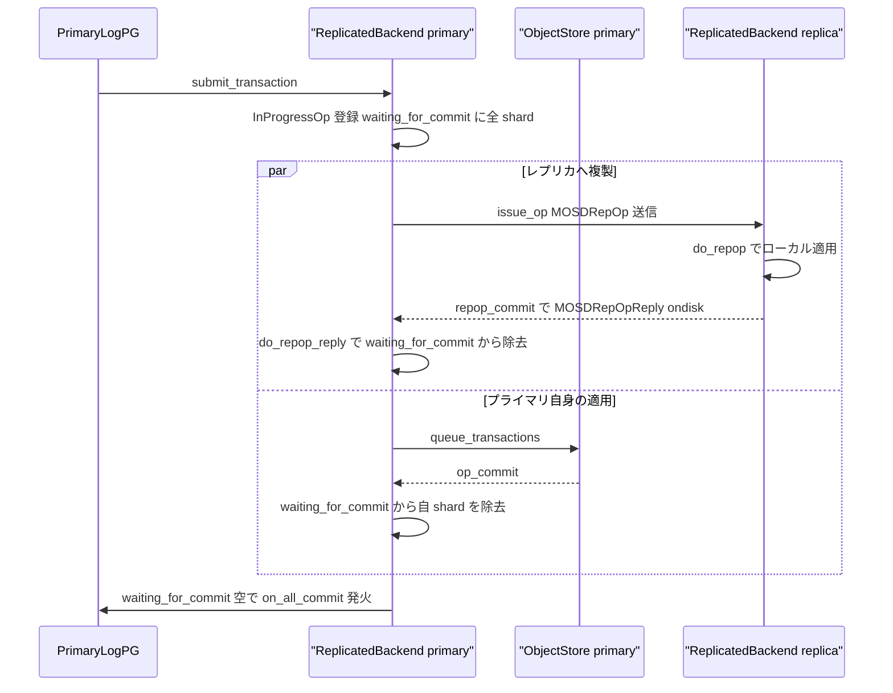

# 第14章 ReplicatedBackend とレプリケーション書き込み

> **本章で読むソース**
>
> - [`src/osd/PGBackend.h`](https://github.com/ceph/ceph/blob/v20.2.2/src/osd/PGBackend.h)
> - [`src/osd/ReplicatedBackend.h`](https://github.com/ceph/ceph/blob/v20.2.2/src/osd/ReplicatedBackend.h)
> - [`src/osd/ReplicatedBackend.cc`](https://github.com/ceph/ceph/blob/v20.2.2/src/osd/ReplicatedBackend.cc)
> - [`src/messages/MOSDRepOp.h`](https://github.com/ceph/ceph/blob/v20.2.2/src/messages/MOSDRepOp.h)

## この章の狙い

第13章で見た `PrimaryLogPG` は、クライアントの書き込みを PG のトランザクションへ組み立てるところまでを担う。
そのトランザクションを実際にディスクへ書き、レプリカへ複製する仕事は、`PrimaryLogPG` ではなくバックエンドが引き受ける。
Ceph には複製方式の異なる二つのバックエンドがある。
オブジェクトを丸ごと複数の OSD に複製する `ReplicatedBackend` と、消失訂正符号でシャードに分けて分散させる `ECBackend` である。

`PrimaryLogPG` は、この二つの差を意識せずに書き込みを発行したい。
その分離を担うのが `PGBackend` という抽象基底クラスである。
本章では、まず `PGBackend` がどの操作を抽象化しているかを見る。
続いて `ReplicatedBackend::submit_transaction` を起点に、プライマリが自身の `ObjectStore` へ適用しつつ各レプリカへ `MOSDRepOp` を送り、全 ack と自コミットが揃って上位へ完了を返すまでの流れを読む。
とりわけ、プライマリの適用とレプリカへの送信を並行に走らせ、二種類の完了を一つの集合で待ち合わせる仕組みが、なぜ書き込みのレイテンシを縮めるかを機構のレベルで見る。

## 前提

第13章で見た `PrimaryLogPG` の I/O パイプラインと、`PGTransaction` の組み立てを前提とする。
トランザクションを最終的に受け取る `ObjectStore` の `queue_transactions` インターフェースは第18章で扱う。
各書き込みが伴う `pg_log_entry_t` を用いた PGLog の更新と、それに基づく recovery は第16章で扱う。
本章と対をなす消失訂正符号側のバックエンドは第15章で読む。

## PGBackend 抽象がバックエンド差を隠す

`PGBackend` は、PG のデータ操作を複製方式から切り離すための抽象基底クラスである。
[`src/osd/PGBackend.h` L59-L60](https://github.com/ceph/ceph/blob/v20.2.2/src/osd/PGBackend.h#L59-L60) がクラスを開き、`ReplicatedBackend` と `ECBackend` がこれを継承する。

```cpp
 class PGBackend {
 public:
```

書き込みの入口は純粋仮想関数 `submit_transaction` である。
[`src/osd/PGBackend.h` L466-L481](https://github.com/ceph/ceph/blob/v20.2.2/src/osd/PGBackend.h#L466-L481) が、組み立て済みの `PGTransaction` とログエントリ、全コミット時に呼ぶコールバックを受け取る形を定める。

```cpp
   /// execute implementation specific transaction
   virtual void submit_transaction(
     const hobject_t &hoid,               ///< [in] object
     const object_stat_sum_t &delta_stats,///< [in] stat change
     const eversion_t &at_version,        ///< [in] version
     PGTransactionUPtr &&t,               ///< [in] trans to execute (move)
     const eversion_t &trim_to,           ///< [in] trim log to here
     const eversion_t &pg_committed_to,   ///< [in] lower bound on
                                          ///       committed version
     std::vector<pg_log_entry_t>&& log_entries, ///< [in] log entries for t
     /// [in] hitset history (if updated with this transaction)
     std::optional<pg_hit_set_history_t> &hset_history,
     Context *on_all_commit,              ///< [in] called when all commit
     ceph_tid_t tid,                      ///< [in] tid
     osd_reqid_t reqid,                   ///< [in] reqid
     OpRequestRef op                      ///< [in] op
     ) = 0;
```

引数に複製方式は現れない。
`PrimaryLogPG` はレプリケーションと消失訂正符号のどちらでも、この一つのシグネチャに向けてトランザクションを渡すだけでよい。
戻り値の代わりに `on_all_commit` を渡す非同期の形をとる点が要点である。
書き込みは複数 OSD への往復を伴うため、呼び出しはすぐ戻り、全レプリカのコミットが揃った時点でコールバックが発火する。

読み取り側も同じ抽象に載る。
`submit_transaction` の下流に加えて、同期読みの `objects_read_sync`（[`src/osd/PGBackend.h` L590-L595](https://github.com/ceph/ceph/blob/v20.2.2/src/osd/PGBackend.h#L590-L595)）と非同期読みの `objects_read_async`（[`src/osd/PGBackend.h` L605-L610](https://github.com/ceph/ceph/blob/v20.2.2/src/osd/PGBackend.h#L605-L610)）も純粋仮想である。

```cpp
   virtual int objects_read_sync(
     const hobject_t &hoid,
     uint64_t off,
     uint64_t len,
     uint32_t op_flags,
     ceph::buffer::list *bl) = 0;
```

レプリケーションでは読みは単にローカルの `ObjectStore` から一括で返せる。
消失訂正符号では複数シャードを集めて復号する必要がある。
この差を `PGBackend` の仮想関数境界が吸収するため、上位の I/O パイプラインは方式によって分岐しない。

バックエンドがコールバックを介して上位へ通知するときは、`Listener` インターフェースを使う。
[`src/osd/PGBackend.h` L67-L74](https://github.com/ceph/ceph/blob/v20.2.2/src/osd/PGBackend.h#L67-L74) のコメントが、`Listener` の呼び出しは親（`PrimaryLogPG`）がロックを保持したまま行い、コールバックも同じロックの下で呼ばれる約束であることを述べる。

```cpp
   /**
    * Provides interfaces for PGBackend callbacks
    *
    * The intention is that the parent calls into the PGBackend
    * implementation holding a lock and that the callbacks are
    * called under the same locks.
    */
   class Listener {
```

`ReplicatedBackend` は、この `Listener`（コード中では `parent`）を通じて `queue_transactions` や統計更新、PGLog 操作を親へ委譲する。

## submit_transaction がプライマリの起点になる

`ReplicatedBackend::submit_transaction` の実体を読む。
[`src/osd/ReplicatedBackend.cc` L571-L593](https://github.com/ceph/ceph/blob/v20.2.2/src/osd/ReplicatedBackend.cc#L571-L593) が、受け取った `PGTransaction` を `ObjectStore::Transaction` へ変換し、進行中の書き込みを追跡する `InProgressOp` を登録する。

```cpp
  vector<pg_log_entry_t> log_entries(_log_entries);
  ObjectStore::Transaction op_t;
  PGTransactionUPtr t(std::move(_t));
  set<hobject_t> added, removed;
  generate_transaction(
    t,
    coll,
    log_entries,
    &op_t,
    &added,
    &removed,
    get_osdmap()->require_osd_release);
  ceph_assert(added.size() <= 1);
  ceph_assert(removed.size() <= 1);

  auto insert_res = in_progress_ops.insert(
    make_pair(
      tid,
      ceph::make_ref<InProgressOp>(
	tid, on_all_commit,
	orig_op, at_version)
      )
    );
```

`in_progress_ops` は `tid`（トランザクション ID）をキーに `InProgressOp` を引く `std::map` である（[`src/osd/ReplicatedBackend.h` L344](https://github.com/ceph/ceph/blob/v20.2.2/src/osd/ReplicatedBackend.h#L344)）。
`InProgressOp` の定義（[`src/osd/ReplicatedBackend.h` L328-L343](https://github.com/ceph/ceph/blob/v20.2.2/src/osd/ReplicatedBackend.h#L328-L343)）が、この追跡構造の中心である `waiting_for_commit` を持つ。

```cpp
  struct InProgressOp : public RefCountedObject {
    ceph_tid_t tid;
    std::set<pg_shard_t> waiting_for_commit;
    Context *on_commit;
    OpRequestRef op;
    eversion_t v;
    bool done() const {
      return waiting_for_commit.empty();
    }
```

`waiting_for_commit` は、この書き込みのコミットをまだ待っている shard の集合である。
`done()` はこの集合が空になった状態を「完了」と定める。
続く [`src/osd/ReplicatedBackend.cc` L597-L613](https://github.com/ceph/ceph/blob/v20.2.2/src/osd/ReplicatedBackend.cc#L597-L613) が、この集合を acting セットの全 shard で初期化してから `issue_op` を呼ぶ。

```cpp
  op.waiting_for_commit.insert(
    parent->get_acting_recovery_backfill_shards().begin(),
    parent->get_acting_recovery_backfill_shards().end());

  issue_op(
    soid,
    at_version,
    tid,
    reqid,
    trim_to,
    pg_committed_to,
    added.size() ? *(added.begin()) : hobject_t(),
    removed.size() ? *(removed.begin()) : hobject_t(),
    log_entries,
    hset_history,
    &op,
    op_t);
```

集合にはプライマリ自身の shard も含まれる。
プライマリのローカルコミットとレプリカからの ack を区別せず、同じ集合の要素として待ち合わせる設計である。
`issue_op` を先に呼び、そのあとで自身のトランザクションを `ObjectStore` へ渡す。
[`src/osd/ReplicatedBackend.cc` L627-L636](https://github.com/ceph/ceph/blob/v20.2.2/src/osd/ReplicatedBackend.cc#L627-L636) が、ローカルコミット時に `op_commit` を呼ぶコールバックを仕掛けてトランザクションをキューへ積む。

```cpp
  op_t.register_on_commit(
    parent->bless_context(
      new C_OSD_OnOpCommit(this, &op)));

  vector<ObjectStore::Transaction> tls;
  tls.push_back(std::move(op_t));

  parent->queue_transactions(tls, op.op);
  if (at_version != eversion_t()) {
    parent->op_applied(at_version);
  }
```

`issue_op` はメッセージを送るだけで、レプリカのコミットを待たずに戻る。
`queue_transactions` もトランザクションを積むだけで、ローカルコミットの完了を待たずに戻る。
結果として、レプリカでの適用とプライマリでの適用は同時に進む。
どちらの完了が先に届いても、後述の経路が同じ `waiting_for_commit` から自分の shard を取り除く。

## issue_op がレプリカへ MOSDRepOp を送る

`issue_op` は、プライマリを除く各 shard へ複製メッセージを配る。
[`src/osd/ReplicatedBackend.cc` L1146-L1187](https://github.com/ceph/ceph/blob/v20.2.2/src/osd/ReplicatedBackend.cc#L1146-L1187) が、ログエントリを一度だけ符号化してからループで各レプリカ宛のメッセージを生成し、送る。

```cpp
    // avoid doing the same work in generate_subop
    bufferlist logs;
    encode(log_entries, logs);

    for (const auto& shard : get_parent()->get_acting_recovery_backfill_shards()) {
      if (shard == parent->whoami_shard()) continue;
      const pg_info_t &pinfo = parent->get_shard_info().find(shard)->second;

      Message *wr;
      wr = generate_subop(
	  soid,
	  at_version,
	  tid,
	  reqid,
	  pg_trim_to,
	  pg_committed_to,
	  new_temp_oid,
	  discard_temp_oid,
	  logs,
	  hset_hist,
	  op_t,
	  shard,
	  pinfo);
```

ログエントリの符号化をループの外で一度だけ行う点は、コメント `avoid doing the same work in generate_subop` が示すとおりの最適化である。
レプリカごとに同じログをつくり直さず、符号化済みの `bufferlist` を各 `generate_subop` へ渡す。

送るメッセージは `MOSDRepOp` である。
[`src/osd/ReplicatedBackend.cc` L1088-L1096](https://github.com/ceph/ceph/blob/v20.2.2/src/osd/ReplicatedBackend.cc#L1088-L1096) が、宛先 shard とオブジェクト、版数、要求する ack 種別を詰めて生成する。

```cpp
  MOSDRepOp *wr = new MOSDRepOp(
    reqid, parent->whoami_shard(),
    spg_t(get_info().pgid.pgid, peer.shard),
    soid, acks_wanted,
    get_osdmap_epoch(),
    parent->get_last_peering_reset_epoch(),
    tid, at_version);
```

このメッセージは書き込みトランザクションの本体とログをレプリカへ運ぶ。
`MOSDRepOp` の定義（[`src/messages/MOSDRepOp.h` L44-L56](https://github.com/ceph/ceph/blob/v20.2.2/src/messages/MOSDRepOp.h#L44-L56)）が、対象オブジェクト `poid`、実行するトランザクションを積む `logbl`、版数 `version` を持つことを示す。

```cpp
  hobject_t poid;

  __u8 acks_wanted;

  // transaction to exec
  ceph::buffer::list logbl;
  pg_stat_t pg_stats;

  // subop metadata
  eversion_t version;
```

`acks_wanted` には `CEPH_OSD_FLAG_ACK | CEPH_OSD_FLAG_ONDISK` が入る（[`src/osd/ReplicatedBackend.cc` L1088](https://github.com/ceph/ceph/blob/v20.2.2/src/osd/ReplicatedBackend.cc#L1088)）。
プライマリはディスクへの永続化を示す ondisk ack を要求する。
生成した各メッセージは `send_message_osd_cluster` でクラスタ内部の Messenger へ渡され、対応するレプリカ OSD に届く。

## do_repop がレプリカ側で適用する

レプリカ OSD が `MOSDRepOp` を受け取ると、`do_repop` が呼ばれる。
[`src/osd/ReplicatedBackend.cc` L1215-L1226](https://github.com/ceph/ceph/blob/v20.2.2/src/osd/ReplicatedBackend.cc#L1215-L1226) が、レプリカ側の進行状態を持つ `RepModify` を用意し、メッセージからトランザクションを取り出す。

```cpp
  RepModifyRef rm(std::make_shared<RepModify>(get_parent()->min_peer_features()));
  rm->op = op;
  rm->ackerosd = ackerosd;
  rm->last_complete = get_info().last_complete;
  rm->epoch_started = get_osdmap_epoch();

  ceph_assert(m->logbl.length());
  // shipped transaction and log entries
  vector<pg_log_entry_t> log;

  auto p = const_cast<bufferlist&>(m->get_middle()).cbegin();
  auto d = const_cast<bufferlist&>(m->get_data()).cbegin();
  rm->opt.decode(m->get_middle().length() != 0 ?  p : d, d);
```

`RepModify` は、レプリカ側の一回の複製適用を追跡する構造である。
[`src/osd/ReplicatedBackend.h` L435-L449](https://github.com/ceph/ceph/blob/v20.2.2/src/osd/ReplicatedBackend.h#L435-L449) が、ack を返す相手 `ackerosd` と、実行する二つのトランザクション `opt`（プライマリから運ばれた本体）と `localt`（ローカルで足す操作）を持つことを示す。

```cpp
  struct RepModify {
    OpRequestRef op;
    bool committed;
    int ackerosd;
    eversion_t last_complete;
    epoch_t epoch_started;

    ObjectStore::Transaction opt, localt;
```

レプリカも自身の PGLog をこのタイミングで更新する。
[`src/osd/ReplicatedBackend.cc` L1270-L1288](https://github.com/ceph/ceph/blob/v20.2.2/src/osd/ReplicatedBackend.cc#L1270-L1288) が、運ばれてきたログを `log_operation` で反映し、コミット時に `repop_commit` を呼ぶコールバックを仕掛けて二つのトランザクションをまとめてキューへ積む。

```cpp
  rm->opt.register_on_commit(
    parent->bless_context(
      new C_OSD_RepModifyCommit(this, rm)));
  vector<ObjectStore::Transaction> tls;
  tls.reserve(2);
  tls.push_back(std::move(rm->localt));
  tls.push_back(std::move(rm->opt));
  parent->queue_transactions(tls, op);
```

ログを運ぶ `logbl` を全レプリカが受け取り適用することで、acting セットの各 OSD が同じ PGLog を持つ。
このログの一致が、後の peering で誰が最新かを判定し、recovery で欠けを埋める土台になる（第16章）。

レプリカのトランザクションがディスクへコミットされると、コールバックが `repop_commit` を呼ぶ。
[`src/osd/ReplicatedBackend.cc` L1305-L1322](https://github.com/ceph/ceph/blob/v20.2.2/src/osd/ReplicatedBackend.cc#L1305-L1322) が、ondisk フラグを立てた `MOSDRepOpReply` をプライマリへ返す。

```cpp
  MOSDRepOpReply *reply = new MOSDRepOpReply(
    m,
    get_parent()->whoami_shard(),
    0, get_osdmap_epoch(), m->get_min_epoch(), CEPH_OSD_FLAG_ONDISK);
  reply->set_last_complete_ondisk(rm->last_complete);
  reply->set_priority(CEPH_MSG_PRIO_HIGH); // this better match ack priority!
  reply->trace = rm->op->pg_trace;
  get_parent()->send_message_osd_cluster(
    rm->ackerosd, reply, get_osdmap_epoch());
```

## 二種類の完了を一つの集合で待ち合わせる

プライマリ側で完了を集約する経路は二つある。
一つはプライマリ自身のローカルコミットで、`op_commit` が呼ばれる。
[`src/osd/ReplicatedBackend.cc` L656-L662](https://github.com/ceph/ceph/blob/v20.2.2/src/osd/ReplicatedBackend.cc#L656-L662) が、`waiting_for_commit` から自分の shard を取り除き、集合が空なら `on_commit` を発火させる。

```cpp
  op->waiting_for_commit.erase(get_parent()->whoami_shard());

  if (op->waiting_for_commit.empty()) {
    op->on_commit->complete(0);
    op->on_commit = 0;
    in_progress_ops.erase(op->tid);
  }
```

もう一つはレプリカからの ack で、`do_repop_reply` が呼ばれる。
[`src/osd/ReplicatedBackend.cc` L697-L718](https://github.com/ceph/ceph/blob/v20.2.2/src/osd/ReplicatedBackend.cc#L697-L718) が、`tid` で `InProgressOp` を引き、ondisk ack なら返信元 shard を `waiting_for_commit` から取り除いて、空になれば同じく `on_commit` を発火させる。

```cpp
    if (r->ack_type & CEPH_OSD_FLAG_ONDISK) {
      ceph_assert(ip_op.waiting_for_commit.count(from));
      ip_op.waiting_for_commit.erase(from);
```

```cpp
    if (ip_op.waiting_for_commit.empty() &&
        ip_op.on_commit) {
      ip_op.on_commit->complete(0);
      ip_op.on_commit = 0;
      in_progress_ops.erase(iter);
    }
```

二つの経路は同じ `waiting_for_commit` を減らし、同じ完了条件（集合が空）を判定する。
プライマリのコミットとレプリカの ack を種別で区別せず、shard の集合という一つの表現に集約したことで、両経路は同じ処理を共有できる。
`on_commit` は `submit_transaction` が受け取った `on_all_commit` であり、これが発火して初めて `PrimaryLogPG` はクライアントへ書き込み完了を返せる。

この設計が効くのは、待ち合わせが並行に進むからである。
`submit_transaction` は `issue_op` を呼んでレプリカへメッセージを送ってから自身のトランザクションを積む。
レプリカでの `do_repop` による適用と、プライマリでの `queue_transactions` による適用は同時に走る。
仮にプライマリが自身のコミットを終えてからレプリカへ送っていれば、書き込みのレイテンシは両者の和になっていた。
並行に走らせるため、レイテンシは最も遅い一つのコミットで決まり、和ではなく最大値に近づく。

## 書き込みの流れの全体像

ここまでの経路を一つのシーケンスにまとめる。



プライマリは全レプリカの ondisk ack と自身のコミットが揃った時点で初めてクライアントへ完了を返す。
どれか一つでもコミットが遅れれば、その shard が `waiting_for_commit` に残り続け、完了は保留される。
全複製が永続化されるまで完了を返さないため、プライマリ障害でレプリカへフェイルオーバーしても確定済みの書き込みは失われない。

## まとめ

`PGBackend` は、PG のデータ操作を複製方式から切り離す抽象基底クラスである。
`PrimaryLogPG` は `submit_transaction` と読み取り関数の仮想関数境界に向けて操作を発行するだけで、レプリケーションと消失訂正符号のどちらでも同じコードで動く。
`ReplicatedBackend` はこの境界の下で、プライマリのローカル適用とレプリカへの `MOSDRepOp` 送信を並行に走らせる。
プライマリ自身のコミットとレプリカからの ondisk ack を `waiting_for_commit` という一つの shard 集合に集約し、集合が空になった時点で上位へ完了を返す。
二種類の完了を同じ表現で待ち合わせることで、書き込みのレイテンシは各コミットの和ではなく最大値に近づく。
各書き込みが伴う PGLog エントリを全レプリカが適用する仕組みは、第16章の recovery の土台になる。

## 関連する章

- 第13章「PrimaryLogPG の I/O パイプライン」：`submit_transaction` を呼ぶ側の書き込み組み立てを扱う。
- 第15章「Erasure Code バックエンド」：同じ `PGBackend` 抽象の下でシャード分散を行う `ECBackend` を読む。
- 第16章「PGLog・recovery・backfill」：本章で各レプリカが適用した PGLog を使う peering と欠け補填を扱う。
- 第18章「ObjectStore インターフェースと Transaction」：`queue_transactions` が受け取るトランザクションの永続化層を読む。
