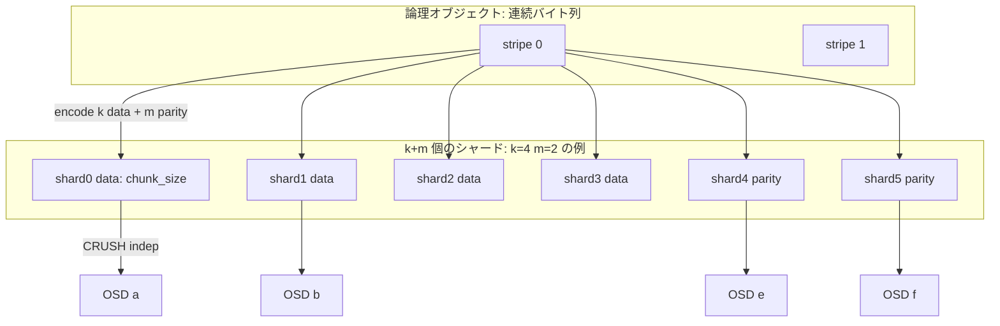
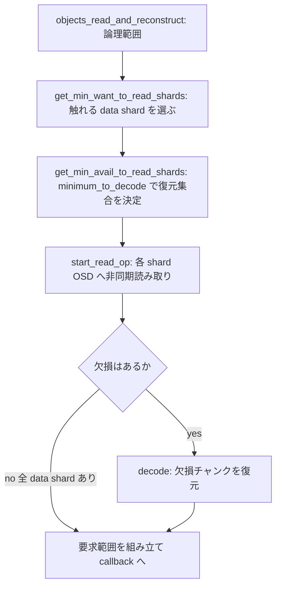
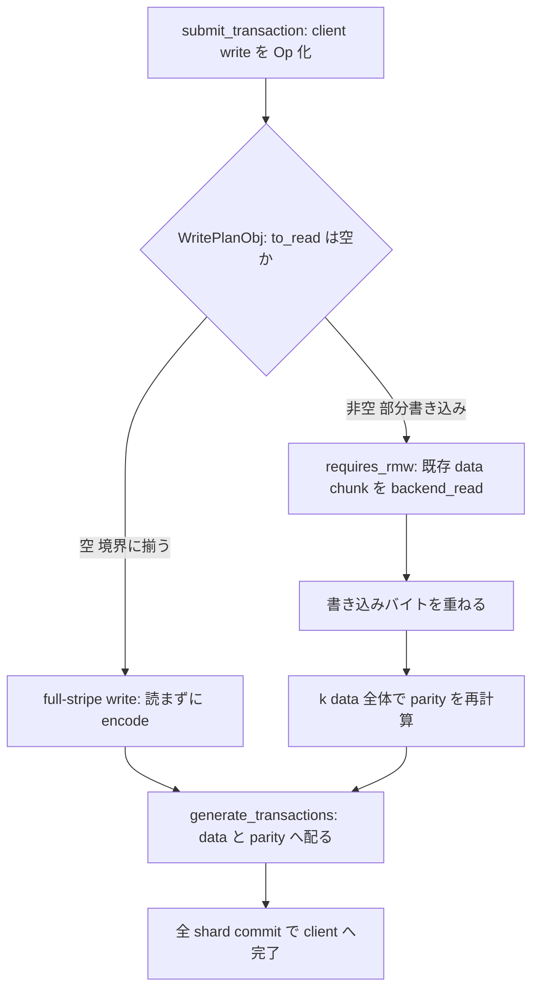

# 第15章 Erasure Code バックエンド

> **本章で読むソース**
>
> - [`src/osd/ECBackend.h`](https://github.com/ceph/ceph/blob/v20.2.2/src/osd/ECBackend.h)
> - [`src/osd/ECCommon.h`](https://github.com/ceph/ceph/blob/v20.2.2/src/osd/ECCommon.h)
> - [`src/osd/ECUtil.h`](https://github.com/ceph/ceph/blob/v20.2.2/src/osd/ECUtil.h)
> - [`src/osd/ECTransaction.h`](https://github.com/ceph/ceph/blob/v20.2.2/src/osd/ECTransaction.h)
> - [`src/erasure-code/ErasureCodeInterface.h`](https://github.com/ceph/ceph/blob/v20.2.2/src/erasure-code/ErasureCodeInterface.h)

## この章の狙い

前章の `ReplicatedBackend` は、オブジェクトの完全な複製を複数の OSD に置いてデータを守る。
3レプリカなら容量効率は3分の1になり、格納したい実データの3倍の生ディスクを消費する。
アーカイブのように読み書きの頻度が低く容量単価が効く用途では、この3倍が重い。

**Erasure Code**（消失訂正符号、以下「EC」）は、オブジェクトを `k` 個のデータチャンクに分け、そこから `m` 個のパリティチャンクを計算して、合計 `k + m` 個のチャンクを別々の OSD に置く。
任意の `m` 個までの OSD が失われても、残る `k` 個から元データを復元できる。
容量効率は `k / (k + m)` であり、たとえば `k=4`、`m=2` なら実データの1.5倍で二重障害に耐える。
同じ二重障害耐性を3レプリカで得ると3倍かかるので、EC は容量を半分に減らす。

その代償は、書き込みの重さにある。
レプリケーションでは各 OSD が完全なオブジェクトを持つため、部分書き込みは該当バイトを各レプリカに上書きするだけで済む。
EC ではパリティが `k` 個のデータチャンク全体から計算されるので、ストライプの一部だけを書き換えるにも、まず既存のチャンクを読んでパリティを再計算する必要がある。
この Read-Modify-Write（以下「RMW」）が EC 書き込みの重さの源である。

本章では、`ECBackend` がストライプとチャンクをどう対応づけ（`ECUtil`）、読み取りで欠損をどう復元し（`ReadPipeline`）、部分書き込みで既存データをどう読み直すか（`RMWPipeline`）を読む。
符号化そのものは `ErasureCodeInterface` を実装するプラグインに委ね、バックエンドはチャンクの配置と入出力の調停に徹する。

## 前提

第7章で見た CRUSH の `indep` を、EC のシャード配置の前提とする。
EC プールでは `k + m` 個のシャードが順序を保った独立の枠として並び、`indep` が各シャードの位置を固定したまま欠損だけを補う。
シャード番号 `shard_id_t` はこの枠の位置に対応し、番号ごとに決まった OSD がそのチャンクを保持する。

I/O を駆動する `PrimaryLogPG` の枠組みは第13章、レプリケーション側の対になる実装は第14章で扱う。
`ECBackend` はそれらと同じ `PGBackend` の実装であり、プライマリ OSD が受けたクライアント I/O を各シャードへ分解して配る役割を担う。

なお EC には歴史的な理由で2系統の実装が同居する。
`v20.2.2` では、旧来の実装（`ECBackendL`、`ECCommonL`）と最適化版（`ECBackend`、`ECCommon`）を `ECSwitch` が切り替える。

[`src/osd/ECSwitch.h` L14-L18](https://github.com/ceph/ceph/blob/v20.2.2/src/osd/ECSwitch.h#L14-L18)

```cpp
/* This module is intended as a temporary switcher between the "legacy" EC
 * implementation and the "optimized" version. Once we trust the optimized
 * version sufficiently, we can remove both that version and this switcher and
 * make the optimised ec backend interact directly with the optimized backend.
 */
```

プールが最適化 EC を許可するかどうか（`allows_ecoptimizations()`）で実体が決まる。
本章は最適化版の `ECBackend` を読む。

## ストライプとチャンク：stripe_info_t

EC の座標系を握るのが `ECUtil::stripe_info_t` である。
オブジェクトの論理オフセット（RADOS から見た連続バイト列上の位置）を、どのシャードのどのオフセットに対応させるかを、この構造体の値だけで計算する。

[`src/osd/ECUtil.h` L451-L462](https://github.com/ceph/ceph/blob/v20.2.2/src/osd/ECUtil.h#L451-L462)

```cpp
class stripe_info_t {
  friend class shard_extent_map_t;

  const uint64_t stripe_width;
  const uint64_t plugin_flags;
  const uint64_t chunk_size;
  const pg_pool_t *pool;
  const unsigned int k;
  // Can be calculated with a division from above. Better to cache.
  const unsigned int m;
```

`stripe_width` はストライプ1本ぶんのデータのバイト数、`chunk_size` は1シャードが1ストライプで受け持つバイト数である。
両者の関係は構築時に決まる。

[`src/osd/ECUtil.h` L526-L542](https://github.com/ceph/ceph/blob/v20.2.2/src/osd/ECUtil.h#L526-L542)

```cpp
  stripe_info_t(const ErasureCodeInterfaceRef &ec_impl, const pg_pool_t *pool,
                uint64_t stripe_width
    )
    : stripe_width(stripe_width),
      plugin_flags(ec_impl->get_supported_optimizations()),
      chunk_size(stripe_width / ec_impl->get_data_chunk_count()),
      pool(pool),
      k(ec_impl->get_data_chunk_count()),
      m(ec_impl->get_coding_chunk_count()),
```

`chunk_size` は `stripe_width` を `k` で割った値であり、コンストラクタは `stripe_width % k == 0` を `ceph_assert` で要求する。
つまりストライプはちょうど `k` 個のデータチャンクに割り切れる。
論理オフセットが1本のストライプを跨いで進むと、次のバイトは同じシャードの次のチャンクではなく、隣のデータシャードの同じストライプ内チャンクへ回る。
`k` 個のデータシャードを一巡してから、全シャードが次のストライプへ進む。

`k` と `m`、および両者から導く各種のサイズは、単純なアクセサで取り出す。

[`src/osd/ECUtil.h` L689-L695](https://github.com/ceph/ceph/blob/v20.2.2/src/osd/ECUtil.h#L689-L695)

```cpp
  unsigned int get_k() const {
    return k;
  }

  unsigned int get_k_plus_m() const {
    return k + m;
  }
```

オブジェクト全体のサイズから、あるシャードが持つべきバイト数を求めるのが `object_size_to_shard_size` である。

[`src/osd/ECUtil.h` L614-L620](https://github.com/ceph/ceph/blob/v20.2.2/src/osd/ECUtil.h#L614-L620)

```cpp
  uint64_t object_size_to_shard_size(const uint64_t size, shard_id_t shard) const {
    uint64_t remainder = size % get_stripe_width();
    uint64_t shard_size = (size - remainder) / k;
    raw_shard_id_t raw_shard = get_raw_shard(shard);
    if (raw_shard >= get_k()) {
      // coding parity shards have same size as data shard 0
      raw_shard = 0;
```

完全に埋まったストライプのぶんはオブジェクトサイズを `k` で割ればよく、末尾の端数だけをストライプ内の位置に応じて振り分ける。
パリティシャードはデータシャード0と同じ長さを持つ。
この対応関係を図にすると、`k` データ＋`m` パリティのチャンクが `k + m` 個のシャードへ並び、各シャードが別々の OSD に置かれる。



## プラグイン抽象：ErasureCodeInterface

符号化の数式は `ECBackend` の外にある。
`ErasureCodeInterface` が抽象クラスとして符号化の契約だけを定め、実体は実行時に選ばれるプラグインが与える。
`jerasure`、`isa`、`clay`、`lrc`、`shec` がソースツリーに同梱され、`ec_impl` が `ErasureCodeInterfaceRef`（`shared_ptr`）として `ECBackend` から参照される。

バックエンドがプラグインに求めるのは、主に三つの操作である。
第一に、どのシャードが残っていれば復元できるかを判定する `minimum_to_decode` である。

[`src/erasure-code/ErasureCodeInterface.h` L309-L312](https://github.com/ceph/ceph/blob/v20.2.2/src/erasure-code/ErasureCodeInterface.h#L309-L312)

```cpp
    virtual int minimum_to_decode(const shard_id_set &want_to_read,
                          const shard_id_set &available,
                          shard_id_set &minimum_set,
                          mini_flat_map<shard_id_t, std::vector<std::pair<int, int>>> *minimum_sub_chunks) = 0;
```

読みたいシャード（`want_to_read`）と現在読めるシャード（`available`）を渡すと、復元に必要な最小のシャード集合を `minimum_set` に返す。
第二に、データチャンクからパリティチャンクを作る `encode` である。

[`src/erasure-code/ErasureCodeInterface.h` L401-L403](https://github.com/ceph/ceph/blob/v20.2.2/src/erasure-code/ErasureCodeInterface.h#L401-L403)

```cpp
    virtual int encode(const shard_id_set &want_to_encode,
                       const bufferlist &in,
                       shard_id_map<bufferlist> *encoded) = 0;
```

第三に、欠損チャンクを残りから復元する `decode` である。

[`src/erasure-code/ErasureCodeInterface.h` L537-L539](https://github.com/ceph/ceph/blob/v20.2.2/src/erasure-code/ErasureCodeInterface.h#L537-L539)

```cpp
    virtual int decode(const shard_id_set &want_to_read,
                       const shard_id_map<bufferlist> &chunks,
                       shard_id_map<bufferlist> *decoded, int chunk_size) = 0;
```

抽象化の効き目は、符号の種類と実装の速さを `ECBackend` から切り離せる点にある。
`jerasure` や `isa`（Intel ISA-L）は Reed-Solomon 符号を SIMD 命令で高速に計算し、`clay` や `lrc` は復旧時の読み取り量を減らす局所符号を実装する。
どれを選んでもバックエンドのコードは変わらず、プロファイルで指定したプラグインが `ec_impl` に差し込まれる。

## 読み取り：ReadPipeline

読み取りは `ECCommon::ReadPipeline` が受け持つ。
入口は `objects_read_and_reconstruct` で、オブジェクトごとの読み取り範囲と、遅延読み取りを許すかを表す `fast_read` を受ける。

[`src/osd/ECCommon.h` L88-L92](https://github.com/ceph/ceph/blob/v20.2.2/src/osd/ECCommon.h#L88-L92)

```cpp
  virtual void objects_read_and_reconstruct(
      const std::map<hobject_t, std::list<ec_align_t>> &reads,
      bool fast_read,
      uint64_t object_size,
      GenContextURef<ec_extents_t&&> &&func) = 0;
```

要求された論理範囲を全シャードぶん読む必要はない。
`ReadPipeline` は読みたいバイト長が触れるデータシャードだけを選ぶ「部分読み取り」を行う。

[`src/osd/ECCommon.h` L395-L406](https://github.com/ceph/ceph/blob/v20.2.2/src/osd/ECCommon.h#L395-L406)

```cpp
    /**
     * While get_want_to_read_shards creates a want_to_read based on the EC
     * plugin's all get_data_chunk_count() (full stripe), this method
     * inserts only the chunks actually necessary to read the length of data.
     * That is, we can do so called "partial read" -- fetch subset of stripe.
     *
     * Like in get_want_to_read_shards, we check the plugin's mapping.
     *
     */
    void get_min_want_to_read_shards(
        const ec_align_t &to_read, ///< [in]
        ECUtil::shard_extent_set_t &want_shard_reads); ///< [out]
```

欠損がなければ、選んだデータシャードの該当バイトをそのまま返せる。
これが `FLAG_EC_PLUGIN_PARTIAL_READ_OPTIMIZATION` の前提であり、データチャンクを連結すると元データになる系統的符号なら、小さな読み取りは `decode` を呼ばずにデータシャードから直接取り出せる。

シャードが欠けている場合は、復元に必要なシャードを選び直す。
その判定を担うのが `get_min_avail_to_read_shards` で、内部で `minimum_to_decode` を使い、復元に足りるシャード集合を `read_request_t` に組み立てる。

[`src/osd/ECCommon.h` L430-L438](https://github.com/ceph/ceph/blob/v20.2.2/src/osd/ECCommon.h#L430-L438)

```cpp
    /// Returns to_read replicas sufficient to reconstruct want
    int get_min_avail_to_read_shards(
        const hobject_t &hoid, ///< [in] object
        bool for_recovery, ///< [in] true if we may use non-acting replicas
        bool do_redundant_reads,
        ///< [in] true if we want to issue redundant reads to reduce latency
        read_request_t &read_request,
        ///< [out] shard_reads, corresponding subchunks / other sub reads to read
        const std::optional<std::set<pg_shard_t>> &error_shards = std::nullopt
```

こうして決めたシャード読み取りを `start_read_op` が各 OSD へ非同期に発行し、応答が揃ったところで欠損があれば `decode` を掛けて要求範囲を組み立て、コールバックへ渡す。



## 書き込みと Read-Modify-Write：RMWPipeline

書き込みは `ECCommon::RMWPipeline` が握る。
プライマリ OSD は `submit_transaction` で受けたクライアント書き込みを1件の `Op` にまとめ、`ECTransaction` が各シャードへ配るトランザクションを生成する。

書き込みが重くなるかどうかは、書き込む範囲がストライプ境界に揃っているかで分かれる。
`ECTransaction::WritePlanObj` は、この判断の結果として「先に読むべき範囲」と「実際に書く範囲」を持つ。

[`src/osd/ECTransaction.h` L26-L33](https://github.com/ceph/ceph/blob/v20.2.2/src/osd/ECTransaction.h#L26-L33)

```cpp
class WritePlanObj {
 public:
  const hobject_t hoid;
  std::optional<ECUtil::shard_extent_set_t> to_read;
  ECUtil::shard_extent_set_t will_write;
  const uint64_t orig_size;
  const uint64_t projected_size;
  bool invalidates_cache;
  bool do_parity_delta_write = false;
```

`to_read` が空でなければ、そのプランは既存チャンクの読み直しを要する。
`Op` はこれを `requires_rmw()` で判定する。

[`src/osd/ECCommon.h` L498-L501](https://github.com/ceph/ceph/blob/v20.2.2/src/osd/ECCommon.h#L498-L501)

```cpp
      ECTransaction::WritePlan plan;
      bool requires_rmw() const { return !plan.want_read; }
```

RMW が必要な部分書き込みでは、まず既存のデータチャンクを読み、書き込むバイトを重ねてから、`k` 個のデータチャンク全体でパリティを再計算する。
`RMWPipeline` はこの読み取りを、キャッシュを介した `backend_read` として `ReadPipeline` の読み取り経路へ回し、応答が揃うと `cache_ready` から書き込みを続行する。

[`src/osd/ECCommon.h` L575-L587](https://github.com/ceph/ceph/blob/v20.2.2/src/osd/ECCommon.h#L575-L587)

```cpp
    void backend_read(hobject_t oid, ECUtil::shard_extent_set_t const &request,
                      uint64_t object_size) override {
      std::map<hobject_t, read_request_t> to_read;
      to_read.emplace(oid, read_request_t(request, false, object_size));

      objects_read_async_no_cache(
        std::move(to_read),
        [this](ec_extents_t &&results) {
          for (auto &&[oid, result]: results) {
            extent_cache.read_done(oid, std::move(result.shard_extent_map));
          }
        });
    }
```

読みが済んだら再符号化し、各シャードのトランザクションを `generate_transactions` で作って、データシャードとパリティシャードの両方へ書き込みを配る。
書き込みは全シャードのコミットが揃ってからクライアントへ完了を返す。



## 高速化の工夫：フルストライプ書き込みで読み取りを省く

EC 書き込みの重さは、パリティ再計算のために既存チャンクを読む往復にある。
`WritePlanObj` が書き込み範囲を検査し、ストライプ境界にちょうど揃う書き込み（フルストライプ書き込み）に対しては `to_read` を立てず、`requires_rmw()` が偽になる。
このとき `k` 個のデータチャンクは書き込むデータだけで完全に決まるので、既存チャンクを読まずに `encode` でパリティを作れる。

読み取りの往復を省けるのが速さの理由である。
部分書き込みが読み取りとネットワーク往復を挟むのに対し、フルストライプ書き込みはプライマリでの符号化と各シャードへの書き込みだけで済む。
新規オブジェクトの追記や、ストライプ幅に揃えた順次書き込みでは、EC でもレプリケーションに近い書き込み経路をたどれる。

同じ発想はプラグイン側の最適化フラグにも現れる。
`FLAG_EC_PLUGIN_PARTIAL_WRITE_OPTIMIZATION` は1チャンク未満の書き込みで各データチャンクの該当断片だけを読んで符号化することを許し、`FLAG_EC_PLUGIN_PARITY_DELTA_OPTIMIZATION` は差分だけでパリティを更新する `encode_delta` を許す。

[`src/erasure-code/ErasureCodeInterface.h` L668-L673](https://github.com/ceph/ceph/blob/v20.2.2/src/erasure-code/ErasureCodeInterface.h#L668-L673)

```cpp
      /* Parity delta write optimization means the encode_delta and
       * apply_delta methods are supported which allows small updates
       * to a stripe to be applied using a read-modify-write of a
       * data chunk and the coding parity chunks.
       */
      FLAG_EC_PLUGIN_PARITY_DELTA_OPTIMIZATION = 1<<4,
```

`WritePlanObj::do_parity_delta_write` はこの経路を選んだかどうかを持つ。
差分書き込みでは、変更するデータチャンクとパリティチャンクだけを読み書きすればよく、ストライプ全体を読む必要がない。

## まとめ

`ECBackend` は、オブジェクトを `k` 個のデータチャンクと `m` 個のパリティチャンクに符号化し、`k + m` 個のシャードへ分散して置く `PGBackend` 実装である。
座標系は `stripe_info_t` が握り、`stripe_width` を `k` で割った `chunk_size` の単位でストライプとシャードを対応づける。
符号化の数式は `ErasureCodeInterface` の背後のプラグインに委ね、バックエンドは `minimum_to_decode`、`encode`、`decode` の三つを呼ぶだけでよい。

読み取りは `ReadPipeline` が担い、必要なデータシャードだけを読む部分読み取りを基本とし、欠損があるときに限って `decode` で復元する。
書き込みは `RMWPipeline` が担い、部分書き込みでは既存チャンクを読み直してパリティを再計算する。
このRMWが EC 書き込みの重さの源であり、ストライプ境界に揃うフルストライプ書き込みで読み取りを省くのが、この重さを避ける中心の工夫である。

## 関連する章

- 第7章「CRUSH アルゴリズムによる決定的なデータ配置」：`indep` によるシャード位置の固定を扱う。
- 第13章「PrimaryLogPG の I/O パイプライン」：`ECBackend` を駆動する I/O の枠組みを扱う。
- 第14章「ReplicatedBackend とレプリケーション書き込み」：対になるレプリケーション実装を扱う。
