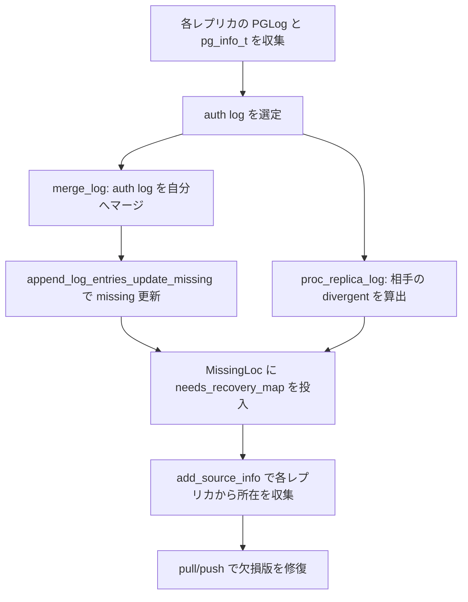
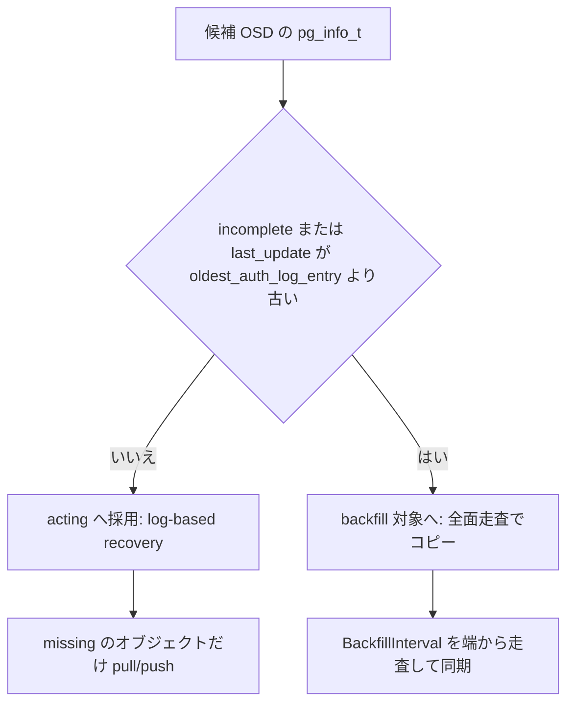

# 第16章 PGLog・recovery・backfill

> **本章で読むソース**
>
> - [`src/osd/PGLog.h`](https://github.com/ceph/ceph/blob/v20.2.2/src/osd/PGLog.h)
> - [`src/osd/PGLog.cc`](https://github.com/ceph/ceph/blob/v20.2.2/src/osd/PGLog.cc)
> - [`src/osd/osd_types.h`](https://github.com/ceph/ceph/blob/v20.2.2/src/osd/osd_types.h)
> - [`src/osd/MissingLoc.h`](https://github.com/ceph/ceph/blob/v20.2.2/src/osd/MissingLoc.h)
> - [`src/osd/MissingLoc.cc`](https://github.com/ceph/ceph/blob/v20.2.2/src/osd/MissingLoc.cc)
> - [`src/osd/PrimaryLogPG.cc`](https://github.com/ceph/ceph/blob/v20.2.2/src/osd/PrimaryLogPG.cc)
> - [`src/osd/PeeringState.cc`](https://github.com/ceph/ceph/blob/v20.2.2/src/osd/PeeringState.cc)

## この章の狙い

OSD が一時的に停止して復帰したとき、その OSD が保持するオブジェクトは停止中に書き込まれた最新版を欠いている。
Ceph はこの差分を、全オブジェクトを比較することなく、各 PG が保持する操作ログ（PGLog）から算出する。
本章では、書き込みを版付きで記録する `pg_log_t`、レプリカ間でログを突き合わせて欠損オブジェクト集合（missing）を求める `merge_log`、欠損版の所在を追う `MissingLoc`、そしてログでは追えないほど差が開いた場合の全面同期である backfill までを読む。
第14章で見たレプリケーション書き込みが正常時のデータ整合を担うのに対し、本章の recovery と backfill は障害後の整合回復を担う。

## 前提

第12章の peering で、PG は acting セットのメンバーからログと `pg_info_t` を集め、権威ログ（auth log）を選び出す。
本章の処理はその peering の内部と、activate 後の recovery フェーズで動く。
オブジェクト識別子 `hobject_t`、up セットと acting セット、プライマリ OSD の役割は第8章と第12章で導入済みとして進める。

## PGLog：版付き操作ログ

PGLog は、その PG に対する更新と削除を発生順に並べたログである。
各エントリは `pg_log_entry_t` で、対象オブジェクト `soid`、この操作でオブジェクトが到達する版 `version`、直前の版 `prior_version`、そして操作種別 `op` を持つ。

[`src/osd/osd_types.h` L4447-4460](https://github.com/ceph/ceph/blob/v20.2.2/src/osd/osd_types.h#L4447-L4460)

```cpp
struct pg_log_entry_t {
  enum {
    MODIFY = 1,   // some unspecified modification (but not *all* modifications)
    CLONE = 2,    // cloned object from head
    DELETE = 3,   // deleted object
    //BACKLOG = 4,  // event invented by generate_backlog [obsolete]
    LOST_REVERT = 5, // lost new version, revert to an older version.
    LOST_DELETE = 6, // lost new version, revert to no object (deleted).
    LOST_MARK = 7,   // lost new version, now EIO
    PROMOTE = 8,     // promoted object from another tier
    CLEAN = 9,       // mark an object clean
    ERROR = 10,      // write that returned an error
  };
```

種別は `is_update()` と `is_delete()` の二系統に集約される。
recovery はこの区別で、オブジェクトを pull で持ってくるべきか、ローカルから消すべきかを決める。

[`src/osd/osd_types.h` L4537-4545](https://github.com/ceph/ceph/blob/v20.2.2/src/osd/osd_types.h#L4537-L4545)

```cpp
  bool is_update() const {
    return
      is_clone() || is_modify() || is_promote() || is_clean() ||
      is_lost_revert() || is_lost_mark();
  }
  bool is_delete() const {
    return op == DELETE || op == LOST_DELETE;
  }
```

版を表す `eversion_t` は、OSDMap のエポックと PG 内で単調増加する版数の組である。

[`src/osd/osd_types.h` L888-895](https://github.com/ceph/ceph/blob/v20.2.2/src/osd/osd_types.h#L888-L895)

```cpp
class eversion_t {
public:
  version_t version;
  epoch_t epoch;
  __u32 __pad;
  eversion_t() : version(0), epoch(0), __pad(0) {}
  eversion_t(epoch_t e, version_t v) : version(v), epoch(e), __pad(0) {}
```

エポックを上位に置くことで、比較は先にエポックを見る。
新しい acting セットで書かれた版は、古いエポックのどの版よりも必ず後に並ぶ。
これにより、OSD が入れ替わっても版の全順序が保たれ、どちらのログが新しいかを一意に判定できる。

ログ全体は `pg_log_t` が持つ。
`head` が最新エントリの版、`tail` が保持している最古エントリの直前の版であり、`tail` より後の履歴は完全に説明できることを表す。

[`src/osd/osd_types.h` L4658-4671](https://github.com/ceph/ceph/blob/v20.2.2/src/osd/osd_types.h#L4658-L4671)

```cpp
  eversion_t head;    // newest entry
  eversion_t tail;    // version prior to oldest
protected:
  // We can rollback rollback-able entries > can_rollback_to
  eversion_t can_rollback_to;

  // always <= can_rollback_to, indicates how far stashed rollback
  // data can be found
  eversion_t rollback_info_trimmed_to;

public:
  // the actual log
  mempool::osd_pglog::list<pg_log_entry_t> log;
```

メモリ上では `pg_log_t` をそのまま走査すると遅いため、`PGLog` は `IndexedLog` でオブジェクト名から末尾エントリへの逆引き、リクエスト ID からエントリへの逆引きなどの索引を張る。
`complete_to` と `last_requested` は recovery の進行位置を指すポインタである。

[`src/osd/PGLog.h` L168-176](https://github.com/ceph/ceph/blob/v20.2.2/src/osd/PGLog.h#L168-L176)

```cpp
  struct IndexedLog : public pg_log_t {
    mutable std::unordered_map<hobject_t, pg_log_entry_t*> objects;  // ptrs into log.  be careful!
    mutable std::unordered_map<osd_reqid_t, pg_log_entry_t*> caller_ops;
    mutable std::unordered_multimap<osd_reqid_t, pg_log_entry_t*> extra_caller_ops;
    mutable std::unordered_map<osd_reqid_t, pg_log_dup_t*> dup_index;

    // recovery pointers
    std::list<pg_log_entry_t>::iterator complete_to; // not inclusive of referenced item
    version_t last_requested = 0;               // last object requested by primary
```

## missing 集合の算出

**missing** は、そのレプリカが「本来持つべき最新版を欠いているオブジェクト」の集合である。
各要素は `pg_missing_item` で、必要な版 `need` と手元にある版 `have` を保持する。
`have` が空なら、そのオブジェクトはローカルに一つも存在しない。

[`src/osd/osd_types.h` L4874-4890](https://github.com/ceph/ceph/blob/v20.2.2/src/osd/osd_types.h#L4874-L4890)

```cpp
struct pg_missing_item {
  eversion_t need, have;
  ObjectCleanRegions clean_regions;
  enum missing_flags_t {
    FLAG_NONE = 0,
    FLAG_DELETE = 1,
  } flags;
  pg_missing_item() : flags(FLAG_NONE) {}
  explicit pg_missing_item(eversion_t n) : need(n), flags(FLAG_NONE) {}  // have no old version
  pg_missing_item(eversion_t n, eversion_t h, bool is_delete=false, bool old_style = false) :
    need(n), have(h) {
    set_delete(is_delete);
    if (old_style)
      clean_regions.mark_fully_dirty();
    if (have == eversion_t())
      clean_regions.mark_object_new();
  }
```

missing は、ログエントリを一つずつ食わせて構築する。
`pg_missing_set::add_next_event` は、ログの順序でエントリを渡す前提で、直前までの missing を最新エントリのぶんだけ更新する。
`prior_version` が空、つまり新規オブジェクトなら `have` を空にして丸ごと欠損として登録し、すでに欠損中のオブジェクトなら `need` だけを新しい版に進めて `have` は据え置く。

[`src/osd/osd_types.h` L5161-5203](https://github.com/ceph/ceph/blob/v20.2.2/src/osd/osd_types.h#L5161-L5203)

```cpp
    if (e.prior_version == eversion_t() || e.is_clone()) {
      // new object.
      if (is_missing_divergent_item) {  // use iterator
        auto erased = rmissing_erase(missing_it->second.need, e.soid);
        ceph_assert(erased == 1);  // Should always erase exactly one entry
        // .have = nil
        missing_it->second = item(e.version, eversion_t(), e.is_delete());
        missing_it->second.clean_regions.mark_fully_dirty();
      } else if (pool.is_nonprimary_shard(shard) && !e.is_written_shard(shard)) {
	// new object, partial write and not already missing - skip
	skipped = true;
      } else {
         // create new element in missing map
         // .have = nil
        missing[e.soid] = item(e.version, eversion_t(), e.is_delete());
        missing[e.soid].clean_regions.mark_fully_dirty();
      }
    } else if (is_missing_divergent_item) {
      // already missing (prior).
      auto erased = rmissing_erase((missing_it->second).need, e.soid);
      ceph_assert(erased == 1);  // Should always erase exactly one entry
      missing_it->second.need = e.version;  // leave .have unchanged.
      missing_it->second.set_delete(e.is_delete());
```

`need` を鍵にした逆引き multimap `rmissing` も同時に維持する。
recovery はこの逆引きを版の昇順にたどることで、古い版の欠損から順に修復できる。

## ログの突き合わせ：merge_log と proc_replica_log

プライマリは peering で、権威ログを自身のログへ取り込む。
`merge_log` は、相手のログ `olog` を自分のログへマージし、その過程で missing を更新する。
前提として、二つのログは重なりを持たなければならない。

[`src/osd/PGLog.cc` L397-401](https://github.com/ceph/ceph/blob/v20.2.2/src/osd/PGLog.cc#L397-L401)

```cpp
  // If our log is empty, the incoming log needs to have not been trimmed.
  ceph_assert(!log.null() || olog.tail == eversion_t());
  // The logs must overlap.
  ceph_assert(log.head >= olog.tail && olog.head >= log.tail);
```

自分のログ末尾より相手のログ末尾が新しければ、頭を伸ばす。
新しいエントリを取り込むと同時に、`append_log_entries_update_missing` がそのエントリぶんだけ missing を進める。
ログの差分だけを missing に反映するので、オブジェクト本体を読む必要はない。

[`src/osd/PGLog.cc` L490-501](https://github.com/ceph/ceph/blob/v20.2.2/src/osd/PGLog.cc#L490-L501)

```cpp
    mempool::osd_pglog::list<pg_log_entry_t> new_entries;
    new_entries.splice(new_entries.end(), olog.log, from, to);
    append_log_entries_update_missing(
      info.last_backfill,
      new_entries,
      false,
      &log,
      missing,
      rollbacker,
      pool,
      toosd.shard,
      this);
```

一方、レプリカ側のログにプライマリと食い違うエントリ（divergent）があれば、`proc_replica_log` がそれを算出する。
相手のログ頭が自分のログ末尾より古くて重ならないときや、頭が完全に一致するときは、divergent を探す必要がないので早期に戻る。

[`src/osd/PGLog.cc` L234-243](https://github.com/ceph/ceph/blob/v20.2.2/src/osd/PGLog.cc#L234-L243)

```cpp
  if (olog.head < log.tail) {
    dout(10) << __func__ << ": osd." << from << " does not overlap, not looking "
	     << "for divergent objects" << dendl;
    return;
  }
  if (olog.head == log.head) {
    dout(10) << __func__ << ": osd." << from << " same log head, not looking "
	     << "for divergent objects" << dendl;
    return;
  }
```



## MissingLoc：欠損版の所在追跡

missing は「何を欠いているか」を答えるが、「どの OSD から取れるか」は答えない。
それを埋めるのが `MissingLoc` である。
`needs_recovery_map` が修復対象と必要な版、`missing_loc` がオブジェクトごとの取得元 OSD 集合、`missing_loc_sources` が取得元として使える OSD の全体を保持する。

[`src/osd/MissingLoc.h` L60-62](https://github.com/ceph/ceph/blob/v20.2.2/src/osd/MissingLoc.h#L60-L62)

```cpp
  std::map<hobject_t, pg_missing_item> needs_recovery_map;
  std::map<hobject_t, std::set<pg_shard_t> > missing_loc;
  std::set<pg_shard_t> missing_loc_sources;
```

所在は `add_source_info` が埋める。
あるレプリカの `pg_info_t` と missing を受け取り、修復対象を一つずつ見て「その OSD がこの版を持つか」を判定する。
判定は本体を読むのではなく、相手の `last_update` が必要な版に届いているか、`last_backfill` の範囲内か、相手の missing に載っていないか、というメタ情報だけで下す。

[`src/osd/MissingLoc.cc` L91-111](https://github.com/ceph/ceph/blob/v20.2.2/src/osd/MissingLoc.cc#L91-L111)

```cpp
    if (oinfo.last_update < need) {
      ldout(cct, 10) << "search_for_missing " << soid << " " << need
		     << " also missing on osd." << fromosd
		     << " (last_update " << oinfo.last_update
		     << " < needed " << need << ")" << dendl;
      continue;
    }
    if (p->first >= oinfo.last_backfill) {
      // FIXME: this is _probably_ true, although it could conceivably
      // be in the undefined region!  Hmm!
      ldout(cct, 10) << "search_for_missing " << soid << " " << need
		     << " also missing on osd." << fromosd
		     << " (past last_backfill " << oinfo.last_backfill
		     << ")" << dendl;
      continue;
    }
    if (omissing.is_missing(soid)) {
      ldout(cct, 10) << "search_for_missing " << soid << " " << need
		     << " also missing on osd." << fromosd << dendl;
      continue;
    }
```

条件を通れば、そのオブジェクトの取得元集合に当該 OSD を加える。

[`src/osd/MissingLoc.cc` L119-130](https://github.com/ceph/ceph/blob/v20.2.2/src/osd/MissingLoc.cc#L119-L130)

```cpp
    {
      auto p = missing_loc.find(soid);
      if (p == missing_loc.end()) {
	p = missing_loc.emplace(soid, set<pg_shard_t>()).first;
      } else {
	_dec_count(p->second);
      }
      p->second.insert(fromosd);
      _inc_count(p->second);
    }
```

どの OSD からも取れないオブジェクトは **unfound** となる。
`needs_recovery_map` にあるが `missing_loc` が空、または回復可能な所在が揃っていない状態がこれにあたる。

[`src/osd/MissingLoc.h` L147-157](https://github.com/ceph/ceph/blob/v20.2.2/src/osd/MissingLoc.h#L147-L157)

```cpp
  bool is_unfound(const hobject_t &hoid) const {
    auto it = needs_recovery_map.find(hoid);
    if (it == needs_recovery_map.end()) {
      return false;
    }
    if (it->second.is_delete()) {
      return false;
    }
    auto mit = missing_loc.find(hoid);
    return mit == missing_loc.end() || !(*is_recoverable)(mit->second);
  }
```

## log-based recovery：ログ差分に沿った修復

修復フェーズはプライマリの `start_recovery_ops` から始まる。
プライマリ自身に欠損がなければレプリカの修復に進み、そうでなければ `recover_primary` で自分の欠損を先に埋める。

[`src/osd/PrimaryLogPG.cc` L13357-13366](https://github.com/ceph/ceph/blob/v20.2.2/src/osd/PrimaryLogPG.cc#L13357-L13366)

```cpp
  if (!missing.have_missing() || // Primary does not have missing
      // or all of the missing objects are unfound.
      recovery_state.all_missing_unfound()) {
    // Recover the replicas.
    started = recover_replicas(max, handle, &recovery_started);
  }
  if (!started) {
    // We still have missing objects that we should grab from replicas.
    started += recover_primary(max, handle);
  }
```

`recover_primary` は、missing の逆引き `rmissing` を `last_requested` の位置から版の昇順に走査する。
全オブジェクトを舐めるのではなく、欠損として記録された版だけを古い順にたどる。

[`src/osd/PrimaryLogPG.cc` L13502-13503](https://github.com/ceph/ceph/blob/v20.2.2/src/osd/PrimaryLogPG.cc#L13502-L13503)

```cpp
  auto p = missing.get_rmissing().lower_bound(eversion_t(0, recovery_state.get_pg_log().get_log().last_requested));
  while (p != missing.get_rmissing().end()) {
```

レプリカ側の欠損は `recover_replicas` が扱い、対象オブジェクトごとに `prep_object_replica_pushes` を呼ぶ。
プライマリが本体を読み、`pgbackend->recover_object` でレプリカへ push する。

[`src/osd/PrimaryLogPG.cc` L13742-13747](https://github.com/ceph/ceph/blob/v20.2.2/src/osd/PrimaryLogPG.cc#L13742-L13747)

```cpp
  int r = pgbackend->recover_object(
    soid,
    v,
    ObjectContextRef(),
    obc, // has snapset context
    h);
```

削除された版の修復は本体の転送を伴わない。
`recover_missing` は、対象が削除済みなら `remove_missing_object` でレプリカからの削除に切り替える。

[`src/osd/PrimaryLogPG.cc` L12436-12438](https://github.com/ceph/ceph/blob/v20.2.2/src/osd/PrimaryLogPG.cc#L12436-L12438)

```cpp
  if (recovery_state.get_missing_loc().is_deleted(soid)) {
    start_recovery_op(soid);
    ceph_assert(!recovering.count(soid));
```

## log-based recovery と backfill の使い分け

ログには保持上限があり、`tail` より古い履歴は捨てられる。
ある OSD の `last_update` が権威ログの最古エントリより古ければ、ログの差分だけでは何が変わったかを説明できない。
この判定は peering の acting セット選定で下される。
`calc_replicated_acting` は、各候補 OSD が incomplete か、`last_update` が権威ログの最古版 `oldest_auth_log_entry` より古い場合に、その OSD を backfill 対象へ回す。

[`src/osd/PeeringState.cc` L1925-1935](https://github.com/ceph/ceph/blob/v20.2.2/src/osd/PeeringState.cc#L1925-L1935)

```cpp
    const pg_info_t &cur_info = all_info.find(up_cand)->second;
    if (cur_info.is_incomplete() ||
        cur_info.last_update < oldest_auth_log_entry) {
      ss << " shard " << up_cand << " (up) backfill " << cur_info << std::endl;
      backfill->insert(up_cand);
      acting_backfill->insert(up_cand);
    } else {
      want->push_back(i);
      acting_backfill->insert(up_cand);
      ss << " osd." << i << " (up) accepted " << cur_info << std::endl;
    }
```

`oldest_auth_log_entry` は、プライマリと権威ログ担当のログ末尾の小さいほうである。

[`src/osd/PeeringState.cc` L1883-1886](https://github.com/ceph/ceph/blob/v20.2.2/src/osd/PeeringState.cc#L1883-L1886)

```cpp
  eversion_t oldest_auth_log_entry =
    std::min(primary->second.log_tail, auth_log_shard->second.log_tail);

  return std::make_pair(primary, oldest_auth_log_entry);
```



## backfill：全面走査による同期

backfill 対象になった OSD は、ログではなくオブジェクト名の空間を端から走査して同期する。
`recover_backfill` は、対象 OSD ごとに `BackfillInterval` を初期化し、それぞれの `last_backfill` の位置から走査を始める。

[`src/osd/PrimaryLogPG.cc` L13939-13948](https://github.com/ceph/ceph/blob/v20.2.2/src/osd/PrimaryLogPG.cc#L13939-L13948)

```cpp
    // initialize BackfillIntervals
    for (set<pg_shard_t>::const_iterator i = get_backfill_targets().begin();
	 i != get_backfill_targets().end();
	 ++i) {
      peer_backfill_info[*i].reset(
	recovery_state.get_peer_info(*i).last_backfill);
    }
    backfill_info.reset(last_backfill_started);
```

走査は `hobject_t` の順序に沿って一定区間ずつ進む。
プライマリは自分の区間とレプリカの区間を突き合わせ、レプリカに無いか古いオブジェクトを push し、余分なオブジェクトを削除する。
区間を使い切ると次の区間をスキャンし、`last_backfill` を前進させる。
この境界を跨いだ書き込みは、境界より手前なら通常のレプリケーションで、手前でなければ backfill の対象として扱われる。

## degraded と misplaced

障害後の PG 状態は degraded と misplaced を区別する。
**degraded** は冗長度が落ちた状態、つまり本来の複製数より実在するコピーが少ないオブジェクトを含む状態である。

[`src/osd/osd_types.h` L1027](https://github.com/ceph/ceph/blob/v20.2.2/src/osd/osd_types.h#L1027)

```cpp
#define PG_STATE_DEGRADED           (1ULL << 10) // pg contains objects with reduced redundancy
```

一方 **misplaced** は、複製数は足りているが CRUSH が指す本来の配置と違う OSD にコピーが載っている状態である。
統計としては、redundancy を欠くオブジェクトを `num_objects_degraded`、正しい数はあるが配置がずれたオブジェクトを `num_objects_misplaced` として別々に数える。

[`src/osd/osd_types.h` L1970](https://github.com/ceph/ceph/blob/v20.2.2/src/osd/osd_types.h#L1970)

```cpp
  int64_t num_objects_degraded{0};
```

degraded はデータ保護の観点で優先度が高く、recovery で優先して埋められる。
misplaced はデータの安全性そのものは損なわれておらず、backfill でオブジェクトを正しい OSD へ移せば解消する。

## 高速化・最適化の工夫

第一の工夫は、修復対象をログ差分に限定する点である。
missing はログエントリを順に食わせて構築され（`add_next_event`）、`recover_primary` は missing の逆引き `rmissing` だけを版の昇順に走査する。
障害中に変更されたオブジェクトの数はふつう PG 全体のごく一部なので、全オブジェクトを比較する代わりにログに現れた版だけを pull/push すれば足りる。
これが、log-based recovery が backfill より桁違いに軽い理由である。
ログでは追えないほど差が開いたときに限り、`calc_replicated_acting` が backfill へ切り替え、全面走査の重い経路を使う。

第二の工夫は、同時修復数を予約で絞る点である。
各 OSD は `local_reserver` と `remote_reserver` という `AsyncReserver` を持ち、recovery と backfill はプライマリ側とレプリカ側の双方で予約を取ってから走る。

[`src/osd/OSD.h` L458-459](https://github.com/ceph/ceph/blob/v20.2.2/src/osd/OSD.h#L458-L459)

```cpp
  AsyncReserver<spg_t, Finisher> local_reserver;
  AsyncReserver<spg_t, Finisher> remote_reserver;
```

同時に走る本数は `osd_max_backfills`（既定値 1）で上限が付く。
修復トラフィックが際限なく client I/O の帯域とディスクを食い潰すのを防ぎ、障害中でも前面の I/O を守るための機構である。

## まとめ

PGLog は各書き込みを `eversion_t` 付きのエントリとして記録し、エポックを上位に置いた版の全順序でログの新旧を一意に決める。
peering では `merge_log` と `proc_replica_log` がレプリカ間のログを突き合わせ、`add_next_event` がログ差分から missing を算出する。
`MissingLoc` は欠損版の所在を各レプリカのメタ情報だけから追い、どこからも取れないものを unfound とする。
log-based recovery は missing のオブジェクトだけを pull/push する軽い経路で、`last_update` が権威ログの最古版より古い OSD に対しては `calc_replicated_acting` が backfill へ切り替え、オブジェクト空間を端から走査して全面同期する。
degraded と misplaced を分けて数え、冗長度の回復を優先しつつ、予約と `osd_max_backfills` で修復の並行度を絞って client I/O を守る。

## 関連する章

- 第12章「PG と PeeringState」：本章の merge_log と backfill 判定が動く acting セット選定と権威ログ決定を扱う。
- 第13章「PrimaryLogPG の I/O パイプライン」：本章の recovery メソッドを持つクラスの本体である。
- 第14章「ReplicatedBackend とレプリケーション書き込み」：正常時の書き込みが本章の recovery で使う pull/push を提供する。
- 第17章「スクラブと SnapMapper」：recovery が版を揃えた後に内容の一致を検証する仕組みを扱う。
