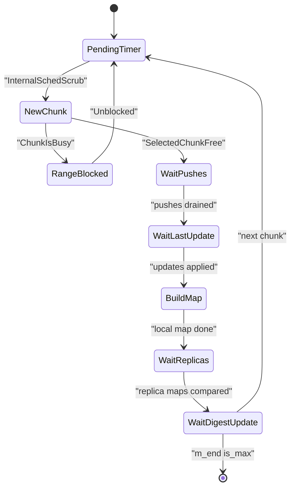
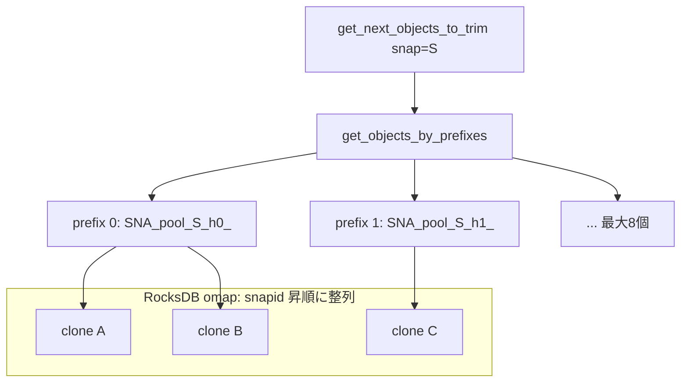

# 第17章 スクラブと SnapMapper

> **本章で読むソース**
>
> - [`src/osd/scrubber_common.h`](https://github.com/ceph/ceph/blob/v20.2.2/src/osd/scrubber_common.h)
> - [`src/osd/scrubber/pg_scrubber.h`](https://github.com/ceph/ceph/blob/v20.2.2/src/osd/scrubber/pg_scrubber.h)
> - [`src/osd/scrubber/pg_scrubber.cc`](https://github.com/ceph/ceph/blob/v20.2.2/src/osd/scrubber/pg_scrubber.cc)
> - [`src/osd/scrubber/scrub_machine.h`](https://github.com/ceph/ceph/blob/v20.2.2/src/osd/scrubber/scrub_machine.h)
> - [`src/osd/scrubber/osd_scrub_sched.h`](https://github.com/ceph/ceph/blob/v20.2.2/src/osd/scrubber/osd_scrub_sched.h)
> - [`src/osd/scrubber/osd_scrub.cc`](https://github.com/ceph/ceph/blob/v20.2.2/src/osd/scrubber/osd_scrub.cc)
> - [`src/osd/SnapMapper.h`](https://github.com/ceph/ceph/blob/v20.2.2/src/osd/SnapMapper.h)
> - [`src/osd/SnapMapper.cc`](https://github.com/ceph/ceph/blob/v20.2.2/src/osd/SnapMapper.cc)

## この章の狙い

レプリケーションや Erasure Code は、書き込みの瞬間に複数の OSD へ同じ内容を届ける。
しかし、いったんディスクに載ったデータが後から静かに壊れることはある。
ビットの反転、ファームウェアのバグ、部分書き込みの取りこぼしが、どのレプリカにも通知されないまま蓄積していく。
スクラブは、この沈黙のデータ破損を能動的に見つけるための定期検証である。

本章の前半では、PG のオブジェクトをレプリカ間で突き合わせるスクラブの機構を読む。
PG 全体を一度に止めて検証すればクライアント I/O が長時間ブロックされてしまうため、Ceph はオブジェクトを chunk に区切り、検証中の chunk だけを一時的に凍結する。
この chunk 単位の検証と、書き込みを preempt させる仕組みが前半の中心である。

後半では、スナップショットが生む clone オブジェクトを管理する `SnapMapper` を読む。
`SnapMapper` は snapid からその snap に属するオブジェクトを逆引きできるインデックスであり、スナップ削除時にどのオブジェクトを消すべきかを効率よく列挙する。
逆引きインデックスがなぜスナップトリムを速くするのかを、キーの設計に踏み込んで説明する。

## 前提

- 第13章の `PrimaryLogPG` による I/O パイプラインと、プライマリがレプリカへ書き込みを配る流れ。
- 第14章のレプリケーション書き込みと、第15章の Erasure Code シャード。
- 第16章の recovery と backfill（スクラブは in-flight の push が掃けるのを待ってから検証する）。
- オブジェクトが `hobject_t` で識別され、clone は head の直前に並ぶという RADOS のオブジェクトモデル。

## スクラブが検証するもの

スクラブには深さの異なる二段階がある。
その区別は `scrub_level_t` という真偽値の列挙で表される。

[`src/osd/osd_types.h` L2237-L2238](https://github.com/ceph/ceph/blob/v20.2.2/src/osd/osd_types.h#L2237-L2238)

```cpp
enum class scrub_level_t : bool { shallow = false, deep = true };
enum class scrub_type_t : bool { not_repair = false, do_repair = true };
```

**shallow scrub**（浅いスクラブ）は、各レプリカのメタデータだけを読んで突き合わせる。
オブジェクトの存在、サイズ、属性（omap のキーや `object_info`）がレプリカ間で一致するかを確認する。
データ本体は読まないため軽く、既定では日次で走る。

**deep-scrub**（深いスクラブ）は、オブジェクトのデータ本体まで読み、その CRC を計算してレプリカ間で比較する。
ディスク上のビット反転はメタデータには現れないため、本体の突き合わせでしか検出できない。
そのぶん全データを読む I/O 負荷が高く、既定では週次で走る。

`scrub_type_t` は、検証で見つかった不一致を修復するかどうかを分ける。
通常のスクラブは不一致を記録するだけで、修復は `do_repair` を指定したときに行われる。
どちらのレプリカが正しいかは多数決や `object_info` の版で判断され、その詳細は本章では扱わない。

## chunk 単位の検証

PG は数万から数十万のオブジェクトを持ちうる。
これを一括で検証しようとすると、検証が終わるまで PG 全体への書き込みを止めることになり、クライアントから見た応答が長時間途切れる。
Ceph はこれを避けるため、オブジェクトの並び順に沿って PG を小さな **chunk**（区間）に切り、chunk を一つずつ検証する。
検証中に凍結されるのはその chunk の範囲だけであり、PG の残りは通常どおり I/O を受け付ける。

chunk の選択は `select_range()` が担う。
`objects_list_partial()` でストアからオブジェクトを最小個数から最大個数の範囲で取り出し、その終端を chunk の右端 `m_end` に定める。

[`src/osd/scrubber/pg_scrubber.cc` L1015-L1067](https://github.com/ceph/ceph/blob/v20.2.2/src/osd/scrubber/pg_scrubber.cc#L1015-L1067)

```cpp
  hobject_t start = m_start;
  hobject_t candidate_end;
  std::vector<hobject_t> objects;
  int ret = m_pg->get_pgbackend()->objects_list_partial(
      start, min_chunk_sz, max_chunk_sz, &objects, &candidate_end);
  ceph_assert(ret >= 0);

  if (!objects.empty()) {

    hobject_t back = objects.back();
    while (candidate_end.is_head() && candidate_end == back.get_head()) {
      candidate_end = back;
      objects.pop_back();
      // ... (中略) ...
    }
```

ここで注意深いのは、chunk の境界を head と clone のあいだに置かない配慮である。
オブジェクトの head とその clone は隣り合って並ぶ。
もし境界がそのあいだに落ちると、head を含む chunk と clone を含む chunk が別々のタイミングで検証され、その隙に作られた clone を取りこぼしうる。
コメントはこの危険を明示しており、境界を head と一致させないよう `candidate_end` を手前へ丸めている。

範囲が決まったら、その範囲が他の操作に押さえられていないかを `_range_available_for_scrub()` で確かめる。
押さえられていれば chunk は「busy」であり、`select_range()` は `nullopt` を返して後で再試行する。

[`src/osd/scrubber/pg_scrubber.cc` L1048-L1053](https://github.com/ceph/ceph/blob/v20.2.2/src/osd/scrubber/pg_scrubber.cc#L1048-L1053)

```cpp
  if (!m_pg->_range_available_for_scrub(m_start, candidate_end)) {
    // we'll be requeued by whatever made us unavailable for scrub
    dout(10) << __func__ << ": scrub blocked somewhere in range "
	     << "[" << m_start << ", " << candidate_end << ")" << dendl;
    return std::nullopt;
  }
```

### 書き込みを止める範囲を最小にする

chunk が確定すると、その範囲へ届く書き込みだけがスクラブと競合する。
プライマリは書き込みを受けるたびに `write_blocked_by_scrub()` を呼び、対象オブジェクトが今の chunk 区間 `[m_start, m_end)` に入るかを調べる。

[`src/osd/scrubber/pg_scrubber.cc` L1109-L1143](https://github.com/ceph/ceph/blob/v20.2.2/src/osd/scrubber/pg_scrubber.cc#L1109-L1143)

```cpp
bool PgScrubber::write_blocked_by_scrub(const hobject_t& soid)
{
  if (soid < m_start || soid >= m_end) {
    return false;
  }
  // ... (中略) ...
  if (preemption_data.is_preemptable()) {

    dout(10) << __func__ << " " << soid << " preempted" << dendl;

    // signal the preemption
    preemption_data.do_preempt();
    m_end = m_start;  // free the range we were scrubbing

    return false;
  }

  get_osd_perf_counters()->inc(unlabeled_cntrs_idx.write_blocked);
  // ... (中略) ...
  return true;
}
```

範囲外のオブジェクトへの書き込みは即座に `false` を返して素通りする。
範囲内であっても、スクラブがまだ preempt 可能な段階なら、書き込みを止める代わりにスクラブ側を中断する。
`do_preempt()` を立てて `m_end = m_start` とし、押さえていた範囲を手放して書き込みを先に通す。
deep-scrub のように長く走る検証で、クライアント書き込みを優先すべき局面ではこの preempt が効く。
preempt 可能でない段階（比較の直前など）に限って、書き込みは本当にブロックされ、chunk の検証が終わってから再開される。

### chunk 検証の状態遷移

検証の一巡は Boost.Statechart で書かれた状態機械 `ScrubMachine` が駆動する。
プライマリがアクティブに検証している `ActiveScrubbing` の内側に、chunk 一つを処理する下位状態が並ぶ。

[`src/osd/scrubber/scrub_machine.h` L663-L684](https://github.com/ceph/ceph/blob/v20.2.2/src/osd/scrubber/scrub_machine.h#L663-L684)

```cpp
struct PendingTimer : sc::state<PendingTimer, ActiveScrubbing>, NamedSimply {

  explicit PendingTimer(my_context ctx);

  using reactions = mpl::list<
    sc::transition<InternalSchedScrub, NewChunk>,
    sc::custom_reaction<SleepComplete>>;
  // ... (中略) ...
};

struct NewChunk : sc::state<NewChunk, ActiveScrubbing>, NamedSimply {

  explicit NewChunk(my_context ctx);

  using reactions = mpl::list<sc::transition<ChunkIsBusy, RangeBlocked>,
			      sc::custom_reaction<SelectedChunkFree>>;

  sc::result react(const SelectedChunkFree&);
};
```

`NewChunk` に入ると `select_range_n_notify()` を呼んで chunk を選ぶ。

[`src/osd/scrubber/scrub_machine.cc` L470-L476](https://github.com/ceph/ceph/blob/v20.2.2/src/osd/scrubber/scrub_machine.cc#L470-L476)

```cpp
  scrbr->get_preemptor().adjust_parameters();

  //  choose range to work on
  //  select_range_n_notify() will signal either SelectedChunkFree or
  //  ChunkIsBusy. If 'busy', we transition to Blocked, and wait for the
  //  range to become available.
  scrbr->select_range_n_notify();
```

範囲が空いていれば `SelectedChunkFree` が飛んで `WaitPushes` へ進み、busy なら `ChunkIsBusy` で `RangeBlocked` に落ちて範囲が空くのを待つ。
その後、`WaitPushes` で in-flight の recovery push が掃けるのを待ち、`WaitLastUpdate` でログの更新が行き渡るのを待ってから、`BuildMap` で自分の scrub マップを作る。
scrub マップは chunk 内の各オブジェクトについて、メタデータ（と deep-scrub なら本体の CRC）をまとめたものである。

プライマリは同時にレプリカへ chunk のマップ生成を依頼し、`WaitReplicas` で各レプリカのマップを集める。
全員のマップが揃うと `maps_compare_n_cleanup()` が突き合わせを行い、不一致を記録する。

[`src/osd/scrubber/pg_scrubber.cc` L1602-L1628](https://github.com/ceph/ceph/blob/v20.2.2/src/osd/scrubber/pg_scrubber.cc#L1602-L1628)

```cpp
void PgScrubber::maps_compare_n_cleanup()
{
  m_pg->add_objects_scrubbed_count(std::ssize(m_be->get_primary_scrubmap().objects));

  auto required_fixes =
    m_be->scrub_compare_maps(m_end.is_max(), get_snap_mapper_accessor());
  // ... (中略) ...
  // actuate snap-mapper changes:
  apply_snap_mapper_fixes(required_fixes.snap_fix_list);
  // ... (中略) ...
  m_start = m_end;
  run_callbacks();

  // requeue the writes from the chunk that just finished
  requeue_waiting();
}
```

比較が済むと `m_start = m_end` として次の chunk へ左端を進め、`requeue_waiting()` でこの chunk のあいだに止めていた書き込みを再投入する。
そして `PendingTimer` に戻り、設定された間隔だけスリープしてから次の chunk に取りかかる。
`m_end` が PG の末尾（`is_max()`）に達していれば、その PG のスクラブは一巡を終える。

この一巡の流れを図にする。



`scrub_compare_maps()` は突き合わせのついでに `SnapMapper` の整合も検証し、ずれていれば `snap_fix_list` として修正を返す。
`SnapMapper` の内容と実際の clone オブジェクトが食い違っていれば、ここで直される。
その `SnapMapper` が何を保持しているのかを次に読む。

## スクラブのスケジューリング

いつどの PG を検証するかは、OSD ごとの `ScrubQueue` が決める。
検証すべき PG は、それぞれの目標時刻を持つ `SchedEntry` としてキューに積まれる。
キューの実体は `not_before_queue_t` であり、目標時刻に達したものだけを取り出せる優先度つきの構造である。

[`src/osd/scrubber/osd_scrub_sched.h` L240](https://github.com/ceph/ceph/blob/v20.2.2/src/osd/scrubber/osd_scrub_sched.h#L240)

```cpp
  not_before_queue_t<Scrub::SchedEntry> to_scrub;
```

キューの先頭が来ても、すぐに走らせるとは限らない。
OSD は現在の環境条件を `restrictions_on_scrubbing()` で集め、走らせてよいかを判断する。

[`src/osd/scrubber/osd_scrub.cc` L194-L215](https://github.com/ceph/ceph/blob/v20.2.2/src/osd/scrubber/osd_scrub.cc#L194-L215)

```cpp
  if (!m_resource_bookkeeper.can_inc_scrubs()) {
    // our local OSD is already running too many scrubs
    dout(15) << "OSD cannot inc scrubs" << dendl;
    env_conditions.max_concurrency_reached = true;

  } else if (scrub_random_backoff()) {
    // ... (中略) ...
    env_conditions.random_backoff_active = true;
  }

  if (is_recovery_active && !conf->osd_scrub_during_recovery) {
    // ... (中略) ...
    env_conditions.recovery_in_progress = true;
  }

  env_conditions.restricted_time = !scrub_time_permit(scrub_clock_now);
  env_conditions.cpu_overloaded = !scrub_load_below_threshold();
```

同時実行数の上限、recovery 中かどうか、CPU 負荷が閾値を超えていないか、そして時間帯の四つが判断材料になる。
時間帯は `scrub_time_permit()` が曜日と時刻で許可する。

[`src/osd/scrubber/osd_scrub.cc` L327-L346](https://github.com/ceph/ceph/blob/v20.2.2/src/osd/scrubber/osd_scrub.cc#L327-L346)

```cpp
  bool day_permits = isbetween_modulo(
      conf->osd_scrub_begin_week_day, conf->osd_scrub_end_week_day,
      bdt.tm_wday);
  // ... (中略) ...
  bool time_permits = isbetween_modulo(
      conf->osd_scrub_begin_hour, conf->osd_scrub_end_hour, bdt.tm_hour);
```

これらの条件は、負荷の低い夜間や週末にスクラブを寄せ、業務時間帯のクライアント I/O を守るための運用ノブである。
条件を満たさないあいだ、定期スクラブはキューに留め置かれ、オペレーターが明示的に要求したスクラブだけが優先される。

## SnapMapper が保持する二つの写像

RADOS のスナップショットは、オブジェクトを書き換える直前にその旧内容を **clone** として残す。
head オブジェクトの `SnapSet` が、どの snapid にどの clone が対応するかを持つ。

[`src/osd/osd_types.h` L5926-L5931](https://github.com/ceph/ceph/blob/v20.2.2/src/osd/osd_types.h#L5926-L5931)

```cpp
struct SnapSet {
  snapid_t seq;
  std::vector<snapid_t> clones;   // ascending
  std::map<snapid_t, interval_set<uint64_t> > clone_overlap;  // overlap w/ next newest
  std::map<snapid_t, uint64_t> clone_size;
  std::map<snapid_t, std::vector<snapid_t>> clone_snaps; // descending
};
```

`SnapSet` は head から clone をたどる順引きである。
しかしスナップを削除するときに必要なのは逆向きの問いである。
「この snapid に属する clone オブジェクトはどれか」を、PG 内の全 head を走査せずに答えたい。
これを可能にするのが `SnapMapper` の逆引きインデックスである。

`SnapMapper` は二つの写像を、キーの接頭辞を変えて同じ omap（RocksDB 上のキー値ストア）に同居させる。

[`src/osd/SnapMapper.h` L101-L122](https://github.com/ceph/ceph/blob/v20.2.2/src/osd/SnapMapper.h#L101-L122)

```cpp
/**
 * SnapMapper
 *
 * Manages two mappings:
 *  1) hobject_t -> {snapid}
 *  2) snapid -> {hobject_t}
 *
 * We accomplish this using two sets of keys:
 *  1) OBJECT_PREFIX + obj.str() -> encoding of object_snaps
 *  2) MAPPING_PREFIX + poolid + snapid_t + obj.str() -> encoding of std::pair<snapid_t, obj>
 * // ... (中略) ...
 * The 2) mapping is arranged such that all objects in a particular
 * snap will sort together, and so that all objects in a pg for a
 * particular snap will group under up to 8 prefixes.
 */
```

一つ目の写像（`OBJ_` 接頭辞）はオブジェクトから所属 snapid を引く。
これは主にスクラブが `SnapMapper` の内容と実際の PG 状態を突き合わせて検証するために置かれている。
二つ目の写像（`SNA_` 接頭辞）が逆引きの本体であり、キーの並びに設計の工夫がある。

## 逆引きキーの設計とスナップトリムの効率化

逆引きキーの接頭辞は、pool と snapid を固定幅の16進で埋め込んで作られる。

[`src/osd/SnapMapper.cc` L227-L238](https://github.com/ceph/ceph/blob/v20.2.2/src/osd/SnapMapper.cc#L227-L238)

```cpp
string SnapMapper::get_prefix(int64_t pool, snapid_t snap)
{
  static_assert(sizeof(pool) == 8, "assumed by the formatting code");

  // note: the snap_id is to be formatted as a 64-bit hex number,
  // and not according to the text representation of snapid_t
  ceph_assert(snap != CEPH_NOSNAP && snap != CEPH_SNAPDIR);
  return fmt::sprintf("%s%lld_%.16X_",
		      MAPPING_PREFIX,
		      pool,
		      static_cast<uint64_t>(snap));
}
```

完全なキーは、この接頭辞にシャード接頭辞とオブジェクト文字列を続けたものになる。

[`src/osd/SnapMapper.cc` L240-L249](https://github.com/ceph/ceph/blob/v20.2.2/src/osd/SnapMapper.cc#L240-L249)

```cpp
string SnapMapper::to_raw_key(
  const pair<snapid_t, hobject_t> &in) const
{
  return get_prefix(in.second.pool, in.first) + shard_prefix + in.second.to_str();
}
```

キーの先頭に snapid が固定幅で来るため、同じ snap に属する clone のキーは RocksDB 上で連続して並ぶ。
検索の起点をさらに絞るのが、PG が持つ最大8個の **prefix**（ハッシュ接頭辞）である。
PG は `hobject_t` のハッシュ上位ビットで区切られており、その PG に属するオブジェクトは高々8個のハッシュ接頭辞のもとに集まる。

[`src/osd/SnapMapper.cc` L510-L517](https://github.com/ceph/ceph/blob/v20.2.2/src/osd/SnapMapper.cc#L510-L517)

```cpp
    std::set<std::string> _prefixes = hobject_t::get_prefixes(
      mask_bits,
      match,
      pool);
    prefixes.clear();
    for (auto i = _prefixes.begin(); i != _prefixes.end(); ++i) {
      prefixes.insert(shard_prefix + *i);
    }
```

スナップトリムは `get_next_objects_to_trim()` を繰り返し呼び、消すべき clone を少しずつ取り出す。

[`src/osd/SnapMapper.h` L348-L352](https://github.com/ceph/ceph/blob/v20.2.2/src/osd/SnapMapper.h#L348-L352)

```cpp
  /// Returns first object with snap as a snap
  std::optional<std::vector<hobject_t>> get_next_objects_to_trim(
    snapid_t snap,              ///< [in] snap to check
    unsigned max                ///< [in] max to get
    );  ///< @return nullopt if no more objects
```

その内側の `get_objects_by_prefixes()` が、8個の prefix を順にたどり、各 prefix のもとで `snap` に属するキーを `get_next()` で走査する。

[`src/osd/SnapMapper.cc` L620-L649](https://github.com/ceph/ceph/blob/v20.2.2/src/osd/SnapMapper.cc#L620-L649)

```cpp
vector<hobject_t> SnapMapper::get_objects_by_prefixes(
  snapid_t snap,
  unsigned max)
{
  vector<hobject_t> out;

  /// maintain the prefix_itr between calls to avoid searching depleted prefixes
  for ( ; prefix_itr != prefixes.end(); prefix_itr++) {
    const string prefix(get_prefix(pool, snap) + *prefix_itr);
    string pos = prefix;
    while (out.size() < max) {
      pair<string, ceph::buffer::list> next;
      // access RocksDB (an expensive operation!)
      int r = backend.get_next(pos, &next);
      // ... (中略) ...
      if (auto next_prefix = next.first.substr(0, prefix.size());
          next_prefix != prefix) {
        // ... (中略) ...
	break; // Done with this prefix
      }
      // ... (中略) ...
      out.push_back(next_decoded.second);
      pos = next.first;
    }
```

走査は、キーの接頭辞が `get_prefix(pool, snap) + prefix` に一致するあいだだけ続く。
接頭辞が変わった時点で、その snap のその prefix に属する clone は尽きたと判断して次の prefix へ移る。
`prefix_itr` は呼び出しをまたいで保たれるため、いったん掃き終えた prefix を再走査しない。

ここが逆引きインデックスの効く点である。
もし逆引きがなければ、ある snap を削除するのに PG の全 head をなめて `SnapSet` を開き、その snap を含む clone を探す必要がある。
`SnapMapper` は snapid をキー先頭に据えることで、削除対象の clone を RocksDB 上の連続したキー範囲として直接レンジスキャンできる。
走査コストは PG の総オブジェクト数ではなく、その snap に実際に属する clone の数に比例する。
スナップを一つ消すたびに PG 全体を走査する事態を避けられることが、逆引きインデックスがスナップトリムを速くする理由である。

`get_next_objects_to_trim()` は、全 prefix を掃き終えて何も返らなくなったとき、もう一巡だけ空走査して取りこぼしがないことを確かめる。

[`src/osd/SnapMapper.cc` L698-L714](https://github.com/ceph/ceph/blob/v20.2.2/src/osd/SnapMapper.cc#L698-L714)

```cpp
  auto objs = get_objects_by_prefixes(snap, max);
  if (unlikely(objs.size() == 0)) {
    reset_prefix_itr(snap, "Second pass trim");
    objs = get_objects_by_prefixes(snap, max);

    if (unlikely(objs.size() > 0)) {
      derr << *this << __func__ << " New Clone-Objects were added to Snap " << snap
	   << " after trimming was started" << dendl;
    }
    reset_prefix_itr(CEPH_NOSNAP, "Trim was completed successfully");
  }

  if (objs.size() == 0) {
    return std::nullopt;
  } else {
    return objs;
  }
```

`nullopt` が返ると、呼び出し側の `PrimaryLogPG` はその snap のトリムを完了とみなす。

[`src/osd/PrimaryLogPG.cc` L15885-L15891](https://github.com/ceph/ceph/blob/v20.2.2/src/osd/PrimaryLogPG.cc#L15885-L15891)

```cpp
  auto to_trim =
      pg->snap_mapper.get_next_objects_to_trim(snap_to_trim, max);
  if (!to_trim.has_value()) {
    // Done!
    ldout(pg->cct, 10) << "no more entries to trim" << dendl;

    pg->snap_trimq.erase(snap_to_trim);
```

逆引き構造を図にする。
`SNA_` 接頭辞のキーは snapid ごとにまとまり、その中がさらに PG のハッシュ prefix で分かれる。



## まとめ

スクラブは、書き込み経路では気付けない静かなデータ破損を、定期的な突き合わせで検出する。
shallow scrub はメタデータを、deep-scrub は本体の CRC までをレプリカ間で比較する。
PG を chunk に区切り、検証中の chunk 区間だけを凍結することで、クライアント I/O への影響を chunk 単位に閉じ込める。
競合する書き込みが来ても、preempt 可能な段階ならスクラブ側を中断して書き込みを先に通す。
スケジューリングは負荷と時間帯を見て、業務時間帯を避けてスクラブを走らせる。

`SnapMapper` は clone オブジェクトを snapid から逆引きするインデックスである。
snapid をキー先頭に固定幅で据え、その snap に属する clone を RocksDB 上の連続キー範囲としてレンジスキャンできるようにする。
これによりスナップトリムの走査コストが、PG の総オブジェクト数ではなく削除対象 clone の数に比例する。
スクラブは検証のついでに `SnapMapper` の内容と実オブジェクトの整合も確かめ、ずれを直す。

## 関連する章

- [第13章 PrimaryLogPG の I/O パイプライン](13-primarylogpg.md)：スクラブと snaptrim を駆動する PG の I/O 経路と、書き込みが `write_blocked_by_scrub()` を通る位置。
- [第16章 PGLog・recovery・backfill](16-recovery.md)：スクラブが検証前に待つ in-flight の push と、PG のオブジェクト状態。
- [第18章 ObjectStore インターフェースと Transaction](../part06-bluestore/18-objectstore.md)：`SnapMapper` の omap や scrub マップが実際に載る ObjectStore と、その上の RocksDB。
