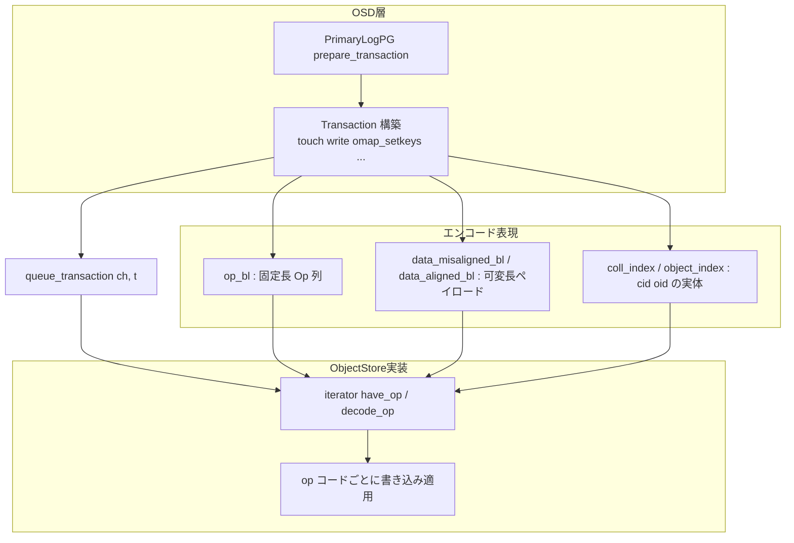

# 第18章 ObjectStore インターフェースと Transaction

> **本章で読むソース**
>
> - [`src/os/ObjectStore.h`](https://github.com/ceph/ceph/blob/v20.2.2/src/os/ObjectStore.h)
> - [`src/os/Transaction.h`](https://github.com/ceph/ceph/blob/v20.2.2/src/os/Transaction.h)
> - [`src/os/Transaction.cc`](https://github.com/ceph/ceph/blob/v20.2.2/src/os/Transaction.cc)

## この章の狙い

OSD は RADOS のオブジェクトを最終的にローカルディスクへ書き込む。
その書き込み先を抽象化するのが `ObjectStore` である。
上位の PG コード（第13章）は、生の I/O システムコールを直接発行しない。
オブジェクトへの write や omap 更新をまず `ObjectStore::Transaction` にエンコードし、`queue_transaction` でストアへ渡す。

本章は二つの層を読む。
一つは `ObjectStore` という抽象クラスそのもので、上位が呼ぶ書き込み投入口と同期読み取り口を定める。
もう一つは `Transaction` で、複数の変更操作を1つのアトミックな単位としてバイト列にまとめる仕組みである。
`ObjectStore` の実装の1つが BlueStore であり、その内部構造は第19章以降で扱う。

「操作をその場で実行せず、いったんデータとしてエンコードして運ぶ」という設計が全体を貫く。
この設計がなぜバッチ化とコピー削減につながるのかを、`Transaction` のエンコード表現から読み解くことが本章の主題である。

## 前提

第13章で `PrimaryLogPG` が `prepare_transaction` で ObjectStore へのトランザクションを組み立て、第14章で `ReplicatedBackend` がそれをプライマリとレプリカの各ストアへ届ける流れを見た。
本章はその受け皿である `ObjectStore` の契約と、運ばれる `Transaction` の中身に踏み込む。
歴史的には FileStore という POSIX ファイルシステム上の実装が使われていた。
現在の標準実装は生ブロックデバイス上に構築された BlueStore であり、本書もこちらを追う。

## ObjectStore：ローカルストレージの抽象

`ObjectStore` は純粋仮想関数を並べた抽象クラスである。
クラス定義の冒頭で、扱うトランザクション型を `ceph::os::Transaction` に別名付けしている。

[`src/os/ObjectStore.h` L63-L68](https://github.com/ceph/ceph/blob/v20.2.2/src/os/ObjectStore.h#L63-L68)

```cpp
class ObjectStore {
protected:
  std::string path;

public:
  using Transaction = ceph::os::Transaction;
```

ストアの操作は大きく三種類に分かれる。
状態を変える書き込みは、すべて `Transaction` にまとめて `queue_transaction` から投入する。
現在の状態を知る読み取りは、`read` や `omap_get` や `getattr` を直接同期呼び出しする。
ライフサイクル管理として `mkfs`、`mount`、`umount` がある。

書き込み投入口は次の2つである。
単一トランザクション版 `queue_transaction` は、内部で1要素のベクタに詰め替えて `queue_transactions` を呼ぶ薄いラッパーにすぎない。
実装が override するのは複数版 `queue_transactions` のほうである。

[`src/os/ObjectStore.h` L230-L242](https://github.com/ceph/ceph/blob/v20.2.2/src/os/ObjectStore.h#L230-L242)

```cpp
  int queue_transaction(CollectionHandle& ch,
			Transaction&& t,
			TrackedOpRef op = TrackedOpRef(),
			ThreadPool::TPHandle *handle = NULL) {
    std::vector<Transaction> tls;
    tls.push_back(std::move(t));
    return queue_transactions(ch, tls, op, handle);
  }

  virtual int queue_transactions(
    CollectionHandle& ch, std::vector<Transaction>& tls,
    TrackedOpRef op = TrackedOpRef(),
    ThreadPool::TPHandle *handle = NULL) = 0;
```

投入は非同期である。
第1引数の `CollectionHandle` が、このトランザクション群を適用する Collection を指す。
完了はコールバックで通知され、その分類は後述する。

読み取りは同期関数として並ぶ。
オブジェクトのバイトデータを読む `read` は、オフセットと長さを取り結果を `bufferlist` に返す。

[`src/os/ObjectStore.h` L484-L490](https://github.com/ceph/ceph/blob/v20.2.2/src/os/ObjectStore.h#L484-L490)

```cpp
   virtual int read(
     CollectionHandle &c,
     const ghobject_t& oid,
     uint64_t offset,
     size_t len,
     ceph::buffer::list& bl,
     uint32_t op_flags = 0) = 0;
```

オブジェクトは4つの部分から成る。
バイトデータ、xattr、omap ヘッダ、omap エントリである。
この区分はヘッダのコメントで明示されている。

[`src/os/ObjectStore.h` L183-L185](https://github.com/ceph/ceph/blob/v20.2.2/src/os/ObjectStore.h#L183-L185)

```cpp
   * Each object has four distinct parts: byte data, xattrs, omap_header
   * and omap entries.
```

xattr は拡張属性であり、キーと値の集合として持つ。
Ceph 内部では合計サイズが小さく（64KB 未満程度）、近接アクセスが安価であることを前提に使われる。
omap エントリは概念上は xattr と同じキーバリューだが、別のアドレス空間に置かれ、値が MB 級に大きくなりうる。
`omap_get` は omap ヘッダとキーバリュー全体を取り出す。

[`src/os/ObjectStore.h` L708-L713](https://github.com/ceph/ceph/blob/v20.2.2/src/os/ObjectStore.h#L708-L713)

```cpp
  virtual int omap_get(
    CollectionHandle &c,     ///< [in] Collection containing oid
    const ghobject_t &oid,   ///< [in] Object containing omap
    ceph::buffer::list *header,      ///< [out] omap header
    std::map<std::string, ceph::buffer::list> *out /// < [out] Key to value std::map
    ) = 0;
```

omap は大量エントリでも範囲クエリが効率的であることが要求される。
この特性が、RADOS のオブジェクトインデックスや PG のメタデータ保持に使われる根拠となる。

## Collection は PG に対応する

`ObjectStore` の中でオブジェクトは、`coll_t` という名前の Collection に属する。
`coll_t` は `spg_t`（シャード付き PG 識別子）をラップする型であり、`is_pg()` で PG を表すかどうかを判定できる。

[`src/osd/osd_types.h` L655-L663](https://github.com/ceph/ceph/blob/v20.2.2/src/osd/osd_types.h#L655-L663)

```cpp
class coll_t {
  enum type_t : uint8_t {
    TYPE_META = 0,
    TYPE_LEGACY_TEMP = 1, /* no longer used */
    TYPE_PG = 2,
    TYPE_PG_TEMP = 3,
  };
  type_t type;
  spg_t pgid;
```

Collection は単なるオブジェクトのグループではなく、トランザクションの順序付け単位でもある。
同じ Collection に投入されたトランザクションは投入順に適用される。
異なる Collection のトランザクションは並行して走りうる。

[`src/os/ObjectStore.h` L131-L135](https://github.com/ceph/ceph/blob/v20.2.2/src/os/ObjectStore.h#L131-L135)

```cpp
   * a collection also orders transactions
   *
   * Any transactions queued under a given collection will be applied in
   * sequence.  Transactions queued under different collections may run
   * in parallel.
```

この順序保証が、PG ごとの書き込みの直列性を下位で支える。
Collection をまたぐ並行実行を許すことで、複数 PG の I/O は互いを待たずに進む。

上位は Collection をハンドル `CollectionHandle` で扱う。
既存の Collection は `open_collection` で開き、新規作成予定の Collection は `create_new_collection` でハンドルを得る。

[`src/os/ObjectStore.h` L414-L423](https://github.com/ceph/ceph/blob/v20.2.2/src/os/ObjectStore.h#L414-L423)

```cpp
  virtual CollectionHandle open_collection(const coll_t &cid) = 0;

  /**
   * get a collection handle for a soon-to-be-created collection
   *
   * This handle must be used by queue_transaction that includes a
   * create_collection call in order to become valid.  It will become the
   * reference to the created collection.
   */
  virtual CollectionHandle create_new_collection(const coll_t &cid) = 0;
```

## Transaction：操作をデータとして運ぶ

`Transaction` は一連の基本変更操作を表す。
create、touch、write、setattr、omap_setkeys といった操作は、それぞれ数値の op コードを持つ。

[`src/os/Transaction.h` L109-L118](https://github.com/ceph/ceph/blob/v20.2.2/src/os/Transaction.h#L109-L118)

```cpp
  enum {
    OP_NOP =          0,
    OP_CREATE =       7,   // cid, oid
    OP_TOUCH =        9,   // cid, oid
    OP_WRITE =        10,  // cid, oid, offset, len, bl
    OP_ZERO =         11,  // cid, oid, offset, len
    OP_TRUNCATE =     12,  // cid, oid, len
    OP_REMOVE =       13,  // cid, oid
    OP_SETATTR =      14,  // cid, oid, attrname, bl
    OP_SETATTRS =     15,  // cid, oid, attrset
```

各操作は固定長構造体 `Op` にエンコードされる。
`Op` は `__attribute__ ((packed))` 付きの POD で、op コードと Collection の索引 `cid`、オブジェクトの索引 `oid`、オフセットや長さなどのフィールドを持つ。

[`src/os/Transaction.h` L163-L178](https://github.com/ceph/ceph/blob/v20.2.2/src/os/Transaction.h#L163-L178)

```cpp
  struct Op {
    ceph_le32 op;
    ceph_le32 cid;
    ceph_le32 oid;
    ceph_le64 off;
    ceph_le64 len;
    ceph_le32 dest_cid;
    ceph_le32 dest_oid;               //OP_CLONE, OP_CLONERANGE
    ceph_le64 dest_off;               //OP_CLONERANGE
    ceph_le32 hint;                   //OP_COLL_HINT,OP_SETALLOCHINT
    ceph_le64 expected_object_size;   //OP_SETALLOCHINT
    ceph_le64 expected_write_size;    //OP_SETALLOCHINT
    ceph_le32 split_bits;             //OP_SPLIT_COLLECTION2,OP_COLL_SET_BITS,
                                      //OP_MKCOLL
    ceph_le32 split_rem;              //OP_SPLIT_COLLECTION2
  } __attribute__ ((packed)) ;
```

`cid` と `oid` は `coll_t` や `ghobject_t` の実体ではなく、索引番号である。
Collection とオブジェクトの実体は `coll_index` と `object_index` に一度だけ登録し、`Op` にはその番号だけを埋める。
同じオブジェクトを複数回操作しても実体は重複して積まれない。

トランザクションを構築する各メソッドは、この `Op` を1つ確保して埋める形をとる。
たとえば `touch` は次のように書ける。

[`src/os/Transaction.h` L850-L856](https://github.com/ceph/ceph/blob/v20.2.2/src/os/Transaction.h#L850-L856)

```cpp
  void touch(const coll_t& cid, const ghobject_t& oid) {
    Op* _op = _get_next_op();
    _op->op = OP_TOUCH;
    _op->cid = _get_coll_id(cid);
    _op->oid = _get_object_id(oid);
    data.ops = data.ops + 1;
  }
```

`_get_next_op` が新しい `Op` 用の領域を確保して返す。
確保先は `op_bl` という `bufferlist` である。
末尾に空きが足りなければ `OPS_PER_PTR`（32）個ぶんをまとめて予約し、`append_hole` で穴を空けてゼロ初期化する。

[`src/os/Transaction.h` L795-L804](https://github.com/ceph/ceph/blob/v20.2.2/src/os/Transaction.h#L795-L804)

```cpp
  Op* _get_next_op() {
    if (op_bl.get_append_buffer_unused_tail_length() < sizeof(Op)) {
      op_bl.reserve(sizeof(Op) * OPS_PER_PTR);
    }
    // append_hole ensures bptr merging. Even huge number of ops
    // shouldn't result in overpopulating bl::_buffers.
    char* const p = op_bl.append_hole(sizeof(Op)).c_str();
    memset(p, 0, sizeof(Op));
    return reinterpret_cast<Op*>(p);
  }
```

固定長の `Op` 列とは別に、可変長のペイロードは別の `bufferlist` に積む。
`setattr` の属性値や `omap_setkeys` のキーバリューは、`data_misaligned_bl` に `encode` される。

[`src/os/Transaction.h` L1137-L1149](https://github.com/ceph/ceph/blob/v20.2.2/src/os/Transaction.h#L1137-L1149)

```cpp
  void omap_setkeys(
    const coll_t& cid,                           ///< [in] Collection containing oid
    const ghobject_t &oid,                ///< [in] Object to update
    const std::map<std::string, ceph::buffer::list> &attrset ///< [in] Replacement keys and values
    ) {
    using ceph::encode;
    Op* _op = _get_next_op();
    _op->op = OP_OMAP_SETKEYS;
    _op->cid = _get_coll_id(cid);
    _op->oid = _get_object_id(oid);
    encode(attrset, data_misaligned_bl);
    data.ops = data.ops + 1;
  }
```

トランザクション全体のヘッダは `TransactionData` に置かれる。
`ops` は操作の総数で、`empty()` や `get_num_ops()` はここを見る。

[`src/os/Transaction.h` L180-L192](https://github.com/ceph/ceph/blob/v20.2.2/src/os/Transaction.h#L180-L192)

```cpp
  struct TransactionData {
    ceph_le64 ops;
    ceph_le32 unused1;
    ceph_le32 unused2;
    ceph_le32 unused3;
    ceph_le32 fadvise_flags;

    TransactionData() noexcept :
      ops(0),
      unused1(0),
      unused2(0),
      unused3(0),
      fadvise_flags(0) { }
```

## iterator：バイト列から操作を復元する

`ObjectStore` の実装側は、エンコードされたトランザクションを `iterator` で1操作ずつ読み解く。
`have_op` で残りの有無を見て、`decode_op` で次の `Op` を返し、可変長データが要る操作ではそれ専用のデコード関数を呼ぶ。

[`src/os/Transaction.h` L692-L703](https://github.com/ceph/ceph/blob/v20.2.2/src/os/Transaction.h#L692-L703)

```cpp
    bool have_op() {
      return ops > 0;
    }
    Op* decode_op() {
      ceph_assert(ops > 0);

      op = reinterpret_cast<Op*>(op_buffer_p);
      op_buffer_p += sizeof(Op);
      ops--;

      return op;
    }
```

`decode_op` は `op_bl` の中を `Op` サイズぶんずつポインタを進めて返すだけである。
固定長ゆえに読み出しにパースが要らない。
この復元パターンは `dump` の実装に典型的に現れる。

[`src/os/Transaction.cc` L58-L66](https://github.com/ceph/ceph/blob/v20.2.2/src/os/Transaction.cc#L58-L66)

```cpp
  iterator i = begin();
  int op_num = 0;
  bool stop_looping = false;
  while (i.have_op() && !stop_looping) {
    Transaction::Op *op = i.decode_op();
    f->open_object_section("op");
    f->dump_int("op_num", op_num);

    switch (op->op) {
```

`Op` の `cid` と `oid` は索引番号なので、`get_cid` と `get_oid` で実体に引き直す。
BlueStore の `queue_transactions` もこの同じ iterator を使い、op コードごとに自前の書き込み処理へ振り分ける。

## 複数トランザクションの連結

`queue_transactions` はトランザクションのベクタを受ける。
上位が複数のトランザクションを1回の投入にまとめられるのは、`append` が別のトランザクションを自分の末尾へ連結できるからである。

[`src/os/Transaction.h` L524-L534](https://github.com/ceph/ceph/blob/v20.2.2/src/os/Transaction.h#L524-L534)

```cpp
  /// Append the operations of the parameter to this Transaction. Those operations are removed from the parameter Transaction
  void append(Transaction& other) {
    //appending a transaction in new format with a transaction in old format
    //or versa versa is not supported.
    ceph_assert(data_features == other.data_features);
    data.ops = data.ops + other.data.ops;
    data.fadvise_flags = data.fadvise_flags | other.data.fadvise_flags;
    on_applied.splice(on_applied.end(), other.on_applied);
    on_commit.splice(on_commit.end(), other.on_commit);
    on_applied_sync.splice(on_applied_sync.end(), other.on_applied_sync);
```

連結時は相手側の Collection とオブジェクトの索引を自分の索引へ振り直す。
`_update_op_bl` が相手の `op_bl` を走査し、各 `Op` の `cid` と `oid` を新しい番号に置換する。
索引を統合することで、連結後も実体の重複登録を避けられる。

## 完了通知の三分類

トランザクションの一生には三つのコールバック機会がある。
`on_applied_sync`、`on_applied`、`on_commit` である。
`on_applied` 系は、変更が後続の ObjectStore 操作から読めるようになった時点で呼ばれる。
`on_commit` は、変更が安定ストレージへ恒久的にコミットされ、クラッシュに耐える状態になった時点で呼ばれる。

[`src/os/Transaction.h` L33-L38](https://github.com/ceph/ceph/blob/v20.2.2/src/os/Transaction.h#L33-L38)

```cpp
 * The "on_applied" and "on_applied_sync" callbacks are invoked when
 * the modifications requested by the Transaction are visible to
 * subsequent ObjectStore operations, i.e., the results are
 * readable. The only conceptual difference between on_applied and
 * on_applied_sync is the specific thread and locking environment in
 * which the callbacks operate.
```

第13章で `PrimaryLogPG` が「レプリカのコミットと自身のコミットが揃った時点でクライアントへ応答する」と述べた、その「コミット」がこの `on_commit` に対応する。
読み取り可能になる時点と、恒久化される時点を分けて通知することで、上位は可視性と耐久性を別々のタイミングで扱える。

## エンコードの二形式と最適化

トランザクションは二つの形式でエンコードされる。
バージョン9の旧形式は書き込みデータをページ境界に整列させない。
バージョン10の新形式は、整列したデータをメッセージ先頭にまとめて配置する。
選択はレプリカ集合の共通機能ビットで決まる。

[`src/os/Transaction.h` L1319-L1352](https://github.com/ceph/ceph/blob/v20.2.2/src/os/Transaction.h#L1319-L1352)

```cpp
  void encode(ceph::buffer::list &p_bl,
	      ceph::buffer::list &d_bl,
	      uint64_t features=0) const
  {
    //see also get_encoded_bytes which assumes layout version 9

    //layout version 9:
    // buffer = data_misaligned_bl + op_bl + coll_index + object_index + data
    //layout version 10 (for inter-OSD messages):
    // payload = op_bl + coll_index + object_index + data
    // data = data_aligned_bl + data_misaligned_bl

    uint8_t ver = HAVE_FEATURE(features, SERVER_TENTACLE) ? 10 : 9;
```

新形式が書き込みデータを整列させる狙いは、OSD 間メッセージでのデータのページ境界を保つことにある。
write メソッドは書き込みデータのうち、ページ境界に収まる中央部分を `data_aligned_bl` に、端の半端な部分を `data_misaligned_bl` に振り分ける。
整列を保つと、受信側でのコピーやページをまたぐ再配置を避けやすくなる。

この章の最適化の核心は、トランザクションのバッチ化とゼロコピーの併用にある。
複数の変更操作を1つの `Transaction` にまとめ、それを1回 `queue_transaction` するので、バックエンドはまとめて1度のコミットで永続化でき、ディスクへの fsync 回数を操作ごとではなくトランザクションごとに減らせる。
さらに write のデータ本体は `bufferlist` として参照で運ばれ、エンコード時にバイト列がコピーされない。
固定長 `Op` を `append_hole` でまとめ確保し、可変長データは別 `bufferlist` に参照で積むこの分離が、操作を積む段でのメモリコピーを抑える。

## トランザクションが流れる経路

上位の PG から BlueStore までの流れを図にまとめる。



Collection ごとに直列、Collection 間で並行という順序付けを、投入口の `CollectionHandle` が担う。
エンコードされた `op_bl` と可変長ペイロードは、`iterator` を通じて実装側で1操作ずつ復元され、BlueStore の書き込みパスへ渡る。

## まとめ

`ObjectStore` は OSD とローカルディスクの間に立つ抽象で、書き込みは `Transaction` にまとめて `queue_transaction` で投入し、読み取りは `read` や `omap_get` を同期呼び出しする。
`Transaction` は複数の変更操作を、固定長 `Op` 列（`op_bl`）と可変長ペイロード（`data_misaligned_bl` ほか）に分けてエンコードし、Collection とオブジェクトは索引番号で参照する。
実装側は `iterator` でこのバイト列を1操作ずつ復元して適用する。
Collection は `coll_t` として PG に対応し、同一 Collection 内のトランザクションは投入順に直列適用される。
バッチ化とゼロコピーの併用により、操作ごとのコミットとデータコピーを避けられる点が、この層の効率を支える。

## 関連する章

- 第13章「PrimaryLogPG の I/O パイプライン」：`Transaction` を組み立てる上位の処理。
- 第14章「ReplicatedBackend」：組み立てた `Transaction` をプライマリとレプリカの各ストアへ届ける層。
- 第19章「BlueStore のメタデータとオンディスク構造」：`ObjectStore` の標準実装 BlueStore が `queue_transactions` をどう処理するか。
