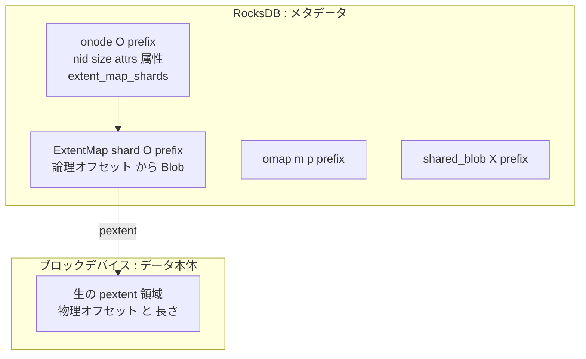
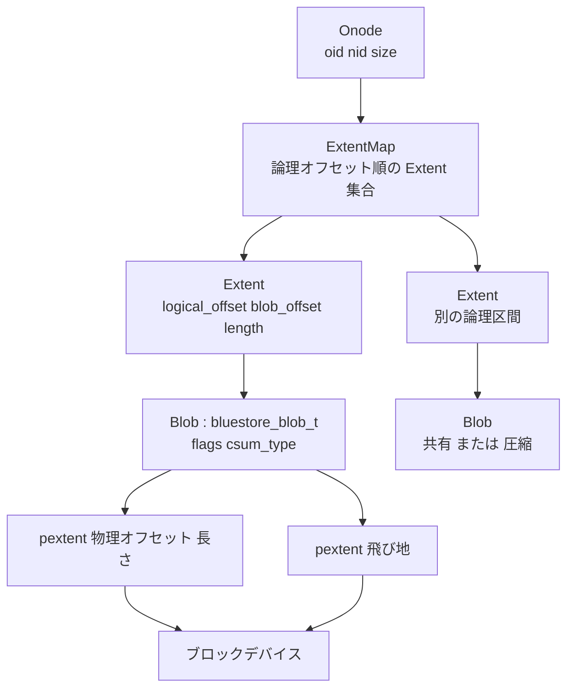

# 第19章 BlueStore のメタデータとオンディスク構造

> **本章で読むソース**
>
> - [`src/os/bluestore/bluestore_types.h`](https://github.com/ceph/ceph/blob/v20.2.2/src/os/bluestore/bluestore_types.h)
> - [`src/os/bluestore/BlueStore.h`](https://github.com/ceph/ceph/blob/v20.2.2/src/os/bluestore/BlueStore.h)
> - [`src/os/bluestore/BlueStore.cc`](https://github.com/ceph/ceph/blob/v20.2.2/src/os/bluestore/BlueStore.cc)

## この章の狙い

第18章では、OSD が下位に要求する `ObjectStore` インターフェースと、書き込みをまとめて渡す `Transaction` を読んだ。
その実装が BlueStore である。
BlueStore は、ローカルのファイルシステムを介さず、生ブロックデバイスの上にオブジェクトを直接配置する。

ファイルシステムを挟まない設計には理由がある。
RADOS のオブジェクトは、データ本体のほかに拡張属性と omap という二種類のキー値集合を持つ。
これをファイルシステムの上に載せると、ファイルシステム自身のメタデータ更新と RADOS のメタデータ更新で二重にジャーナルを書くことになり、書き込み増幅が避けられない。
BlueStore は、メタデータを RocksDB に、データ本体を生デバイスに分けて置くことで、この二重ジャーナルを外した。

本章は、この二層構造のうちメタデータ側を読む。
オブジェクトのメタデータがどのオンディスク構造で表現され、論理オフセットがどうやって生デバイス上の物理位置へ変換されるかをたどる。
大きなオブジェクトのメタデータを部分的にだけ読み書きするための ExtentMap のシャード化を、本章の最適化の中心に据える。
データ本体を実際にデバイスへ書き出す経路（Allocator、deferred write、圧縮）は第21章で、RocksDB をどのデバイス領域に載せるか（BlueFS）は第20章で扱う。

## 前提

- 第18章の `ObjectStore` と `Transaction`、および OSD がオブジェクトを `ghobject_t` で識別すること。
- オブジェクトが本体データに加えて拡張属性と omap を持つという RADOS のオブジェクトモデル。
- キー値ストアとしての RocksDB の役割（キー順に整列した永続 map であること）。

## 二層構造：メタデータは RocksDB、データは生デバイス

BlueStore は一つの OSD が使うストレージ空間を二つの置き場に分けて管理する。
オブジェクトのメタデータ（本体データがデバイス上のどこにあるかの対応、拡張属性、omap）は RocksDB のキー値として持つ。
オブジェクトの本体データは、RocksDB を経由せず生ブロックデバイスの領域に直接置く。

RocksDB の中では、キーの先頭1バイトのプレフィックスで用途を区切っている。

[`src/os/bluestore/BlueStore.cc` L130-L141](https://github.com/ceph/ceph/blob/v20.2.2/src/os/bluestore/BlueStore.cc#L130-L141)

```cpp
const string PREFIX_SUPER = "S";       // field -> value
const string PREFIX_STAT = "T";        // field -> value(int64 array)
const string PREFIX_COLL = "C";        // collection name -> cnode_t
const string PREFIX_OBJ = "O";         // object name -> onode_t
const string PREFIX_OMAP = "M";        // u64 + keyname -> value
const string PREFIX_PGMETA_OMAP = "P"; // u64 + keyname -> value(for meta coll)
const string PREFIX_PERPOOL_OMAP = "m"; // s64 + u64 + keyname -> value
const string PREFIX_PERPG_OMAP = "p";   // u64(pool) + u32(hash) + u64(id) + keyname -> value
const string PREFIX_DEFERRED = "L";    // id -> deferred_transaction_t
const string PREFIX_ALLOC = "B";       // u64 offset -> u64 length (freelist)
const string PREFIX_ALLOC_BITMAP = "b";// (see BitmapFreelistManager)
const string PREFIX_SHARED_BLOB = "X"; // u64 SB id -> shared_blob_t
```

オブジェクトのメタデータは `O` プレフィックスに、その値としてオブジェクトごとの `onode`（後述）が入る。
omap のエントリは `m` や `p` プレフィックスに、オブジェクトの識別子を先頭に付けたキーで並ぶ。
このキー設計により、同一プールや同一 PG の omap は RocksDB 上で連続配置され、範囲スキャンが局所的な読み出しで済む。
`B` プレフィックスの freelist は空き領域の管理であり、第21章の Allocator で扱う。

メタデータとデータの分担を図にすると次のようになる。



RocksDB 自体もどこかに永続化する必要があるが、その置き場が BlueFS という専用の軽量ファイルシステムである。
BlueFS は第20章で読む。
本章では、RocksDB が使えるキー値ストアとして手前に立っている前提で、メタデータの中身に集中する。

## onode：オブジェクト一つ分のメタデータ

BlueStore がオブジェクト一つを永続化するときの値が `bluestore_onode_t` である。

[`src/os/bluestore/bluestore_types.h` L1120-L1146](https://github.com/ceph/ceph/blob/v20.2.2/src/os/bluestore/bluestore_types.h#L1120-L1146)

```cpp
struct bluestore_onode_t {
  uint64_t nid = 0;                    ///< numeric id (locally unique)
  uint64_t size = 0;                   ///< object size
  // mempool to be assigned to buffer::ptr manually
  std::map<mempool::bluestore_cache_meta::string, ceph::buffer::ptr> attrs;

  struct shard_info {
    uint32_t offset = 0;  ///< logical offset for start of shard
    uint32_t bytes = 0;   ///< encoded bytes
    // ... (中略) ...
  };
  std::vector<shard_info> extent_map_shards; ///< extent std::map shards (if any)
  // ... (中略) ...
  uint8_t flags = 0;

  std::map<uint32_t, uint64_t> zone_offset_refs;  ///< (zone, offset) refs to this onode
```

`nid` は OSD 内で一意な数値 ID であり、omap のキー先頭に埋め込むためにオブジェクト名より短い識別子として使う。
`size` はオブジェクトの論理サイズ、`attrs` は拡張属性の集合である。
`extent_map_shards` は、後述する ExtentMap を分割して別キーへ逃がすときの索引であり、通常サイズのオブジェクトでは空のままとなる。
`flags` は omap がどのキープレフィックスに置かれているか（`FLAG_PERPOOL_OMAP` など）を保持し、omap を読むときにどのプレフィックスを引くかを決める。

[`src/os/bluestore/bluestore_types.h` L1147-L1152](https://github.com/ceph/ceph/blob/v20.2.2/src/os/bluestore/bluestore_types.h#L1147-L1152)

```cpp
  enum {
    FLAG_OMAP = 1,         ///< object may have omap data
    FLAG_PGMETA_OMAP = 2,  ///< omap data is in meta omap prefix
    FLAG_PERPOOL_OMAP = 4, ///< omap data is in per-pool prefix; per-pool keys
    FLAG_PERPG_OMAP = 8,   ///< omap data is in per-pg prefix; per-pg keys
  };
```

この `bluestore_onode_t` を値として RocksDB の `O` プレフィックスに置く。
メモリ側では、これを包む `BlueStore::Onode` が対応する。

[`src/os/bluestore/BlueStore.h` L1371-L1392](https://github.com/ceph/ceph/blob/v20.2.2/src/os/bluestore/BlueStore.h#L1371-L1392)

```cpp
  struct Onode {
    MEMPOOL_CLASS_HELPERS();

    std::atomic_int nref = 0;      ///< reference count
    std::atomic_int pin_nref = 0;  ///< reference count replica to track pinning
    Collection *c;
    ghobject_t oid;

    /// key under PREFIX_OBJ where we are stored
    mempool::bluestore_cache_meta::string key;
    // ... (中略) ...
    bluestore_onode_t onode;  ///< metadata stored as value in kv store
    bool exists;              ///< true if object logically exists
    // ... (中略) ...
    ExtentMap extent_map;
    BufferSpace bc;             ///< buffer cache
```

`Onode` は、永続表現の `bluestore_onode_t` に加えて、メモリ上で組み立てた `ExtentMap`（論理から物理への対応）と `BufferSpace`（本体データのキャッシュ）を抱える。
オブジェクトへの読み書きは、まずこの `Onode` を得るところから始まる。

## onode の取得：RocksDB から引いてデコードする

`Collection::get_onode` が、オブジェクト ID から `Onode` を得る入り口である。

[`src/os/bluestore/BlueStore.cc` L5327-L5355](https://github.com/ceph/ceph/blob/v20.2.2/src/os/bluestore/BlueStore.cc#L5327-L5355)

```cpp
  OnodeRef o = onode_space.lookup(oid);
  if (o)
    return o;

  string key;
  get_object_key(store->cct, oid, &key);
  // ... (中略) ...
  bufferlist v;
  int r = -ENOENT;
  Onode *on;
  if (!is_createop) {
    r = store->db->get(PREFIX_OBJ, key.c_str(), key.size(), &v);
    ldout(store->cct, 20) << " r " << r << " v.len " << v.length() << dendl;
  }
  // ... (中略) ...
  // new object, load onode if available
  on = Onode::create_decode(this, oid, key, v, true, store->segment_size != 0);
  o.reset(on);
  return onode_space.add_onode(oid, o);
```

まず `onode_space` という Onode キャッシュを引き、当たればそのまま返す。
外れた場合だけ、`get_object_key` でオブジェクト ID を RocksDB キーへ変換し、`O` プレフィックスから値を読む。
読んだ値を `Onode::create_decode` でデコードして `Onode` を組み立て、キャッシュへ登録してから返す。
ここで重要なのは、デコードするのは `bluestore_onode_t` 本体とシャード索引までであり、ExtentMap の中身はまだ全部読まない点である。

## ExtentMap：論理オフセットから Blob への対応

オブジェクトのデータ本体は、論理オフセットの区間ごとに物理位置へ対応づける。
その対応を保持するのが `ExtentMap` であり、要素が `Extent` である。

[`src/os/bluestore/BlueStore.h` L872-L890](https://github.com/ceph/ceph/blob/v20.2.2/src/os/bluestore/BlueStore.h#L872-L890)

```cpp
  struct Extent : public ExtentBase {
    MEMPOOL_CLASS_HELPERS();

    uint32_t logical_offset = 0;      ///< logical offset
    uint32_t blob_offset = 0;         ///< blob offset
    uint32_t length = 0;              ///< length
    BlobRef  blob;                    ///< the blob with our data
```

一つの `Extent` は、オブジェクトの論理オフセット `logical_offset` から始まる `length` バイトが、ある `blob` の中の `blob_offset` に対応することを表す。
`Extent` は論理オフセットをキーとして intrusive な集合に整列して並ぶ。
複数の論理区間が同じ `Blob` を指すこともあり、これが後述する共有や圧縮の基盤になる。

`Blob` は、論理的なデータのまとまりを、生デバイス上の物理位置とチェックサムに結びつける層である。
その永続表現が `bluestore_blob_t` である。

[`src/os/bluestore/bluestore_types.h` L489-L513](https://github.com/ceph/ceph/blob/v20.2.2/src/os/bluestore/bluestore_types.h#L489-L513)

```cpp
struct bluestore_blob_t {
private:
  PExtentVector extents;              ///< raw data position on device
  uint32_t logical_length = 0;        ///< original length of data stored in the blob
  uint32_t compressed_length = 0;     ///< compressed length if any

public:
  enum {
    LEGACY_FLAG_MUTABLE = 1,  ///< [legacy] blob can be overwritten or split
    FLAG_COMPRESSED = 2,      ///< blob is compressed
    FLAG_CSUM = 4,            ///< blob has checksums
    FLAG_HAS_UNUSED = 8,      ///< blob has unused std::map
    FLAG_SHARED = 16,         ///< blob is shared; see external SharedBlob
  };
  // ... (中略) ...
  uint8_t csum_type = Checksummer::CSUM_NONE;      ///< CSUM_*
  uint8_t csum_chunk_order = 0;       ///< csum block size is 1<<block_order bytes

  ceph::buffer::ptr csum_data;                ///< opaque std::vector of csum data
```

`extents` は `bluestore_pextent_t`（物理エクステント）の列である。

[`src/os/bluestore/bluestore_types.h` L97-L103](https://github.com/ceph/ceph/blob/v20.2.2/src/os/bluestore/bluestore_types.h#L97-L103)

```cpp
/// pextent: physical extent
struct bluestore_pextent_t : public bluestore_interval_t<uint64_t, uint32_t> 
{
  bluestore_pextent_t() {}
  bluestore_pextent_t(uint64_t o, uint64_t l) : bluestore_interval_t(o, l) {}
  bluestore_pextent_t(const bluestore_interval_t &ext) :
    bluestore_interval_t(ext.offset, ext.length) {}
```

一つの `bluestore_pextent_t` は、生デバイス上の物理オフセット `offset` と長さ `length` の区間である。
一つの `Blob` が複数の pextent を持てるため、論理的に連続したデータが物理的に飛び地でも表現できる。
`FLAG_COMPRESSED` が立てば、`logical_length` と `compressed_length` の差として圧縮率が記録され、pextent は圧縮後の短い領域を指す。

ここまでで、オブジェクトから生デバイスまでの参照の連鎖が揃う。
`Onode` から `ExtentMap`、そこから論理区間ごとの `Extent`、`Extent` が指す `Blob`、`Blob` の中の `pextent`、そしてブロックデバイスへ、という階層である。



## ExtentMap のシャード化：大きなオブジェクトを部分ロードする

ここまでの `ExtentMap` は、オブジェクト一つ分の論理から物理への対応を全部メモリに持つ構造だった。
問題は、オブジェクトが大きくなると `Extent` の数が増え、対応表そのものが肥大することである。
RBD のイメージのように数ギガバイトのオブジェクトを、その端の数キロバイトだけ読み書きする場合でも、対応表を丸ごと RocksDB から読んでデコードするのでは無駄が大きい。

BlueStore はこれを、ExtentMap を論理オフセットで区切った複数のシャードに分割して解く。
各シャードは RocksDB 上では独立したキーに置かれ、必要なシャードだけを読み込む。
シャードの索引が、先に見た `bluestore_onode_t::extent_map_shards` である。
メモリ側の `ExtentMap::Shard` が各シャードのロード状態を持つ。

[`src/os/bluestore/BlueStore.h` L978-L985](https://github.com/ceph/ceph/blob/v20.2.2/src/os/bluestore/BlueStore.h#L978-L985)

```cpp
    struct Shard {
      bluestore_onode_t::shard_info *shard_info = nullptr;
      unsigned extents = 0;  ///< count extents in this shard
      bool loaded = false;   ///< true if shard is loaded
      bool dirty = false;    ///< true if shard is dirty and needs reencoding
    };

    mempool::bluestore_cache_meta::vector<Shard> shards;    ///< shards
```

`loaded` が、そのシャードの `Extent` 群をまだデコードしていないことを示す。
`get_onode` の時点では `shards` の索引だけを作り、各シャードは `loaded=false` のまま置く。
読み書きの直前に、対象の論理範囲を覆うシャードだけをロードする。
この「必要なシャードだけを読み込む」入り口が `fault_range` である。

[`src/os/bluestore/BlueStore.cc` L4327-L4341](https://github.com/ceph/ceph/blob/v20.2.2/src/os/bluestore/BlueStore.cc#L4327-L4341)

```cpp
void BlueStore::ExtentMap::fault_range(
  KeyValueDB *db,
  uint32_t offset,
  uint32_t length)
{
  // ... (中略) ...
  if (shards.size() == 0) {
    // no sharding yet; everyting is loaded
    return;
  }
  auto start = seek_shard(offset);
  auto last = seek_shard(offset + length);
  maybe_load_shard(db, start, last);
}
```

`shards` が空なら、ExtentMap はシャード化されておらず全部が onode 内にインライン展開済みなので、そのまま返る。
シャード化されている場合は、`seek_shard` で対象範囲の始端と終端が属するシャード番号を二分探索で求め、その範囲のシャードだけを `maybe_load_shard` に渡す。

[`src/os/bluestore/BlueStore.h` L1141-L1161](https://github.com/ceph/ceph/blob/v20.2.2/src/os/bluestore/BlueStore.h#L1141-L1161)

```cpp
    int seek_shard(uint32_t offset) {
      size_t end = shards.size();
      size_t mid, left = 0;
      size_t right = end; // one passed the right end

      while (left < right) {
        mid = left + (right - left) / 2;
        if (offset >= shards[mid].shard_info->offset) {
          size_t next = mid + 1;
          if (next >= end || offset < shards[next].shard_info->offset)
            return mid;
          // ... (中略) ...
```

実際にシャードを RocksDB から読むのが `maybe_load_shard` である。

[`src/os/bluestore/BlueStore.cc` L4343-L4385](https://github.com/ceph/ceph/blob/v20.2.2/src/os/bluestore/BlueStore.cc#L4343-L4385)

```cpp
void BlueStore::ExtentMap::maybe_load_shard(
  KeyValueDB *db,
  int start,
  int last)
{
  // ... (中略) ...
  string key;
  while (start <= last) {
    ceph_assert((size_t)start < shards.size());
    auto p = &shards[start];
    if (!p->loaded) {
      // ... (中略) ...
      bufferlist v;
      generate_extent_shard_key_and_apply(
	onode->key, p->shard_info->offset, &key,
        [&](const string& final_key) {
          int r = db->get(PREFIX_OBJ, final_key, &v);
          // ... (中略) ...
        }
      );
      p->extents = decode_some(v);
      p->loaded = true;
      // ... (中略) ...
      onode->c->store->logger->inc(l_bluestore_onode_shard_misses);
    } else {
      onode->c->store->logger->inc(l_bluestore_onode_shard_hits);
    }
    ++start;
  }
}
```

未ロードのシャードだけについて、`onode->key` にシャードの論理オフセットを付け足した専用キーを組み立て、`O` プレフィックスから読んで `decode_some` でデコードする。
すでにロード済みのシャードは読み飛ばす。
`l_bluestore_onode_shard_hits` と `l_bluestore_onode_shard_misses` のカウンタが、部分ロードがどれだけ効いているかを可視化している。

この構造が本章の最適化の中心である。
数ギガバイトのオブジェクトの端だけを読むとき、`fault_range` は対象範囲を覆う一つか二つのシャードしか RocksDB から読まず、残りの ExtentMap はデコードしないまま放置する。
オブジェクト全体のメタデータ量に比例した読み込みではなく、アクセスする論理範囲の大きさに比例した読み込みで済むため、部分アクセスのメタデータコストが一定に抑えられる。

読み出し経路がこのシャード化とどうつながるかは、`_do_read` の冒頭で確認できる。

[`src/os/bluestore/BlueStore.cc` L12972-L12983](https://github.com/ceph/ceph/blob/v20.2.2/src/os/bluestore/BlueStore.cc#L12972-L12983)

```cpp
  if (offset + length > o->onode.size) {
    length = o->onode.size - offset;
  }

  auto start = mono_clock::now();
  o->extent_map.fault_range(db, offset, length);
  log_latency(__func__,
    l_bluestore_read_onode_meta_lat,
    mono_clock::now() - start,
    cct->_conf->bluestore_log_op_age,
    "", l_bluestore_slow_read_onode_meta_count);
  _dump_onode<30>(cct, *o);
```

読み出しは、要求された論理範囲についてだけ `fault_range` を呼び、その範囲の ExtentMap を確定させてから、対応する pextent をデバイスから読む。
本体データを読む後半（`_read_cache`、`_prepare_read_ioc`、aio）は第21章の書き込みパスと合わせて扱う。

### シャードの粒度

シャードをどこで区切るかは、エンコード後のバイト数を目安に決める。

[`src/os/bluestore/BlueStore.cc` L3643-L3645](https://github.com/ceph/ceph/blob/v20.2.2/src/os/bluestore/BlueStore.cc#L3643-L3645)

```cpp
  unsigned target = cct->_conf->bluestore_extent_map_shard_target_size;
  unsigned slop = target *
    cct->_conf->bluestore_extent_map_shard_target_size_slop;
```

`bluestore_extent_map_shard_target_size` は既定で 500 バイト、下限の `bluestore_extent_map_shard_min_size` は 150 バイトである。
シャードが目標を大きく超えたり下限を割ったりすると、ExtentMap は再シャード（reshard）を要求し、境界を引き直す。
更新がシャード境界をまたぐと、そのシャードを単独でエンコードできなくなるため、`maybe_reshard` が再シャードを予約する。
このように、シャードは論理オフセットの区間であると同時に、RocksDB に書くエンコード済みキー値の単位でもある。

## Blob の共有とチェックサム

`Blob` には、複数のオブジェクトから参照される「共有 Blob」という状態がある。
スナップショットの clone は、親オブジェクトと同じデータを指すところから始まる。
このとき同じ pextent を二つの onode が参照するため、参照を横断して管理する `SharedBlob` を使う。

[`src/os/bluestore/BlueStore.h` L538-L557](https://github.com/ceph/ceph/blob/v20.2.2/src/os/bluestore/BlueStore.h#L538-L557)

```cpp
  struct SharedBlob {
    MEMPOOL_CLASS_HELPERS();

    std::atomic_int nref = {0}; ///< reference count
    bool loaded = false;

    CollectionRef collection;
    union {
      uint64_t sbid_unloaded;              ///< sbid if persistent isn't loaded
      bluestore_shared_blob_t *persistent; ///< persistent part of the shared blob if any
    };
```

`bluestore_blob_t` に `FLAG_SHARED` が立つと、その Blob は外部の `SharedBlob` に持ち出された参照集計を持つ。
`SharedBlob` の永続表現は RocksDB の `X` プレフィックス（`PREFIX_SHARED_BLOB`）に、共有 Blob ID（sbid）をキーとして置かれる。
どの物理区間が何本の論理参照を受けているかは `bluestore_extent_ref_map_t` が数え、参照が 0 になった区間だけを Allocator に返却できるようにする。

チェックサムは `Blob` 単位で持つ。
`bluestore_blob_t` の `csum_type` と `csum_chunk_order`、`csum_data` がそれである。
チェックサムのチャンクサイズは `1 << csum_chunk_order` バイトであり、Blob の中を固定長のチャンクに区切って一つずつチェックサム値を記録する。

[`src/os/bluestore/bluestore_types.h` L640-L642](https://github.com/ceph/ceph/blob/v20.2.2/src/os/bluestore/bluestore_types.h#L640-L642)

```cpp
  uint32_t get_csum_chunk_size() const {
    return 1 << csum_chunk_order;
  }
```

読み出しのたびに、デバイスから読んだ本体データを記録済みチェックサムと照合する。
その照合が `_verify_csum` である。

[`src/os/bluestore/BlueStore.cc` L13073-L13089](https://github.com/ceph/ceph/blob/v20.2.2/src/os/bluestore/BlueStore.cc#L13073-L13089)

```cpp
int BlueStore::_verify_csum(OnodeRef& o,
			    const bluestore_blob_t* blob, uint64_t blob_xoffset,
			    const bufferlist& bl,
			    uint64_t logical_offset)
{
  int bad;
  uint64_t bad_csum;
  auto start = mono_clock::now();
  int r = blob->verify_csum(blob_xoffset, bl, &bad, &bad_csum);
  // ... (中略) ...
  if (r < 0) {
    if (r == -1) {
      // ... (中略) ...
```

`verify_csum` が不一致を返すと、`_verify_csum` は壊れたチャンクの物理位置と論理位置を突き止め、期待値と実際の値をログに出す。
ファイルシステムを介さず生デバイスに書くと、下位のファイルシステムが提供するチェックサムには頼れない。
BlueStore が Blob 単位でチェックサムを持つのは、この読み出し時照合によってビットロット（デバイス上での静かなビット反転）を検出するためである。
検出したチェックサム不一致は上位に伝わり、第17章のスクラブや recovery が正しいレプリカからの復元を引き起こす。

## Onode キャッシュと Buffer キャッシュ

メタデータとデータには、それぞれ別のキャッシュ階層がある。
`OnodeCacheShard` が onode（メタデータ）を、`BufferCacheShard` が本体データをキャッシュする。

[`src/os/bluestore/BlueStore.h` L1611-L1624](https://github.com/ceph/ceph/blob/v20.2.2/src/os/bluestore/BlueStore.h#L1611-L1624)

```cpp
  /// A Generic buffer Cache Shard
  struct BufferCacheShard : public CacheShard {
    std::atomic<uint64_t> num_extents = {0};
    std::atomic<uint64_t> num_blobs = {0};
    uint64_t buffer_bytes = 0;
  public:
    BufferCacheShard(BlueStore* store)
      : CacheShard(store->cct) {
    }
    // ... (中略) ...
```

キャッシュは複数のシャードに分かれ、オブジェクトはハッシュでいずれかのシャードに割り当たる。
ロックをシャードごとに分けることで、別々のオブジェクトへの並行アクセスがキャッシュのロックで直列化されるのを避ける。
`get_onode` が最初に `onode_space` を引いたのは、この Onode キャッシュへの参照である。
本体データ側の `BufferSpace` は、`_do_read` が `_read_cache` でまず参照し、キャッシュに載っている区間はデバイスを読まずに返す。

メタデータとデータでキャッシュを分けるのは、両者でアクセス特性が異なるからである。
onode は小さく参照が繰り返されるため滞留させたい一方、本体データは大きく一度きりの読み出しも多い。
別々のキャッシュにして、それぞれのメモリ配分を独立に調整できるようにしている。

## まとめ

BlueStore は、ファイルシステムを挟まず生ブロックデバイスにオブジェクトを直接置くローカルストレージである。
メタデータ（onode、ExtentMap のシャード、omap、shared_blob）は RocksDB のキー値として、本体データは生デバイスの pextent に置く二層構造をとる。
この分離により、ファイルシステムのメタデータ更新と RADOS のメタデータ更新の二重ジャーナルを外している。

オブジェクトへのアクセスは、`Onode` を得て、`ExtentMap` で論理オフセットを `Blob` に、`Blob` で pextent に、pextent で生デバイスの物理位置に変換する連鎖をたどる。
ExtentMap をシャードに分け、`fault_range` でアクセスする論理範囲を覆うシャードだけを RocksDB から読むことで、巨大オブジェクトの部分アクセスでもメタデータの読み込みコストを一定に保つ。
Blob 単位のチェックサムは、生デバイス上でのビットロットを読み出し時に検出し、スクラブや recovery による復元につなぐ。

## 関連する章

- 第18章「ObjectStore インターフェースと Transaction」：BlueStore が実装する上位インターフェースと、書き込みをまとめて渡す Transaction。
- 第20章「BlueFS と RocksDB 統合」：本章でメタデータの置き場とした RocksDB を、どのデバイス領域にどう載せるか。
- 第21章「Allocator と書き込みパス」：pextent をどこから切り出すか（Allocator）と、deferred write、圧縮、チェックサム生成を含む書き込み経路の全体。
