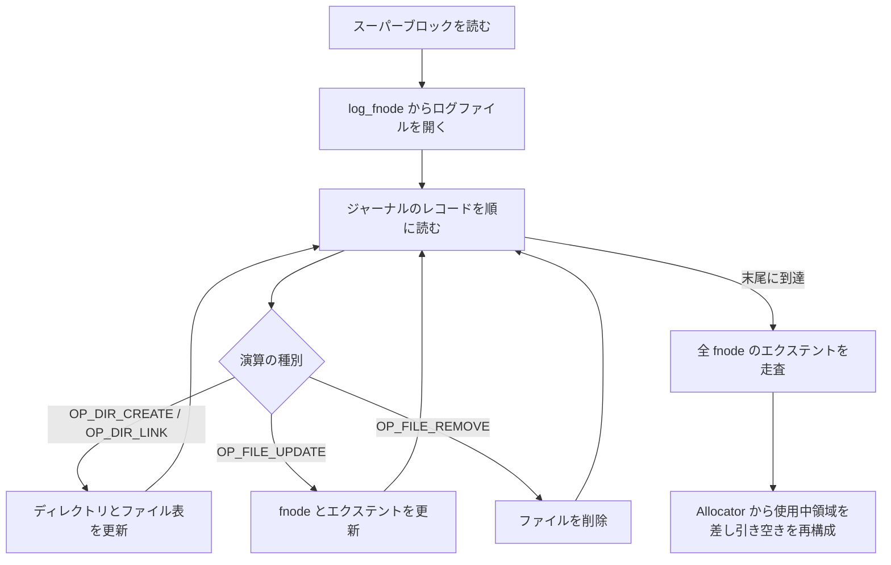
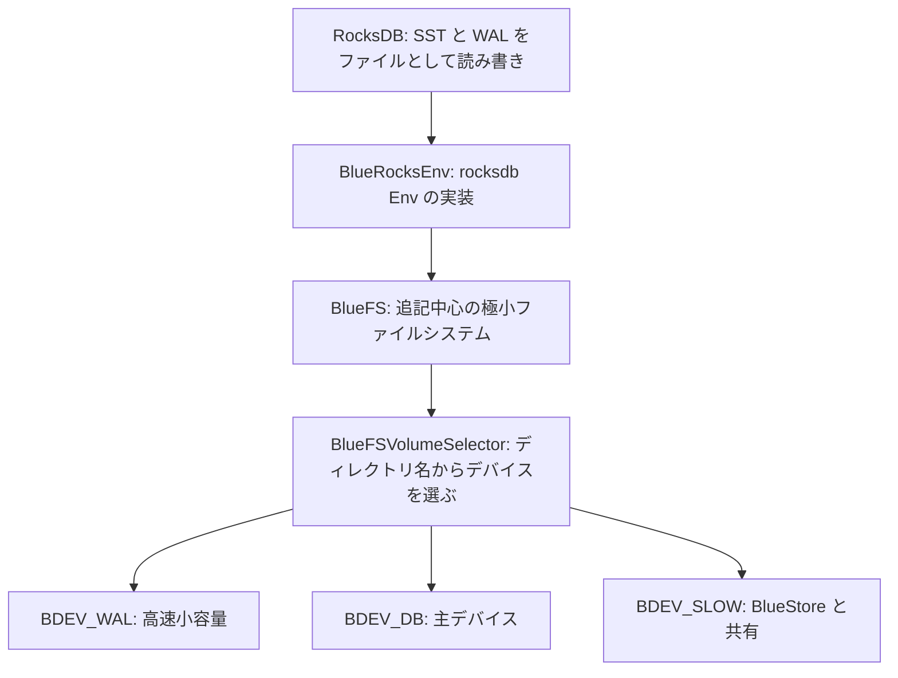

# 第20章 BlueFS と RocksDB 統合

> **本章で読むソース**
>
> - [`src/os/bluestore/BlueFS.h`](https://github.com/ceph/ceph/blob/v20.2.2/src/os/bluestore/BlueFS.h)
> - [`src/os/bluestore/BlueFS.cc`](https://github.com/ceph/ceph/blob/v20.2.2/src/os/bluestore/BlueFS.cc)
> - [`src/os/bluestore/bluefs_types.h`](https://github.com/ceph/ceph/blob/v20.2.2/src/os/bluestore/bluefs_types.h)
> - [`src/os/bluestore/BlueRocksEnv.h`](https://github.com/ceph/ceph/blob/v20.2.2/src/os/bluestore/BlueRocksEnv.h)
> - [`src/os/bluestore/BlueRocksEnv.cc`](https://github.com/ceph/ceph/blob/v20.2.2/src/os/bluestore/BlueRocksEnv.cc)

## この章の狙い

前章では、BlueStore がオブジェクトのメタデータ（onode やエクステント写像）を RocksDB のキーバリューとして持つことを読んだ。
しかし BlueStore は生のブロックデバイスを直接管理し、カーネルのファイルシステムを使わない。
一方の RocksDB は、SST ファイルや WAL を通常の POSIX ファイルとして読み書きする前提で書かれている。
この二つを噛み合わせるには、生デバイスの上に RocksDB が必要とするだけのファイル操作を提供する層が要る。
その層が **BlueFS** である。

BlueFS は汎用ファイルシステムではない。
RocksDB が実際に呼ぶ操作、すなわちファイルの新規作成、末尾への追記、順次読みと乱数読み、ディレクトリ列挙、リネーム、削除に的を絞る。
上書きやランダム書き込みは提供しない。
本章では、この割り切りがどのようにメタデータ構造を単純化するか、RocksDB を無改造で載せる `Env` の差し込みがどう働くか、そして複数のブロックデバイスにファイルを振り分けて書き込みレイテンシを下げる仕組みを読む。

## 前提

- 第18章の `ObjectStore` インターフェースと、BlueStore がその実装であること。
- 第19章の BlueStore のメタデータが RocksDB に載ること、および `Allocator` が生デバイスの空き領域を貸し出すこと。
- RocksDB が SST と WAL をファイルとして扱い、書き込みが末尾追記中心であること。
- ジャーナル（追記のみのログ）に変更を書き、起動時に読み直して状態を復元する一般的な手法。

## なぜ専用ファイルシステムを挟むのか

BlueStore はデバイス全体を自分で握り、その空き領域を `Allocator` で管理する。
ここに RocksDB を載せるには二つの道がある。
デバイスに ext4 や XFS を敷いて RocksDB をその上に置くか、RocksDB のためのファイル抽象を自前で作るかである。
Ceph は後者を選んだ。
汎用ファイルシステムはディレクトリツリー、パーミッション、ジャーナリング、ページキャッシュとの整合など、RocksDB が使わない機能まで抱え、そのぶんメタデータ更新のたびに余分な I/O とシステムコールを払う。

BlueFS が提供する操作は、RocksDB が本当に呼ぶものだけである。
RocksDB の `Env` 抽象が要求するメソッドのうち、上書きやランダム書き込みにあたる `Truncate` や `NewRandomRWFile` は、BlueFS 側で `NotSupported` を返して実装しない。

[`src/os/bluestore/BlueRocksEnv.h` L90-L94](https://github.com/ceph/ceph/blob/v20.2.2/src/os/bluestore/BlueRocksEnv.h#L90-L94)

```cpp
  rocksdb::Status NewRandomRWFile(const std::string& fname,
                                 std::unique_ptr<rocksdb::RandomRWFile>* result,
                                 const rocksdb::EnvOptions& options)override {
    return rocksdb::Status::NotSupported("RandomRWFile is not implemented in this Env");
  }
```

RocksDB は LSM ツリーであり、いったん書いた SST を書き換えず、新しい SST を書いて古いものを消す。
WAL も末尾追記だけで進む。
このアクセスパターンだからこそ、上書きを捨てた追記中心のファイルシステムで足りる。

## ファイルとエクステントとジャーナル

BlueFS のファイルは、論理的な連続領域をデバイス上のエクステントの並びに写像したものである。
ファイルのメタデータは `bluefs_fnode_t`（fnode）が持つ。

[`src/os/bluestore/bluefs_types.h` L139-L144](https://github.com/ceph/ceph/blob/v20.2.2/src/os/bluestore/bluefs_types.h#L139-L144)

```cpp
struct bluefs_fnode_t {
  uint64_t ino;
  uint64_t size;
  utime_t mtime;
  uint8_t __unused__ = 0; // was prefer_bdev
  mempool::bluefs::vector<bluefs_extent_t> extents;
```

`ino` はファイルの識別子、`size` は論理サイズ、`extents` がデバイス上の実データ位置である。
個々のエクステントは、どのデバイスのどのオフセットから何バイトかを持つ。

[`src/os/bluestore/bluefs_types.h` L14-L23](https://github.com/ceph/ceph/blob/v20.2.2/src/os/bluestore/bluefs_types.h#L14-L23)

```cpp
class bluefs_extent_t {
public:
  uint64_t offset = 0;
  uint32_t length = 0;
  uint8_t bdev;

  bluefs_extent_t(uint8_t b = 0, uint64_t o = 0, uint32_t l = 0)
    : offset(o), length(l), bdev(b) {}

  uint64_t end() const { return  offset + length; }
```

`bdev` フィールドが、そのエクステントがどのブロックデバイスにあるかを指す。
一つのファイルのエクステントが複数のデバイスにまたがってよい設計であり、これが後述するデバイス階層の土台になる。

これらの fnode やディレクトリ構造を、BlueFS はディスク上のツリーとしては持たない。
かわりにすべての変更を一本のジャーナル（BlueFS 自身のログファイル、`ino` が 1 の特別なファイル）に追記する。
ジャーナルに書けるのは `bluefs_transaction_t` の演算だけである。

[`src/os/bluestore/bluefs_types.h` L347-L362](https://github.com/ceph/ceph/blob/v20.2.2/src/os/bluestore/bluefs_types.h#L347-L362)

```cpp
struct bluefs_transaction_t {
  typedef enum {
    OP_NONE = 0,
    OP_INIT,        ///< initial (empty) file system marker
    OP_ALLOC_ADD,   ///< OBSOLETE: add extent to available block storage (extent)
    OP_ALLOC_RM,    ///< OBSOLETE: remove extent from available block storage (extent)
    OP_DIR_LINK,    ///< (re)set a dir entry (dirname, filename, ino)
    OP_DIR_UNLINK,  ///< remove a dir entry (dirname, filename)
    OP_DIR_CREATE,  ///< create a dir (dirname)
    OP_DIR_REMOVE,  ///< remove a dir (dirname)
    OP_FILE_UPDATE, ///< set/update file metadata (file)
    OP_FILE_REMOVE, ///< remove file (ino)
    OP_JUMP,        ///< jump the seq # and offset
    OP_JUMP_SEQ,    ///< jump the seq #
    OP_FILE_UPDATE_INC, ///< incremental update file metadata (file)
  } op_t;
```

ディレクトリの生成、ディレクトリへのファイルのリンク、fnode の更新、ファイルの削除が、それぞれ一つの演算になる。
ファイルを作って書き込むと、`OP_FILE_UPDATE`（または差分だけを載せる `OP_FILE_UPDATE_INC`）が fnode の新しいエクステントをジャーナルに刻む。
BlueFS のメタデータの真実は、このジャーナルの追記列そのものである。

## マウント時のジャーナル replay

BlueFS はマウントのたびにジャーナルを先頭から読み直し、メモリ上のディレクトリツリーとファイル表を組み立て直す。
この再生を担うのが `_replay` である。
まずスーパーブロックを読み、そこに記録されたログファイルの fnode を起点に、ジャーナルのレコードを順に解釈していく。

[`src/os/bluestore/BlueFS.cc` L1055-L1083](https://github.com/ceph/ceph/blob/v20.2.2/src/os/bluestore/BlueFS.cc#L1055-L1083)

```cpp
int BlueFS::mount()
{
  dout(1) << __func__ << dendl;

  _init_logger();
  int r = _open_super();
  // ... (中略) ...
  _init_alloc();

  r = _replay(false, false);
```

replay はレコードの種別ごとに分岐し、演算をメモリ状態へ適用する。
たとえばディレクトリへのファイルのリンクは、対象のディレクトリと fnode を引き当て、そのディレクトリのファイル表に登録する。

[`src/os/bluestore/BlueFS.cc` L1625-L1641](https://github.com/ceph/ceph/blob/v20.2.2/src/os/bluestore/BlueFS.cc#L1625-L1641)

```cpp
	  if (!noop) {
	    FileRef file = _get_file(ino);
	    ceph_assert(file->fnode.ino);
	    map<string,DirRef>::iterator q = nodes.dir_map.find(dirname);
	    ceph_assert(q != nodes.dir_map.end());
	    map<string,FileRef>::iterator r = q->second->file_map.find(filename);
	    ceph_assert(r == q->second->file_map.end());

            vselector->sub_usage(file->vselector_hint, file->fnode);
            file->vselector_hint =
              vselector->get_hint_by_dir(dirname);
            vselector->add_usage(file->vselector_hint, file->fnode);


	    q->second->file_map[filename] = file;
	    ++file->refs;
	  }
```

replay が終わると、メモリ上には最新のディレクトリツリーとすべての fnode が揃う。
このとき、どのデバイスのどの領域が使用中かも fnode のエクステントから判明する。
そこで BlueFS は空き領域の管理表をディスクには持たず、マウント時に各ファイルのエクステントを走査して `Allocator` から使用中領域を差し引き、空き領域の集合を再構成する。

[`src/os/bluestore/BlueFS.cc` L1091-L1106](https://github.com/ceph/ceph/blob/v20.2.2/src/os/bluestore/BlueFS.cc#L1091-L1106)

```cpp
  for (auto& p : nodes.file_map) {
    if (p.second->envelope_mode()) {
      log.uses_envelope_mode = true;
    }
    dout(20) << __func__ << " noting alloc for " << p.second->fnode << dendl;
    for (auto& q : p.second->fnode.extents) {
      bool is_shared = is_shared_alloc(q.bdev);
      ceph_assert(!is_shared || (is_shared && shared_alloc));
      if (is_shared && shared_alloc->need_init && shared_alloc->a) {
        shared_alloc->bluefs_used += q.length;
        alloc[q.bdev]->init_rm_free(q.offset, q.length);
      } else if (!is_shared) {
        locked_alloc[q.bdev].reset_intersected(q);
        alloc[q.bdev]->init_rm_free(q.offset, q.length);
      }
    }
  }
```

空き領域を別のジャーナルやフリーリストとしてディスクに持たないため、その整合を保つための追加の書き込みが要らない。
fnode の集合が使用中領域の唯一の記録であり、空きはその補集合として起動時に導かれる。



## 追記とエクステントの割り当て

ファイルへの書き込みは末尾追記である。
`_flush_range_F` は、書き込み終端が現在の割り当て済み領域を超えるときだけ、新しいエクステントを確保する。

[`src/os/bluestore/BlueFS.cc` L3912-L3933](https://github.com/ceph/ceph/blob/v20.2.2/src/os/bluestore/BlueFS.cc#L3912-L3933)

```cpp
  uint64_t allocated = h->file->fnode.get_allocated();
  // do not bother to dirty the file if we are overwriting
  // previously allocated extents.
  if (allocated < end) {
    // we should never run out of log space here; see the min runway check
    // in _flush_and_sync_log.
    int r = _allocate(vselector->select_prefer_bdev(h->file->vselector_hint),
		      end - allocated,
                      0,
		      &h->file->fnode,
		      [&](const bluefs_extent_t& e) {
		        vselector->add_usage(h->file->vselector_hint, e);
	              });
    if (r < 0) {
      derr << __func__ << " allocated: 0x" << std::hex << allocated
           << " offset: 0x" << offset << " length: 0x" << length << std::dec
           << dendl;
      ceph_abort_msg("bluefs enospc");
      return r;
    }
    h->file->is_dirty = true;
  }
```

`_allocate` の第一引数が、どのデバイスから確保を試みるかを決める。
値は `select_prefer_bdev` がファイルの `vselector_hint` から選ぶ。
確保したエクステントは fnode に追加され、ファイルは dirty として記録される。
その後、次のログ同期のときに `OP_FILE_UPDATE` としてジャーナルへ書き出される。
データ本体の書き込みと、fnode 変更のジャーナル追記は別であり、fnode 更新をまとめてから書くことで、追記のたびにメタデータを同期する負担を避けている。

## 複数デバイス階層とファイルの振り分け

BlueFS は最大で三種類のデバイスを使い分ける。

[`src/os/bluestore/BlueFS.h` L256-L261](https://github.com/ceph/ceph/blob/v20.2.2/src/os/bluestore/BlueFS.h#L256-L261)

```cpp
  static constexpr unsigned BDEV_WAL = 0;
  static constexpr unsigned BDEV_DB = 1;
  static constexpr unsigned BDEV_SLOW = 2;
  static constexpr unsigned BDEV_NEWWAL = 3;
  static constexpr unsigned BDEV_NEWDB = 4;
```

`BDEV_WAL` は小容量で高速なデバイス、`BDEV_DB` は主デバイス、`BDEV_SLOW` は BlueStore とデータ領域を共有する大容量デバイスである。
どのファイルをどのデバイスに置くかは、`BlueFSVolumeSelector` がファイルのディレクトリ名から決める。
RocksDB は WAL を `db.wal` ディレクトリに、SST の一部を `db.slow` ディレクトリに置くため、`RocksDBBlueFSVolumeSelector` はディレクトリ名の接尾辞でヒントを分ける。

[`src/os/bluestore/BlueFS.cc` L5438-L5452](https://github.com/ceph/ceph/blob/v20.2.2/src/os/bluestore/BlueFS.cc#L5438-L5452)

```cpp
void* RocksDBBlueFSVolumeSelector::get_hint_by_dir(std::string_view dirname) const {
  uint8_t res = LEVEL_DB;
  if (dirname.length() > 5) {
    // the "db.slow" and "db.wal" directory names are hard-coded at
    // match up with bluestore.  the slow device is always the second
    // one (when a dedicated block.db device is present and used at
    // bdev 0).  the wal device is always last.
    if (boost::algorithm::ends_with(dirname, ".slow")) {
      res = LEVEL_SLOW;
    }
    else if (boost::algorithm::ends_with(dirname, ".wal")) {
      res = LEVEL_WAL;
    }
  }
  return reinterpret_cast<void*>(res);
}
```

このヒントを `select_prefer_bdev` がデバイス番号へ変換する。

[`src/os/bluestore/BlueFS.cc` L5415-L5423](https://github.com/ceph/ceph/blob/v20.2.2/src/os/bluestore/BlueFS.cc#L5415-L5423)

```cpp
  case LEVEL_LOG:
  case LEVEL_WAL:
    res = BlueFS::BDEV_WAL;
    break;
  case LEVEL_DB:
  default:
    res = BlueFS::BDEV_DB;
    break;
  }
  return res;
```

BlueFS のログと RocksDB の WAL は、いずれも高速な `BDEV_WAL` へ向かう。
書き込みの完了を待たせる WAL を最速デバイスに置くことで、書き込みパスのレイテンシを下げる。
SST 本体は `BDEV_DB` に置き、DB デバイスが逼迫したぶんだけ `BDEV_SLOW` へこぼす。

選んだデバイスに空きが足りないときは、割り当てが自動で次のデバイスへ降りる。

[`src/os/bluestore/BlueFS.cc` L4479-L4492](https://github.com/ceph/ceph/blob/v20.2.2/src/os/bluestore/BlueFS.cc#L4479-L4492)

```cpp
    } else if (permit_dev_fallback && id != BDEV_SLOW && alloc[id + 1]) {
      dout(20) << __func__ << " fallback to bdev "
	       << (int)id + 1
	       << dendl;
      if (alloc_attempts > 0 && is_shared_alloc(id + 1)) {
        logger->inc(l_bluefs_alloc_shared_dev_fallbacks);
      }
      return _allocate(id + 1,
                       len,
                       0, // back to default alloc unit
                       node,
		       cb,
                       alloc_attempts,
                       permit_dev_fallback);
    } else {
```

`BDEV_WAL` が満杯なら `BDEV_DB` へ、それも満杯なら `BDEV_SLOW` へと、番号の昇順にフォールバックする。
高速デバイスを優先しつつ、あふれても書き込みが止まらない。

## BlueRocksEnv による差し込み

RocksDB は、ファイル操作をすべて `rocksdb::Env` インターフェース越しに行う。
BlueFS を RocksDB に載せる鍵は、この `Env` の実装として BlueFS を呼ぶクラスを渡すことである。
それが `BlueRocksEnv` であり、RocksDB の `EnvWrapper` を継承する。

[`src/os/bluestore/BlueRocksEnv.h` L18-L18](https://github.com/ceph/ceph/blob/v20.2.2/src/os/bluestore/BlueRocksEnv.h#L18)

```cpp
class BlueRocksEnv : public rocksdb::EnvWrapper {
```

RocksDB がファイルを開くとき、RocksDB は `db/000123.sst` のようなパス文字列を渡してくる。
`BlueRocksEnv` はこれを最後のスラッシュで分割し、ディレクトリ名とファイル名にして BlueFS へ渡す。

[`src/os/bluestore/BlueRocksEnv.cc` L35-L46](https://github.com/ceph/ceph/blob/v20.2.2/src/os/bluestore/BlueRocksEnv.cc#L35-L46)

```cpp
std::pair<std::string_view, std::string_view>
split(const std::string &fn)
{
  size_t slash = fn.rfind('/');
  assert(slash != fn.npos);
  size_t file_begin = slash + 1;
  while (slash && fn[slash - 1] == '/')
    --slash;
  return {string_view(fn.data(), slash),
          string_view(fn.data() + file_begin,
	              fn.size() - file_begin)};
}
```

RocksDB が書き込み用ファイルを要求する `NewWritableFile` は、この分割を挟んで BlueFS の `open_for_write` を呼ぶだけである。

[`src/os/bluestore/BlueRocksEnv.cc` L371-L382](https://github.com/ceph/ceph/blob/v20.2.2/src/os/bluestore/BlueRocksEnv.cc#L371-L382)

```cpp
rocksdb::Status BlueRocksEnv::NewWritableFile(
  const std::string& fname,
  std::unique_ptr<rocksdb::WritableFile>* result,
  const rocksdb::EnvOptions& options)
{
  auto [dir, file] = split(fname);
  BlueFS::FileWriter *h;
  int r = fs->open_for_write(dir, file, &h, false);
  if (r < 0)
    return err_to_status(r);
  result->reset(new BlueRocksWritableFile(fs, h));
  return rocksdb::Status::OK();
}
```

戻り値は、RocksDB が期待する `rocksdb::WritableFile` を BlueFS の `FileWriter` で裏打ちしたラッパーである。
RocksDB から見れば、これは普通のファイルを書いているのと変わらない。
`Env` を差し替えるだけで RocksDB のコードには一切手を入れず、その下でファイル操作が BlueFS へ流れる。
ここにあるのは、RocksDB が定めたファイル操作の契約に BlueFS を合わせる薄い翻訳層である。



## ジャーナルの肥大を抑える compaction

ジャーナルは追記だけで伸び続ける。
ファイルの生成と削除を繰り返すと、すでに無効になったレコード（削除済みファイルの fnode 更新など）もジャーナルに残ったままになる。
放置すると、マウント時の replay が読むべき量が際限なく増える。
そこで BlueFS は、ジャーナルが十分に大きく、かつ現在のメタデータから作れる最小サイズより大きく膨れたときに、ジャーナルを圧縮する。

[`src/os/bluestore/BlueFS.cc` L2877-L2881](https://github.com/ceph/ceph/blob/v20.2.2/src/os/bluestore/BlueFS.cc#L2877-L2881)

```cpp
  if (current < cct->_conf->bluefs_log_compact_min_size ||
      ratio < cct->_conf->bluefs_log_compact_min_ratio) {
    return false;
  }
  return true;
```

`current` は今のジャーナルの実サイズ、`expected` は現在のメタデータから復元に必要な最小サイズであり、その比が閾値を超えたときだけ圧縮に踏み切る。
圧縮は、いま生きているディレクトリと fnode だけを新しいジャーナルに書き直す操作である。
これで無効なレコードが落ち、ジャーナルは現在のメタデータを表す最小限の追記列に戻る。
非同期版の `_compact_log_async_LD_LNF_D` は、新しいジャーナル領域を確保して現行ジャーナルからそこへ「ジャンプ」させ、書き込みを止めずに圧縮を進める。

## この章の最適化の要点

BlueFS は、空き領域を管理する専用のオンディスク構造を持たない。
すべてのファイルの fnode に記録されたエクステントが使用中領域の唯一の記録であり、空き領域はマウント時にその補集合として `Allocator` に再構成される（[BlueFS.cc L1091-L1106](https://github.com/ceph/ceph/blob/v20.2.2/src/os/bluestore/BlueFS.cc#L1091-L1106)）。
フリーリストを別に持たないため、割り当てや解放のたびにそれを同期する I/O が要らず、書き込みで払うメタデータ更新はジャーナルへの fnode 追記だけで済む。

## まとめ

BlueFS は、RocksDB を生デバイスの上に載せるための追記中心の極小ファイルシステムである。
ファイルは fnode でエクステントの並びに写像され、メタデータの変更はすべて一本のジャーナルに追記される。
マウント時にはジャーナルを replay してディレクトリツリーと fnode を復元し、そこから空き領域を導く。
ファイルはディレクトリ名のヒントで `BDEV_WAL`／`BDEV_DB`／`BDEV_SLOW` に振り分けられ、WAL を高速デバイスに置くことで書き込みレイテンシを抑え、あふれれば低速デバイスへフォールバックする。
RocksDB は `BlueRocksEnv` を通してこの層を無改造で使い、パス文字列をディレクトリとファイルに分けて BlueFS の操作へ橋渡しする。

## 関連する章

- 第19章「BlueStore のメタデータとオンディスク構造」：BlueFS が載せる RocksDB に、どのメタデータがどう格納されるか。
- 第21章「Allocator と書き込みパス」：BlueFS がエクステントを借りる `Allocator` の実装と、BlueStore 本体の書き込みパス。
