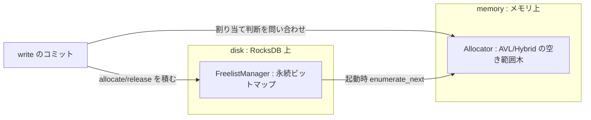
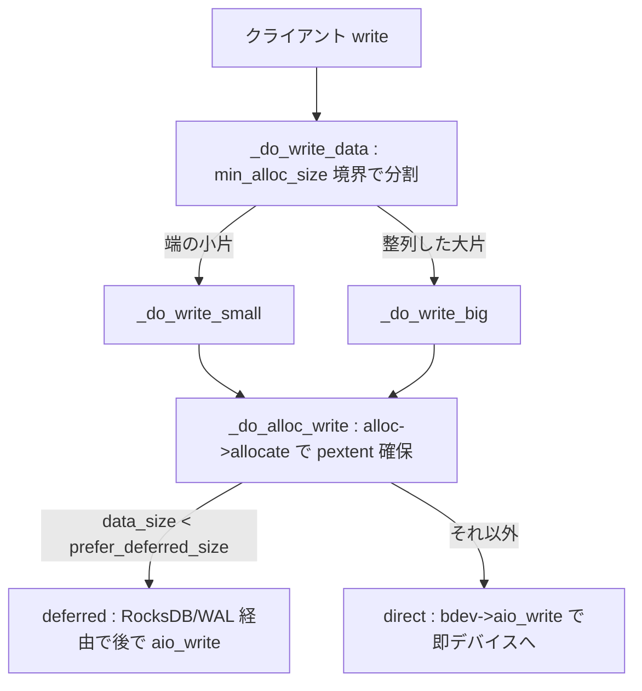

# 第21章 Allocator と書き込みパス

> **本章で読むソース**
>
> - [`src/os/bluestore/Allocator.h`](https://github.com/ceph/ceph/blob/v20.2.2/src/os/bluestore/Allocator.h)
> - [`src/os/bluestore/AvlAllocator.h`](https://github.com/ceph/ceph/blob/v20.2.2/src/os/bluestore/AvlAllocator.h)
> - [`src/os/bluestore/HybridAllocator.h`](https://github.com/ceph/ceph/blob/v20.2.2/src/os/bluestore/HybridAllocator.h)
> - [`src/os/bluestore/AvlAllocator.cc`](https://github.com/ceph/ceph/blob/v20.2.2/src/os/bluestore/AvlAllocator.cc)
> - [`src/os/bluestore/FreelistManager.h`](https://github.com/ceph/ceph/blob/v20.2.2/src/os/bluestore/FreelistManager.h)
> - [`src/os/bluestore/BitmapFreelistManager.h`](https://github.com/ceph/ceph/blob/v20.2.2/src/os/bluestore/BitmapFreelistManager.h)
> - [`src/os/bluestore/BitmapFreelistManager.cc`](https://github.com/ceph/ceph/blob/v20.2.2/src/os/bluestore/BitmapFreelistManager.cc)
> - [`src/os/bluestore/BlueStore.cc`](https://github.com/ceph/ceph/blob/v20.2.2/src/os/bluestore/BlueStore.cc)

## この章の狙い

BlueStore はブロックデバイスを生のまま握り、どのバイト範囲が空いているかを自分で管理する。
書き込みのたびに空き領域から物理エクステント（pextent）を切り出し、データを載せ、確定分をクラッシュに耐える形で残す。
この一連の担い手が「Allocator」と「FreelistManager」である。

本章はまず、空き領域管理がなぜメモリ上の割り当て構造とディスク上の永続ビットマップという二本立てになっているかを読む。
次に、クライアントの write が BlueStore 内部でどう小片と大片に分解され、小さな上書きを deferred write に、大きく整列した書き込みを direct write に振り分けるかを追う。
最後に、write に伴って施される checksum と、オプションの圧縮の位置づけを確認する。

## 前提

第18章で `ObjectStore` の `Transaction` がどう組み立てられ、第19章で BlueStore の onode・blob・extent といったオンディスク構造を扱った。
第20章では BlueFS が RocksDB のログとデータを BlueStore の同じデバイス上に同居させる仕組みを見た。
本章はその上で、実データ本体をデバイスのどこへ置くかを決める層に踏み込む。
onode が指す blob が最終的にどのバイト範囲に対応するかは、ここで割り当てられる pextent が決める。

## Allocator の抽象：割り当てと解放

空き領域の割り当てを担う `Allocator` は、実装非依存の抽象インターフェースである。
中心は `allocate` と `release` の二つで、`allocate` は要求サイズを満たす pextent の列を `PExtentVector` に詰めて返す。

[`src/os/bluestore/Allocator.h` L45-L64](https://github.com/ceph/ceph/blob/v20.2.2/src/os/bluestore/Allocator.h#L45-L64)

```cpp
  virtual int64_t allocate(uint64_t want_size, uint64_t block_size,
			   uint64_t max_alloc_size, int64_t hint,
			   PExtentVector *extents) = 0;

  int64_t allocate(uint64_t want_size, uint64_t block_size,
		   int64_t hint, PExtentVector *extents) {
    return allocate(want_size, block_size, want_size, hint, extents);
  }

  /* Bulk release. Implementations may override this method to handle the whole
   * set at once. This could save e.g. unnecessary mutex dance. */
  virtual void release(const release_set_t& release_set) = 0;
  void release(const PExtentVector& release_set);

  virtual void dump() = 0;
  virtual void foreach(
    std::function<void(uint64_t offset, uint64_t length)> notify) = 0;

  virtual void init_add_free(uint64_t offset, uint64_t length) = 0;
  virtual void init_rm_free(uint64_t offset, uint64_t length) = 0;
```

`init_add_free` と `init_rm_free` は起動時の初期化専用で、既知の空き範囲を割り当て構造へ流し込む。
要求サイズは一つの連続エクステントで返るとは限らず、空きの断片化に応じて複数の pextent に分かれる。
どの実装を使うかは `create` が設定名から選ぶ。

[`src/os/bluestore/Allocator.h` L74-L80](https://github.com/ceph/ceph/blob/v20.2.2/src/os/bluestore/Allocator.h#L74-L80)

```cpp
  static Allocator *create(
    CephContext* cct,
    std::string_view type,
    int64_t size,
    int64_t block_size,
    const std::string_view name = ""
    );
```

## AVL と Hybrid：メモリ上の空き領域構造

既定の割り当て構造は AVL 木ベースの `AvlAllocator` である。
空き範囲を表す `range_seg_t` を二本の木で同時に持つのが要点で、片方はオフセット順、もう片方はサイズ順に並べる。

[`src/os/bluestore/AvlAllocator.h` L116-L133](https://github.com/ceph/ceph/blob/v20.2.2/src/os/bluestore/AvlAllocator.h#L116-L133)

```cpp
  using range_tree_t = 
    boost::intrusive::avl_set<
      range_seg_t,
      boost::intrusive::compare<range_seg_t::before_t>,
      boost::intrusive::member_hook<
	range_seg_t,
	boost::intrusive::avl_set_member_hook<>,
	&range_seg_t::offset_hook>>;
  range_tree_t range_tree;    ///< main range tree
  /*
   * The range_size_tree should always contain the
   * same number of segments as the range_tree.
   * The only difference is that the range_size_tree
   * is ordered by segment sizes.
   */
```

オフセット順の木は、隣接する空き範囲の結合と、カーソル位置から前方に空きを探す走査に使う。
サイズ順の木は、要求サイズに合う空き範囲を対数時間で引くために使う。
`_allocate` はこの二つを状況で使い分ける。
空きに余裕があるあいだはカーソル起点の先着（first-fit）で局所性を優先し、空きが痩せてきたらサイズ木を使った最良適合（best-fit）に切り替える。

[`src/os/bluestore/AvlAllocator.cc` L282-L307](https://github.com/ceph/ceph/blob/v20.2.2/src/os/bluestore/AvlAllocator.cc#L282-L307)

```cpp
  const int free_pct = num_free * 100 / device_size;
  uint64_t start = 0;
  // If we're running low on space, find a range by size by looking up in the size
  // sorted tree (best-fit), instead of searching in the area pointed by cursor
  if (force_range_size_alloc ||
      max_size < range_size_alloc_threshold ||
      free_pct < range_size_alloc_free_pct) {
    start = -1ULL;
  } else {
    // ... (中略) ...
    uint64_t align = size & -size;
    ceph_assert(align != 0);
    uint64_t dummy_cursor = (uint64_t)hint;
    uint64_t* cursor =
      hint == -1 ? &lbas[cbits(align) - 1] : &dummy_cursor;
    start = _pick_block_after(cursor, size, unit);
```

AVL 木は空き範囲の数に比例してメモリを食う。
断片化が進むと範囲の数が膨らみ、割り当て構造だけで数百 MB を占めうる。
これを抑えるのが `HybridAllocator` である。
主構造（AVL または B木）に加えて `BitmapAllocator` を副として持ち、木に載せきれない分をビットマップへ「spillover」させる。

[`src/os/bluestore/HybridAllocator.h` L12-L32](https://github.com/ceph/ceph/blob/v20.2.2/src/os/bluestore/HybridAllocator.h#L12-L32)

```cpp
template <typename PrimaryAllocator>
class HybridAllocatorBase : public PrimaryAllocator {
  BitmapAllocator* bmap_alloc = nullptr;
public:
  HybridAllocatorBase(CephContext* cct, int64_t device_size, int64_t _block_size,
                      uint64_t max_mem,
	              std::string_view name) :
      PrimaryAllocator(cct, device_size, _block_size, max_mem, name) {
  }
  // ... (中略) ...
  uint64_t get_free() override {
    std::lock_guard l(PrimaryAllocator::get_lock());
    return (bmap_alloc ? bmap_alloc->get_free() : 0) +
      PrimaryAllocator::_get_free();
  }
```

ビットマップは1割り当て単位を1ビットで表すため、範囲の数によらずメモリ使用量が一定に収まる。
細かな空き断片を木からビットマップへ逃がすことで、木のノード数の上限を保ちながら空き全体を管理できる。
これが Hybrid の狙いである。

## FreelistManager：RocksDB 上の永続ビットマップ

ここまでの割り当て構造はすべてメモリ上にある。
OSD が落ちれば消える。
確定した割り当ての結果をクラッシュに耐える形で残す役割は、別の層である `FreelistManager` が負う。
インターフェースは Allocator と対をなし、`allocate` と `release` を持つが、引数に `KeyValueDB::Transaction` を取る点が決定的に異なる。

[`src/os/bluestore/FreelistManager.h` L41-L46](https://github.com/ceph/ceph/blob/v20.2.2/src/os/bluestore/FreelistManager.h#L41-L46)

```cpp
  virtual void allocate(
    uint64_t offset, uint64_t length,
    KeyValueDB::Transaction txn) = 0;
  virtual void release(
    uint64_t offset, uint64_t length,
    KeyValueDB::Transaction txn) = 0;
```

`FreelistManager` は自分でディスクへ書かない。
渡された RocksDB トランザクションにビットの変更を積むだけで、実際の永続化はデータ本体の書き込みと同じトランザクションのコミットに相乗りする。
既定実装の `BitmapFreelistManager` は、デバイス全域を割り当て単位ごとの1ビットで表すビットマップを RocksDB のキーバリューとして保持する。

[`src/os/bluestore/BitmapFreelistManager.h` L16-L28](https://github.com/ceph/ceph/blob/v20.2.2/src/os/bluestore/BitmapFreelistManager.h#L16-L28)

```cpp
class BitmapFreelistManager : public FreelistManager {
  std::string meta_prefix, bitmap_prefix;
  std::shared_ptr<KeyValueDB::MergeOperator> merge_op;
  ceph::mutex lock = ceph::make_mutex("BitmapFreelistManager::lock");

  uint64_t size;            ///< size of device (bytes)
  uint64_t bytes_per_block; ///< bytes per block (bdev_block_size)
  uint64_t blocks_per_key;  ///< blocks (bits) per key/value pair
  uint64_t bytes_per_key;   ///< bytes per key/value pair
  uint64_t blocks;          ///< size of device (blocks, size rounded up)
```

### XOR マージによる読まない更新

ビットマップの更新には工夫がある。
`allocate` も `release` も、対象範囲に対して同じ `_xor` を呼ぶだけである。

[`src/os/bluestore/BitmapFreelistManager.cc` L486-L506](https://github.com/ceph/ceph/blob/v20.2.2/src/os/bluestore/BitmapFreelistManager.cc#L486-L506)

```cpp
void BitmapFreelistManager::allocate(
  uint64_t offset, uint64_t length,
  KeyValueDB::Transaction txn)
{
  dout(10) << __func__ << " 0x" << std::hex << offset << "~" << length
	   << std::dec << dendl;
  if (!is_null_manager()) {
    _xor(offset, length, txn);
  }
}

void BitmapFreelistManager::release(
  uint64_t offset, uint64_t length,
  KeyValueDB::Transaction txn)
{
  dout(10) << __func__ << " 0x" << std::hex << offset << "~" << length
	   << std::dec << dendl;
  if (!is_null_manager()) {
    _xor(offset, length, txn);
  }
}
```

`_xor` は変更したいビットだけを立てた差分バッファを作り、RocksDB の `merge` 操作としてトランザクションに積む。
マージの中身は登録済みの `XorMergeOperator` が担い、既存値と差分をビット単位で XOR する。

[`src/os/bluestore/BitmapFreelistManager.cc` L32-L52](https://github.com/ceph/ceph/blob/v20.2.2/src/os/bluestore/BitmapFreelistManager.cc#L32-L52)

```cpp
struct XorMergeOperator : public KeyValueDB::MergeOperator {
  void merge_nonexistent(
    const char *rdata, size_t rlen, std::string *new_value) override {
    *new_value = std::string(rdata, rlen);
  }
  void merge(
    const char *ldata, size_t llen,
    const char *rdata, size_t rlen,
    std::string *new_value) override {
    ceph_assert(llen == rlen);
    *new_value = std::string(ldata, llen);
    for (size_t i = 0; i < rlen; ++i) {
      (*new_value)[i] ^= rdata[i];
    }
  }
  // ... (中略) ...
  const char *name() const override {
    return "bitwise_xor";
  }
};
```

XOR を使うことで、割り当てと解放は現在のビット値を読まずに書ける。
割り当ては該当ビットを 0 から 1 へ、解放は 1 から 0 へ変えるが、どちらも「そのビットを反転する」という同一の差分で表現でき、更新前に現在値を読み出す往復（read-modify-write）が要らない。
RocksDB のマージ機構が、実際の反転を読み出し時か compaction 時まで遅延してくれる。
これが FreelistManager の永続化を軽くする最適化である。

### 二本立ての合流点

メモリ上の Allocator とディスク上の FreelistManager は、二つの地点で結び付く。
起動時には、FreelistManager が RocksDB のビットマップを順に列挙し、空き範囲を Allocator へ流し込んで割り当て構造をゼロから再構成する。

[`src/os/bluestore/BlueStore.cc` L7398-L7405](https://github.com/ceph/ceph/blob/v20.2.2/src/os/bluestore/BlueStore.cc#L7398-L7405)

```cpp
    fm->enumerate_reset();
    uint64_t offset, length;
    while (fm->enumerate_next(db, &offset, &length)) {
      alloc->init_add_free(offset, length);
      ++num;
      bytes += length;
    }
    fm->enumerate_reset();
```

書き込みのコミット時には逆向きに、トランザクションが確定した割り当てと解放を FreelistManager がビットマップの差分としてトランザクションへ積む。

[`src/os/bluestore/BlueStore.cc` L14670-L14682](https://github.com/ceph/ceph/blob/v20.2.2/src/os/bluestore/BlueStore.cc#L14670-L14682)

```cpp
    // update freelist with non-overlap sets
    for (interval_set<uint64_t>::iterator p = pallocated->begin();
	 p != pallocated->end();
	 ++p) {
      fm->allocate(p.get_start(), p.get_len(), t);
    }
    for (interval_set<uint64_t>::iterator p = preleased->begin();
	 p != preleased->end();
	 ++p) {
      dout(20) << __func__ << " release 0x" << std::hex << p.get_start()
	       << "~" << p.get_len() << std::dec << dendl;
      fm->release(p.get_start(), p.get_len(), t);
    }
```

割り当て判断そのものは、毎回の write で高速に回さねばならないためメモリ上の木で行う。
一方で永続化が要るのは、クラッシュから正しく空き状態を復元できることだけである。
この二つの要求を同じ構造で兼ねると、割り当てのたびにディスクへ同期することになり遅い。
判断はメモリの木、永続はビットマップと役割を分け、確定分だけを RocksDB へ積んで再構成に備えるのが、この二本立ての意味である。



## 書き込みパスの分岐：small と big

ここからは、クライアントの write が pextent にたどり着くまでを追う。
入口は `_do_write` で、書き込みオプションの決定、データの配置、割り当てと実書き込みを順に呼ぶ。

[`src/os/bluestore/BlueStore.cc` L17662-L17666](https://github.com/ceph/ceph/blob/v20.2.2/src/os/bluestore/BlueStore.cc#L17662-L17666)

```cpp
  WriteContext wctx;
  _choose_write_options(c, o, fadvise_flags, &wctx);
  o->extent_map.fault_range(db, offset, length);
  _do_write_data(txc, c, o, offset, length, bl, &wctx);
  r = _do_alloc_write(txc, c, o, &wctx);
```

`_do_write_data` が、書き込み範囲を割り当て単位（min_alloc_size）の境界で頭・中間・末尾に切り分ける。
先頭と末尾の割り当て単位に満たない端は `_do_write_small` へ、境界に整列した中間の大きな塊は `_do_write_big` へ渡す。

[`src/os/bluestore/BlueStore.cc` L17435-L17474](https://github.com/ceph/ceph/blob/v20.2.2/src/os/bluestore/BlueStore.cc#L17435-L17474)

```cpp
  if (offset / min_alloc_size == (end - 1) / min_alloc_size &&
      (length != min_alloc_size)) {
    // we fall within the same block
    _do_write_small(txc, c, o, offset, length, p, wctx);
  } else {
    // ... (中略) ...
    if (head_length) {
      _do_write_small(txc, c, o, head_offset, head_length, p, wctx);
    }
    // ... (中略) ...
      _do_write_big(txc, c, o, middle_offset, middle_length, p, wctx);
    // ... (中略) ...
    if (tail_length) {
      _do_write_small(txc, c, o, tail_offset, tail_length, p, wctx);
    }
  }
```

この切り分けは、割り当て単位より小さい上書きと、単位に整列した大きな書き込みとを最初に分離するためにある。
小さい端は既存の割り当て単位の一部を書き換える read-modify-write になりやすく、大きな中間は新しい割り当て単位をまるごと占める。
両者は最適な書き込み方が違うので、blob の作り方の段階で経路を分ける。

## deferred と direct の使い分け

書き込み方の最終判断は `_do_alloc_write` にある。
まず必要バイト数を Allocator に要求し、pextent を確保する。

[`src/os/bluestore/BlueStore.cc` L17184-L17187](https://github.com/ceph/ceph/blob/v20.2.2/src/os/bluestore/BlueStore.cc#L17184-L17187)

```cpp
  prealloc_left = alloc->allocate(
    need, min_alloc_size, need,
    use_last_allocator_lookup_position ? -1 : 0,
    &prealloc);
```

確保した pextent へデータを載せる段で、書き込みを deferred と direct のどちらで出すかを決める。
判定は単純で、デバイスへ実際に転送するデータ量 `data_size` が `prefer_deferred_size` を下回れば deferred、そうでなければ direct である。

[`src/os/bluestore/BlueStore.cc` L17325-L17350](https://github.com/ceph/ceph/blob/v20.2.2/src/os/bluestore/BlueStore.cc#L17325-L17350)

```cpp
    // queue io
    if (!g_conf()->bluestore_debug_omit_block_device_write) {
      if (data_size < prefer_deferred_size_snapshot) {
	dout(20) << __func__ << " deferring 0x" << std::hex
		 << l->length()  << " write via deferred, pds=0x"
                 << prefer_deferred_size_snapshot
                 << std::dec<< dendl;
	bluestore_deferred_op_t *op = _get_deferred_op(txc, l->length());
	op->op = bluestore_deferred_op_t::OP_WRITE;
	int r = wi.b->get_blob().map(
	  b_off, l->length(),
	  [&](uint64_t offset, uint64_t length) {
	    op->extents.emplace_back(bluestore_pextent_t(offset, length));
	    return 0;
	  });
        ceph_assert(r == 0);
        op->data = *l;
      } else {
	wi.b->get_blob().map_bl(
	  b_off, *l,
	  [&](uint64_t offset, bufferlist& t) {
	    bdev->aio_write(offset, t, &txc->ioc, false);
	  });
	logger->inc(l_bluestore_write_new);
      }
    }
```

direct write は `bdev->aio_write` でデータをそのままデバイスへ非同期発行する。
deferred write はデータをデバイスへ直接は出さず、`bluestore_deferred_op_t` として RocksDB のトランザクション（WAL）に載せる。
このデータは RocksDB のコミットで永続化され、その後 `_deferred_queue` に積まれてからまとめてデバイスへ流される。

[`src/os/bluestore/BlueStore.cc` L15442-L15451](https://github.com/ceph/ceph/blob/v20.2.2/src/os/bluestore/BlueStore.cc#L15442-L15451)

```cpp
  tmp->txcs.push_back(*txc);
  bluestore_deferred_transaction_t& wt = *txc->deferred_txn;
  for (auto opi = wt.ops.begin(); opi != wt.ops.end(); ++opi) {
    const auto& op = *opi;
    ceph_assert(op.op == bluestore_deferred_op_t::OP_WRITE);
    bufferlist::const_iterator p = op.data.begin();
    for (auto e : op.extents) {
      tmp->prepare_write(cct, wt.seq, e.offset, e.length, p);
    }
  }
```

なぜ小さい書き込みだけを遠回りさせるのか。
割り当て単位に満たない上書きをデバイスへ直に書くと、書き込み先の割り当て単位を読み、変更部分を差し替え、書き戻す read-modify-write が要る。
デバイスへの読み書きが往復するぶん遅延が乗る。
deferred はこの往復を、いったんデータを RocksDB のログへ順次書き込みで逃がすことで隠す。
クライアントへの応答は RocksDB コミットの時点で返せるので、read-modify-write は非同期の後始末に回り、小さな上書きの遅延が短くなる。
逆に、割り当て単位まるごとを占める大きな書き込みは、読み出す必要がなく直に書けば済むので、ログを二度書きする deferred はかえって無駄になる。
だから大きい direct・小さい deferred と振り分ける。



## checksum と圧縮

write では、データ本体とは別に整合性のための checksum が blob 単位で計算される。
`_choose_write_options` が checksum の種別と粒度を wctx に決め、`_do_alloc_write` が新しい blob に対して checksum を初期化してから計算する。

[`src/os/bluestore/BlueStore.cc` L17296-L17298](https://github.com/ceph/ceph/blob/v20.2.2/src/os/bluestore/BlueStore.cc#L17296-L17298)

```cpp
    dout(20) << __func__ << " blob " << *wi.b << dendl;
    if (dblob.has_csum()) {
      dblob.calc_csum(b_off, *l);
    }
```

checksum は blob のメタデータとして onode 側に格納され、読み出し時にデバイスから読んだデータの破損を検出するために使う。
BlueStore がデバイスを生で握る以上、ファイルシステムに整合性検査を委ねられない。
そのぶんを自前の checksum が担う。

圧縮は設定とヒントで有効なときだけ働く。
`_do_alloc_write` の冒頭で、blob 長が割り当て単位を超えるデータを圧縮器にかけ、十分に縮んだ場合に限り圧縮結果を採用する。

[`src/os/bluestore/BlueStore.cc` L17115-L17131](https://github.com/ceph/ceph/blob/v20.2.2/src/os/bluestore/BlueStore.cc#L17115-L17131)

```cpp
      if (r == 0 && result_len <= want_len && result_len < wi.blob_length) {
	bluestore_compression_header_t chdr;
	chdr.type = wctx->compressor->get_type();
	chdr.length = t.length();
	chdr.compressor_message = compressor_message;
	encode(chdr, wi.compressed_bl);
	wi.compressed_bl.claim_append(t);

	compressed_len = wi.compressed_bl.length();
	result_len = p2roundup(compressed_len, min_alloc_size);
	if (result_len <= want_len && result_len < wi.blob_length) {
	  // Cool. We compressed at least as much as we were hoping to.
	  // pad out to min_alloc_size
	  wi.compressed_bl.append_zero(result_len - compressed_len);
	  wi.compressed_len = compressed_len;
	  wi.compressed = true;
```

圧縮が採用されると、Allocator へ要求するのは圧縮後を割り当て単位へ丸めた `result_len` になり、確保する pextent が縮む。
期待したほど縮まなければ圧縮結果を捨て、元データをそのまま書く。
どちらの blob も、その後の checksum 計算と deferred/direct の判定へ同じ経路で合流する。

## まとめ

BlueStore の空き領域管理は、メモリ上の Allocator とディスク上の FreelistManager の二本立てである。
割り当て判断は AVL または Hybrid の空き範囲木で高速に行い、確定した割り当てと解放だけを RocksDB のビットマップへ永続化して、クラッシュ後の再構成に備える。
永続化は XOR マージで現在値を読まずに差分を積むため軽い。

書き込みパスは、割り当て単位の境界で write を小片と大片に分け、`_do_alloc_write` で pextent を確保したうえで、転送データ量が閾値未満なら deferred、以上なら direct を選ぶ。
deferred は小さい上書きの read-modify-write を RocksDB のログへ逃がして遅延を隠し、direct は大きい書き込みを直にデバイスへ出す。
書き込みには blob 単位の checksum が付き、条件を満たせば圧縮が pextent を縮める。

## 関連する章

- 第18章「ObjectStore インターフェースと Transaction」：本章が扱う write が乗る `Transaction` の組み立て。
- 第19章「BlueStore のメタデータとオンディスク構造」：pextent を指す blob と onode の構造。
- 第20章「BlueFS と RocksDB 統合」：FreelistManager と deferred write が永続化に使う RocksDB の土台。
