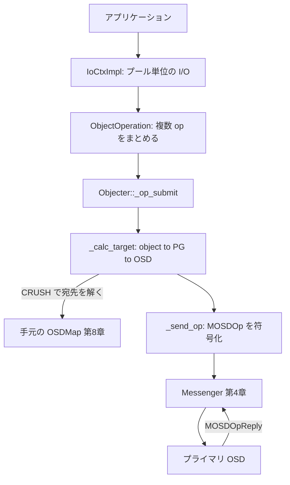
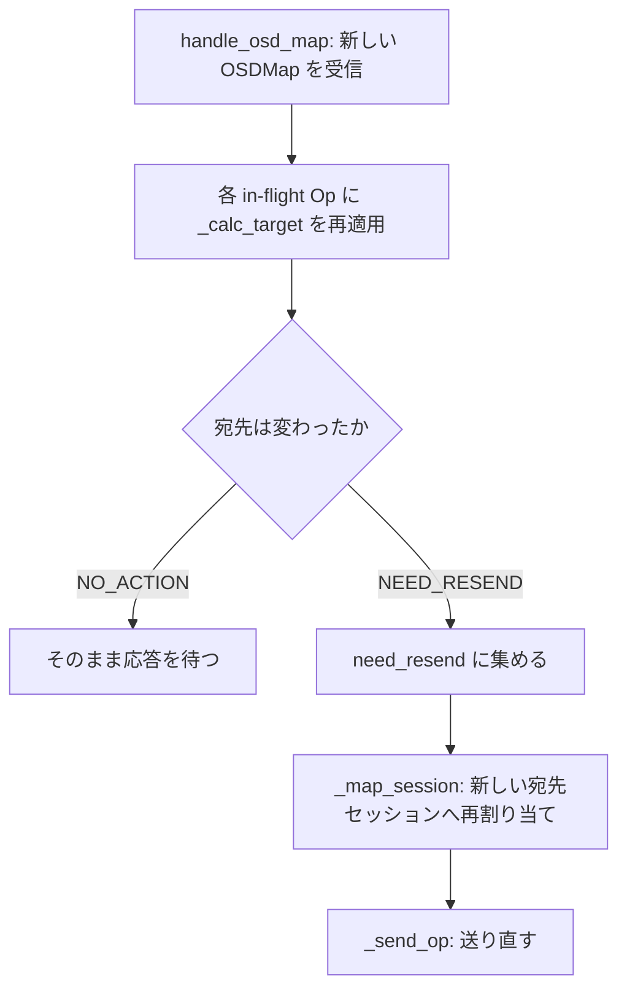

# 第22章 Objecter と librados

> **本章で読むソース**
>
> - [`src/librados/RadosClient.cc`](https://github.com/ceph/ceph/blob/v20.2.2/src/librados/RadosClient.cc)
> - [`src/librados/IoCtxImpl.cc`](https://github.com/ceph/ceph/blob/v20.2.2/src/librados/IoCtxImpl.cc)
> - [`src/osdc/Objecter.h`](https://github.com/ceph/ceph/blob/v20.2.2/src/osdc/Objecter.h)
> - [`src/osdc/Objecter.cc`](https://github.com/ceph/ceph/blob/v20.2.2/src/osdc/Objecter.cc)

## この章の狙い

ここまでの章は、OSD 側でオブジェクトがどう配置され、複製され、ディスクに落ちるかを追ってきた。
本章は視点をクライアント側へ移し、アプリケーションが RADOS へ read/write を発行してから、その要求が正しい OSD へ届くまでを読む。

登場するのは二つの層である。
一つは公開ライブラリ `librados` で、アプリケーションはこの API を通じてプールへ I/O を出す。
もう一つは `Objecter` で、受け取った要求を手元の OSDMap で解決し、宛先 OSD へ直接メッセージを送る。
第1章で「クライアントはゲートウェイを介さず OSD と直接通信する」と述べた。
その通信相手をクライアント自身に計算させているのが `Objecter` である。

本章はまず `librados` が `Objecter` をどう組み立てて保持するかを見る。
次に、`IoCtx` 経由の write が `ObjectOperation` に積まれ、`Objecter` へ渡る道筋を追う。
続いて中核の `_calc_target` が object から宛先 OSD をどう導くかを読み、最後に OSDMap が更新されたとき in-flight の要求をどう再送するかを、堅牢性の工夫として機構レベルで説明する。

## 前提

第4章で `Messenger` と `AsyncConnection` によるメッセージ送受信の仕組みを、第8章で OSDMap と PG マッピング、プールの構造を扱った。
本章はこの二つを土台にする。
`Objecter` は OSDMap を参照して宛先を決め、`Messenger` でその宛先へメッセージを送る、いわば両者を束ねる利用者である。
本章より上の第23章（librbd）と第24章（CephFS）が扱う各サービスも、最終的な RADOS アクセスはすべてこの層を経由する。

## librados の位置づけ：プール単位の入口

`librados` はアプリケーションが RADOS を使うための公開ライブラリである。
入口となるのが `RadosClient` で、クラスタへの接続時に `Messenger` を作り、その上に `Objecter` を載せる。

[`src/librados/RadosClient.cc` L262-L273](https://github.com/ceph/ceph/blob/v20.2.2/src/librados/RadosClient.cc#L262-L273)

```cpp
  objecter = new (std::nothrow) Objecter(cct, messenger, &monclient, poolctx);
  if (!objecter)
    goto out;
  objecter->set_balanced_budget();

  monclient.set_messenger(messenger);
  mgrclient.set_messenger(messenger);

  objecter->init();
  messenger->add_dispatcher_head(&mgrclient);
  messenger->add_dispatcher_tail(objecter);
  messenger->add_dispatcher_tail(this);
```

ここで `Objecter` は `Messenger` のディスパッチャとして登録される。
OSD から届く応答メッセージ（`MOSDOpReply`）や更新された OSDMap（`MOSDMap`）は、`Messenger` からこのディスパッチャへ配送される。
`monclient` を渡しているのは、`Objecter` が Monitor から最新の OSDMap を購読して受け取るためである。

アプリケーションが実際に I/O を出すときは、プールを一つ選んで `IoCtx` を得る。
`IoCtx` の実体が `IoCtxImpl` で、そのプール（`oloc`）とスナップショット文脈を保持したまま `Objecter` を呼ぶ。
プールを固定した I/O コンテキストという単位は、上位の RBD や CephFS、RGW がいずれも共有する。

## 要求の組み立て：ObjectOperation

一回の RADOS 要求は、単一の read や write とは限らない。
`librados` は複数の低レベル osd op を一つのメッセージにまとめて送れる。
このまとまりを表すのが `ObjectOperation` で、`ops` という配列に個々の op を積んでいく。

[`src/osdc/Objecter.h` L90-L93](https://github.com/ceph/ceph/blob/v20.2.2/src/osdc/Objecter.h#L90-L93)

```cpp
struct ObjectOperation {
  osdc_opvec ops;
  int flags = 0;
  int priority = 0;
```

op を積む操作は薄いヘルパーで表現される。
たとえば `write` はデータ付きの op を一つ追加し、その op のオフセットと長さを埋める。

[`src/osdc/Objecter.h` L176-L181](https://github.com/ceph/ceph/blob/v20.2.2/src/osdc/Objecter.h#L176-L181)

```cpp
  void add_data(int op, uint64_t off, uint64_t len, ceph::buffer::list& bl) {
    OSDOp& osd_op = add_op(op);
    osd_op.op.extent.offset = off;
    osd_op.op.extent.length = len;
    osd_op.indata.claim_append(bl);
  }
```

複数の op を一つの `ObjectOperation` にまとめる意味は、それらが同じオブジェクトに対して一括して、しかもアトミックに適用される点にある。
たとえば「omap 値を書き、同時にオブジェクト属性を更新する」といった操作を、一つのメッセージ、一回の OSD 処理で完結させられる。

`IoCtxImpl::write` は、このヘルパーを使って要求を組み立てる典型である。

[`src/librados/IoCtxImpl.cc` L596-L607](https://github.com/ceph/ceph/blob/v20.2.2/src/librados/IoCtxImpl.cc#L596-L607)

```cpp
int librados::IoCtxImpl::write(const object_t& oid, bufferlist& bl,
			       size_t len, uint64_t off)
{
  if (len > UINT_MAX/2)
    return -E2BIG;
  ::ObjectOperation op;
  prepare_assert_ops(&op);
  bufferlist mybl;
  mybl.substr_of(bl, 0, len);
  op.write(off, mybl);
  return operate(oid, &op, NULL);
}
```

組み立てた `ObjectOperation` は `operate` へ渡される。
`operate` は `Objecter` に `Op` を用意させ、`op_submit` で発行し、完了を待つ。

[`src/librados/IoCtxImpl.cc` L670-L675](https://github.com/ceph/ceph/blob/v20.2.2/src/librados/IoCtxImpl.cc#L670-L675)

```cpp
  Objecter::Op *objecter_op = objecter->prepare_mutate_op(
    oid, oloc,
    *o, snapc, ut,
    flags | extra_op_flags,
    oncommit, &ver, osd_reqid_t(), nullptr, otel_trace);
  objecter->op_submit(objecter_op);
```

`prepare_mutate_op` に渡している `oncommit` が、完了時に発火するコールバックである。
同期版の `operate` はこの `oncommit` に条件変数を叩く `Context` を渡し、その条件変数でスリープして応答を待つ。
非同期版の `aio_operate` は、代わりにアプリケーションの `AioCompletion` を叩く `Context` を渡すだけで、待たずに戻る。
どちらも下層の仕組みは同じで、`Op` に完了 `Context` を持たせ、応答受信でそれを発火させる。

## Objecter の役割：object から宛先 OSD を解く

`Objecter` が受け取る `Op` は、対象オブジェクトと op 列、そして完了時のコールバックを束ねた構造体である。

[`src/osdc/Objecter.h` L1978-L2016](https://github.com/ceph/ceph/blob/v20.2.2/src/osdc/Objecter.h#L1978-L2016)

```cpp
  struct Op : public RefCountedObject {
    OSDSession *session = nullptr;
    int incarnation = 0;

    op_target_t target;
    // ... (中略) ...
    std::variant<OpComp, fu2::unique_function<OpSig>,
		 Context*> onfinish;
```

`target` が宛先計算の作業領域で、`onfinish` が完了コールバックである。
`onfinish` が `variant` なのは、新しい非同期完了ハンドラと、旧来の `librados` が使う `Context*` の双方を受けるためである。

宛先計算の入口は `_op_submit` で、まず `_calc_target` を呼んで対象 OSD を確定させ、その OSD 向けのセッションを取り、送れる状態なら `_send_op` する。

[`src/osdc/Objecter.cc` L2489-L2501](https://github.com/ceph/ceph/blob/v20.2.2/src/osdc/Objecter.cc#L2489-L2501)

```cpp
void Objecter::_op_submit(Op *op, shunique_lock<ceph::shared_mutex>& sul, ceph_tid_t *ptid)
{
  // rwlock is locked

  ldout(cct, 10) << __func__ << " op " << op << dendl;

  // pick target
  ceph_assert(op->session == NULL);
  OSDSession *s = NULL;

  bool check_for_latest_map = false;
  int r = _calc_target(&op->target, nullptr);
```

`_calc_target` が本章の核心である。
これは object → PG → OSD という第8章の配置計算を、クライアント側で OSDMap を使って再現する。
まず対象プールの `pg_pool_t` を引き、`object_locator_to_pg` で object を生の PG に写す。

[`src/osdc/Objecter.cc` L3004-L3010](https://github.com/ceph/ceph/blob/v20.2.2/src/osdc/Objecter.cc#L3004-L3010)

```cpp
    int ret = osdmap->object_locator_to_pg(t->target_oid, t->target_oloc,
					   pgid);
    if (ret == -ENOENT) {
      t->osd = -1;
      return RECALC_OP_TARGET_POOL_DNE;
    }
  }
```

次に、その PG を CRUSH（第7章）で OSD 集合へ写す。
プールの `pg_num` で PG 番号を安定化させたうえで、`pg_to_up_acting_osds` が up セットと acting セット、それぞれのプライマリを求める。

[`src/osdc/Objecter.cc` L3026-L3033](https://github.com/ceph/ceph/blob/v20.2.2/src/osdc/Objecter.cc#L3026-L3033)

```cpp
  if (!lookup_pg_mapping(actual_pgid, osdmap->get_epoch(), &up, &up_primary,
                         &acting, &acting_primary)) {
    osdmap->pg_to_up_acting_osds(actual_pgid, &up, &up_primary,
                                 &acting, &acting_primary);
    pg_mapping_t pg_mapping(osdmap->get_epoch(),
                            up, up_primary, acting, acting_primary);
    update_pg_mapping(actual_pgid, std::move(pg_mapping));
  }
```

ここに一つ目の最適化が現れる。
`pg_to_up_acting_osds` は内部で CRUSH を回す計算であり、同じ PG への要求が続くたびに毎回引き直すのは無駄である。
そこで `lookup_pg_mapping` でエポック付きのキャッシュを先に引き、外れたときだけ CRUSH を回して結果を `update_pg_mapping` に登録する。
同一エポックの間、同じ PG への宛先計算はキャッシュ参照で済み、CRUSH の再計算を避けられる。

宛先 OSD は通常 acting セットのプライマリになる。

[`src/osdc/Objecter.cc` L3175-L3177](https://github.com/ceph/ceph/blob/v20.2.2/src/osdc/Objecter.cc#L3175-L3177)

```cpp
    } else {
      t->osd = acting_primary;
    }
```

読み取りに限っては、`BALANCE_READS` や `LOCALIZE_READS` フラグが立っていれば acting セット内のレプリカを宛先に選べる。
負荷分散や、近いレプリカからの読み取りを狙う経路である。
書き込みは必ずプライマリへ送る。
レプリカへの複製はプライマリ OSD が担い（第14章）、クライアントは関与しないためである。

宛先 OSD が決まると、`_op_submit` はその OSD 向けの `OSDSession` を取得し、`_send_op` でメッセージを送る。
`_send_op` は要求を `MOSDOp` に符号化し、セッションが持つ `Connection` へ渡す。

[`src/osdc/Objecter.cc` L3499-L3499](https://github.com/ceph/ceph/blob/v20.2.2/src/osdc/Objecter.cc#L3499-L3499)

```cpp
  op->session->con->send_message(m);
```

この一行が、第1章で述べた「クライアントが直接 OSD と通信する」の実体である。
Monitor はここに登場しない。
クライアントは Monitor から OSDMap を受け取るだけで、データ経路では OSD と直接メッセージを交わす。



## 完了：応答で Context を発火する

OSD が要求を処理し終えると `MOSDOpReply` を返す。
`Messenger` はこれをディスパッチャである `Objecter` へ渡し、`handle_osd_op_reply` が処理する。
応答の tid（トランザクション ID）で対応する in-flight の `Op` を引き当て、結果コードと読み取りデータを取り出したうえで、`onfinish` を発火させる。

[`src/osdc/Objecter.cc` L3795-L3799](https://github.com/ceph/ceph/blob/v20.2.2/src/osdc/Objecter.cc#L3795-L3799)

```cpp
  if (op->has_completion()) {
    num_in_flight--;
    onfinish = std::move(op->onfinish);
    op->onfinish = nullptr;
  }
```

このコールバックが、`IoCtxImpl::operate` で渡した条件変数を叩く `Context` であれば同期呼び出しが目覚め、`AioCompletion` を叩く `Context` であれば非同期完了が通知される。
`Op` に完了 `Context` を持たせておき、応答受信で一度だけ発火させる形が、同期と非同期の両方を同じ骨格で支えている。

## 堅牢性の工夫：OSDMap 更新時の再送

クライアントが要求を送った後で、宛先だった OSD が落ちたり、PG が別の OSD へ移ったりすることがある。
このとき手元の OSDMap は古くなり、`_calc_target` が導いた宛先はもう正しくない。
`Objecter` は新しい OSDMap を受け取るたびに in-flight の要求を再計算し、宛先が変わったものを送り直す。

Monitor から新しい OSDMap が届くと `handle_osd_map` が処理する。
その中でセッション上の各 `Op` について `_calc_target` を呼び直し、宛先が変わる要求（`RECALC_OP_TARGET_NEED_RESEND`）を `need_resend` に集める。

[`src/osdc/Objecter.cc` L1147-L1158](https://github.com/ceph/ceph/blob/v20.2.2/src/osdc/Objecter.cc#L1147-L1158)

```cpp
    int r = _calc_target(&op->target,
			 op->session ? op->session->con.get() : nullptr);
    switch (r) {
    case RECALC_OP_TARGET_NO_ACTION:
      if (!skipped_map && !(force_resend_writes && op->target.respects_full()))
	break;
      // -- fall-thru --
    case RECALC_OP_TARGET_NEED_RESEND:
      _session_op_remove(op->session, op);
      need_resend[op->tid] = op;
      _op_cancel_map_check(op);
      break;
```

続いて、集めた要求を新しい宛先のセッションへ割り当て直し、送り直す。

[`src/osdc/Objecter.cc` L1373-L1394](https://github.com/ceph/ceph/blob/v20.2.2/src/osdc/Objecter.cc#L1373-L1394)

```cpp
  // resend requests
  for (auto p = need_resend.begin();
       p != need_resend.end(); ++p) {
    auto op = p->second;
    auto s = op->session;
    bool mapped_session = false;
    if (!s) {
      int r = _map_session(&op->target, &s, sul);
      ceph_assert(r == 0);
      mapped_session = true;
    } else {
      get_session(s);
    }
    std::unique_lock sl(s->lock);
    if (mapped_session) {
      _session_op_assign(s, op);
    }
    if (op->should_resend) {
      if (!op->session->is_homeless() && !op->target.paused) {
	logger->inc(l_osdc_op_resend);
	_send_op(op);
      }
    }
```

この再送があるため、クライアントは要求の宛先を追跡し続ける必要がない。
一度発行すれば、以降はクラスタ状態の変化に応じて `Objecter` が宛先を張り替え、応答を受け取るまで面倒を見る。



再計算が完了までかからないよう、宛先が変わらない要求（`RECALC_OP_TARGET_NO_ACTION`）はそのまま据え置く点も効いている。
OSDMap が更新されても、影響を受ける PG に向いた要求だけが再送対象になり、無関係な in-flight 要求は触らずに済む。

## まとめ

本章は、アプリケーションの read/write が RADOS の正しい OSD へ届くまでを二層で読んだ。
`librados` はプール単位の `IoCtx` を入口に、複数の osd op を `ObjectOperation` にまとめて `Objecter` へ渡す。
`Objecter` は `_calc_target` で object を PG、さらに OSD へと手元の OSDMap で解決し、`Messenger` でプライマリ OSD へ直接メッセージを送る。
応答は tid で `Op` に結び付けられ、完了 `Context` を一度だけ発火させて同期と非同期の呼び出しを目覚めさせる。

最適化としては二つを見た。
一つは PG マッピングのエポック付きキャッシュで、同一エポックの間は CRUSH の再計算を避ける。
もう一つは OSDMap 更新時の選択的再送で、宛先が変わった in-flight 要求だけを新しい OSD へ張り替え、クライアントを状態変化に追従させる。

## 関連する章

- [第1章 Ceph/RADOS のアーキテクチャとデーモン起動](../part00-overview/01-architecture.md)：クライアントが OSD と直接通信するという全体像。
- [第4章 Messenger と AsyncConnection のイベント駆動 I/O](../part02-network/04-messenger.md)：`_send_op` が使うメッセージ送受信の基盤。
- [第8章 OSDMap・PG マッピング・プール](../part03-crush/08-osdmap-pg.md)：`_calc_target` が参照する配置計算の元。
- [第23章 librbd（RBD）の I/O ディスパッチ](23-librbd.md)：本章の `librados` を土台にブロックデバイスを実現する層。
- [第24章 CephFS：MDS と MDCache](24-cephfs-mds.md)：ファイルシステムのデータもこの層を経由して RADOS に載る。
