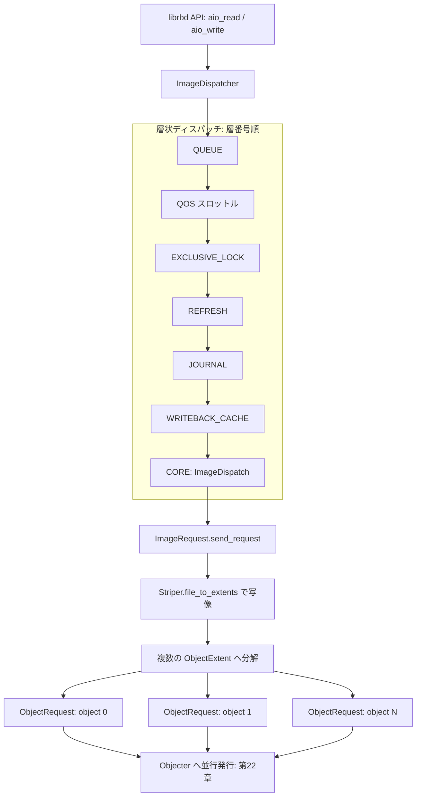

# 第23章 librbd（RBD）の I/O ディスパッチ

> **本章で読むソース**
>
> - [`src/librbd/ImageCtx.h`](https://github.com/ceph/ceph/blob/v20.2.2/src/librbd/ImageCtx.h)
> - [`src/librbd/ImageCtx.cc`](https://github.com/ceph/ceph/blob/v20.2.2/src/librbd/ImageCtx.cc)
> - [`src/osdc/Striper.cc`](https://github.com/ceph/ceph/blob/v20.2.2/src/osdc/Striper.cc)
> - [`src/librbd/io/ImageRequest.cc`](https://github.com/ceph/ceph/blob/v20.2.2/src/librbd/io/ImageRequest.cc)
> - [`src/librbd/io/ObjectRequest.cc`](https://github.com/ceph/ceph/blob/v20.2.2/src/librbd/io/ObjectRequest.cc)
> - [`src/librbd/io/ImageDispatcher.cc`](https://github.com/ceph/ceph/blob/v20.2.2/src/librbd/io/ImageDispatcher.cc)
> - [`src/librbd/io/Dispatcher.h`](https://github.com/ceph/ceph/blob/v20.2.2/src/librbd/io/Dispatcher.h)

## この章の狙い

RBD は RADOS の上に仮想ブロックデバイスを実装する。
仮想マシンから見れば1本の連続したディスクだが、その実体は RADOS プール上に散らばった固定サイズのオブジェクト列である。
librbd はこの見かけと実体のあいだを埋める。
デバイスへの1回の読み書き `(offset, length)` を受け取り、それが覆う複数のオブジェクトへの I/O へ分解し、各オブジェクトへの操作を第22章の Objecter 経由で並行発行する。

本章はこの写像と分解を二つの機構から読む。
一つはイメージ座標をオブジェクト座標へ変換する `Striper` で、`(offset, length)` からオブジェクト番号とオブジェクト内オフセットを算術で求める。
もう一つは `ImageDispatcher` の層状ディスパッチで、キャッシュや QoS やジャーナルといった機能を独立した層として I/O の経路に差し込む。
イメージ I/O が層を1つずつ通り、最下層で `Striper` によりオブジェクト I/O へ砕かれ、Objecter へ渡るまでを追う。

## 前提

第22章で Objecter が RADOS オブジェクトへの操作を PG へ振り分け、応答を待つ非同期の窓口であることを見た。
librbd はその利用者であり、ブロックデバイスの I/O をオブジェクト I/O の集まりへ翻訳して Objecter へ流し込む。
オブジェクトから PG への割り当てと OSD への配置（第8章）は librbd の下位にあり、librbd はオブジェクト名と操作を渡すだけで配置を意識しない。

RBD イメージは1つの `ImageCtx` で表現される。
1つのイメージが開かれているあいだ、そのサイズ、ストライプ設定、有効な feature、スナップショット情報などはすべてこの構造体が保持する。

## ImageCtx：1イメージの状態とレイアウト

`ImageCtx` はイメージのレイアウトを決めるパラメータを保持する。
`order` はオブジェクトサイズの指数であり、オブジェクトサイズは `1 << order` バイトになる。
既定の `order` は22で、オブジェクトサイズは4MiB である。

[`src/librbd/ImageCtx.h` L158-L160](https://github.com/ceph/ceph/blob/v20.2.2/src/librbd/ImageCtx.h#L158-L160)

```cpp
    uint8_t order;
    uint64_t size;
    uint64_t features;
```

`stripe_unit` と `stripe_count` はストライピングの単位と幅を決める。
これらと `order` から、写像に使う `file_layout_t layout` を組み立てる。

[`src/librbd/ImageCtx.h` L172-L172](https://github.com/ceph/ceph/blob/v20.2.2/src/librbd/ImageCtx.h#L172)

```cpp
    uint64_t stripe_unit, stripe_count;
```

`init_layout` が実際に `layout` を初期化する。
`stripe_unit` か `stripe_count` が未設定なら、`stripe_unit` をオブジェクトサイズに、`stripe_count` を1に落とす。
これは1オブジェクトを1ストライプ単位とする単純な構成であり、RBD の既定はこの形になる。

[`src/librbd/ImageCtx.cc` L219-L236](https://github.com/ceph/ceph/blob/v20.2.2/src/librbd/ImageCtx.cc#L219-L236)

```cpp
  void ImageCtx::init_layout(int64_t pool_id)
  {
    if (stripe_unit == 0 || stripe_count == 0) {
      stripe_unit = 1ull << order;
      stripe_count = 1;
    }
    // ... (中略) ...
    layout = file_layout_t();
    layout.stripe_unit = stripe_unit;
    layout.stripe_count = stripe_count;
    layout.object_size = 1ull << order;
```

この `layout` が、以降のイメージ座標からオブジェクト座標への変換の入力になる。

## Striper：イメージ座標をオブジェクト座標へ写す

イメージ I/O の `(offset, length)` を、どのオブジェクトのどの範囲に当てるかへ翻訳するのが `Striper::file_to_extents` である。
入力の1つの連続範囲を、`layout` に従って複数の `ObjectExtent`（オブジェクト番号とオブジェクト内オフセットと長さの組）へ砕く。

写像の前段で、ストライプの三つのパラメータを取り出す。
`stripe_count` が1のときは `stripe_unit` をオブジェクトサイズに揃え、1オブジェクトを丸ごと1ストライプ単位として扱う。
`stripes_per_object` は1オブジェクトに含まれるストライプ単位の個数である。

[`src/osdc/Striper.cc` L194-L205](https://github.com/ceph/ceph/blob/v20.2.2/src/osdc/Striper.cc#L194-L205)

```cpp
  __u32 object_size = layout->object_size;
  __u32 su = layout->stripe_unit;
  __u32 stripe_count = layout->stripe_count;
  ceph_assert(object_size >= su);
  if (stripe_count == 1) {
    ldout(cct, 20) << " sc is one, reset su to os" << dendl;
    su = object_size;
  }
  uint64_t stripes_per_object = object_size / su;
```

写像の核心は次の算術である。
イメージ内オフセット `cur` を `stripe_unit` で割ってブロック番号 `blockno` を得る。
`blockno` を `stripe_count` で割った商が横方向のストライプ番号 `stripeno`、余りがオブジェクトセット内の位置 `stripepos` になる。
`stripeno` を `stripes_per_object` で割ってオブジェクトセット番号 `objectsetno` を求め、`objectsetno * stripe_count + stripepos` でオブジェクト番号 `objectno` を確定する。

[`src/osdc/Striper.cc` L207-L219](https://github.com/ceph/ceph/blob/v20.2.2/src/osdc/Striper.cc#L207-L219)

```cpp
  uint64_t cur = offset;
  uint64_t left = len;
  while (left > 0) {
    // layout into objects
    uint64_t blockno = cur / su; // which block
    // which horizontal stripe (Y)
    uint64_t stripeno = blockno / stripe_count;
    // which object in the object set (X)
    uint64_t stripepos = blockno % stripe_count;
    // which object set
    uint64_t objectsetno = stripeno / stripes_per_object;
    // object id
    uint64_t objectno = objectsetno * stripe_count + stripepos;
```

既定構成では `stripe_count` が1で `stripe_unit` がオブジェクトサイズに等しいため、`objectno` は `cur / object_size` に一致する。
オフセット4MiB ごとに次のオブジェクトへ移る、単純な連番マッピングになる。
`stripe_count` を増やすと、隣り合うストライプ単位が別々のオブジェクトへ分散し、1本のシーケンシャル I/O が複数の OSD へ広がる。
この while ループが `left` を消費しながら1範囲を跨ぐオブジェクト群へ砕くので、1回の呼び出しで境界をまたぐ I/O も過不足なく分解される。

librbd 側はこの変換を `area_to_object_extents` で呼び出す。
イメージ領域のオフセットを生オフセットへ直したうえで `Striper::file_to_extents` に渡し、結果を `LightweightObjectExtents` に受け取る。

[`src/librbd/io/Utils.cc` L193-L199](https://github.com/ceph/ceph/blob/v20.2.2/src/librbd/io/Utils.cc#L193-L199)

```cpp
void area_to_object_extents(I* image_ctx, uint64_t offset, uint64_t length,
                            ImageArea area, uint64_t buffer_offset,
                            striper::LightweightObjectExtents* object_extents) {
  offset = area_to_raw_offset(*image_ctx, offset, area);
  Striper::file_to_extents(image_ctx->cct, &image_ctx->layout, offset, length,
                           0, buffer_offset, object_extents);
}
```

## ImageRequest：イメージ I/O をオブジェクト I/O へ分解する

`ImageRequest` は1回のイメージ I/O を表す。
読み取りは `ImageReadRequest`、書き込みは `ImageWriteRequest` のように操作ごとに派生クラスがある。
`send_request` が、イメージ範囲をオブジェクト範囲へ写し、各オブジェクトへの `ObjectDispatchSpec` を生成して発行する。

読み取りの `send_request` を見る。
入力の各イメージ範囲を `area_to_object_extents` でオブジェクト範囲へ砕き、`object_extents` に集める。

[`src/librbd/io/ImageRequest.cc` L387-L399](https://github.com/ceph/ceph/blob/v20.2.2/src/librbd/io/ImageRequest.cc#L387-L399)

```cpp
  // map image extents to object extents
  LightweightObjectExtents object_extents;
  uint64_t buffer_ofs = 0;
  for (auto &extent : image_extents) {
    if (extent.second == 0) {
      continue;
    }

    util::area_to_object_extents(&image_ctx, extent.first, extent.second,
                                 this->m_image_area, buffer_ofs,
                                 &object_extents);
    buffer_ofs += extent.second;
  }
```

続いて、砕いたオブジェクト範囲の個数を完了カウンタに設定し、範囲ごとに読み取りリクエストを生成して `send` する。
`set_request_count` にオブジェクト範囲の数を渡すことで、全オブジェクトの応答がそろった時点で1回のイメージ I/O の完了とみなす。
各 `ObjectDispatchSpec::create_read` は独立に発行されるので、複数オブジェクトへの読み取りは互いを待たずに並行して進む。

[`src/librbd/io/ImageRequest.cc` L404-L417](https://github.com/ceph/ceph/blob/v20.2.2/src/librbd/io/ImageRequest.cc#L404-L417)

```cpp
  // issue the requests
  aio_comp->set_request_count(object_extents.size());
  for (auto &oe : object_extents) {
    // ... (中略) ...
    auto req_comp = new io::ReadResult::C_ObjectReadRequest(
      aio_comp, {{oe.offset, oe.length, std::move(oe.buffer_extents)}});
    auto req = ObjectDispatchSpec::create_read(
      &image_ctx, OBJECT_DISPATCH_LAYER_NONE, oe.object_no,
      &req_comp->extents, m_io_context, m_op_flags, m_read_flags,
      this->m_trace, nullptr, req_comp);
    req->send();
  }
```

書き込みの `send_request` も同じ骨格である。
イメージ範囲をオブジェクト範囲へ砕き、`set_request_count` を設定し、範囲ごとに `create_object_request` で書き込みリクエストを作って `send_object_requests` で発行する。
1つの `bufferlist` を各オブジェクト範囲へ切り分ける処理が加わる点だけが読み取りと異なる。

## 層状ディスパッチ：ImageDispatcher

イメージ I/O は `ImageRequest` へ届く前に `ImageDispatcher` を通る。
`ImageDispatcher` は複数のディスパッチ層を登録順ではなく層番号順に並べ、I/O を上から下へ1層ずつ通す。
各層は QoS スロットル、書き込みブロック、リフレッシュ、そして最下層でオブジェクト分解を担う中核処理といった、独立した関心事を受け持つ。

層は列挙型で番号付けされている。
番号の小さい層から大きい層へ向けて I/O が流れ、`IMAGE_DISPATCH_LAYER_CORE` が最下層になる。

[`src/librbd/io/Types.h` L57-L70](https://github.com/ceph/ceph/blob/v20.2.2/src/librbd/io/Types.h#L57-L70)

```cpp
enum ImageDispatchLayer {
  IMAGE_DISPATCH_LAYER_NONE = 0,
  IMAGE_DISPATCH_LAYER_API_START = IMAGE_DISPATCH_LAYER_NONE,
  IMAGE_DISPATCH_LAYER_QUEUE,
  IMAGE_DISPATCH_LAYER_QOS,
  IMAGE_DISPATCH_LAYER_EXCLUSIVE_LOCK,
  IMAGE_DISPATCH_LAYER_REFRESH,
  IMAGE_DISPATCH_LAYER_INTERNAL_START = IMAGE_DISPATCH_LAYER_REFRESH,
  IMAGE_DISPATCH_LAYER_MIGRATION,
  IMAGE_DISPATCH_LAYER_JOURNAL,
  IMAGE_DISPATCH_LAYER_WRITE_BLOCK,
  IMAGE_DISPATCH_LAYER_WRITEBACK_CACHE,
  IMAGE_DISPATCH_LAYER_CORE,
  IMAGE_DISPATCH_LAYER_LAST
};
```

`ImageDispatcher` のコンストラクタが、起動時に中核の層を登録する。
中核の `ImageDispatch`（`IMAGE_DISPATCH_LAYER_CORE`）に加え、キューイング、QoS、リフレッシュ、書き込みブロックの各層がここで組み込まれる。

[`src/librbd/io/ImageDispatcher.cc` L179-L196](https://github.com/ceph/ceph/blob/v20.2.2/src/librbd/io/ImageDispatcher.cc#L179-L196)

```cpp
ImageDispatcher<I>::ImageDispatcher(I* image_ctx)
  : Dispatcher<I, ImageDispatcherInterface>(image_ctx) {
  // configure the core image dispatch handler on startup
  auto image_dispatch = new ImageDispatch(image_ctx);
  this->register_dispatch(image_dispatch);

  auto queue_image_dispatch = new QueueImageDispatch(image_ctx);
  this->register_dispatch(queue_image_dispatch);

  m_qos_image_dispatch = new QosImageDispatch<I>(image_ctx);
  this->register_dispatch(m_qos_image_dispatch);

  auto refresh_image_dispatch = new RefreshImageDispatch(image_ctx);
  this->register_dispatch(refresh_image_dispatch);

  m_write_block_dispatch = new WriteBlockImageDispatch<I>(image_ctx);
  this->register_dispatch(m_write_block_dispatch);
}
```

層を順に通す本体は基底クラス `Dispatcher` の `send` にある。
`m_dispatches` は層番号をキーにした順序付きマップで、`upper_bound` で現在の層より1つ大きい層を取り出す。
その層が I/O を処理して `handled` を返せば、次の層への前進はその層が完了時に再度 `send` を呼ぶ形で継続する。
すべての層を通り抜けたら I/O は完了扱いになる。

[`src/librbd/io/Dispatcher.h` L105-L135](https://github.com/ceph/ceph/blob/v20.2.2/src/librbd/io/Dispatcher.h#L105-L135)

```cpp
    while (true) {
      m_lock.lock_shared();
      dispatch_layer = dispatch_spec->dispatch_layer;
      auto it = m_dispatches.upper_bound(dispatch_layer);
      if (it == m_dispatches.end()) {
        // the request is complete if handled by all layers
        dispatch_spec->dispatch_result = DISPATCH_RESULT_COMPLETE;
        m_lock.unlock_shared();
        break;
      }
      // ... (中略) ...
      // advance to next layer in case we skip or continue
      dispatch_spec->dispatch_layer = dispatch->get_dispatch_layer();

      bool handled = send_dispatch(dispatch, dispatch_spec);
      async_op_tracker->finish_op();

      // handled ops will resume when the dispatch ctx is invoked
      if (handled) {
        return;
      }
    }
```

最下層の中核 `ImageDispatch` に達すると、そこが `ImageRequest::aio_read` などを呼び出し、これまで見たオブジェクト分解へ橋渡しする。

[`src/librbd/io/ImageDispatch.cc` L43-L60](https://github.com/ceph/ceph/blob/v20.2.2/src/librbd/io/ImageDispatch.cc#L43-L60)

```cpp
bool ImageDispatch<I>::read(
    // ... (中略) ...
  ImageRequest<I>::aio_read(m_image_ctx, aio_comp, std::move(image_extents),
```

層をマップで順序付けすることで、機能の追加はマップへの層の登録だけで済む。
中間層は自分の関心事だけを判定し、処理しないなら `handled` を返さず素通りさせるので、経路の骨格を変えずに write-back キャッシュやジャーナルを差し込める。

### 層状ディスパッチとオブジェクト分解の全体像



## ObjectRequest：個々のオブジェクトへの I/O

`ObjectRequest` は1つの RADOS オブジェクトへの操作を表す。
読み取りの `ObjectReadRequest::read_object` は、オブジェクトへの読み取りを Objecter へ発行する前に object-map を参照する。
読み取り対象がイメージの現行スナップショットで、object-map が「このオブジェクトは存在しない」と示すなら、RADOS への読み取りを発行せず親イメージの読み取りへ直接移る。

[`src/librbd/io/ObjectRequest.cc` L223-L235](https://github.com/ceph/ceph/blob/v20.2.2/src/librbd/io/ObjectRequest.cc#L223-L235)

```cpp
void ObjectReadRequest<I>::read_object() {
  I *image_ctx = this->m_ictx;

  std::shared_lock image_locker{image_ctx->image_lock};
  auto read_snap_id = this->m_io_context->get_read_snap();
  if (read_snap_id == image_ctx->snap_id &&
      image_ctx->object_map != nullptr &&
      !image_ctx->object_map->object_may_exist(this->m_object_no)) {
    image_ctx->asio_engine->post([this]() { read_parent(); });
    return;
  }
```

object-map が不在を保証しない場合だけ、実際の RADOS 読み取りを組み立てて発行する。
読み取り長が閾値以上ならスパース読み取りを使い、疎に書かれたオブジェクトの空き穴を転送せずに済ませる。

[`src/librbd/io/ObjectRequest.cc` L238-L254](https://github.com/ceph/ceph/blob/v20.2.2/src/librbd/io/ObjectRequest.cc#L238-L254)

```cpp
  neorados::ReadOp read_op;
  for (auto& extent: *this->m_extents) {
    if (extent.length >= image_ctx->sparse_read_threshold_bytes) {
      read_op.sparse_read(extent.offset, extent.length, &extent.bl,
                          &extent.extent_map);
    } else {
      read_op.read(extent.offset, extent.length, &extent.bl);
    }
  }
  // ... (中略) ...
  image_ctx->rados_api.execute(
    {data_object_name(this->m_ictx, this->m_object_no)},
    *this->m_io_context, std::move(read_op), nullptr,
```

この `rados_api.execute` が第22章の Objecter へ操作を渡し、オブジェクトを担当する OSD へ届ける。

## 主要 feature

RBD イメージは `features` ビットで機能を切り替える。
本章の I/O 経路に関わる主なものを挙げる。

- **exclusive-lock**：イメージへの書き込みを1クライアントに限る排他ロックで、層状ディスパッチの `IMAGE_DISPATCH_LAYER_EXCLUSIVE_LOCK` がロック取得までの書き込みをここで待たせる。
- **object-map**：各オブジェクトの存在状態を1イメージ分まとめて持つビットマップで、不在オブジェクトの読み取りや無駄な操作を省く。
- **fast-diff**：object-map を用いてスナップショット間の差分を、全オブジェクトを走査せずに算出する機能である。
- **layering（clone）**：親イメージのスナップショットから子イメージを作る機能で、子で未書き込みのオブジェクトは親から読み、書き込み時にコピーアップする。
- **snapshot**：ある時点のイメージ状態を保存する機能で、読み取りスナップショット ID が I/O の `IOContext` に載り、object-map の参照条件にもなる。

## 高速化・最適化の工夫

object-map による不在オブジェクトのスキップが効く。
薄くプロビジョニングされた RBD イメージでは、まだ一度も書かれていないオブジェクトが大半を占める。
`read_object` は、object-map が不在を示すオブジェクトについて RADOS 読み取りを発行せず親イメージの読み取りへ直行する。
これにより、存在しないオブジェクトへの往復とネットワーク越しの ENOENT 応答が丸ごと省け、疎なイメージの読み取り遅延が下がる。

オブジェクト分割による並行 I/O も同じ経路で効く。
`Striper` が1回のイメージ I/O を複数オブジェクトへ砕き、`ImageRequest` が各オブジェクトへの操作を待ち合わせずに `send` するので、境界をまたぐ大きな I/O が複数の OSD へ同時に広がる。

## まとめ

librbd は仮想ブロックデバイスの `(offset, length)` を、`Striper` の算術でオブジェクト番号とオブジェクト内オフセットへ写す。
`ImageRequest` が1回のイメージ I/O をこの写像で複数の `ObjectRequest` へ分解し、各々を Objecter 経由で並行発行する。
イメージ I/O は分解の前に `ImageDispatcher` の層状ディスパッチを通り、QoS やジャーナルやキャッシュといった機能が独立した層として経路に差し込まれる。
object-map は不在オブジェクトへの I/O をスキップし、疎なイメージの読み取りを速める。

## 関連する章

- [第22章 Objecter と librados](22-objecter-librados.md)：オブジェクト I/O を PG へ振り分け OSD へ届ける下位層。
- [第8章 OSDMap・PG マッピング・プール](../part03-crush/08-osdmap-pg.md)：オブジェクトから PG、そして OSD への割り当て。
