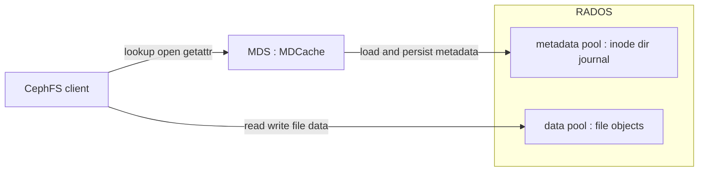
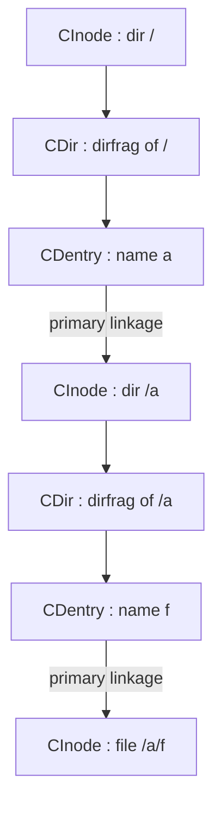
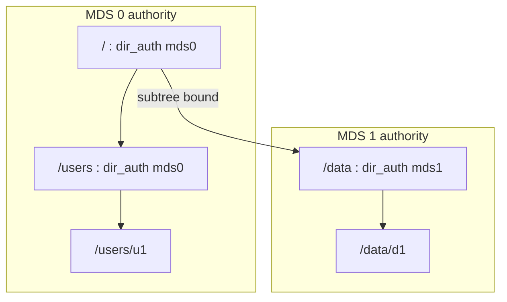

# 第24章 CephFS：MDS と MDCache

> **本章で読むソース**
>
> - [`src/mds/MDSRank.h`](https://github.com/ceph/ceph/blob/v20.2.2/src/mds/MDSRank.h)
> - [`src/mds/CInode.h`](https://github.com/ceph/ceph/blob/v20.2.2/src/mds/CInode.h)
> - [`src/mds/CDir.h`](https://github.com/ceph/ceph/blob/v20.2.2/src/mds/CDir.h)
> - [`src/mds/CDentry.h`](https://github.com/ceph/ceph/blob/v20.2.2/src/mds/CDentry.h)
> - [`src/mds/MDCache.h`](https://github.com/ceph/ceph/blob/v20.2.2/src/mds/MDCache.h)
> - [`src/mds/MDCache.cc`](https://github.com/ceph/ceph/blob/v20.2.2/src/mds/MDCache.cc)
> - [`src/mds/Locker.h`](https://github.com/ceph/ceph/blob/v20.2.2/src/mds/Locker.h)
> - [`src/mds/MDBalancer.h`](https://github.com/ceph/ceph/blob/v20.2.2/src/mds/MDBalancer.h)
> - [`src/mds/journal.cc`](https://github.com/ceph/ceph/blob/v20.2.2/src/mds/journal.cc)

## この章の狙い

CephFS は RADOS の上に POSIX ファイルシステムを構築する。
ファイルの中身は RADOS のオブジェクトに直接置かれ、クライアントは Objecter（第22章）を通じてそのデータを読み書きする。
これに対してディレクトリツリーや inode といったメタデータは、専用のデーモンである MDS が受け持つ。
データ経路とメタデータ経路を分けたのは、両者のスケール特性が異なるためである。
データはオブジェクト単位に分散すればいくらでも並列化できるが、メタデータは名前空間という共有構造を持つため、単純な分散では一貫性が壊れる。

本章は MDS がメタデータをどう表現し、どうスケールさせるかを読む。
まずメモリ上のツリー構造（`CInode`、`CDir`、`CDentry`）と、その集合を管理する `MDCache` を見る。
次に、その名前空間を複数の MDS へ動的に分割する「サブツリー分割」を機構レベルで追う。
更新をまずジャーナルへ追記してから反映する仕組みにも触れる。
複数クライアントの間で inode の各フィールドを一貫させる分散ロック（`Locker`）は入口だけを示し、Capability の詳細は第25章に委ねる。

## 前提

第22章で、RADOS のオブジェクトをクライアントが Objecter 経由で読み書きする経路を見た。
CephFS のファイルデータもこの経路に乗る。
本章が扱うのは、そのデータを指し示すメタデータ（どのファイルがどのオブジェクト群に対応し、ディレクトリツリーのどこに属するか）の側である。
メタデータもまた RADOS のオブジェクトとして永続化される。
MDS は永続化されたメタデータのキャッシュとして振る舞い、クライアントの要求に応じてツリーの一部をメモリに読み込む。

## データとメタデータの分離

CephFS のクライアントがファイルを開くとき、二つの相手と話す。
ファイル名の解決や権限の確認は MDS に問い合わせる。
中身のバイト列は、MDS から受け取ったレイアウト情報をもとに、クライアント自身が Objecter で RADOS のオブジェクトへ直接読み書きする。
この分離により、大きなファイルへの並列 I/O が MDS を経由せず、メタデータサーバーがデータ帯域のボトルネックにならない。



MDS が扱う一つの実行主体が `MDSRank` である。
1 つの MDS デーモンは、クラスタ内での担当番号（rank）に対応する `MDSRank` を持つ。
`MDSRank` は自身の rank と、メタデータ処理を分担する各サブシステムへのポインタを保持する。

[`src/mds/MDSRank.h` L412-L416](https://github.com/ceph/ceph/blob/v20.2.2/src/mds/MDSRank.h#L412-L416)

```cpp
    // sub systems
    Server *server = nullptr;
    MDCache *mdcache = nullptr;
    Locker *locker = nullptr;
    MDLog *mdlog = nullptr;
    MDBalancer *balancer = nullptr;
```

クライアント要求を受け付ける `Server`、メタデータキャッシュの `MDCache`、分散ロックの `Locker`、ジャーナルの `MDLog`、負荷分散の `MDBalancer` が、それぞれの役割を担う。
本章はこのうち `MDCache`、`Locker`、`MDBalancer`、そして `MDLog` が書き出すジャーナルを読む。

## メモリ上のツリー：CInode、CDir、CDentry

メタデータはメモリ上で三種類のオブジェクトのツリーとして表現される。
`CInode` は 1 つの inode（ファイルやディレクトリの実体）を表す。
`CDir` はディレクトリの内容の一断片（dirfrag）を表す。
`CDentry` はディレクトリエントリ、つまり名前から inode への 1 本のリンクを表す。

`CInode` は永続化される inode データ本体を、共有可能な定数ポインタとして保持する。
ディレクトリの inode は、自分の内容を 1 つ以上の `CDir` に分割して持つ。

[`src/mds/CInode.h` L1245](https://github.com/ceph/ceph/blob/v20.2.2/src/mds/CInode.h#L1245)

```cpp
  mempool::mds_co::compact_map<frag_t,CDir*> dirfrags; // cached dir fragments under this Inode
```

1 つのディレクトリを複数の `CDir` に割る仕組みが `dirfragtree` である。

[`src/mds/CInode.h` L180](https://github.com/ceph/ceph/blob/v20.2.2/src/mds/CInode.h#L180)

```cpp
  fragtree_t			dirfragtree;  // dir frag tree, if any.  always consistent with our dirfrag map.
```

巨大なディレクトリを 1 つのオブジェクトとして扱うと、そのディレクトリへの更新がすべて同じオブジェクトに集中する。
`dirfragtree` はディレクトリの名前空間をハッシュで断片に割り、各断片を独立した `CDir` として別々のオブジェクトに永続化させる。
これにより、1 つの大きなディレクトリへの並行更新を複数のオブジェクトへ分散でき、後述するサブツリー分割の単位にもなる。

`CDir` は自分が属する inode と断片番号、そして名前で引ける dentry の連想配列を持つ。

[`src/mds/CDir.h` L713](https://github.com/ceph/ceph/blob/v20.2.2/src/mds/CDir.h#L713)

```cpp
  dentry_key_map items;       // non-null AND null
```

`items` の値が `CDentry` である。
`CDentry` は名前と、その名前が指す先を表す `linkage_t` を持つ。

[`src/mds/CDentry.h` L397-L398](https://github.com/ceph/ceph/blob/v20.2.2/src/mds/CDentry.h#L397-L398)

```cpp
  CDir *dir = nullptr;     // containing dirfrag
  linkage_t linkage; /* durable */
```

`linkage_t` は 3 つの状態を取る。
inode を直接指す primary、別の inode 番号を参照する remote（ハードリンク）、何も指さない null である。

[`src/mds/CDentry.h` L88-L91](https://github.com/ceph/ceph/blob/v20.2.2/src/mds/CDentry.h#L88-L91)

```cpp
    // dentry type is primary || remote || null
    // inode ptr is required for primary, optional for remote, undefined for null
    bool is_primary() const { return remote_ino == 0 && inode != 0; }
    bool is_remote() const { return remote_ino > 0; }
```

primary な dentry は、その inode を格納する権威（authority）でもある。
inode は、それを primary に指す dentry の存在する `CDir` の中に永続化される。
この「dentry が inode を内包する」構造により、パスをたどると同時に inode の実体も同じオブジェクトから読める。

三者の関係を図にする。



## MDCache：ツリーの索引とリクエストの受け皿

`MDCache` は、メモリに読み込まれた全 `CInode` を inode 番号で引ける索引を持つ。

[`src/mds/MDCache.h` L1350-L1351](https://github.com/ceph/ceph/blob/v20.2.2/src/mds/MDCache.h#L1350-L1351)

```cpp
  std::unordered_map<inodeno_t, CInode*> inode_map;  // map of head inodes by ino
  std::map<vinodeno_t, CInode*> snap_inode_map;  // map of snap inodes by ino
```

`get_inode` はこの索引を引く。
スナップショットを持たない通常の inode はハッシュ表 `inode_map` を、スナップショット版は `snap_inode_map` を引く。

[`src/mds/MDCache.h` L847-L858](https://github.com/ceph/ceph/blob/v20.2.2/src/mds/MDCache.h#L847-L858)

```cpp
  CInode* get_inode(vinodeno_t vino) {
    if (vino.snapid == CEPH_NOSNAP) {
      auto p = inode_map.find(vino.ino);
      if (p != inode_map.end())
	return p->second;
    } else {
      auto p = snap_inode_map.find(vino);
      if (p != snap_inode_map.end())
	return p->second;
    }
    return NULL;
  }
```

パス解決の途中で目的の `CDir` や `CInode` がキャッシュにないとき、MDS はそれを RADOS から読み込むか、権威を持つ別の MDS へ問い合わせる。
つまり `MDCache` は名前空間全体の一部だけをメモリに保持する、部分キャッシュとして働く。

クライアント要求は `request_start` で登録され、処理中の要求として `active_requests` に記録される。

[`src/mds/MDCache.cc` L9732-L9744](https://github.com/ceph/ceph/blob/v20.2.2/src/mds/MDCache.cc#L9732-L9744)

```cpp
  // register new client request
  MDRequestImpl::Params params;
  params.reqid = req->get_reqid();
  params.attempt = req->get_num_fwd();
  params.client_req = req;
  params.initiated = req->get_recv_stamp();
  params.throttled = req->get_throttle_stamp();
  params.all_read = req->get_recv_complete_stamp();
  params.dispatched = req->get_dispatch_stamp();

  MDRequestRef mdr =
      mds->op_tracker.create_request<MDRequestImpl,MDRequestImpl::Params*>(&params);
  active_requests[params.reqid] = mdr;
```

`active_requests` に要求 ID をキーとして登録するのは、同じ要求が転送レースで二重に届いても 1 つにまとめ、リトライ時に状態を引き継ぐためである。

## 動的サブツリー分割

CephFS のスケーラビリティの核が、名前空間を複数の MDS へ動的に割り振る仕組みである。
ディレクトリツリーを部分木（サブツリー）に切り、各サブツリーの権威を特定の MDS に持たせる。
`MDCache` はサブツリーの根となる `CDir` と、その内側にある境界（他 MDS へ委譲された入れ子のサブツリー）の集合を保持する。

[`src/mds/MDCache.h` L1368](https://github.com/ceph/ceph/blob/v20.2.2/src/mds/MDCache.h#L1368)

```cpp
  std::map<CDir*,std::set<CDir*> > subtrees;
```

どの MDS がその `CDir` の権威かは、`CDir` 自身が持つ `dir_auth` で表される。

[`src/mds/CDir.h` L795](https://github.com/ceph/ceph/blob/v20.2.2/src/mds/CDir.h#L795)

```cpp
  mds_authority_t dir_auth;
```

サブツリーの境界を動かす操作が `adjust_subtree_auth` である。
ある `CDir` を根とする部分木の権威を、指定した MDS へ付け替える。

[`src/mds/MDCache.h` L338](https://github.com/ceph/ceph/blob/v20.2.2/src/mds/MDCache.h#L338)

```cpp
  void adjust_subtree_auth(CDir *root, mds_authority_t auth, bool adjust_pop=true);
```

この境界を、実際の負荷に応じて動かすのが `MDBalancer` である。
各 MDS は自分の負荷を定期的に交換し、過負荷の MDS は自分のサブツリーの一部を軽い MDS へ移す候補として選ぶ。
移送そのものは `migrator->export_dir` に委ねられる。

[`src/mds/MDBalancer.cc` L232-L234](https://github.com/ceph/ceph/blob/v20.2.2/src/mds/MDBalancer.cc#L232-L234)

```cpp
        if (dir->get_num_head_items() > 0) {
	  mds->mdcache->migrator->export_dir(dir, target);
        }
```

サブツリー分割が速さに効くのは、境界を「ディレクトリという既存の局所性」に沿って引く点にある。
同じディレクトリ配下の操作は同じ MDS に集まりやすいため、1 MDS 内でメタデータ操作が完結する割合が高く保たれる。
負荷が偏れば境界だけを動かせばよく、名前空間全体を再ハッシュする必要がない。

複数 MDS へのサブツリー分割を図にする。



## メタデータジャーナル

メタデータの更新は、対象の inode オブジェクトへ即座に書き戻すのではなく、まず MDS 専用のジャーナルへ追記される。
ジャーナルは RADOS 上のオブジェクト列であり、更新を表すイベントが順に並ぶ。
メタデータ更新の中心イベントが `EMetaBlob` で、更新された dirfrag と dentry と inode の一式を運ぶ。
再起動時にはジャーナルを再生し、未反映の更新をキャッシュへ復元する。

[`src/mds/journal.cc` L1226](https://github.com/ceph/ceph/blob/v20.2.2/src/mds/journal.cc#L1226)

```cpp
void EMetaBlob::replay(MDSRank *mds, LogSegmentRef const& logseg, int type, MDPeerUpdate *peerup)
```

ジャーナルを挟むと 2 つの利得がある。
1 つはクラッシュ耐性で、更新はまず追記の形で永続化されるため、途中でクラッシュしても再生で一貫した状態へ戻せる。
もう 1 つは書き込みの一括化で、同じ inode への連続した更新をメモリ上でまとめ、ジャーナルへの順次追記としてまとめて流せる。
ランダムな位置にある多数の inode オブジェクトを個別に更新する代わりに、追記という順次書き込みへ変換できる点が効率に効く。

## 分散ロック：Locker への入口

複数のクライアントや MDS が同じ inode を同時に触るとき、そのフィールド群（サイズ、mtime、権限など）を一貫させる調停役が `Locker` である。
クライアント要求を処理する前に、`Server` は必要なロックを `acquire_locks` でまとめて取得する。

[`src/mds/Locker.h` L69-L73](https://github.com/ceph/ceph/blob/v20.2.2/src/mds/Locker.h#L69-L73)

```cpp
  bool acquire_locks(const MDRequestRef& mdr,
		     MutationImpl::LockOpVec& lov,
		     CInode *auth_pin_freeze=NULL,
		     bool auth_pin_nonblocking=false,
                     bool skip_quiesce=false);
```

inode の各フィールドは種類の異なる複数のロックに分かれており、read 用、write 用、排他用の粒度で個別に取得と解放ができる。
このロック機構の上に、クライアントへ権限を貸し出す Capability が乗る。
クライアントはロックの状態に応じた Capability を保持し、その範囲でメタデータをローカルにキャッシュして操作できる。
Capability の状態遷移とクライアント側の扱いは第25章で詳しく読む。

## まとめ

CephFS はファイルデータを RADOS のオブジェクトに直接置き、メタデータだけを MDS が扱う。
MDS はメタデータを `CInode`、`CDir`、`CDentry` のツリーとしてメモリに持ち、`MDCache` がその索引と要求処理の受け皿になる。
名前空間は動的サブツリー分割で複数 MDS へ割られ、`MDBalancer` が負荷に応じて境界を動かす。
更新はまずジャーナルへ追記され、クラッシュ耐性と順次書き込みへの変換を得る。
同じ inode への並行アクセスは `Locker` が調停し、その上に Capability が乗る。

## 関連する章

- 第22章「Objecter と librados」：CephFS クライアントがファイルデータを読み書きする RADOS アクセス経路。
- 第25章「CephFS クライアントと Capability」：`Locker` が貸し出す Capability の状態遷移とクライアント側のキャッシュ制御。
