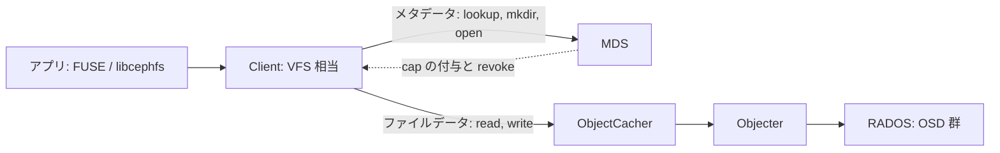
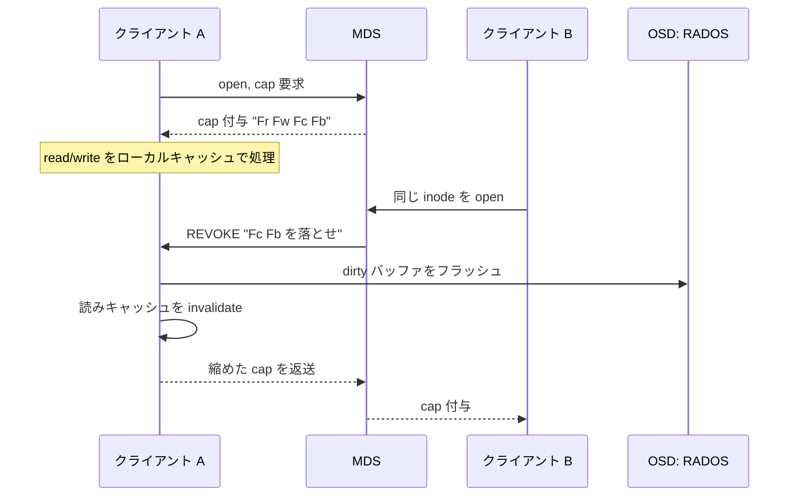

# 第25章 CephFS クライアントと Capability

> **本章で読むソース**
>
> - [`src/client/Client.h`](https://github.com/ceph/ceph/blob/v20.2.2/src/client/Client.h)
> - [`src/client/Client.cc`](https://github.com/ceph/ceph/blob/v20.2.2/src/client/Client.cc)
> - [`src/client/Inode.h`](https://github.com/ceph/ceph/blob/v20.2.2/src/client/Inode.h)
> - [`src/mds/Capability.h`](https://github.com/ceph/ceph/blob/v20.2.2/src/mds/Capability.h)
> - [`src/include/ceph_fs.h`](https://github.com/ceph/ceph/blob/v20.2.2/src/include/ceph_fs.h)

## この章の狙い

CephFS のクライアントは、POSIX ファイルシステムの見た目を保ちながら、その内側で二つの異なるサーバー群と話す。
ディレクトリ操作やファイル属性といったメタデータは MDS へリクエストとして送り、ファイルの中身は RADOS のオブジェクトへ直接読み書きする。
この二経路の分離が、メタデータの一貫性を MDS に集約しつつ、データ転送を MDS のボトルネックから外す土台になる。

本章はまず、`Client` が一つの操作をメタデータ経路とデータ経路のどちらへ振り分けるかを読む。
次に、両経路をまたいで一貫性を保つ仕組みである「Capability」を扱う。
cap は MDS が inode ごとにクライアントへ与える許可であり、単一クライアントが対象を占有する間はローカルキャッシュで高速化し、別のクライアントが同じ inode を要求した瞬間に revoke してキャッシュを吐き出させる。
最後に、この cap がデータキャッシュである `ObjectCacher` とどう連動し、revoke のときにどうフラッシュされるかを追う。

## 前提

第22章で `Objecter` と librados を読み、クライアントが RADOS オブジェクトへ直接 I/O を投げる経路を確認した。
CephFS のファイルデータは、この Objecter とその上の `ObjectCacher` を通って OSD へ渡る。
第24章では MDS 側の `MDCache` と分散ロックを扱い、cap を発行し revoke する主体が MDS であることを見た。
本章はその対向にあたるクライアント側から、MDS が渡してきた cap をどう解釈し、どう返すかを読む。

## メタデータとデータの二経路

`Client` は FUSE や libcephfs から POSIX ライクな呼び出しを受ける VFS 相当の層である。
そのうちディレクトリ探索や属性取得のようなメタデータ操作は、`make_request` で MDS へリクエストとして送られる。

[`src/client/Client.cc` L2112-L2126](https://github.com/ceph/ceph/blob/v20.2.2/src/client/Client.cc#L2112-L2126)

```cpp
int Client::make_request(MetaRequest *request,
			 const UserPerm& perms,
			 InodeRef *ptarget, bool *pcreated,
			 mds_rank_t use_mds,
			 bufferlist *pdirbl,
			 size_t feature_needed)
{
  int r = 0;

  // assign a unique tid
  ceph_tid_t tid = ++last_tid;
  request->set_tid(tid);
```

一方、ファイルデータの中身はこの経路を通らない。
`Client` はデータ用のクライアントとして `Objecter` と、その手前のキャッシュ層 `ObjectCacher` を保持する。

[`src/client/Client.h` L1234-L1239](https://github.com/ceph/ceph/blob/v20.2.2/src/client/Client.h#L1234-L1239)

```cpp
  std::unique_ptr<ObjectCacher>      objectcacher;
```

[`src/client/Client.h` L1239](https://github.com/ceph/ceph/blob/v20.2.2/src/client/Client.h#L1239)

```cpp
  Objecter  *objecter;
```

ファイルは固定サイズのオブジェクトへストライプ分割され、read/write はそのオブジェクトを保持する OSD へ Objecter が直接送る。
MDS はデータのバイト列を一切中継しない。
この分離により、多数のクライアントが並行して大量のデータを流しても、MDS の負荷はメタデータのやり取りだけに限られる。



## Capability：inode ごとの許可

**Capability**（cap）は、MDS が inode ごとにクライアントへ与える許可の集合である。
「読んでよい」「書いてよい」だけでなく、「読んだ内容をローカルにキャッシュしてよい」「書き込みをバッファしてよい」までを、ビットの組み合わせで表す。
ビットは種別ごとの2文字略号で語られる。
汎用ビットの定義は次のとおりで、`s`（shared）と `x`（exclusive）に加え、ファイル用の cache・read・write・buffer が並ぶ。

[`src/include/ceph_fs.h` L907-L913](https://github.com/ceph/ceph/blob/v20.2.2/src/include/ceph_fs.h#L907-L913)

```c
#define CEPH_CAP_GSHARED     1  /* client can reads */
#define CEPH_CAP_GEXCL       2  /* client can read and update */
#define CEPH_CAP_GCACHE      4  /* (file) client can cache reads */
#define CEPH_CAP_GRD         8  /* (file) client can read */
#define CEPH_CAP_GWR        16  /* (file) client can write */
#define CEPH_CAP_GBUFFER    32  /* (file) client can buffer writes */
#define CEPH_CAP_GWREXTEND  64  /* (file) client can extend EOF */
```

これらのビットは種別ごとにシフトして合成される。
ファイル種別（`Fx` と略される）では、`Fc`（file cache）と `Fb`（file buffer）がデータキャッシュの許可にあたる。

[`src/include/ceph_fs.h` L935-L939](https://github.com/ceph/ceph/blob/v20.2.2/src/include/ceph_fs.h#L935-L939)

```c
#define CEPH_CAP_FILE_CACHE    (CEPH_CAP_GCACHE    << CEPH_CAP_SFILE)
#define CEPH_CAP_FILE_RD       (CEPH_CAP_GRD       << CEPH_CAP_SFILE)
#define CEPH_CAP_FILE_WR       (CEPH_CAP_GWR       << CEPH_CAP_SFILE)
#define CEPH_CAP_FILE_BUFFER   (CEPH_CAP_GBUFFER   << CEPH_CAP_SFILE)
#define CEPH_CAP_FILE_WREXTEND (CEPH_CAP_GWREXTEND << CEPH_CAP_SFILE)
```

`Fr`（`CEPH_CAP_FILE_RD`）はデータを OSD から読む許可、`Fw`（`CEPH_CAP_FILE_WR`）は書く許可である。
これに対し `Fc` はその読みをローカルキャッシュから返してよい許可、`Fb` は書き込みをいったんローカルバッファに溜めてよい許可を表す。
`Fr`/`Fw` だけならクライアントは毎回 OSD へ同期 I/O を出すが、`Fc`/`Fb` を持つ間はキャッシュで済ませられる。
読み取りキャッシュ（`Fc`）は書き手がいない間なら複数クライアントへ同時に配れるが、書き込みバッファ（`Fb`）は一時に一クライアントへ絞る。
このキャッシュ許可の配り分けが、後述する一貫性の要になる。

クライアント側では、inode ごとに MDS ランク別の cap を `caps` マップに保持する。
データキャッシュの実体である `ObjectCacher::ObjectSet` も同じ inode に属し、cap とキャッシュが同じ構造の下に並ぶ。

[`src/client/Inode.h` L212-L234](https://github.com/ceph/ceph/blob/v20.2.2/src/client/Inode.h#L212-L234)

```cpp
  std::map<mds_rank_t, Cap> caps;            // mds -> Cap
  Cap *auth_cap = 0;
  int64_t cap_dirtier_uid = -1;
  int64_t cap_dirtier_gid = -1;
  unsigned dirty_caps = 0;
  unsigned flushing_caps = 0;
  // ... (中略) ...
  ObjectCacher::ObjectSet oset; // ORDER DEPENDENCY: ino
```

複数の MDS が同じ inode に cap を持ちうるため、クライアントが実際に行使できる許可は全 cap の論理和として求める。
`caps_issued` は有効な各 cap の `issued` を畳み込み、issued と implemented を返す。

[`src/client/Inode.cc` L255-L274](https://github.com/ceph/ceph/blob/v20.2.2/src/client/Inode.cc#L255-L274)

```cpp
int Inode::caps_issued(int *implemented) const
{
  int c = snap_caps;
  int i = 0;
  for (const auto &[mds, cap] : caps) {
    if (cap_is_valid(cap)) {
      c |= cap.issued;
      i |= cap.implemented;
    }
  }
  // ... (中略) ...
  if (implemented)
    *implemented = i;
  return c;
}
```

## cap の取得とキャッシュ判定

read/write は実データに触れる前に、必要な cap を握れているかを `get_caps` で確認する。
`get_caps` は必要ビット（`need`）と、あれば嬉しいビット（`want`）を受け取り、現に issued されている cap でまかなえるかを調べる。
まかなえていて、かつ望むビットが revoke 中（`revoking`）でなければ、cap への参照を取ってヒットを記録し即座に返る。

[`src/client/Client.cc` L3871-L3879](https://github.com/ceph/ceph/blob/v20.2.2/src/client/Client.cc#L3871-L3879)

```cpp
		 << " need " << ccap_string(need) << " want " << ccap_string(want)
		 << " revoking " << ccap_string(revoking)
		 << dendl;
	if ((revoking & want) == 0) {
	  *phave = need | (have & want);
	  in->get_cap_ref(need);
	  cap_hit();
	  return 0;
	}
```

read の側は `Fr` を `need`、`Fc` を `want` として `get_caps` を呼ぶ。
`Fc` まで得られたかどうかで、キャッシュから返すか OSD へ同期読みするかが決まる。

[`src/client/Client.cc` L11169-L11172](https://github.com/ceph/ceph/blob/v20.2.2/src/client/Client.cc#L11169-L11172)

```cpp
  if (!conf->client_debug_force_sync_read &&
      conf->client_oc &&
      (have & (CEPH_CAP_FILE_CACHE | CEPH_CAP_FILE_LAZYIO))) {
    // CAES 1 - blocking or non-blocking caller with the client holding Fc caps
```

`Fc` を持つときは `_read_async` が `ObjectCacher` を経由し、キャッシュにあればネットワークへ出ずに返す。
`Fc` を持たないときは `_read_sync` が Objecter で OSD へ直接読みに行く。
write も同様で、`Fb` を握れていれば `objectcacher->file_write` でローカルバッファに書き、後でまとめてフラッシュする。

[`src/client/Client.cc` L11905-L11920](https://github.com/ceph/ceph/blob/v20.2.2/src/client/Client.cc#L11905-L11920)

```cpp
  if (cct->_conf->client_oc &&
      (have & (CEPH_CAP_FILE_BUFFER | CEPH_CAP_FILE_LAZYIO))) {
    // do buffered write
    if (!in->oset.dirty_or_tx)
      get_cap_ref(in, CEPH_CAP_FILE_CACHE | CEPH_CAP_FILE_BUFFER);

    get_cap_ref(in, CEPH_CAP_FILE_BUFFER);

    // async, caching, non-blocking.
    r = objectcacher->file_write(&in->oset, &in->layout,
				 in->snaprealm->get_snap_context(),
				 offset, size, bl, ceph::real_clock::now(),
				 0, iofinish.get(),
```

## cap の付与と revoke のやり取り

cap の発行と回収は MDS が主導し、クライアントはその通知を受けて自分の状態を合わせる。
MDS 側の `Capability` は、クライアントへ実際に渡した許可を `_pending`、クライアントがまだ手放していないとみなす許可を `_issued` として持つ。
revoke 中の許可は、両者の差 `_issued & ~_pending` で表される。

[`src/mds/Capability.h` L137-L145](https://github.com/ceph/ceph/blob/v20.2.2/src/mds/Capability.h#L137-L145)

```cpp
  int pending() const {
    return _pending;
  }
  int issued() const {
    return _issued;
  }
  int revoking() const {
    return _issued & ~_pending;
  }
```

別のクライアントが同じ inode に競合する cap を要求すると、MDS は先のクライアントへ「この許可まで縮めてほしい」というメッセージを送る。
クライアント側の受け口が `handle_caps` で、op が `GRANT` か `REVOKE` かに応じて cap を更新する。

[`src/client/Client.cc` L5512-L5521](https://github.com/ceph/ceph/blob/v20.2.2/src/client/Client.cc#L5512-L5521)

```cpp
void Client::handle_caps(const MConstRef<MClientCaps>& m)
{
  mds_rank_t mds = mds_rank_t(m->get_source().num());

  std::scoped_lock cl(client_lock);
  auto session = _get_mds_session(mds, m->get_connection().get());
  if (!session) {
    return;
  }
```

revoke が届くと、クライアントは即座に応答を返す必要がある。
`handle_cap_grant` は op が `REVOKE` のとき `check_caps` を遅延なしフラグ付きで呼び、縮んだ cap を MDS へ返送させる。

[`src/client/Client.cc` L6051-L6058](https://github.com/ceph/ceph/blob/v20.2.2/src/client/Client.cc#L6051-L6058)

```cpp
  // just in case the caps was released just before we get the revoke msg
  if (!check && m->get_op() == CEPH_CAP_OP_REVOKE) {
    cap->wanted = 0; // don't let check_caps skip sending a response to MDS
    check = true;
    flags = CHECK_CAPS_NODELAY;
  }

  if (check)
    check_caps(in, flags);
```

dirty なメタデータを持たない cap は、MDS の ack を待たずに手放せる。
このため revoke の往復は、汚れていないキャッシュを捨てるだけの軽いやり取りで済むことが多い。

[`src/mds/Capability.h` L36-L38](https://github.com/ceph/ceph/blob/v20.2.2/src/mds/Capability.h#L36-L38)

```cpp
- if client has no dirty data, it can release it without waiting for an mds ack.
  - client may thus get a cap _update_ and not have the cap.  ignore it.
```

## revoke に伴うキャッシュのフラッシュ

`Fc`/`Fb` の revoke は、単に許可ビットを落とすだけでは済まない。
その cap のもとでローカルに溜めたキャッシュを、他クライアントが読む前に正しい場所へ吐き出さねばならない。
`check_caps` は、`Fc` が revoke 対象になっていて自分がまだ使っていないとき、`_release` でキャッシュを解放する。

[`src/client/Client.cc` L4157-L4161](https://github.com/ceph/ceph/blob/v20.2.2/src/client/Client.cc#L4157-L4161)

```cpp
  if (!(orig_used & CEPH_CAP_FILE_BUFFER) &&
      (revoking & used & (CEPH_CAP_FILE_CACHE | CEPH_CAP_FILE_LAZYIO))) {
    if (_release(in.get()))
      used &= ~(CEPH_CAP_FILE_CACHE | CEPH_CAP_FILE_LAZYIO);
  }
```

`_release` は、そのキャッシュを参照している者がいなければ `_invalidate_inode_cache` を呼び、`ObjectCacher` の該当 `ObjectSet` を捨てる。

[`src/client/Client.cc` L4493-L4530](https://github.com/ceph/ceph/blob/v20.2.2/src/client/Client.cc#L4493-L4530)

```cpp
void Client::_invalidate_inode_cache(Inode *in)
{
  ldout(cct, 10) << __func__ << " " << *in << dendl;

  // invalidate our userspace inode cache
  if (cct->_conf->client_oc) {
    objectcacher->release_set(&in->oset);
    if (!objectcacher->set_is_empty(&in->oset))
      lderr(cct) << "failed to invalidate cache for " << *in << dendl;
  }
  // ... (中略) ...
}

bool Client::_release(Inode *in)
{
  ldout(cct, 20) << "_release " << *in << dendl;
  if (in->cap_refs[CEPH_CAP_FILE_CACHE] == 0) {
    _invalidate_inode_cache(in);
    return true;
  }
  return false;
}
```

`Fb` の側は、捨てる前に書き戻しが要る。
バッファされた write がまだ OSD に届いていないなら、`_flush` で `ObjectCacher` の dirty をフラッシュしてから cap を返す。
この読み書き両方向のキャッシュ制御が、次のシーケンスにまとまる。



## inode のライフサイクルと cap

クライアント側の inode は、cap を一つでも得た時点で生き始める。
`add_update_cap` は、まだ cap を持たない inode に最初の cap を付けるとき `snaprealm` を開き、以後の cap 更新をこの inode の `caps` マップへ束ねる。

[`src/client/Client.cc` L4608-L4616](https://github.com/ceph/ceph/blob/v20.2.2/src/client/Client.cc#L4608-L4616)

```cpp
void Client::add_update_cap(Inode *in, MetaSession *mds_session, uint64_t cap_id,
			    unsigned issued, unsigned wanted, unsigned seq, unsigned mseq,
			    inodeno_t realm, int flags, const UserPerm& cap_perms)
{
  if (!in->is_any_caps()) {
    ceph_assert(in->snaprealm == 0);
    in->snaprealm = get_snap_realm(realm);
    in->snaprealm->inodes_with_caps.push_back(&in->snaprealm_item);
    ldout(cct, 15) << __func__ << " first one, opened snaprealm " << in->snaprealm << dendl;
```

逆に、すべての cap を revoke で手放し、参照も尽きた inode はキャッシュから外せる。
cap を保持している限り MDS 側もその inode を掴んでおくため、クライアントが cap を返すことは、MDS のメモリ回収の合図も兼ねる。
cap の保有はキャッシュの有効期限そのものであり、別途のリース時刻を持たずに、MDS からの revoke がキャッシュ無効化のトリガーになる。

## 高速化・最適化の工夫

cap によるキャッシュ許可の配り分けが、一貫性と性能を同時に成り立たせる仕組みである。
書き手がいない間、MDS は inode を共有状態に置き、複数のクライアントへ同時に `Fr`/`Fc` を与えられる。
各クライアントは read をローカルキャッシュから返し、OSD への往復も MDS への問い合わせもせずに済ませられる。
一方、書き込みをバッファに溜める `Fb` は一時に一クライアントへしか与えない。
別のクライアントが同じ inode に書き込もうとすると、MDS は既存クライアントの `Fb`（および必要に応じて `Fc`）を revoke し、キャッシュのフラッシュと invalidate を強制してから状態を移す。
読みを共有しつつ書きを一者に直列化することで、ローカルキャッシュの高速性を保ちながら、複数クライアント間で古いデータが見えることを防げる。

## まとめ

CephFS クライアントは、メタデータ操作を MDS へのリクエストに、ファイルデータの read/write を Objecter と ObjectCacher 経由の RADOS 直接 I/O に振り分ける。
両経路をまたぐ一貫性は Capability が担う。
cap は inode ごとに MDS が与える許可で、`Fr`/`Fw` がデータ I/O を、`Fc`/`Fb` がローカルキャッシュを許す。
クライアントは `get_caps` で必要な cap を確認してから I/O 方式を選び、MDS からの revoke を `handle_caps` で受けてキャッシュをフラッシュし、cap を縮めて返す。
この付与と revoke の往復が、単一占有時の高速なキャッシュと、競合時の正しさを両立させる。

## 関連する章

- 第22章「Objecter と librados」：クライアントが RADOS オブジェクトへ直接 I/O を送る下位経路。
- 第24章「CephFS：MDS と MDCache」：cap を発行し revoke する MDS 側の主体と分散ロック。
