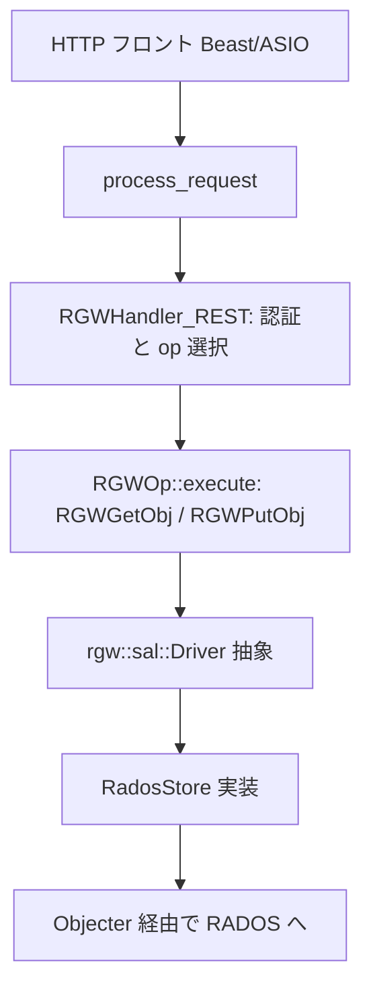
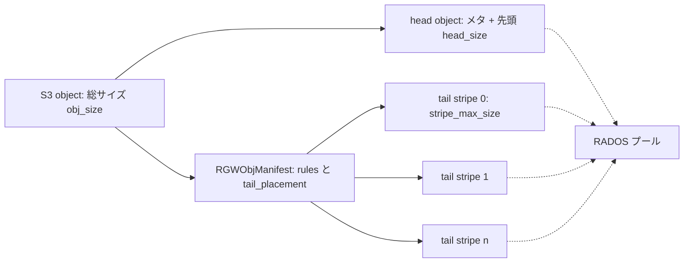

# 第26章 RADOS Gateway（RGW）

> **本章で読むソース**
>
> - [`src/rgw/rgw_process.cc`](https://github.com/ceph/ceph/blob/v20.2.2/src/rgw/rgw_process.cc)
> - [`src/rgw/rgw_op.cc`](https://github.com/ceph/ceph/blob/v20.2.2/src/rgw/rgw_op.cc)
> - [`src/rgw/rgw_sal.h`](https://github.com/ceph/ceph/blob/v20.2.2/src/rgw/rgw_sal.h)
> - [`src/rgw/driver/rados/rgw_obj_manifest.h`](https://github.com/ceph/ceph/blob/v20.2.2/src/rgw/driver/rados/rgw_obj_manifest.h)
> - [`src/rgw/driver/rados/rgw_putobj_processor.cc`](https://github.com/ceph/ceph/blob/v20.2.2/src/rgw/driver/rados/rgw_putobj_processor.cc)
> - [`src/rgw/services/svc_bi_rados.h`](https://github.com/ceph/ceph/blob/v20.2.2/src/rgw/services/svc_bi_rados.h)

## この章の狙い

RADOS Gateway（RGW）は、HTTP で S3 と Swift の API を提供し、その裏でオブジェクトを RADOS に格納するゲートウェイである。
第23章の RBD がブロックデバイスを、第24章と第25章の CephFS がファイルシステムを RADOS の上に築いたのと同じ位置づけで、RGW はオブジェクトストレージを築く。
どれも最終的には第22章の `Objecter` を通って RADOS へ read/write するという点で共通し、違いは上位に載せる API の意味論にある。

本章はまず、HTTP リクエストが RGW 内部でどの層を通り、認証と操作の選択を経て RADOS への I/O にたどり着くかを追う。
次に、S3 の1オブジェクトが RADOS 上でどう表現されるかを読む。
大きなオブジェクトを head と複数の tail に分割し、manifest でつなぐ格納構造が中心になる。
最後に、大規模バケットのホットスポットを避けるためにバケットインデックスをシャード化する仕組みを、スケーラビリティの工夫として説明する。

## 前提

第22章で `Objecter` と librados を、第8章で OSDMap と PG マッピングを扱った。
RGW はこれらの上に立つ利用者であり、自身が RADOS の内部構造を作り直すわけではない。
S3 のバケットとオブジェクトを、いくつかの RADOS プールに置かれた RADOS オブジェクトへ翻訳するのが RGW の仕事である。
本章はその翻訳の骨格だけを読み、暗号化や圧縮、ライフサイクルといった個別機能には踏み込まない。

## リクエスト処理の骨格

RGW はデーモンとして HTTP フロント（既定は Beast/ASIO）を持ち、受け取った1リクエストごとに `process_request` を呼ぶ。
この関数は、リクエストの状態をまとめる `req_state` を組み立て、URL とメソッドから適切なハンドラを選び、そのハンドラに操作オブジェクトを作らせる。

[`src/rgw/rgw_process.cc` L306-L331](https://github.com/ceph/ceph/blob/v20.2.2/src/rgw/rgw_process.cc#L306-L331)

```cpp
  RGWOp* op = nullptr;
  int init_error = 0;
  bool should_log = false;
  RGWREST* rest = penv.rest;
  RGWRESTMgr *mgr;
  bool is_health_request = false;
  RGWHandler_REST *handler = rest->get_handler(driver, s,
                                               *penv.auth_registry,
                                               frontend_prefix,
                                               client_io, &mgr, &init_error);
  // ... (中略) ...
  op = handler->get_op();
  if (!op) {
    abort_early(s, NULL, -ERR_METHOD_NOT_ALLOWED, handler, yield);
    goto done;
  }
```

`RGWHandler_REST` は S3 用や Swift 用に派生し、URL がバケットを指すかオブジェクトを指すか、メソッドが `GET` か `PUT` かに応じて、対応する `RGWOp` の派生を返す。
たとえばオブジェクトの `GET` なら `RGWGetObj`、`PUT` なら `RGWPutObj` である。
`RGWOp` は S3 の1操作を表すコマンドオブジェクトであり、以後の認証と実行はこの `op` を軸に進む。

操作オブジェクトが決まると、`process_request` は認証を済ませてから `rgw_process_authenticated` に処理を渡す。
この関数が権限検査と本体実行を一列に並べる。

[`src/rgw/rgw_process.cc` L221-L266](https://github.com/ceph/ceph/blob/v20.2.2/src/rgw/rgw_process.cc#L221-L266)

```cpp
  ldpp_dout(op, 2) << "verifying op permissions" << dendl;
  {
    auto span = tracing::rgw::tracer.add_span("verify_permission", s->trace);
    std::swap(span, s->trace);
    ret = op->verify_permission(y);
    std::swap(span, s->trace);
  }
  // ... (中略) ...
  ldpp_dout(op, 2) << "executing" << dendl;
  {
    auto span = tracing::rgw::tracer.add_span("execute", s->trace);
    std::swap(span, s->trace);
    op->execute(y);
    std::swap(span, s->trace);
  }
```

権限は `verify_permission` が、S3 の ACL やバケットポリシーに照らして判定する。
そこを通ったリクエストだけが `op->execute` に進み、ここで初めて RADOS への read/write が起きる。
認証（相手が誰か）と認可（その操作を許すか）を、本体実行の前段に固めて置く構造である。

経路全体は次の図のようになる。



## SAL：ストレージ抽象レイヤ

`RGWOp::execute` が呼ぶのは、`RGWRados` を直接ではなく、Storage Abstraction Layer（SAL）と呼ぶ抽象インターフェースである。
入口は `rgw::sal::Driver` で、ユーザー・バケット・オブジェクトを取得する純粋仮想メソッドを並べる。

[`src/rgw/rgw_sal.h` L285-L293](https://github.com/ceph/ceph/blob/v20.2.2/src/rgw/rgw_sal.h#L285-L293)

```cpp
class Driver {
  public:
    Driver() {}
    virtual ~Driver() = default;

    /** Post-creation initialization of driver */
    virtual int initialize(CephContext *cct, const DoutPrefixProvider *dpp) = 0;
    /** Name of this driver provider (e.g., "rados") */
    virtual const std::string get_name() const = 0;
```

`Driver`・`Bucket`・`Object`・`Writer` といった抽象の下に、RADOS 実装として `RadosStore` などが並ぶ。
S3 操作のコードは抽象型だけを見て書かれ、実際に RADOS へ書くかどうかは差し込まれた driver が決める。
この分離により、RADOS 以外のバックエンド（別クラスタへの委譲や、他ストレージへの橋渡し）を同じ操作コードのまま差せる設計になっている。
本章が読むのは、この抽象の下にある RADOS driver の翻訳である。

## オブジェクトの格納構造：head と tail

S3 の1オブジェクトは、そのまま1個の RADOS オブジェクトに載るとは限らない。
RADOS オブジェクトは1個あたりを小さく保つのが望ましく、数 GB の S3 オブジェクトを丸ごと1個に置くと、その OSD だけに負荷が集中し recovery も重くなる。
RGW は1つの S3 オブジェクトを、メタデータと先頭データを持つ **head オブジェクト**と、残りのデータを分担する複数の **tail オブジェクト**に分割し、その対応表を `RGWObjManifest` に持つ。

manifest は、オブジェクトの総サイズ、head のサイズ、tail 側の配置プール、そしてストライプの規則を保持する。

[`src/rgw/driver/rados/rgw_obj_manifest.h` L197-L217](https://github.com/ceph/ceph/blob/v20.2.2/src/rgw/driver/rados/rgw_obj_manifest.h#L197-L217)

```cpp
class RGWObjManifest {
protected:
  bool explicit_objs{false}; /* really old manifest? */
  std::map<uint64_t, RGWObjManifestPart> objs;

  uint64_t obj_size{0};

  rgw_obj obj;
  uint64_t head_size{0};
  rgw_placement_rule head_placement_rule;

  uint64_t max_head_size{0};
  std::string prefix;
  rgw_bucket_placement tail_placement; /* might be different than the original bucket,
                                       as object might have been copied across pools */
  std::map<uint64_t, RGWObjManifestRule> rules;
```

`rules` に入る `RGWObjManifestRule` が、tail をどう刻むかを定める。
`stripe_max_size` が1個の RADOS オブジェクト（ストライプ）の上限で、`part_size` はマルチパートの1パートのサイズである。

[`src/rgw/driver/rados/rgw_obj_manifest.h` L134-L143](https://github.com/ceph/ceph/blob/v20.2.2/src/rgw/driver/rados/rgw_obj_manifest.h#L134-L143)

```cpp
struct RGWObjManifestRule {
  uint32_t start_part_num;
  uint64_t start_ofs;
  uint64_t part_size; /* each part size, 0 if there's no part size, meaning it's unlimited */
  uint64_t stripe_max_size; /* underlying obj max size */
  std::string override_prefix;
```

書き込み側でこの規則を組み立てるのが `AtomicObjectProcessor` である。
head の最大サイズとストライプサイズを決め、`set_trivial_rule` で単純な規則を manifest に登録する。

[`src/rgw/driver/rados/rgw_putobj_processor.cc` L342-L368](https://github.com/ceph/ceph/blob/v20.2.2/src/rgw/driver/rados/rgw_putobj_processor.cc#L342-L368)

```cpp
  uint64_t stripe_size;
  const uint64_t default_stripe_size = store->ctx()->_conf->rgw_obj_stripe_size;

  store->get_max_aligned_size(default_stripe_size, alignment, &stripe_size);

  manifest.set_trivial_rule(head_max_size, stripe_size);

  r = manifest_gen.create_begin(store->ctx(), &manifest,
                                bucket_info.placement_rule,
                                &tail_placement_rule,
                                head_obj.bucket, head_obj);
  // ... (中略) ...
  set_head_chunk_size(head_max_size);
  // initialize the processors
  chunk = ChunkProcessor(&writer, chunk_size);
  stripe = StripeProcessor(&chunk, this, head_max_size);
```

ここに書き込みパイプラインの姿が現れる。
`StripeProcessor` が入力データを `stripe_max_size` ごとに切り、`ChunkProcessor` が各ストライプをさらに `chunk_size` 単位の RADOS write op にまとめる。
先頭の `head_max_size` 分は head オブジェクトに載り、それを超えた分から順に tail オブジェクトへストライプされる。
既定のストライプサイズ（`rgw_obj_stripe_size`）は 4MiB で、大きな S3 オブジェクトは多数の 4MiB RADOS オブジェクトに散り、複数の OSD へ並列に分散する。

格納構造を図にすると次のようになる。



読み出し側は逆をたどる。
`RGWGetObj::execute` が read op を用意し、`iterate` で manifest をたどりながら各ストライプを順に RADOS から読み、フィルタ（復号や解凍）を通してクライアントへ送る。

[`src/rgw/rgw_op.cc` L2449-L2472](https://github.com/ceph/ceph/blob/v20.2.2/src/rgw/rgw_op.cc#L2449-L2472)

```cpp
void RGWGetObj::execute(optional_yield y)
{
  // ... (中略) ...
  std::unique_ptr<rgw::sal::Object::ReadOp> read_op(s->object->get_read_op());
```

[`src/rgw/rgw_op.cc` L2676](https://github.com/ceph/ceph/blob/v20.2.2/src/rgw/rgw_op.cc#L2676)

```cpp
  op_ret = read_op->iterate(this, ofs_x, end_x, filter, s->yield);
```

書き込み側で対応するのは、入力を受け取ってパイプラインへ流す `filter->process` の呼び出しである。
`RGWPutObj::execute` はクライアントの本体を分割して読み、ストライプ処理へ渡していく。

[`src/rgw/rgw_op.cc` L4646](https://github.com/ceph/ceph/blob/v20.2.2/src/rgw/rgw_op.cc#L4646)

```cpp
    op_ret = filter->process(std::move(data), ofs);
```

書き込み先の RADOS オブジェクトを実際に開くのは、SAL の `get_atomic_writer` が返す writer である。

[`src/rgw/rgw_sal.h` L682-L688](https://github.com/ceph/ceph/blob/v20.2.2/src/rgw/rgw_sal.h#L682-L688)

```cpp
    virtual std::unique_ptr<Writer> get_atomic_writer(const DoutPrefixProvider *dpp,
				  optional_yield y,
				  rgw::sal::Object* obj,
				  const ACLOwner& owner,
				  const rgw_placement_rule *ptail_placement_rule,
				  uint64_t olh_epoch,
				  const std::string& unique_tag) = 0;
```

## マルチパートアップロードの考え方

大きなオブジェクトを一度の HTTP リクエストで送ると、途中で失敗したときの再送コストが大きい。
S3 のマルチパートアップロードは、1オブジェクトを複数のパートに分けて別々の `PUT` で送り、最後の complete で連結する。
RGW ではパートごとに独立した head と tail が作られ、complete のときに各パートの manifest を1本につなぎ合わせて最終オブジェクトの manifest を組む。
このとき使われるのが、パート番号ごとに規則を持つ manifest 規則（`set_multipart_part_rule`）である。
個々のパートは通常のオブジェクトと同じストライプ構造で RADOS に載るため、格納の仕組みそのものは前節と共通で、違いは manifest の組み立て方だけにある。

## バケットインデックスのシャード化

バケットは、含むオブジェクトの一覧を **バケットインデックス**として別の RADOS オブジェクトに持つ。
オブジェクトを1つ `PUT` するたびに、対応するインデックスへエントリを足す更新が走る。
バケットに数百万のオブジェクトが入り、かつインデックスが1個の RADOS オブジェクトなら、その更新はすべて同じ OSD の同じオブジェクトに集中する。
これはスループットのボトルネックであり、単一オブジェクトへの並行更新は競合も生む。

RGW はこれを避けるため、バケットインデックスを複数のシャードに分ける。
オブジェクトはキーのハッシュで担当シャードが決まり、更新負荷が複数の RADOS オブジェクト（したがって複数の OSD）へ散る。
シャードの選び方は `bucket_shard_index` にある。

[`src/rgw/services/svc_bi_rados.h` L103-L108](https://github.com/ceph/ceph/blob/v20.2.2/src/rgw/services/svc_bi_rados.h#L103-L108)

```cpp
  static int32_t bucket_shard_index(const std::string& key,
				    int num_shards) {
    uint32_t sid = ceph_str_hash_linux(key.c_str(), key.size());
    uint32_t sid2 = sid ^ ((sid & 0xFF) << 24);
    return rgw_shards_mod(sid2, num_shards);
  }
```

オブジェクトキーをハッシュし、シャード数で割った余りを担当シャードとする。
キーが同じなら常に同じシャードに落ちるので、`PUT` と後続の一覧・削除が同じシャードを見る一貫性が保たれる。
これがスケーラビリティの工夫である。
インデックスの更新をキーのハッシュで複数シャードへ分散させることで、1バケットへの書き込みスループットが単一 OSD の上限に縛られず、シャード数に応じて水平に伸びる。
バケットが育つとシャード数が足りなくなるため、RGW は既存インデックスを再ハッシュしてシャードを増やす reshard の機構（`RGWReshard`）を持ち、動的リシャードとして自動で走らせられる。

## まとめ

RGW は、HTTP で受けた S3/Swift リクエストをハンドラで認証と操作に振り分け、`RGWOp::execute` から SAL を通して RADOS へ read/write するゲートウェイである。
S3 の1オブジェクトは head と複数の tail に分割され、manifest がその対応を保持する。
大きなオブジェクトはストライプ単位で複数の RADOS オブジェクトに散り、複数 OSD へ分散する。
バケットインデックスはキーのハッシュでシャード化され、大規模バケットのホットスポットを避ける。

本章で本書は一巡した。
下では CRUSH が配置を決定的に計算し、OSD と PG がレプリケーションと recovery を担い、BlueStore がバイトをデバイスへ落とす。
その RADOS の上に、第23章の RBD、第24章と第25章の CephFS、そして本章の RGW が、それぞれブロック・ファイル・オブジェクトという異なる意味論の API を載せる。
共通の中核を一つ持ち、上位アクセス方式を差し替えられる構造こそが、Ceph が単一のクラスタで三種のストレージを提供できる理由である。

## 関連する章

- [第22章 Objecter と librados](22-objecter-librados.md)：RGW が RADOS へ read/write するときに通る下位層。
- [第8章 OSDMap・PG マッピング・プール](../part03-crush/08-osdmap-pg.md)：head と tail、インデックスシャードが載る RADOS プールと配置の仕組み。
