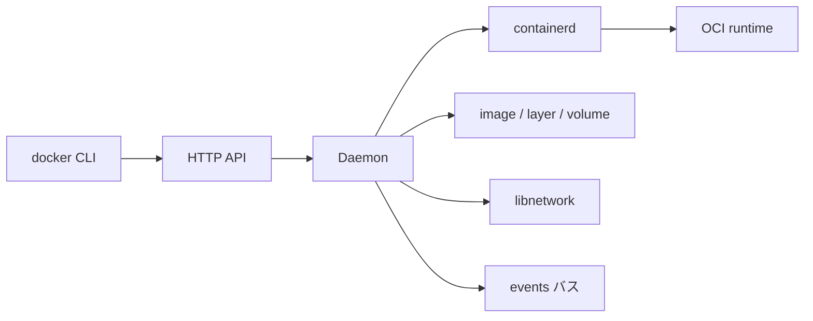

# 第1章 Docker Engine と Moby v2 の全体像

> 本章で読むソース
>
> - [`daemon/daemon.go`](https://github.com/moby/moby/blob/docker-v29.6.1/daemon/daemon.go)
> - [`cmd/dockerd/main.go`](https://github.com/moby/moby/blob/docker-v29.6.1/cmd/dockerd/main.go)

## この章の狙い

本章では **Docker Engine** を、dockerd、containerd、ストレージ、ネットワーク、API がつながる一つのデーモンとして読む。
以後の章で個別に読む部品が、`Daemon` のどのフィールドと責務に対応するかを先に押さえる。

## 前提

Go の構造体、goroutine、Linux 名前空間の基本を前提にする。
コンテナは OCI ランタイム仕様に沿ったプロセス隔離単位として扱う。

## 全体の流れ



## デーモンを中心に読む

`Daemon` はコンテナストア、イメージサービス、イベント、ネットワークコントローラ、volume、containerd クライアントを束ねる。
API リクエストは最終的にこの構造体のメソッドへ落ちる。

[`daemon/daemon.go` L99-L126](https://github.com/moby/moby/blob/docker-v29.6.1/daemon/daemon.go#L99-L126)

```go
// Daemon holds information about the Docker daemon.
type Daemon struct {
	id                string
	repository        string
	containers        container.Store
	containersReplica *container.ViewDB
	execCommands      *container.ExecStore
	imageService      ImageService
	configStore       atomic.Pointer[configStore]
	configReload      sync.Mutex
	statsCollector    *stats.Collector
	defaultLogConfig  containertypes.LogConfig
	registryService   *registry.Service
	EventsService     *events.Events
	netController     *libnetwork.Controller
	volumes           *volumesservice.VolumesService
	root              string
	// ... (中略) ...
	containerdClient  *containerd.Client
	containerd        libcontainerdtypes.Client
```

## Moby v2 モジュール

v29 系は `github.com/moby/moby/v2` モジュールに整理されている。
エントリポイント `cmd/dockerd/main.go` は `daemon/command` へ委譲し、CLI 定義とデーモン起動を分離する。

[`cmd/dockerd/main.go` L16-L38](https://github.com/moby/moby/blob/docker-v29.6.1/cmd/dockerd/main.go#L16-L38)

```go
func main() {
	if reexec.Init() {
		return
	}
	ctx := context.Background()

	signal.Ignore(syscall.SIGPIPE)

	_, stdout, stderr := term.StdStreams()

	r, err := command.NewDaemonRunner(stdout, stderr)
	if err != nil {
		_, _ = fmt.Fprintln(stderr, err)
		os.Exit(1)
	}
	if err := r.Run(ctx); err != nil {
		_, _ = fmt.Fprintln(stderr, err)
		os.Exit(1)
	}
}
```

## 高速化・最適化の工夫

`configStore` を `atomic.Pointer` で持ち、設定リロード時に読み取り側がロックなしでスナップショットを参照できる。

## まとめ

Moby v2 は dockerd を中心に API、ランタイム、ストレージ、ネットワークを一つの `Daemon` に集約する。

## 関連する章

- [第2章 dockerd 起動](02-dockerd-startup.md)
- [第6章 NewDaemon](../part02-core/06-new-daemon.md)
