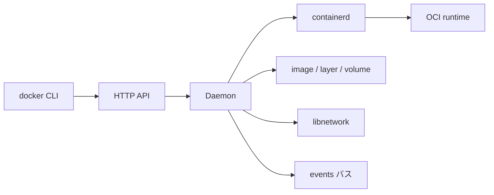

# 第1章 Docker Engine と Moby v2 の全体像

> 本章で読むソース
>
> - [`daemon/daemon.go`](https://github.com/moby/moby/blob/docker-v29.6.1/daemon/daemon.go)
> - [`cmd/dockerd/main.go`](https://github.com/moby/moby/blob/docker-v29.6.1/cmd/dockerd/main.go)
> - [`daemon/events/events.go`](https://github.com/moby/moby/blob/docker-v29.6.1/daemon/events/events.go)

## この章の狙い

本章では **Docker Engine** を、dockerd、containerd、ストレージ、ネットワーク、API がつながる一つのデーモンとして読む。
以後の章で個別に読む部品が、`Daemon` のどのフィールドと責務に対応するかを先に押さえる。

## 前提

Go の構造体、goroutine、Linux 名前空間の基本を前提にする。
コンテナは OCI ランタイム仕様に沿ったプロセス隔離単位として扱う。

## 全体の流れ



## デーモンを中心に読む

`Daemon` はコンテナストア、イメージサービス、イベント、ネットワークコントローラ、volume、containerd クライアントを束ねる。
API リクエストは最終的にこの構造体のメソッドへ落ちる。

[`daemon/daemon.go` L99-L126](https://github.com/moby/moby/blob/docker-v29.6.1/daemon/daemon.go#L99-L126)

```go
// Daemon holds information about the Docker daemon.
type Daemon struct {
	id                string
	repository        string
	containers        container.Store
	containersReplica *container.ViewDB
	execCommands      *container.ExecStore
	imageService      ImageService
	configStore       atomic.Pointer[configStore]
	configReload      sync.Mutex
	statsCollector    *stats.Collector
	defaultLogConfig  containertypes.LogConfig
	registryService   *registry.Service
	EventsService     *events.Events
	netController     *libnetwork.Controller
	volumes           *volumesservice.VolumesService
	root              string
	// ... (中略) ...
	containerdClient  *containerd.Client
	containerd        libcontainerdtypes.Client
```

`StoreHosts` はデーモンが待ち受けるアドレスを map に記録する。
シャットダウンや監査で「どのソケットが有効か」を後から参照できる。

[`daemon/daemon.go` L165-L172](https://github.com/moby/moby/blob/docker-v29.6.1/daemon/daemon.go#L165-L172)

```go
func (daemon *Daemon) StoreHosts(hosts []string) {
	if daemon.hosts == nil {
		daemon.hosts = make(map[string]bool)
	}
	for _, h := range hosts {
		daemon.hosts[h] = true
	}
}
```

## NewDaemon の入口

`NewDaemon` はレジストリサービス作成と root key limit 調整から始まる。
ここで失敗すると `daemonCLI.start` は HTTP サーバを立てる前に戻る。

[`daemon/daemon.go` L849-L858](https://github.com/moby/moby/blob/docker-v29.6.1/daemon/daemon.go#L849-L858)

```go
func NewDaemon(ctx context.Context, config *config.Config, pluginStore *plugin.Store, authzMiddleware *authorization.Middleware) (_ *Daemon, retErr error) {
	registryService, err := registry.NewService(config.ServiceOptions)
	if err != nil {
		return nil, err
	}

	if err := modifyRootKeyLimit(); err != nil {
		log.G(ctx).Warnf("unable to modify root key limit, number of containers could be limited by this quota: %v", err)
	}
```

## イベントバス

`events.Events` は直近イベントのリングと pub/sub を持つ。
`docker events` はここへ subscribe する。

[`daemon/events/events.go` L18-L29](https://github.com/moby/moby/blob/docker-v29.6.1/daemon/events/events.go#L18-L29)

```go
type Events struct {
	mu     sync.Mutex
	events []eventtypes.Message
	pub    *pubsub.Publisher
}

func New() *Events {
	return &Events{
		events: make([]eventtypes.Message, 0, eventsLimit),
		pub:    pubsub.NewPublisher(100*time.Millisecond, bufferSize),
	}
}
```

## Moby v2 エントリポイント

v29 系は `github.com/moby/moby/v2` モジュールに整理されている。
`cmd/dockerd/main.go` は `reexec.Init()` の後、`command.NewDaemonRunner` へ委譲する。

[`cmd/dockerd/main.go` L16-L38](https://github.com/moby/moby/blob/docker-v29.6.1/cmd/dockerd/main.go#L16-L38)

```go
func main() {
	if reexec.Init() {
		return
	}
	ctx := context.Background()

	signal.Ignore(syscall.SIGPIPE)

	_, stdout, stderr := term.StdStreams()

	r, err := command.NewDaemonRunner(stdout, stderr)
	if err != nil {
		_, _ = fmt.Fprintln(stderr, err)
		os.Exit(1)
	}
	if err := r.Run(ctx); err != nil {
		_, _ = fmt.Fprintln(stderr, err)
		os.Exit(1)
	}
}
```

`NewDaemonRunner` はログ形式を整え、`newDaemonCommand` で cobra コマンドを組み立てる。

[`daemon/command/docker.go` L102-L117](https://github.com/moby/moby/blob/docker-v29.6.1/daemon/command/docker.go#L102-L117)

```go
func NewDaemonRunner(stdout, stderr io.Writer) (Runner, error) {
	err := log.SetFormat(log.TextFormat)
	if err != nil {
		return nil, err
	}

	initLogging(stdout, stderr)

	cmd, err := newDaemonCommand()
	if err != nil {
		return nil, err
	}
	cmd.SetOut(stdout)
	cmd.SetErr(stderr)

	return daemonRunner{cmd}, nil
}
```

## 責務の対応表

| フィールド | 主な責務 | 後続章 |
|---|---|---|
| `containers` | 稼働中コンテナのメタデータ | 第7章 |
| `imageService` | イメージとレイヤ | 第12〜13章 |
| `netController` | ブリッジや overlay | 第15〜17章 |
| `volumes` | 名前付き volume | 第14章 |
| `containerd` | ランタイム委譲 | 第9〜11章 |
| `EventsService` | ライフサイクル通知 | 第8章 |

## 高速化・最適化の工夫

`configStore` を `atomic.Pointer` で持ち、設定リロード時に読み取り側がロックなしでスナップショットを参照できる。
ディスク使用量 API は `singleflight.Group` で重複集計を1回にまとめ、並行リクエストの I/O を抑える。

## まとめ

Moby v2 は dockerd を中心に API、ランタイム、ストレージ、ネットワークを一つの `Daemon` に集約する。

## 関連する章

- [第2章 dockerd 起動](02-dockerd-startup.md)
- [第6章 NewDaemon](../part02-core/06-new-daemon.md)
