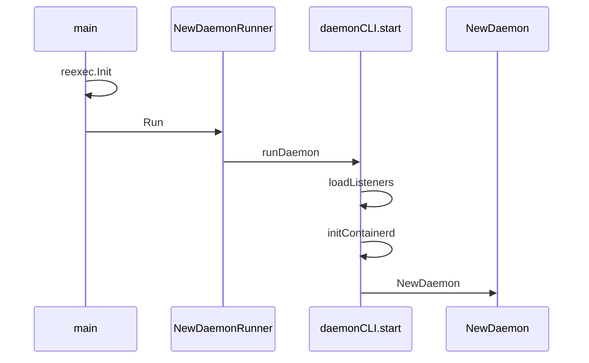

# 第2章 dockerd 起動と reexec

> 本章で読むソース
>
> - [`daemon/command/daemon.go`](https://github.com/moby/moby/blob/docker-v29.6.1/daemon/command/daemon.go)
> - [`daemon/command/docker.go`](https://github.com/moby/moby/blob/docker-v29.6.1/daemon/command/docker.go)
> - [`daemon/command/docker_unix.go`](https://github.com/moby/moby/blob/docker-v29.6.1/daemon/command/docker_unix.go)

## この章の狙い

cobra ベースの CLI から `daemonCLI.start` が走り、HTTP リスナと `NewDaemon` へ至る起動シーケンスを理解する。
`reexec` が子プロセス用エントリをどう差し替えるかも押さえる。

## 前提

[第1章](01-docker-engine-overview.md) を読んでいること。

## cobra コマンド

`newDaemonCommand` は `dockerd [OPTIONS]` を定義し、`RunE` で `runDaemon` へ進む。
`--validate` 指定時は設定検証だけ行いプロセスを終了する。

[`daemon/command/docker.go` L26-L48](https://github.com/moby/moby/blob/docker-v29.6.1/daemon/command/docker.go#L26-L48)

```go
	cmd := &cobra.Command{
		Use:           "dockerd [OPTIONS]",
		Short:         "A self-sufficient runtime for containers.",
		SilenceUsage:  true,
		SilenceErrors: true,
		Args:          NoArgs,
		RunE: func(cmd *cobra.Command, args []string) error {
			opts.flags = cmd.Flags()

			cli, err := newDaemonCLI(opts)
			if err != nil {
				return err
			}
			if opts.Validate {
				cmd.PrintErrln("configuration OK")
				return nil
			}

			return runDaemon(cmd.Context(), cli)
		},
```

Unix では `runDaemon` は `cli.start` をそのまま呼ぶ。

[`daemon/command/docker_unix.go` L12-L14](https://github.com/moby/moby/blob/docker-v29.6.1/daemon/command/docker_unix.go#L12-L14)

```go
func runDaemon(ctx context.Context, cli *daemonCLI) error {
	return cli.start(ctx)
}
```

## start の前半

`daemonCLI.start` はシステム要件、ログ、root 権限、データルート作成を順に確認する。
ここで失敗すると API サーバは起動しない。

[`daemon/command/daemon.go` L118-L161](https://github.com/moby/moby/blob/docker-v29.6.1/daemon/command/daemon.go#L118-L161)

```go
func (cli *daemonCLI) start(ctx context.Context) (retErr error) {
	if err := daemon.CheckSystem(); err != nil {
		return fmt.Errorf("system requirements not met: %w", err)
	}
	configureProxyEnv(ctx, cli.Config.Proxies)
	if err := configureDaemonLogs(ctx, cli.Config.DaemonLogConfig); err != nil {
		return fmt.Errorf("failed to configure daemon logging: %w", err)
	}

	log.G(ctx).Info("Starting up")
	// ... (中略) ...
	if runtime.GOOS == "linux" && os.Geteuid() != 0 {
		return errors.New("dockerd needs to be started with root privileges. To run dockerd in rootless mode as an unprivileged user, see https://docs.docker.com/go/rootless/")
	}

	if err := daemon.CreateDaemonRoot(cli.Config); err != nil {
		return err
	}
```

## pidfile とリスナ

pidfile を書いたあと、`loadListeners` で Unix ソケットや TCP を開く。
続けて `initContainerd` が containerd 接続を確立する。

[`daemon/command/daemon.go` L165-L209](https://github.com/moby/moby/blob/docker-v29.6.1/daemon/command/daemon.go#L165-L209)

```go
	if cli.Pidfile != "" {
		if err := pidfile.Write(cli.Pidfile, os.Getpid()); err != nil {
			return errors.Wrapf(err, "failed to start daemon, ensure docker is not running or delete %s", cli.Pidfile)
		}
		// ... (中略) ...
	}

	lss, hosts, err := loadListeners(cli.Config, cli.apiTLSConfig)
	if err != nil {
		return errors.Wrap(err, "failed to load listeners")
	}

	ctx, cancel := context.WithCancel(ctx)
	waitForContainerDShutdown, err := cli.initContainerd(ctx)
	if err != nil {
		cancel()
		return err
	}
```

## HTTP サーバと graceful shutdown

`http.Server` は `cli.stop` 待ちの goroutine から `Shutdown` される。
起動失敗時は `Close` で即座にソケットを閉じる。

[`daemon/command/daemon.go` L212-L246](https://github.com/moby/moby/blob/docker-v29.6.1/daemon/command/daemon.go#L212-L246)

```go
	httpServer := &http.Server{
		ReadHeaderTimeout: 5 * time.Minute,
	}
	apiShutdownCtx, apiShutdownCancel := context.WithCancel(context.WithoutCancel(ctx))
	apiShutdownDone := make(chan struct{})
	trap.Trap(cli.stop)
	go func() {
		<-cli.apiShutdown
		if err := httpServer.Shutdown(apiShutdownCtx); err != nil {
			log.G(ctx).WithError(err).Error("Error shutting down http server")
		}
		close(apiShutdownDone)
	}()
	defer func() {
		select {
		case <-cli.apiShutdown:
			// ... (中略) ...
			<-apiShutdownDone
		default:
			if err := httpServer.Close(); err != nil {
				log.G(ctx).WithError(err).Error("Error closing http server")
			}
		}
	}()
```

## NewDaemon 呼び出し

リスナ準備後、`daemon.NewDaemon` で本体を構築する。
認可プラグイン検証は `NewDaemon` 後に行う（コメントが順序固定を明示する）。

[`daemon/command/daemon.go` L297-L312](https://github.com/moby/moby/blob/docker-v29.6.1/daemon/command/daemon.go#L297-L312)

```go
	d, err := daemon.NewDaemon(ctx, cli.Config, pluginStore, cli.authzMiddleware)
	if err != nil {
		return errors.Wrap(err, "failed to start daemon")
	}

	d.StoreHosts(hosts)

	if err := validateAuthzPlugins(cli.Config.AuthorizationPlugins, pluginStore); err != nil {
		return errors.Wrap(err, "failed to validate authorization plugin")
	}

	cli.d = d

	if err := startMetricsServer(cli.Config.MetricsAddress); err != nil {
		return errors.Wrap(err, "failed to start metrics server")
```

## reexec

`main` 先頭の `reexec.Init()` は、containerd やランタイムが fork した子が別の Go エントリを実行するときに早期 return する。
同一バイナリで複数役割を担うための仕組みである。



## 高速化・最適化の工夫

起動時に `ExecRoot` 等を一度だけ作成し、以後のコンテナ操作は既存ディレクトリを再利用する。
HTTP `Shutdown` は進行中リクエストを最大5秒待ってから打ち切り、通常停止と異常終了で経路を分ける。

## まとめ

dockerd は薄い `main` と `daemon/command` に起動責務を分離し、`start` で前提条件を固めてから `NewDaemon` へ進む。

## 関連する章

- [第3章 cobra CLI](../part01-command/03-cobra-cli.md)
- [第6章 NewDaemon](../part02-core/06-new-daemon.md)
