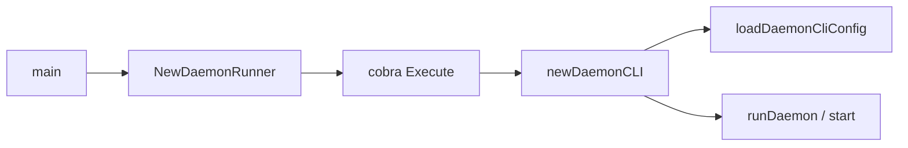

# 第3章 cobra CLI と DaemonRunner

> 本章で読むソース
>
> - [`daemon/command/docker.go`](https://github.com/moby/moby/blob/docker-v29.6.1/daemon/command/docker.go)
> - [`daemon/command/daemon.go`](https://github.com/moby/moby/blob/docker-v29.6.1/daemon/command/daemon.go)

## この章の狙い

`NewDaemonRunner` が cobra コマンドを組み立て、フラグパースから `daemonCLI` 生成までを担う流れを理解する。

## 前提

[第2章](../part00-overview/02-dockerd-startup.md)の `runDaemon` を読んでいること。

## DaemonRunner

`NewDaemonRunner` はログ形式を初期化し、`newDaemonCommand` で得た cobra コマンドに stdout/stderr を束ねる。

[`daemon/command/docker.go` L102-L117](https://github.com/moby/moby/blob/docker-v29.6.1/daemon/command/docker.go#L102-L117)

```go
func NewDaemonRunner(stdout, stderr io.Writer) (Runner, error) {
	err := log.SetFormat(log.TextFormat)
	if err != nil {
		return nil, err
	}

	initLogging(stdout, stderr)

	cmd, err := newDaemonCommand()
	if err != nil {
		return nil, err
	}
	cmd.SetOut(stdout)
	cmd.SetErr(stderr)

	return daemonRunner{cmd}, nil
}
```

`daemonRunner.Run` は `cmd.ExecuteContext(ctx)` を呼ぶだけの薄いラッパである。

## cobra コマンド定義

`SilenceUsage` と `SilenceErrors` を有効にし、起動失敗時に usage を毎回出さない。
`--validate` は `runDaemon` を呼ばずに終了する。

[`daemon/command/docker.go` L26-L48](https://github.com/moby/moby/blob/docker-v29.6.1/daemon/command/docker.go#L26-L48)

```go
	cmd := &cobra.Command{
		Use:           "dockerd [OPTIONS]",
		Short:         "A self-sufficient runtime for containers.",
		SilenceUsage:  true,
		SilenceErrors: true,
		Args:          NoArgs,
		RunE: func(cmd *cobra.Command, args []string) error {
			opts.flags = cmd.Flags()

			cli, err := newDaemonCLI(opts)
			if err != nil {
				return err
			}
			if opts.Validate {
				cmd.PrintErrln("configuration OK")
				return nil
			}

			return runDaemon(cmd.Context(), cli)
		},
```

## newDaemonCLI

設定ファイルと TLS を読み込み、`daemonCLI` を返す。
`--validate` 時はここで `CheckSystem` も走る。

[`daemon/command/daemon.go` L85-L100](https://github.com/moby/moby/blob/docker-v29.6.1/daemon/command/daemon.go#L85-L100)

```go
func newDaemonCLI(opts *daemonOptions) (*daemonCLI, error) {
	cfg, err := loadDaemonCliConfig(opts)
	if err != nil {
		return nil, err
	}

	tlsConfig, err := newAPIServerTLSConfig(cfg)
	if err != nil {
		return nil, err
	}

	if opts.Validate {
		// Verify platform-specific requirements. This is checked early so
		// that `dockerd --validate` also validates system requirements.
```

## フラグ登録

Unix では `installConfigFlags` が runtimes、storage-driver、iptables 等を cobra に載せる。

[`daemon/command/config_unix.go` L14-L28](https://github.com/moby/moby/blob/docker-v29.6.1/daemon/command/config_unix.go#L14-L28)

```go
func installConfigFlags(conf *config.Config, flags *pflag.FlagSet) {
	installCommonConfigFlags(conf, flags)

	flags.Var(opts.NewNamedRuntimeOpt("runtimes", &conf.Runtimes, config.StockRuntimeName), "add-runtime", "Register an additional OCI compatible runtime")
	flags.StringVarP(&conf.SocketGroup, "group", "G", "docker", "Group for the unix socket")
	flags.StringVarP(&conf.GraphDriver, "storage-driver", "s", "", "Storage driver to use")
	flags.BoolVar(&conf.EnableSelinuxSupport, "selinux-enabled", false, "Enable selinux support")
	flags.Var(opts.NewNamedUlimitOpt("default-ulimits", &conf.Ulimits), "default-ulimit", "Default ulimits for containers")
	flags.BoolVar(&conf.BridgeConfig.EnableIPTables, "iptables", true, "Enable addition of iptables rules")
```

## loadDaemonCliConfig

フラグ未パース時はエラーを返し、CLI フラグを `config.Config` へ写す。

[`daemon/command/daemon.go` L612-L621](https://github.com/moby/moby/blob/docker-v29.6.1/daemon/command/daemon.go#L612-L621)

```go
func loadDaemonCliConfig(opts *daemonOptions) (*config.Config, error) {
	if !opts.flags.Parsed() {
		return nil, errors.New(`cannot load CLI config before flags are parsed`)
	}
	opts.setDefaultOptions()

	conf := opts.daemonConfig
	flags := opts.flags
	conf.Debug = opts.Debug
	conf.Hosts = opts.Hosts
```



## 高速化・最適化の工夫

cobra の `SilenceUsage` で失敗パスから巨大な help 出力を除外し、systemd 再起動ループ時のログ肥大を防ぐ。
設定読み込みは `newDaemonCLI` に集約し、HTTP サーバ起動前に失敗を早期検出する。

`daemonRunner.Run` は gRPC ログ設定後に `ExecuteContext` を呼ぶ。

[`daemon/command/docker.go` L94-L98](https://github.com/moby/moby/blob/docker-v29.6.1/daemon/command/docker.go#L94-L98)

```go
func (d daemonRunner) Run(ctx context.Context) error {
	configureGRPCLog(ctx)

	return d.ExecuteContext(ctx)
}
```

## まとめ

CLI 層は薄く、設定と起動本体は `daemonOptions` と `daemonCLI` に委譲する。

## 関連する章

- [第4章 設定](04-daemon-config.md)
- [第5章 HTTP ルーター](05-http-router.md)
