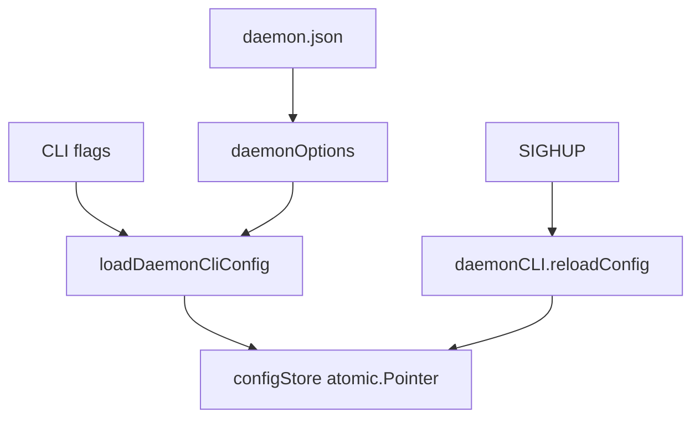

# 第4章 config.Config と設定読み込み

> 本章で読むソース
>
> - [`daemon/config/config.go`](https://github.com/moby/moby/blob/docker-v29.6.1/daemon/config/config.go)
> - [`daemon/command/daemon.go`](https://github.com/moby/moby/blob/docker-v29.6.1/daemon/command/daemon.go)

## この章の狙い

`config.New` のデフォルト値、`daemon.json` マージ、SIGHUP リロードが `Daemon` へ届く経路を理解する。

## 前提

Linux のブリッジネットワークとログドライバの概念を知っていること。

## デフォルト設定

`config.New` はシャットダウンタイムアウト、ログドライバ、同時ダウンロード数、MTU 等の既定値を構造体に書き込む。

[`daemon/config/config.go` L334-L358](https://github.com/moby/moby/blob/docker-v29.6.1/daemon/config/config.go#L334-L358)

```go
func New() (*Config, error) {
	cfg := &Config{
		CommonConfig: CommonConfig{
			ShutdownTimeout: DefaultShutdownTimeout,
			LogConfig: LogConfig{
				Type:   DefaultLogDriver,
				Config: make(map[string]string),
			},
			DaemonLogConfig: DaemonLogConfig{
				LogLevel:  "info",
				LogFormat: log.TextFormat,
			},
			MaxConcurrentDownloads: DefaultMaxConcurrentDownloads,
			MaxConcurrentUploads:   DefaultMaxConcurrentUploads,
			NetworkConfig: NetworkConfig{
				NetworkControlPlaneMTU: DefaultNetworkMtu,
				DefaultNetworkOpts:     make(map[string]map[string]string),
			},
```

## NewDaemon への取り込み

`NewDaemon` は設定検証後、`configStore` にスナップショットを格納する。
以後の読み取りは `atomic.Pointer` 経由になる。

[`daemon/daemon.go` L860-L916](https://github.com/moby/moby/blob/docker-v29.6.1/daemon/daemon.go#L860-L916)

```go
	if err := verifyDaemonSettings(config); err != nil {
		return nil, err
	}

	config.DisableBridge = isBridgeNetworkDisabled(config)

	setupResolvConf(config)
	// ... (中略) ...
	d := &Daemon{
		PluginStore: pluginStore,
		startupDone: make(chan struct{}),
	}
	cfgStore := &configStore{
		Config:   *config,
		Runtimes: rts,
	}
	d.configStore.Store(cfgStore)
```

## SIGHUP リロード

`reloadConfig` は新設定を読み、`cli.d.Reload` が成功したあと CLI 側の設定だけを適用する。
コメントは部分適用を避ける意図を明示する。

[`daemon/command/daemon.go` L525-L540](https://github.com/moby/moby/blob/docker-v29.6.1/daemon/command/daemon.go#L525-L540)

```go
func (cli *daemonCLI) reloadConfig() {
	ctx := context.TODO()
	log.G(ctx).WithField("config-file", *cli.configFile).Info("Got signal to reload configuration")
	reload := func(cfg *config.Config) {
		if err := validateAuthzPlugins(cfg.AuthorizationPlugins, cli.d.PluginStore); err != nil {
			log.G(ctx).WithError(err).Fatal("Error validating authorization plugin")
			return
		}

		if err := cli.d.Reload(cfg); err != nil {
			log.G(ctx).WithError(err).Error("Error reconfiguring the daemon")
			return
		}

		// Apply our own configuration only after the daemon reload has succeeded.
```

## CLI フラグと JSON の合成

`loadDaemonCliConfig` はパース済みフラグから `Debug` や `Hosts` を上書きする。
`--config-file` の内容は `daemonOptions` 初期化時にマージ済みである。

[`daemon/command/daemon.go` L612-L621](https://github.com/moby/moby/blob/docker-v29.6.1/daemon/command/daemon.go#L612-L621)

```go
func loadDaemonCliConfig(opts *daemonOptions) (*config.Config, error) {
	if !opts.flags.Parsed() {
		return nil, errors.New(`cannot load CLI config before flags are parsed`)
	}
	opts.setDefaultOptions()

	conf := opts.daemonConfig
	flags := opts.flags
	conf.Debug = opts.Debug
	conf.Hosts = opts.Hosts
```

## Unix 固有のブリッジ設定

`installConfigFlags` は iptables や ip-forward をデフォルト有効にする。
ルートレスやカスタムブリッジ運用ではここが最初の調整点になる。

[`daemon/command/config_unix.go` L24-L28](https://github.com/moby/moby/blob/docker-v29.6.1/daemon/command/config_unix.go#L24-L28)

```go
	flags.BoolVar(&conf.BridgeConfig.EnableIPTables, "iptables", true, "Enable addition of iptables rules")
	flags.BoolVar(&conf.BridgeConfig.EnableIP6Tables, "ip6tables", true, "Enable addition of ip6tables rules")
	flags.BoolVar(&conf.BridgeConfig.EnableIPForward, "ip-forward", true, "Enable IP forwarding in system configuration")
	flags.BoolVar(&conf.BridgeConfig.DisableFilterForwardDrop, "ip-forward-no-drop", false, "Do not set the filter-FORWARD policy to DROP when enabling IP forwarding")
	flags.BoolVar(&conf.BridgeConfig.EnableIPMasq, "ip-masq", true, "Enable IP masquerading for the default bridge network")
```



## 高速化・最適化の工夫

`MaxConcurrentDownloads` でプル処理の並列度を上限し、ディスクとレジストリへの負荷を抑える。
`configStore` の atomic スナップショットで、リロード中も読み取り側がロック待ちせず設定を参照できる。

`Reload` は新 `config.Config` を `configStore` へ反映する（daemon 本体）。

[`daemon/reload.go` L90-L99](https://github.com/moby/moby/blob/docker-v29.6.1/daemon/reload.go#L90-L99)

```go
func (daemon *Daemon) Reload(conf *config.Config) error {
	daemon.configReload.Lock()
	defer daemon.configReload.Unlock()
	copied, err := copystructure.Copy(daemon.config().Config)
	if err != nil {
		return err
	}
	newCfg := &configStore{
		Config: copied.(config.Config),
	}
```

## まとめ

実行時設定は `configStore` のスナップショットとして Daemon 全体に渡り、SIGHUP で差し替えられる。

## 関連する章

- [第3章 cobra CLI](03-cobra-cli.md)
- [第6章 NewDaemon](../part02-core/06-new-daemon.md)
