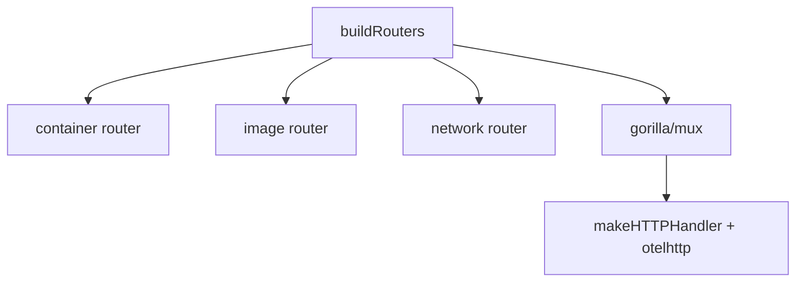

# 第5章 HTTP ルーターと API ハンドラ

> 本章で読むソース
>
> - [`daemon/server/router/router.go`](https://github.com/moby/moby/blob/docker-v29.6.1/daemon/server/router/router.go)
> - [`daemon/server/server.go`](https://github.com/moby/moby/blob/docker-v29.6.1/daemon/server/server.go)
> - [`daemon/command/daemon.go`](https://github.com/moby/moby/blob/docker-v29.6.1/daemon/command/daemon.go)

## この章の狙い

Engine API が `Router` インタフェースで束ねられ、gorilla/mux へ登録される仕組みを理解する。

## 前提

REST と Unix ソケット上の HTTP を知っていること。

## Router インタフェース

各サブシステムは `Routes()` で `Route` スライスを返し、メソッドとパスとハンドラを宣言する。

[`daemon/server/router/router.go` L5-L18](https://github.com/moby/moby/blob/docker-v29.6.1/daemon/server/router/router.go#L5-L18)

```go
type Router interface {
	Routes() []Route
}

type Route interface {
	Handler() httputils.APIFunc
	Method() string
	Path() string
}
```

## buildRouters

`daemon/command/daemon.go` の `buildRouters` は checkpoint を container より先に登録する。
DELETE ルートのマスクを避けるための順序固定である。

[`daemon/command/daemon.go` L824-L842](https://github.com/moby/moby/blob/docker-v29.6.1/daemon/command/daemon.go#L824-L842)

```go
func buildRouters(opts routerOptions) []router.Router {
	routers := []router.Router{
		checkpointrouter.NewRouter(opts.daemon),
		container.NewRouter(opts.daemon),
		image.NewRouter(
			opts.daemon.ImageService(),
			opts.daemon.RegistryService(),
		),
		systemrouter.NewRouter(opts.daemon, opts.cluster, opts.builder.buildkit, opts.daemon.Features),
		volume.NewRouter(opts.daemon.VolumesService(), opts.cluster),
		build.NewRouter(opts.builder.backend, opts.daemon),
		sessionrouter.NewRouter(opts.builder.sessionManager),
		swarmrouter.NewRouter(opts.cluster),
		pluginrouter.NewRouter(opts.daemon.PluginManager()),
		distributionrouter.NewRouter(opts.daemon.ImageBackend()),
		network.NewRouter(opts.daemon, opts.cluster),
		debugrouter.NewRouter(),
	}
```

## mux への登録

`Server.InitRouter` は各 Route を `/v1.xx` 付きと素のパスの両方へ登録する。

[`daemon/server/server.go` L126-L136](https://github.com/moby/moby/blob/docker-v29.6.1/daemon/server/server.go#L126-L136)

```go
	m := mux.NewRouter()
	for _, apiRouter := range routers {
		for _, r := range apiRouter.Routes() {
			if ctx.Err() != nil {
				return m
			}
			log.G(ctx).WithFields(log.Fields{"method": r.Method(), "path": r.Path()}).Debug("Registering route")
			f := s.makeHTTPHandler(r)
			m.Path(versionMatcher + r.Path()).Methods(r.Method()).Handler(f)
			m.Path(r.Path()).Methods(r.Method()).Handler(f)
		}
	}
```

## makeHTTPHandler

各ハンドラは OpenTelemetry の `otelhttp` でラップされ、User-Agent を context へ載せる。

[`daemon/server/server.go` L49-L64](https://github.com/moby/moby/blob/docker-v29.6.1/daemon/server/server.go#L49-L64)

```go
func (s *Server) makeHTTPHandler(route router.Route) http.HandlerFunc {
	handler := route.Handler()
	operation := route.Method() + " " + route.Path()
	return otelhttp.NewHandler(http.HandlerFunc(func(w http.ResponseWriter, r *http.Request) {
		ua := r.Header.Get("User-Agent")
		ctx := baggage.ContextWithBaggage(dockerversion.WithUpstreamUserAgent(r.Context(), ua), otelutil.MustNewBaggage(
```

## system ルーターの例

`/_ping` と `/events` は system ルーターが直接 `routes` スライスに並べる。

[`daemon/server/router/system/system.go` L24-L37](https://github.com/moby/moby/blob/docker-v29.6.1/daemon/server/router/system/system.go#L24-L37)

```go
func NewRouter(b Backend, c ClusterBackend, builder BuildBackend, features func() map[string]bool) router.Router {
	r := &systemRouter{
		backend:  b,
		cluster:  c,
		builder:  builder,
		features: features,
	}

	r.routes = []router.Route{
		router.NewOptionsRoute("/{anyroute:.*}", optionsHandler),
		router.NewGetRoute("/_ping", r.pingHandler),
		router.NewHeadRoute("/_ping", r.pingHandler),
		router.NewGetRoute("/events", r.getEvents),
```



## 高速化・最適化の工夫

認可ミドルウェアはルーター登録時に一度だけ組み立て、リクエストごとのプラグイン探索を避ける。
ルート登録は起動時に完結し、実行時は mux のルックアップだけでハンドラへ到達する。

`containerRouter` は `initRoutes` で POST/GET ルートを束ねる。

[`daemon/server/router/container/container.go` L11-L22](https://github.com/moby/moby/blob/docker-v29.6.1/daemon/server/router/container/container.go#L11-L22)

```go
func NewRouter(b Backend) router.Router {
	r := &containerRouter{
		backend: b,
	}
	r.initRoutes()
	return r
}

func (c *containerRouter) Routes() []router.Route {
	return c.routes
}
```

## まとめ

HTTP API は細かい `Route` の集合として拡張可能に保たれ、`buildRouters` の順序が DELETE の衝突を防ぐ。

## 関連する章

- [第8章 events バス](../part02-core/08-events-bus.md)
- [第18章 start/stop](../part06-runtime/18-start-stop.md)
