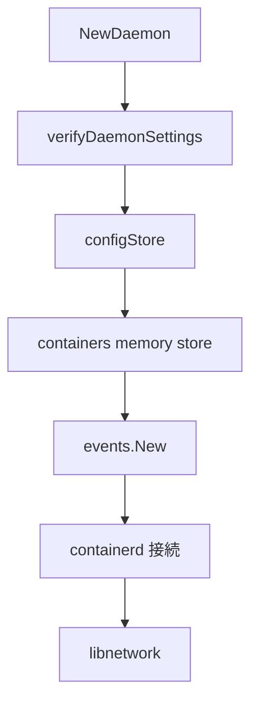

# 第6章 NewDaemon と初期化

> 本章で読むソース
>
> - [`daemon/daemon.go`](https://github.com/moby/moby/blob/docker-v29.6.1/daemon/daemon.go)
> - [`daemon/command/daemon.go`](https://github.com/moby/moby/blob/docker-v29.6.1/daemon/command/daemon.go)

## この章の狙い

`daemon.NewDaemon` がコンテナストア、イベント、containerd、ネットワーク、イメージをどう順に初期化するかを追う。

## 前提

[第4章](../part01-command/04-daemon-config.md)の `config.Config`、[第2章](../part00-overview/02-dockerd-startup.md)の `start` を理解していること。

## 呼び出し位置

`daemonCLI.start` はリスナと containerd 接続のあと `NewDaemon` を呼ぶ。
失敗時は HTTP サーバを本格稼働させない。

[`daemon/command/daemon.go` L297-L309](https://github.com/moby/moby/blob/docker-v29.6.1/daemon/command/daemon.go#L297-L309)

```go
	d, err := daemon.NewDaemon(ctx, cli.Config, pluginStore, cli.authzMiddleware)
	if err != nil {
		return errors.Wrap(err, "failed to start daemon")
	}

	d.StoreHosts(hosts)

	if err := validateAuthzPlugins(cli.Config.AuthorizationPlugins, pluginStore); err != nil {
		return errors.Wrap(err, "failed to validate authorization plugin")
	}

	cli.d = d
```

## 設定検証と tmpDir

`NewDaemon` 冒頭はレジストリ作成、root key limit、設定検証、tmpDir 正規化を行う。

[`daemon/daemon.go` L849-L898](https://github.com/moby/moby/blob/docker-v29.6.1/daemon/daemon.go#L849-L898)

```go
func NewDaemon(ctx context.Context, config *config.Config, pluginStore *plugin.Store, authzMiddleware *authorization.Middleware) (_ *Daemon, retErr error) {
	registryService, err := registry.NewService(config.ServiceOptions)
	if err != nil {
		return nil, err
	}

	if err := modifyRootKeyLimit(); err != nil {
		log.G(ctx).Warnf("unable to modify root key limit, number of containers could be limited by this quota: %v", err)
	}

	if err := verifyDaemonSettings(config); err != nil {
		return nil, err
	}
	// ... (中略) ...
	} else {
		_ = os.Setenv("TMPDIR", realTmp)
	}
```

## configStore と runtimes

`Daemon` 構造体を確保し、`configStore` に設定と runtimes を格納する。

[`daemon/daemon.go` L908-L916](https://github.com/moby/moby/blob/docker-v29.6.1/daemon/daemon.go#L908-L916)

```go
	d := &Daemon{
		PluginStore: pluginStore,
		startupDone: make(chan struct{}),
	}
	cfgStore := &configStore{
		Config:   *config,
		Runtimes: rts,
	}
	d.configStore.Store(cfgStore)
```

## インメモリストア

コンテナは `NewMemoryStore`、レプリカは `ViewDB`、exec は `ExecStore` で初期化する。
同時に `EventsService` を生成する。

[`daemon/daemon.go` L1101-L1109](https://github.com/moby/moby/blob/docker-v29.6.1/daemon/daemon.go#L1101-L1109)

```go
	d.containers = container.NewMemoryStore()
	if d.containersReplica, err = container.NewViewDB(); err != nil {
		return nil, err
	}
	d.execCommands = container.NewExecStore()
	d.statsCollector = d.newStatsCollector(1 * time.Second)

	d.EventsService = events.New()
	d.root = cfgStore.Root
	d.idMapping = idMapping
```

## image store 選択

`determineImageStoreChoice` で containerd snapshotter か従来ストアかを決める。
feature フラグ `containerd-migration` で閾値を環境変数から読める。

[`daemon/daemon.go` L918-L927](https://github.com/moby/moby/blob/docker-v29.6.1/daemon/daemon.go#L918-L927)

```go
	imgStoreChoice, err := determineImageStoreChoice(config, determineImageStoreChoiceOptions{})
	if err != nil {
		return nil, err
	}

	migrationThreshold := int64(-1)
	if config.Features["containerd-migration"] {
		if ts := os.Getenv("DOCKER_MIGRATE_SNAPSHOTTER_THRESHOLD"); ts != "" {
			v, err := units.FromHumanSize(ts)
```



## 高速化・最適化の工夫

`containersReplica` の ViewDB は読み取り多めの API へ別経路を用意し、メイン Store のロック競合を下げる。
`statsCollector` は1秒周期で集計し、過剰な per-request 集計を避ける。

`verifyDaemonSettings` は storage driver と bridge 設定の整合を確認する。

[`daemon/daemon.go` L860-L866](https://github.com/moby/moby/blob/docker-v29.6.1/daemon/daemon.go#L860-L866)

```go
	if err := verifyDaemonSettings(config); err != nil {
		return nil, err
	}

	config.DisableBridge = isBridgeNetworkDisabled(config)
```

## まとめ

`NewDaemon` は設定スナップショットと各サブシステムの生成を一括で行い、以後の API は `Daemon` メソッドへ委譲する。

## 関連する章

- [第7章 コンテナストア](07-container-store.md)
- [第9章 containerd クライアント](../part03-containerd/09-containerd-client.md)
