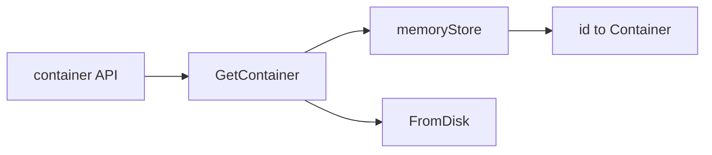

# 第7章 コンテナストア

> 本章で読むソース
>
> - [`daemon/container/store.go`](https://github.com/moby/moby/blob/docker-v29.6.1/daemon/container/store.go)
> - [`daemon/container/memory_store.go`](https://github.com/moby/moby/blob/docker-v29.6.1/daemon/container/memory_store.go)
> - [`daemon/container.go`](https://github.com/moby/moby/blob/docker-v29.6.1/daemon/container.go)

## この章の狙い

稼働中コンテナのメタデータが `container.Store` でどう保持され、API とディスク表現がどう橋渡しされるかを読む。

## 前提

[第6章](06-new-daemon.md)の `NewMemoryStore` 初期化を理解していること。

## Store インタフェース

`Store` は Add/Get/Delete/List とフィルタ走査を定義する。
実装は差し替え可能だが、本番はインメモリ実装が使われる。

[`daemon/container/store.go` L13-L27](https://github.com/moby/moby/blob/docker-v29.6.1/daemon/container/store.go#L13-L27)

```go
type Store interface {
	Add(string, *Container)
	Get(string) *Container
	Delete(string)
	List() []*Container
	Size() int
	First(StoreFilter) *Container
	ApplyAll(StoreReducer)
}
```

## memoryStore

`NewMemoryStore` は `map[string]*Container` を mutex で保護する。
`Add` は同一 ID を上書きする。

[`daemon/container/memory_store.go` L14-L26](https://github.com/moby/moby/blob/docker-v29.6.1/daemon/container/memory_store.go#L14-L26)

```go
func NewMemoryStore() Store {
	return &memoryStore{
		s: make(map[string]*Container),
	}
}

func (c *memoryStore) Add(id string, cont *Container) {
	c.Lock()
	c.s[id] = cont
	c.Unlock()
}
```

`Get` は読み取りロック相当で map 参照だけ行う。

[`daemon/container/memory_store.go` L28-L35](https://github.com/moby/moby/blob/docker-v29.6.1/daemon/container/memory_store.go#L28-L35)

```go
// Get returns a container from the store by id.
func (c *memoryStore) Get(id string) *Container {
	var res *Container
	c.RLock()
	res = c.s[id]
	c.RUnlock()
	return res
}
```

## ディスクからの復元

`loadContainer` は repository 配下の ID ディレクトリから `FromDisk` でメタデータを読む。
Store に無くてもディスクに残っていれば復元できる。

[`daemon/container.go` L75-L80](https://github.com/moby/moby/blob/docker-v29.6.1/daemon/container.go#L75-L80)

```go
	ctr := container.NewBaseContainer(id, filepath.Join(daemon.repository, id))
	if err := ctr.FromDisk(); err != nil {
		return nil, err
	}
	if ctr.ID != id {
		return ctr, fmt.Errorf("Container %s is stored at %s", ctr.ID, id)
```

## 新規コンテナ作成

`createContainer` は `NewBaseContainer` でベースを作り、Config を載せる。
Created 時刻は UTC で記録する。

[`daemon/container.go` L137-L142](https://github.com/moby/moby/blob/docker-v29.6.1/daemon/container.go#L137-L142)

```go
	base := container.NewBaseContainer(id, filepath.Join(daemon.repository, id))
	base.Created = time.Now().UTC()
	base.Managed = managed
	base.Path = entrypoint
	base.Args = args
	base.Config = config
```

## ViewDB との関係

`GetContainer` は `containersReplica` と `containers` の不整合を debug ログに残す。
レプリカは読み取り専用ビューとして別経路の参照に使われる。

[`daemon/container.go` L61-L66](https://github.com/moby/moby/blob/docker-v29.6.1/daemon/container.go#L61-L66)

```go
		log.G(context.TODO()).WithField("prefixOrName", prefixOrName).
			WithField("id", containerID).
			Debugf("daemon.GetContainer: container is known to daemon.containersReplica but not daemon.containers")
```



## 高速化・最適化の工夫

インメモリ map 参照は mutex で短時間だけロックし、一覧 API の `List` はスナップショットコピーで走査する。
ディスク復元は Store ミス時のフォールバックに限定し、通常パスはメモリ参照だけで済ませる。

`ApplyAll` は Store 内全コンテナへ reducer を適用する。

[`daemon/container/memory_store.go` L72-L79](https://github.com/moby/moby/blob/docker-v29.6.1/daemon/container/memory_store.go#L72-L79)

```go
func (c *memoryStore) ApplyAll(apply StoreReducer) {
	wg := new(sync.WaitGroup)
	for _, cont := range c.all() {
		wg.Add(1)
		go func(container *Container) {
			apply(container)
			wg.Done()
		}(cont)
	}
```

## まとめ

コンテナストアは API の真実のソースであり、repository ディレクトリは再起動後の復元用バックアップとして機能する。

## 関連する章

- [第10章 コンテナ作成](../part03-containerd/10-container-create.md)
- [第18章 start/stop](../part06-runtime/18-start-stop.md)
