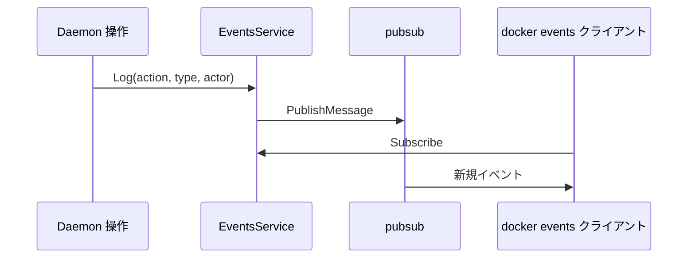

# 第8章 events バス

> 本章で読むソース
>
> - [`daemon/events/events.go`](https://github.com/moby/moby/blob/docker-v29.6.1/daemon/events/events.go)
> - [`daemon/server/router/system/system.go`](https://github.com/moby/moby/blob/docker-v29.6.1/daemon/server/router/system/system.go)

## この章の狙い

コンテナやイメージのライフサイクルイベントがどう記録され、`GET /events` 購読者へ配信されるかを読む。

## 前提

[第6章](06-new-daemon.md)の `EventsService` 初期化を理解していること。

## Events 構造

`Events` は直近メッセージのスライスと pub/sub を持つ。
`New` はバッファ付き Publisher を100ms 間隔でフラッシュする。

[`daemon/events/events.go` L18-L29](https://github.com/moby/moby/blob/docker-v29.6.1/daemon/events/events.go#L18-L29)

```go
type Events struct {
	mu     sync.Mutex
	events []eventtypes.Message
	pub    *pubsub.Publisher
}

func New() *Events {
	return &Events{
		events: make([]eventtypes.Message, 0, eventsLimit),
		pub:    pubsub.NewPublisher(100*time.Millisecond, bufferSize),
	}
}
```

## Subscribe

購読者は直近256件の履歴、新規イベント用 channel、停止関数の3つを受け取る。

[`daemon/events/events.go` L36-L41](https://github.com/moby/moby/blob/docker-v29.6.1/daemon/events/events.go#L36-L41)

```go
func (e *Events) Subscribe() ([]eventtypes.Message, chan any, func()) {
	metrics.EventSubscribers.Inc()
	e.mu.Lock()
	current := make([]eventtypes.Message, len(e.events))
	copy(current, e.events)
	l := e.pub.Subscribe()
```

## Log

デーモン内部は `Log` で action/type/actor を渡し、UTC タイムスタンプ付きメッセージを発行する。

[`daemon/events/events.go` L83-L92](https://github.com/moby/moby/blob/docker-v29.6.1/daemon/events/events.go#L83-L92)

```go
func (e *Events) Log(action eventtypes.Action, eventType eventtypes.Type, actor eventtypes.Actor) {
	now := time.Now().UTC()
	e.PublishMessage(eventtypes.Message{
		Action:   action,
		Type:     eventType,
		Actor:    actor,
		Scope:    "local",
		Time:     now.Unix(),
		TimeNano: now.UnixNano(),
	})
}
```

## HTTP エンドポイント

system ルーターは `GET /events` を `getEvents` に結び付ける。

[`daemon/server/router/system/system.go` L33-L37](https://github.com/moby/moby/blob/docker-v29.6.1/daemon/server/router/system/system.go#L33-L37)

```go
	r.routes = []router.Route{
		router.NewOptionsRoute("/{anyroute:.*}", optionsHandler),
		router.NewGetRoute("/_ping", r.pingHandler),
		router.NewHeadRoute("/_ping", r.pingHandler),
		router.NewGetRoute("/events", r.getEvents),
```

## NewDaemon での生成

`NewDaemon` はストア初期化と同時に `events.New()` を呼ぶ。

[`daemon/daemon.go` L1108-L1109](https://github.com/moby/moby/blob/docker-v29.6.1/daemon/daemon.go#L1108-L1109)

```go
	d.EventsService = events.New()
	d.root = cfgStore.Root
```



## 高速化・最適化の工夫

Publisher の100ms バッチで細かいイベント連打をまとめ、購読者への wake-up 回数を抑える。
リングバッファは件数上限付きで古いイベントを捨て、長時間購読でもメモリが線形増加しない。

購読解除時は `metrics.EventSubscribers` を増減し、同時接続数を観測できる。

[`daemon/events/events.go` L36-L37](https://github.com/moby/moby/blob/docker-v29.6.1/daemon/events/events.go#L36-L37)

```go
func (e *Events) Subscribe() ([]eventtypes.Message, chan any, func()) {
	metrics.EventSubscribers.Inc()
```

## まとめ

events バスはデーモン内の状態変化を一箇所に集約し、CLI と外部ツールが同じストリームを購読できる。

## PublishMessage

`PublishMessage` はリングバッファが満杯なら最古イベントを捨ててから追記する。

[`daemon/events/events.go` L97-L107](https://github.com/moby/moby/blob/docker-v29.6.1/daemon/events/events.go#L97-L107)

```go
func (e *Events) PublishMessage(jm eventtypes.Message) {
	metrics.EventsCounter.Inc()

	e.mu.Lock()
	if len(e.events) == cap(e.events) {
		copy(e.events, e.events[1:])
		e.events[len(e.events)-1] = jm
	} else {
		e.events = append(e.events, jm)
	}
```

## 関連する章

- [第5章 HTTP ルーター](../part01-command/05-http-router.md)
- [第18章 start/stop](../part06-runtime/18-start-stop.md)
