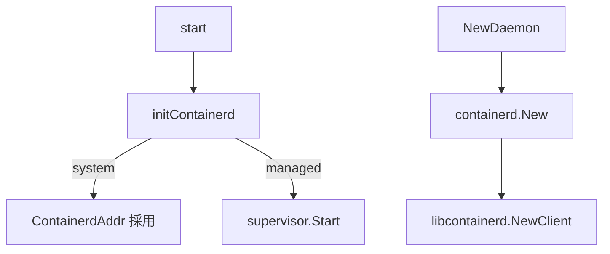

# 第9章 containerd クライアント初期化

> 本章で読むソース
>
> - [`daemon/command/daemon.go`](https://github.com/moby/moby/blob/docker-v29.6.1/daemon/command/daemon.go)
> - [`daemon/command/daemon_unix.go`](https://github.com/moby/moby/blob/docker-v29.6.1/daemon/command/daemon_unix.go)
> - [`daemon/daemon.go`](https://github.com/moby/moby/blob/docker-v29.6.1/daemon/daemon.go)

## この章の狙い

システム containerd を検出するか、管理下の containerd を起動する分岐と、`Daemon` 側 gRPC 接続を理解する。

## 前提

containerd のソケットアドレスと namespace の概念を知っていること。

## initContainerd 分岐

Unix では `ContainerdAddr` が既に設定されていれば外部 containerd をそのまま使う。
空なら `initializeContainerd` で子プロセス起動へ進む。

[`daemon/command/daemon_unix.go` L119-L126](https://github.com/moby/moby/blob/docker-v29.6.1/daemon/command/daemon_unix.go#L119-L126)

```go
func (cli *daemonCLI) initContainerd(ctx context.Context) (func(time.Duration) error, error) {
	if cli.Config.ContainerdAddr != "" {
		return nil, nil
	}

	return cli.initializeContainerd(ctx)
}
```

## initializeContainerd

`systemContainerdRunning` が真なら検出アドレスを採用する。
偽なら `supervisor.Start` で管理 containerd を起動する。

[`daemon/command/daemon.go` L1145-L1169](https://github.com/moby/moby/blob/docker-v29.6.1/daemon/command/daemon.go#L1145-L1169)

```go
func (cli *daemonCLI) initializeContainerd(ctx context.Context) (func(time.Duration) error, error) {
	systemContainerdAddr, ok, err := systemContainerdRunning(honorXDG)
	if err != nil {
		return nil, errors.Wrap(err, "could not determine whether the system containerd is running")
	}
	if ok {
		cli.Config.ContainerdAddr = systemContainerdAddr
		return nil, nil
	}

	log.G(ctx).Info("containerd not running, starting managed containerd")
	opts, err := getContainerdDaemonOpts(cli.Config)
	// ... (中略) ...
	r, err := supervisor.Start(ctx, filepath.Join(cli.Config.Root, "containerd"), filepath.Join(cli.Config.ExecRoot, "containerd"), opts...)
	cli.Config.ContainerdAddr = r.Address()

	return r.WaitTimeout, nil
}
```

`start` は `initContainerd` を HTTP サーバ起動前に呼び、終了時の `WaitTimeout` を defer する。

[`daemon/command/daemon.go` L201-L209](https://github.com/moby/moby/blob/docker-v29.6.1/daemon/command/daemon.go#L201-L209)

```go
	ctx, cancel := context.WithCancel(ctx)
	waitForContainerDShutdown, err := cli.initContainerd(ctx)
	if waitForContainerDShutdown != nil {
		defer waitForContainerDShutdown(10 * time.Second)
	}
	if err != nil {
		cancel()
		return err
	}
```

## containerd.New

`NewDaemon` は解決済みアドレスへ gRPC ダイヤルし、デフォルト namespace を設定する。

[`daemon/daemon.go` L1019-L1027](https://github.com/moby/moby/blob/docker-v29.6.1/daemon/daemon.go#L1019-L1027)

```go
		d.containerdClient, err = containerd.New(
			cfgStore.ContainerdAddr,
			containerd.WithDefaultNamespace(cfgStore.ContainerdNamespace),
			containerd.WithExtraDialOpts(gopts),
			containerd.WithTimeout(connTimeout),
		)
		if err != nil {
			return nil, errors.Wrapf(err, "failed to dial %q", cfgStore.ContainerdAddr)
		}
```

プラグイン用には別 namespace で第2クライアントを開く。

[`daemon/daemon.go` L1034-L1042](https://github.com/moby/moby/blob/docker-v29.6.1/daemon/daemon.go#L1034-L1042)

```go
			pluginCli, err = containerd.New(
				cfgStore.ContainerdAddr,
				containerd.WithDefaultNamespace(cfgStore.ContainerdPluginNamespace),
				containerd.WithExtraDialOpts(gopts),
				containerd.WithTimeout(connTimeout),
			)
			if err != nil {
				return nil, errors.Wrapf(err, "failed to dial %q", cfgStore.ContainerdAddr)
			}
```

## libcontainerd ラッパ

低レベル client を `libcontainerd.NewClient` で包み、イベントと shim 管理を dockerd 向け API にする。

[`daemon/daemon.go` L1347-L1350](https://github.com/moby/moby/blob/docker-v29.6.1/daemon/daemon.go#L1347-L1350)

```go
	d.containerd, err = libcontainerd.NewClient(ctx, d.containerdClient, filepath.Join(config.ExecRoot, "containerd"), config.ContainerdNamespace, d)
	if err != nil {
		return nil, err
	}
```



## 高速化・最適化の工夫

外部 containerd を再利用し、二重起動と余分なスーパーバイザコストを避ける。
gRPC 接続は起動時に1回だけ張り、コンテナ操作は既存 client を共有する。

`initContainerd` は `ContainerdAddr` が空のときだけ管理 containerd を起動する設計である。

[`daemon/command/daemon_unix.go` L119-L125](https://github.com/moby/moby/blob/docker-v29.6.1/daemon/command/daemon_unix.go#L119-L125)

```go
func (cli *daemonCLI) initContainerd(ctx context.Context) (func(time.Duration) error, error) {
	if cli.Config.ContainerdAddr != "" {
		return nil, nil
	}

	return cli.initializeContainerd(ctx)
}
```

## まとめ

containerd は dockerd の下位ランタイム層であり、アドレス解決が起動の分岐点になる。

## 関連する章

- [第10章 コンテナ作成](10-container-create.md)
- [第18章 start/stop](../part06-runtime/18-start-stop.md)
