# 第10章 コンテナ作成パイプライン

> 本章で読むソース
>
> - [`daemon/create.go`](https://github.com/moby/moby/blob/docker-v29.6.1/daemon/create.go)
> - [`daemon/container.go`](https://github.com/moby/moby/blob/docker-v29.6.1/daemon/container.go)

## この章の狙い

API の `ContainerCreate` から `containerCreate`、ディスク上の `create` までの流れを追う。

## 前提

イメージ ID と `HostConfig` の関係を知っていること。

## 公開 API

`ContainerCreate` は `containerCreate` に設定スナップショットを渡す薄いラッパである。

[`daemon/create.go` L52-L56](https://github.com/moby/moby/blob/docker-v29.6.1/daemon/create.go#L52-L56)

```go
func (daemon *Daemon) ContainerCreate(ctx context.Context, params backend.ContainerCreateConfig) (containertypes.CreateResponse, error) {
	return daemon.containerCreate(ctx, daemon.config(), createOpts{
		params: params,
	})
}
```

ビルダー経路は `ArgsEscaped` を無視する別エントリを持つ。

[`daemon/create.go` L60-L64](https://github.com/moby/moby/blob/docker-v29.6.1/daemon/create.go#L60-L64)

```go
func (daemon *Daemon) ContainerCreateIgnoreImagesArgsEscaped(ctx context.Context, params backend.ContainerCreateConfig) (containertypes.CreateResponse, error) {
	return daemon.containerCreate(ctx, daemon.config(), createOpts{
		params:                  params,
		ignoreImagesArgsEscaped: true,
	})
}
```

## containerCreate の検証

OpenTelemetry スパンを張り、設定検証とネットワーク検証を行ってから `daemon.create` へ進む。

[`daemon/create.go` L67-L94](https://github.com/moby/moby/blob/docker-v29.6.1/daemon/create.go#L67-L94)

```go
func (daemon *Daemon) containerCreate(ctx context.Context, daemonCfg *configStore, opts createOpts) (_ containertypes.CreateResponse, retErr error) {
	ctx, span := otel.Tracer("").Start(ctx, "daemon.containerCreate", trace.WithAttributes(
		labelsAsOTelAttributes(opts.params.Config.Labels)...,
	))
	// ... (中略) ...
	if opts.params.Config == nil {
		return containertypes.CreateResponse{}, errdefs.InvalidParameter(errors.New("config cannot be empty in order to create a container"))
	}
	// ... (中略) ...
	warnings, err := daemon.verifyContainerSettings(daemonCfg, opts.params.HostConfig, opts.params.Config, false)
	if err != nil {
		return containertypes.CreateResponse{Warnings: warnings}, errdefs.InvalidParameter(err)
	}
```

プラットフォーム不一致は warning として返し、作成自体は続行できる。

[`daemon/create.go` L96-L112](https://github.com/moby/moby/blob/docker-v29.6.1/daemon/create.go#L96-L112)

```go
	if opts.params.Platform == nil && opts.params.Config.Image != "" {
		img, err := daemon.imageService.GetImage(ctx, opts.params.Config.Image, imagebackend.GetImageOpts{})
		// ... (中略) ...
			if !images.OnlyPlatformWithFallback(p).Match(imgPlat) {
				warnings = append(warnings, fmt.Sprintf("The requested image's platform (%s) does not match the detected host platform (%s) and no specific platform was requested", platforms.FormatAll(imgPlat), platforms.FormatAll(p)))
			}
		}
	}
```

## create 完了

`daemon.create` 成功後、メトリクスを更新して ID を返す。
containerd の `NewTask` は start 経路で実行される。

[`daemon/create.go` L132-L142](https://github.com/moby/moby/blob/docker-v29.6.1/daemon/create.go#L132-L142)

```go
	ctr, err := daemon.create(ctx, &daemonCfg.Config, opts)
	if err != nil {
		return containertypes.CreateResponse{Warnings: warnings}, err
	}
	metrics.ContainerActions.WithValues("create").UpdateSince(start)

	if warnings == nil {
		warnings = make([]string, 0)
	}

	return containertypes.CreateResponse{ID: ctr.ID, Warnings: warnings}, nil
```

## ベースコンテナ

`createContainer` は repository 配下に `NewBaseContainer` を作り Config を載せる。

[`daemon/container.go` L137-L142](https://github.com/moby/moby/blob/docker-v29.6.1/daemon/container.go#L137-L142)

```go
	base := container.NewBaseContainer(id, filepath.Join(daemon.repository, id))
	base.Created = time.Now().UTC()
	base.Managed = managed
	base.Path = entrypoint
	base.Args = args
	base.Config = config
```



```mermaid
flowchart LR
  API[POST /containers/create] --> CC[containerCreate]
  CC --> VERIFY[verifyContainerSettings]
  VERIFY --> CREATE[daemon.create]
  CREATE --> NEW[newContainer]
  NEW --> SEC[setSecurityOptions]
  SEC --> MNT[registerMountPoints]
  MNT --> LAYER[imageService.CreateLayer]
  LAYER --> REG[register]
  REG --> EVT[ActionCreate event]
```

## daemon.create の本体

`daemon.create` は `newContainer` から始まり、失敗時は `cleanupContainer` で巻き戻す。

[`daemon/create.go` L170-L227](https://github.com/moby/moby/blob/docker-v29.6.1/daemon/create.go#L170-L227)

```go
func (daemon *Daemon) create(ctx context.Context, daemonCfg *config.Config, opts createOpts) (retC *container.Container, retErr error) {
	var (
		ctr         *container.Container
		img         *image.Image
		imgManifest *ocispec.Descriptor
		imgID       image.ID
		err         error
		platform    = platforms.DefaultSpec()
	)
	// ... (中略) ...
	if ctr, err = daemon.newContainer(opts.params.Name, platform, opts.params.Config, opts.params.HostConfig, imgID, opts.managed); err != nil {
		return nil, err
	}
	defer func() {
		if retErr != nil {
			err = daemon.cleanupContainer(ctr, backend.ContainerRmConfig{
				ForceRemove:  true,
				RemoveVolume: true,
			})
			// ... (中略) ...
		}
	}()

	if err := daemon.setSecurityOptions(daemonCfg, ctr); err != nil {
		return nil, err
	}
```

RW レイヤ作成と register が続き、create イベントを記録して返す。

[`daemon/create.go` L257-L286](https://github.com/moby/moby/blob/docker-v29.6.1/daemon/create.go#L257-L286)

```go
	if err := daemon.registerMountPoints(ctr, opts.params.DefaultReadOnlyNonRecursive); err != nil {
		return nil, err
	}

	// Set RWLayer for container after mount labels have been set
	rwLayer, err := daemon.imageService.CreateLayer(ctr, setupInitLayer(daemon.idMapping.RootPair()))
	if err != nil {
		return nil, errdefs.System(err)
	}
	ctr.RWLayer = rwLayer
	// ... (中略) ...
	if err := daemon.register(ctx, ctr); err != nil {
		return nil, err
	}
	metrics.StateCtr.Set(ctr.ID, "stopped")
	daemon.LogContainerEvent(ctr, events.ActionCreate)
	return ctr, nil
}
```

## 高速化・最適化の工夫

OpenTelemetry スパンで作成フェーズを分割し、遅延のボトルネックを計測可能にする。
作成と起動を分離し、未起動コンテナのメタデータだけを先に確定できる。

`adaptContainerSettings` は daemon 既定の ulimit 等を HostConfig へ写す。

[`daemon/create.go` L123-L126](https://github.com/moby/moby/blob/docker-v29.6.1/daemon/create.go#L123-L126)

```go
	err = daemon.adaptContainerSettings(&daemonCfg.Config, opts.params.HostConfig)
	if err != nil {
		return containertypes.CreateResponse{Warnings: warnings}, errdefs.InvalidParameter(err)
	}
```

## まとめ

作成はメタデータと rootfs 準備まで、実行タスク作成は start に分離される。
リポジトリ配下の ID ディレクトリは create 完了時点でディスクへ書き出される。

## 関連する章

- [第7章 コンテナストア](../part02-core/07-container-store.md)
- [第18章 start/stop](../part06-runtime/18-start-stop.md)
