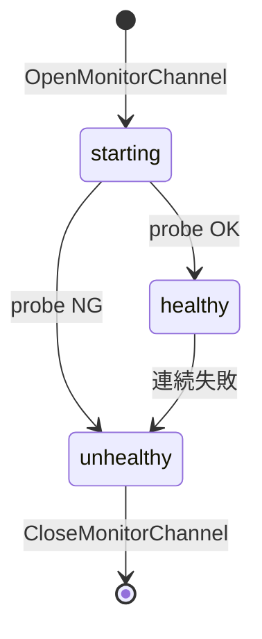

# 第11章 実行監視と health

> 本章で読むソース
>
> - [`daemon/container/health.go`](https://github.com/moby/moby/blob/docker-v29.6.1/daemon/container/health.go)
> - [`daemon/health.go`](https://github.com/moby/moby/blob/docker-v29.6.1/daemon/health.go)
> - [`daemon/start.go`](https://github.com/moby/moby/blob/docker-v29.6.1/daemon/start.go)

## この章の狙い

コンテナのヘルスチェック状態と、起動後の監視ゴルーチン停止経路を理解する。

## 前提

Dockerfile の `HEALTHCHECK` と `docker inspect` の Health フィールドを知っていること。

## Health 構造体

`Health` は API 型を埋め込み、`stop` チャネルで監視ループを終了させる。

[`daemon/container/health.go` L11-L16](https://github.com/moby/moby/blob/docker-v29.6.1/daemon/container/health.go#L11-L16)

```go
type Health struct {
	container.Health
	stop chan struct{} // Write struct{} to stop the monitor
	mu   sync.Mutex
}
```

## 状態の読み書き

`Status` はロック下で現在値を返す。
未初期化時は互換のため `Unhealthy` を返す。

[`daemon/container/health.go` L30-L43](https://github.com/moby/moby/blob/docker-v29.6.1/daemon/container/health.go#L30-L43)

```go
func (s *Health) Status() container.HealthStatus {
	s.mu.Lock()
	defer s.mu.Unlock()

	if s.Health.Status == "" {
		return container.Unhealthy
	}

	return s.Health.Status
}
```

`SetStatus` も同じ mutex で API 型へ書き込む。

[`daemon/container/health.go` L49-L54](https://github.com/moby/moby/blob/docker-v29.6.1/daemon/container/health.go#L49-L54)

```go
func (s *Health) SetStatus(healthStatus container.HealthStatus) {
	s.mu.Lock()
	defer s.mu.Unlock()

	s.Health.Status = healthStatus
}
```

## 監視チャネル

`OpenMonitorChannel` は初回だけ `stop` チャネルを作る。
二重起動は nil を返して防ぐ。

[`daemon/container/health.go` L56-L67](https://github.com/moby/moby/blob/docker-v29.6.1/daemon/container/health.go#L56-L67)

```go
func (s *Health) OpenMonitorChannel() chan struct{} {
	s.mu.Lock()
	defer s.mu.Unlock()

	if s.stop == nil {
		log.G(context.TODO()).Debug("OpenMonitorChannel")
		s.stop = make(chan struct{})
		return s.stop
	}
	return nil
}
```

`CloseMonitorChannel` は `close(stop)` し、互換のため `Unhealthy` に落とす。

[`daemon/container/health.go` L70-L82](https://github.com/moby/moby/blob/docker-v29.6.1/daemon/container/health.go#L70-L82)

```go
func (s *Health) CloseMonitorChannel() {
	s.mu.Lock()
	defer s.mu.Unlock()

	if s.stop != nil {
		log.G(context.TODO()).Debug("CloseMonitorChannel: waiting for probe to stop")
		close(s.stop)
		s.stop = nil
		s.Health.Status = container.Unhealthy
		log.G(context.TODO()).Debug("CloseMonitorChannel done")
	}
}
```

## 起動との関係

`containerStart` はコンテナ mutex を取り、既に Running なら再起動ステップをスキップする。
ヘルスプローブは別 goroutine が `stop` を待つ。

[`daemon/start.go` L76-L91](https://github.com/moby/moby/blob/docker-v29.6.1/daemon/start.go#L76-L91)

```go
func (daemon *Daemon) containerStart(ctx context.Context, daemonCfg *configStore, container *container.Container, checkpoint string, checkpointDir string, resetRestartManager bool) (retErr error) {
	ctx, span := otel.Tracer("").Start(ctx, "daemon.containerStart", trace.WithAttributes(append(
		labelsAsOTelAttributes(container.Config.Labels),
		attribute.String("container.ID", container.ID),
		attribute.String("container.Name", container.Name),
	)...))
	// ... (中略) ...
	container.Lock()
	defer container.Unlock()

	if resetRestartManager && container.State.Running {
```



## 高速化・最適化の工夫

`stop` チャネルは close だけで監視を打ち切り、コンテナ削除時のゴルーチンリークを防ぐ。
Health 状態はコンテナオブジェクト内 mutex で守り、inspect とプローブが競合しない。

`String` は Starting 状態を人間向け文言へ変換する。

[`daemon/container/health.go` L18-L27](https://github.com/moby/moby/blob/docker-v29.6.1/daemon/container/health.go#L18-L27)

```go
func (s *Health) String() string {
	status := s.Status()

	switch status {
	case container.Starting:
		return "health: starting"
	default:
		return string(status)
	}
}
```

## まとめ

ランタイム監視はコンテナオブジェクトに閉じ、Daemon は状態を API とイベントで公開する。

## 関連する章

- [第8章 events](../part02-core/08-events-bus.md)
- [第18章 start/stop](../part06-runtime/18-start-stop.md)
