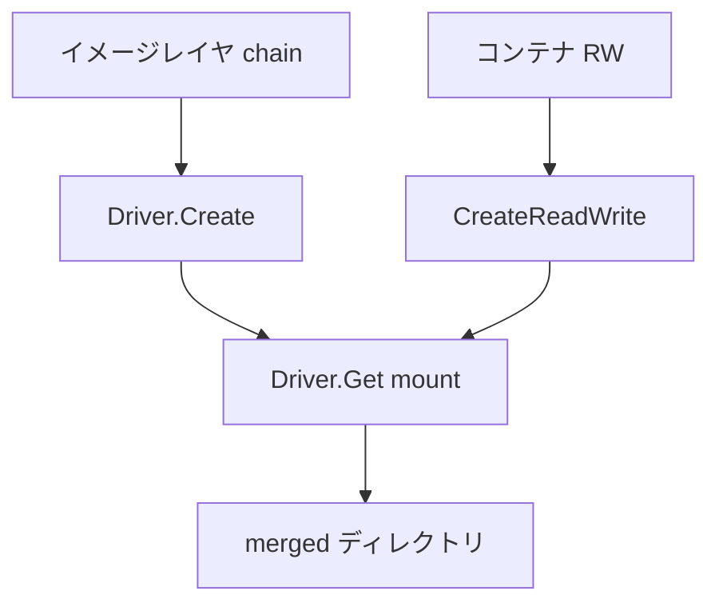

# 第12章 overlay2 グラフドライバ

> 本章で読むソース
>
> - [`daemon/graphdriver/overlay2/overlay.go`](https://github.com/moby/moby/blob/docker-v29.6.1/daemon/graphdriver/overlay2/overlay.go)

## この章の狙い

イメージレイヤとコンテナ RW レイヤが overlay2 でどうディレクトリ化され、マウントされるかを読む。

## 前提

Linux overlayfs と graphdriver インタフェースを知っていること。

## ドライバ登録

`init` で `graphdriver.Register` し、ストレージドライバ名 `overlay2` を登録する。

[`daemon/graphdriver/overlay2/overlay.go` L94-L104](https://github.com/moby/moby/blob/docker-v29.6.1/daemon/graphdriver/overlay2/overlay.go#L94-L104)

```go
type Driver struct {
	home          string
	idMap         user.IdentityMapping
	ctr           *mountref.Counter
	quotaCtl      *quota.Control
	options       overlayOptions
	naiveDiff     graphdriver.DiffDriver
	supportsDType bool
	usingMetacopy bool
	locker        *locker.Locker
}
```

[`daemon/graphdriver/overlay2/overlay.go` L118-L130](https://github.com/moby/moby/blob/docker-v29.6.1/daemon/graphdriver/overlay2/overlay.go#L118-L130)

```go
func init() {
	graphdriver.Register(driverName, Init)
}

func Init(home string, options []string, idMap user.IdentityMapping) (graphdriver.Driver, error) {
	opts, err := parseOptions(options)
	if err != nil {
		return nil, err
	}
```

## レイヤ作成

`Create` は読み取り専用レイヤを作り、`CreateReadWrite` はサイズ quota 付き RW レイヤを作る。

[`daemon/graphdriver/overlay2/overlay.go` L337-L344](https://github.com/moby/moby/blob/docker-v29.6.1/daemon/graphdriver/overlay2/overlay.go#L337-L344)

```go
func (d *Driver) Create(id, parent string, opts *graphdriver.CreateOpts) (retErr error) {
	if opts != nil && len(opts.StorageOpt) != 0 {
		if _, ok := opts.StorageOpt["size"]; ok {
			return errors.New("--storage-opt size is only supported for ReadWrite Layers")
		}
	}
	return d.create(id, parent, opts)
}
```

## Get とマウント

`Get` はレイヤ ID ごとに locker を取り、lower/upper/merged パスを組み立ててマウントする。

[`daemon/graphdriver/overlay2/overlay.go` L510-L520](https://github.com/moby/moby/blob/docker-v29.6.1/daemon/graphdriver/overlay2/overlay.go#L510-L520)

```go
func (d *Driver) Get(id, mountLabel string) (_ string, retErr error) {
	d.locker.Lock(id)
	defer d.locker.Unlock(id)
	dir := d.dir(id)
	if _, err := os.Stat(dir); err != nil {
		return "", err
	}

	diffDir := path.Join(dir, diffDirName)
	lowers, err := os.ReadFile(path.Join(dir, lowerFile))
```

メタデータ API 向けに WorkDir、MergedDir、UpperDir を返す。

[`daemon/graphdriver/overlay2/overlay.go` L282-L291](https://github.com/moby/moby/blob/docker-v29.6.1/daemon/graphdriver/overlay2/overlay.go#L282-L291)

```go
func (d *Driver) GetMetadata(id string) (map[string]string, error) {
	dir := d.dir(id)
	if _, err := os.Stat(dir); err != nil {
		return nil, err
	}

	metadata := map[string]string{
		"WorkDir":   path.Join(dir, workDirName),
		"MergedDir": path.Join(dir, mergedDirName),
		"UpperDir":  path.Join(dir, diffDirName),
	}
```



## 高速化・最適化の工夫

レイヤ ID 単位の locker で同一レイヤへの並行 Get を直列化し、マウント競合を防ぐ。
既存 `overlay2` ディレクトリで feature detection し、不適合 FS では早期に `ErrIncompatibleFS` を返す。

`create` は親レイヤ ID を lower ファイルへ記録する（overlay2 内部）。

[`daemon/graphdriver/overlay2/overlay.go` L346-L347](https://github.com/moby/moby/blob/docker-v29.6.1/daemon/graphdriver/overlay2/overlay.go#L346-L347)

```go
func (d *Driver) create(id, parent string, opts *graphdriver.CreateOpts) (retErr error) {
	dir := d.dir(id)
```

[`daemon/graphdriver/overlay2/overlay.go` L118-L120](https://github.com/moby/moby/blob/docker-v29.6.1/daemon/graphdriver/overlay2/overlay.go#L118-L120)

```go
func init() {
	graphdriver.Register(driverName, Init)
}
```

## Get の参照カウント

[`daemon/graphdriver/overlay2/overlay.go` L510-L530](https://github.com/moby/moby/blob/docker-v29.6.1/daemon/graphdriver/overlay2/overlay.go#L510-L530)

```go
func (d *Driver) Get(id, mountLabel string) (_ string, retErr error) {
	d.locker.Lock(id)
	defer d.locker.Unlock(id)
	dir := d.dir(id)
	if _, err := os.Stat(dir); err != nil {
		return "", err
	}

	diffDir := path.Join(dir, diffDirName)
	lowers, err := os.ReadFile(path.Join(dir, lowerFile))
	if err != nil {
		// If no lower, just return diff directory
		if os.IsNotExist(err) {
			return diffDir, nil
		}
		return "", err
	}

	mergedDir := path.Join(dir, mergedDirName)
	if count := d.ctr.Increment(mergedDir); count > 1 {
		return mergedDir, nil
```

## まとめ

overlay2 は Docker の既定ストレージドライバであり、イメージとコンテナ RW を overlay マウントで重ねる。

## 関連する章

- [第13章 イメージレイヤ](13-image-layer.md)
- [第10章 コンテナ作成](../part03-containerd/10-container-create.md)
