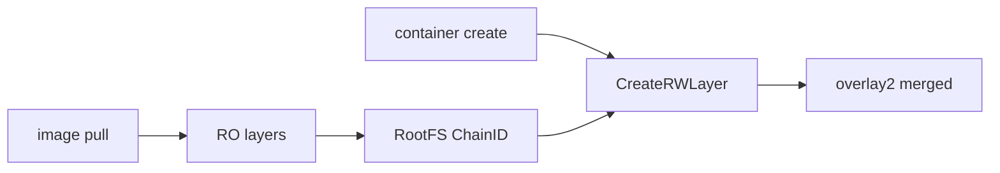

# 第13章 イメージレイヤと RW レイヤ

> 本章で読むソース
>
> - [`daemon/images/service.go`](https://github.com/moby/moby/blob/docker-v29.6.1/daemon/images/service.go)
> - [`daemon/graphdriver/overlay2/overlay.go`](https://github.com/moby/moby/blob/docker-v29.6.1/daemon/graphdriver/overlay2/overlay.go)

## この章の狙い

イメージの `RootFS` チェーンからコンテナ用 RW レイヤがどう切り出されるかを追う。

## 前提

[第12章](12-overlay2-graphdriver.md)の graphdriver を理解していること。

## CreateLayer

`ImageService.CreateLayer` はコンテナの `ImageID` からイメージを引き、RW レイヤオプションを組み立てる。

[`daemon/images/service.go` L126-L136](https://github.com/moby/moby/blob/docker-v29.6.1/daemon/images/service.go#L126-L136)

```go
func (i *ImageService) CreateLayer(container *container.Container, initFunc layer.MountInit) (container.RWLayer, error) {
	var img *image.Image
	if container.ImageID != "" {
		containerImg, err := i.imageStore.Get(container.ImageID)
		if err != nil {
			return nil, err
		}
		img = containerImg
	}

	rwLayerOpts := &layer.CreateRWLayerOpts{
```

## ChainID から RW

`CreateLayerFromImage` は `img.RootFS.ChainID()` を親チェーンとして `layerStore.CreateRWLayer` を呼ぶ。

[`daemon/images/service.go` L147-L154](https://github.com/moby/moby/blob/docker-v29.6.1/daemon/images/service.go#L147-L154)

```go
func (i *ImageService) CreateLayerFromImage(img *image.Image, layerName string, rwLayerOpts *layer.CreateRWLayerOpts) (container.RWLayer, error) {
	var layerID layer.ChainID
	if img != nil {
		layerID = img.RootFS.ChainID()
	}

	return i.layerStore.CreateRWLayer(layerName, layerID, rwLayerOpts)
}
```

## 読み取り専用レイヤ

イメージプルで積まれたレイヤは `Driver.Create` で親子関係を張る。
RW だけが `CreateReadWrite` 経路に入る。

[`daemon/graphdriver/overlay2/overlay.go` L314-L324](https://github.com/moby/moby/blob/docker-v29.6.1/daemon/graphdriver/overlay2/overlay.go#L314-L324)

```go
func (d *Driver) CreateReadWrite(id, parent string, opts *graphdriver.CreateOpts) error {
	if opts == nil {
		opts = &graphdriver.CreateOpts{
			StorageOpt: make(map[string]string),
		}
	} else if opts.StorageOpt == nil {
		opts.StorageOpt = make(map[string]string)
	}

	if _, ok := opts.StorageOpt["size"]; !ok && d.options.quota.Size != 0 {
```

## コンテナ削除時

削除経路は RWLayer 参照をコンテナ lock 下で切り、ストアから解放する（第18章）。



## 高速化・最適化の工夫

イメージレイヤは不変として共有し、コンテナごとの差分だけ RW レイヤに閉じ込める。
`ChainID` により同一イメージ由来コンテナは同じ親チェーンを再利用する。

イメージ無しコンテナは `layerID` 空で RW レイヤだけ作れる。

[`daemon/images/service.go` L147-L151](https://github.com/moby/moby/blob/docker-v29.6.1/daemon/images/service.go#L147-L151)

```go
	var layerID layer.ChainID
	if img != nil {
		layerID = img.RootFS.ChainID()
	}
```

## layerStore

`CreateLayerFromImage` の戻りは `layerStore.CreateRWLayer` への委譲である。

[`daemon/images/service.go` L149-L154](https://github.com/moby/moby/blob/docker-v29.6.1/daemon/images/service.go#L149-L154)

```go
	return i.layerStore.CreateRWLayer(layerName, layerID, rwLayerOpts)
}
```

## RW レイヤの quota

`CreateReadWrite` は daemon 既定の `size` を `StorageOpt` へマージしてから `create` を呼ぶ。

[`daemon/graphdriver/overlay2/overlay.go` L323-L332](https://github.com/moby/moby/blob/docker-v29.6.1/daemon/graphdriver/overlay2/overlay.go#L323-L332)

```go
	// Merge daemon default config.
	if _, ok := opts.StorageOpt["size"]; !ok && d.options.quota.Size != 0 {
		opts.StorageOpt["size"] = strconv.FormatUint(d.options.quota.Size, 10)
	}

	if _, ok := opts.StorageOpt["size"]; ok && !projectQuotaSupported {
		return errors.New("--storage-opt is supported only for overlay over xfs with 'pquota' mount option")
	}

	return d.create(id, parent, opts)
```

## Daemon 初期化との接続

`NewDaemon` の image store 選択は snapshotter 移行 feature と連動する。

[`daemon/daemon.go` L918-L920](https://github.com/moby/moby/blob/docker-v29.6.1/daemon/daemon.go#L918-L920)

```go
	imgStoreChoice, err := determineImageStoreChoice(config, determineImageStoreChoiceOptions{})
	if err != nil {
		return nil, err
```

## まとめ

イメージは RO レイヤの鎖、コンテナはその先に RW レイヤを1枚足した構成になる。

## 関連する章

- [第12章 overlay2](12-overlay2-graphdriver.md)
- [第14章 volume](14-volumes.md)
