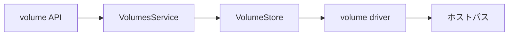

# 第14章 volume サービス

> 本章で読むソース
>
> - [`daemon/volume/service/service.go`](https://github.com/moby/moby/blob/docker-v29.6.1/daemon/volume/service/service.go)
> - [`daemon/daemon.go`](https://github.com/moby/moby/blob/docker-v29.6.1/daemon/daemon.go)
> - [`daemon/volumes.go`](https://github.com/moby/moby/blob/docker-v29.6.1/daemon/volumes.go)

## この章の狙い

名前付き volume の作成、ドライバ選択、マウントが `VolumesService` でどう扱われるかを読む。

## 前提

volume プラグインと local ドライバの違いを知っていること。

## NewVolumeService

`NewDaemon` は root 配下に volume ストアを作り、デフォルトドライバを登録する。

[`daemon/daemon.go` L1079-L1082](https://github.com/moby/moby/blob/docker-v29.6.1/daemon/daemon.go#L1079-L1082)

```go
	d.volumes, err = volumesservice.NewVolumeService(cfgStore.Root, d.PluginStore, idtools.Identity{UID: uid, GID: gid}, d)
	if err != nil {
		return nil, err
	}
```

[`daemon/volume/service/service.go` L33-L53](https://github.com/moby/moby/blob/docker-v29.6.1/daemon/volume/service/service.go#L33-L53)

```go
type VolumesService struct {
	vs           *VolumeStore
	ds           driverLister
	pruneRunning atomic.Bool
	eventLogger  VolumeEventLogger
}

func NewVolumeService(root string, pg plugingetter.PluginGetter, rootIDs idtools.Identity, logger VolumeEventLogger) (*VolumesService, error) {
	ds := drivers.NewStore(pg)
	if err := setupDefaultDriver(ds, root, rootIDs); err != nil {
		return nil, err
	}

	vs, err := NewStore(root, ds, WithEventLogger(logger))
	if err != nil {
		return nil, err
	}
	return &VolumesService{vs: vs, ds: ds, eventLogger: logger}, nil
}
```

## 匿名 volume

名前未指定の `Create` はランダム ID を振り、匿名ラベルを付ける。

[`daemon/volume/service/service.go` L72-L79](https://github.com/moby/moby/blob/docker-v29.6.1/daemon/volume/service/service.go#L72-L79)

```go
func (s *VolumesService) Create(ctx context.Context, name, driverName string, options ...opts.CreateOption) (*volumetypes.Volume, error) {
	if name == "" {
		name = stringid.GenerateRandomID()
		if driverName == "" {
			driverName = volume.DefaultDriverName
		}
		options = append(options, opts.WithCreateLabel(AnonymousLabel, ""))
		log.G(ctx).WithFields(log.Fields{"volume": name, "driver": driverName}).Debug("Creating anonymous volume")
```

## Mount

コンテナ参照 `ref` ごとにドライバへマウントを要求する。

[`daemon/volume/service/service.go` L120-L128](https://github.com/moby/moby/blob/docker-v29.6.1/daemon/volume/service/service.go#L120-L128)

```go
func (s *VolumesService) Mount(ctx context.Context, vol *volumetypes.Volume, ref string) (string, error) {
	v, err := s.vs.Get(ctx, vol.Name, opts.WithGetDriver(vol.Driver))
	if err != nil {
		if IsNotExist(err) {
			err = errdefs.NotFound(err)
		}
		return "", err
	}
	return v.Mount(ref)
```

## Daemon からの公開

API ルーターは `daemon.VolumesService()` 経由でアクセスする。

[`daemon/volumes.go` L324-L327](https://github.com/moby/moby/blob/docker-v29.6.1/daemon/volumes.go#L324-L327)

```go
func (daemon *Daemon) VolumesService() *service.VolumesService {
	return daemon.volumes
}
```



## 高速化・最適化の工夫

`pruneRunning` で並行 prune を1本に制限し、ストアとドライバへの重複削除を防ぐ。
同一 volume への複数コンテナ参照は `ref` カウントでマウントを共有する。

`GetDriverList` は登録済み volume ドライバ名一覧を返す。

[`daemon/volume/service/service.go` L56-L59](https://github.com/moby/moby/blob/docker-v29.6.1/daemon/volume/service/service.go#L56-L59)

```go
func (s *VolumesService) GetDriverList() []string {
	return s.ds.GetDriverList()
}
```

## volume 作成

名前無し volume はランダム ID と匿名ラベルで作られる。

[`daemon/volume/service/service.go` L72-L89](https://github.com/moby/moby/blob/docker-v29.6.1/daemon/volume/service/service.go#L72-L89)

```go
func (s *VolumesService) Create(ctx context.Context, name, driverName string, options ...opts.CreateOption) (*volumetypes.Volume, error) {
	if name == "" {
		name = stringid.GenerateRandomID()
		if driverName == "" {
			driverName = volume.DefaultDriverName
		}
		options = append(options, opts.WithCreateLabel(AnonymousLabel, ""))
		log.G(ctx).WithFields(log.Fields{"volume": name, "driver": driverName}).Debug("Creating anonymous volume")
	} else {
		log.G(ctx).WithField("volume", name).Debug("Creating named volume")
	}
	v, err := s.vs.Create(ctx, name, driverName, options...)
	if err != nil {
		return nil, err
	}

	apiV := volumeToAPIType(v)
	return &apiV, nil
}
```

## まとめ

volume は graphdriver とは別ストアで管理され、プラグインドライバへ委譲される。

## 関連する章

- [第10章 コンテナ作成](../part03-containerd/10-container-create.md)
- [第17章 ネットワーク接続](../part05-network/17-network-connect.md)
