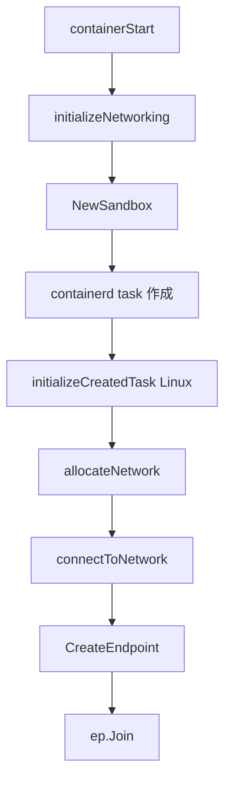

# 第15章 ネットワーク設定と libnetwork

> 本章で読むソース
>
> - [`daemon/libnetwork/controller.go`](https://github.com/moby/moby/blob/docker-v29.6.1/daemon/libnetwork/controller.go)
> - [`daemon/container_operations.go`](https://github.com/moby/moby/blob/docker-v29.6.1/daemon/container_operations.go)

## この章の狙い

コンテナ起動時のネットワーク割り当てが libnetwork `Controller` と `allocateNetwork` でどう進むかを読む。

## 前提

bridge/overlay ネットワークモードの違いを知っていること。

## Controller

`libnetwork.New` は datastore とドライバレジストリを初期化する。

[`daemon/libnetwork/controller.go` L87-L98](https://github.com/moby/moby/blob/docker-v29.6.1/daemon/libnetwork/controller.go#L87-L98)

```go
type Controller struct {
	id               string
	drvRegistry      drvregistry.Networks
	ipamRegistry     drvregistry.IPAMs
	pmRegistry       drvregistry.PortMappers
	sandboxes        map[string]*Sandbox
	cfg              *config.Config
	store            *datastore.Store
	extKeyListener   net.Listener
	svcRecords       map[string]*svcInfo
	serviceBindings  map[serviceKey]*service
```

[`daemon/libnetwork/controller.go` L147-L157](https://github.com/moby/moby/blob/docker-v29.6.1/daemon/libnetwork/controller.go#L147-L157)

```go
func New(ctx context.Context, cfgOptions ...config.Option) (_ *Controller, retErr error) {
	ctx, span := otel.Tracer("").Start(ctx, "libnetwork.New")
	defer func() {
		otelutil.RecordStatus(span, retErr)
		span.End()
	}()

	cfg := config.New(cfgOptions...)
	store, err := datastore.New(cfg.DataDir, cfg.DatastoreBucket)
	if err != nil {
		return nil, fmt.Errorf("libnet controller initialization: %w", err)
```

## initializeNetworking

`containerStart` はマウント後に sandbox 準備へ進む。
Linux では `allocateNetwork` は task 作成後の `initializeCreatedTask` で呼ばれる。

[`daemon/start.go` L130-L136](https://github.com/moby/moby/blob/docker-v29.6.1/daemon/start.go#L130-L136)

```go
	if err := daemon.conditionalMountOnStart(container); err != nil {
		return err
	}

	newSandbox, err := daemon.initializeNetworking(ctx, &daemonCfg.Config, container)
	if err != nil {
		return err
	}
```

`initializeNetworking` は container 共有モードを分岐し、通常は `NewSandbox` で sandbox を作る。

[`daemon/container_operations.go` L450-L496](https://github.com/moby/moby/blob/docker-v29.6.1/daemon/container_operations.go#L450-L496)

```go
func (daemon *Daemon) initializeNetworking(ctx context.Context, cfg *config.Config, ctr *container.Container) (newSandbox *libnetwork.Sandbox, retErr error) {
	if daemon.netController == nil || ctr.Config.NetworkDisabled {
		return nil, nil
	}
	// ... (中略) ...
	if ctr.HostConfig.NetworkMode.IsContainer() {
		nc, err := daemon.getNetworkedContainer(ctr.ID, ctr.HostConfig.NetworkMode.ConnectedContainer())
		if err != nil {
			return nil, err
		}
		// ... (中略) ...
		return nil, nil
	}
	// ... (中略) ...
	sb, err := daemon.netController.NewSandbox(ctx, ctr.ID, sbOptions...)
	if err != nil {
		return nil, err
	}
```

Windows は sandbox 作成直後に `allocateNetwork` を呼ぶ。

[`daemon/container_operations.go` L522-L526](https://github.com/moby/moby/blob/docker-v29.6.1/daemon/container_operations.go#L522-L526)

```go
	if runtime.GOOS == "windows" {
		if err := daemon.allocateNetwork(ctx, cfg, ctr); err != nil {
			return nil, err
		}
	}
```

Linux は task 作成後に netns へ sandbox key を設定してから `allocateNetwork` する。

[`daemon/start_linux.go` L15-L41](https://github.com/moby/moby/blob/docker-v29.6.1/daemon/start_linux.go#L15-L41)

```go
func (daemon *Daemon) initializeCreatedTask(
	ctx context.Context,
	cfg *config.Config,
	tsk types.Task,
	ctr *container.Container,
	spec *specs.Spec,
) error {
	if ctr.Config.NetworkDisabled {
		return nil
	}
	nspath, ok := oci.NamespacePath(spec, specs.NetworkNamespace)
	if ok && nspath == "" {
		sb, err := daemon.netController.GetSandbox(ctr.ID)
		// ... (中略) ...
		if err := sb.SetKey(ctx, fmt.Sprintf("/proc/%d/ns/net", tsk.Pid())); err != nil {
			return errdefs.System(err)
		}
	}
	if err := daemon.runInNetNS(func() error {
		return daemon.allocateNetwork(ctx, cfg, ctr)
	}); err != nil {
		return fmt.Errorf("%s: %w", errSetupNetworking, err)
	}
```

## allocateNetwork

起動前に `NetworkSettings.Networks` をコピーし、各ネットワークへ `connectToNetwork` する。

[`daemon/container_operations.go` L427-L444](https://github.com/moby/moby/blob/docker-v29.6.1/daemon/container_operations.go#L427-L444)

```go
func (daemon *Daemon) allocateNetwork(ctx context.Context, cfg *config.Config, ctr *container.Container) (retErr error) {
	start := time.Now()

	networks := make(map[string]*network.EndpointSettings)
	maps.Copy(networks, ctr.NetworkSettings.Networks)
	for netName, epConf := range networks {
		cleanOperationalData(epConf)
		if err := daemon.connectToNetwork(ctx, cfg, ctr, netName, epConf); err != nil {
			return err
		}
	}

	if _, err := ctr.WriteHostConfig(); err != nil {
		return err
	}
	metrics.NetworkActions.WithValues("allocate").UpdateSince(start)
	return nil
}
```

## connectToNetwork

container ネットワーク共有モードでは追加接続を拒否する。

[`daemon/container_operations.go` L696-L707](https://github.com/moby/moby/blob/docker-v29.6.1/daemon/container_operations.go#L696-L707)

```go
func (daemon *Daemon) connectToNetwork(ctx context.Context, cfg *config.Config, ctr *container.Container, idOrName string, endpointConfig *network.EndpointSettings) (retErr error) {
	containerName := strings.TrimPrefix(ctr.Name, "/")
	ctx, span := otel.Tracer("").Start(ctx, "daemon.connectToNetwork", trace.WithAttributes(
		attribute.String("container.ID", ctr.ID),
		attribute.String("container.name", containerName),
		attribute.String("network.idOrName", idOrName)))
	defer span.End()

	if ctr.HostConfig.NetworkMode.IsContainer() {
		return cerrdefs.ErrInvalidArgument.WithMessage("container sharing network namespace with another container or host cannot be connected to any other network")
	}
```

## ポートマップ準備

接続前に ExposedPorts と PortBindings をマージし、未マップの公開ポート用に nil エントリを作る。

[`daemon/container_operations.go` L111-L120](https://github.com/moby/moby/blob/docker-v29.6.1/daemon/container_operations.go#L111-L120)

```go
	portBindings := make(networktypes.PortMap, len(ctr.HostConfig.PortBindings))
	for p, b := range ctr.HostConfig.PortBindings {
		portBindings[p] = slices.Clone(b)
	}

	for p := range ctr.Config.ExposedPorts {
		if _, ok := portBindings[p]; !ok {
			portBindings[p] = nil
		}
	}
```



## CreateEndpoint と Join

`connectToNetwork` は sandbox を取得したあと endpoint を作り、Join で sandbox に載せる。

[`daemon/container_operations.go` L751-L811](https://github.com/moby/moby/blob/docker-v29.6.1/daemon/container_operations.go#L751-L811)

```go
	sb, err := daemon.netController.GetSandbox(ctr.ID)
	if err != nil {
		return err
	}

	createOptions, err := buildCreateEndpointOptions(ctr, n, endpointConfig, sb, cfg.DNS)
	// ... (中略) ...
	ep, err := n.CreateEndpoint(ctx, containerName, createOptions...)
	if err != nil {
		return err
	}
	// ... (中略) ...
	if err := ep.Join(ctx, sb, joinOptions...); err != nil {
		return err
	}
```

## 高速化・最適化の工夫

ネットワーク割り当ては中間 map にコピーしてから接続し、`connectToNetwork` が Settings を書き換えても走査が壊れない。
OpenTelemetry スパンと `metrics.NetworkActions` で接続遅延を計測する。

`cleanOperationalData` は再接続時に operational フィールドだけを落とす。

[`daemon/container_operations.go` L433-L435](https://github.com/moby/moby/blob/docker-v29.6.1/daemon/container_operations.go#L433-L435)

```go
	for netName, epConf := range networks {
		cleanOperationalData(epConf)
		if err := daemon.connectToNetwork(ctx, cfg, ctr, netName, epConf); err != nil {
```

## まとめ

ネットワーク設定は libnetwork Controller が sandbox と endpoint を管理し、dockerd がコンテナメタデータと同期する。
ポートマッピングは sandbox 作成時に `OptionPortMapping` へ変換されて渡される。

## 関連する章

- [第16章 ポートマッピング](16-port-mapping.md)
- [第17章 ネットワーク接続](17-network-connect.md)
