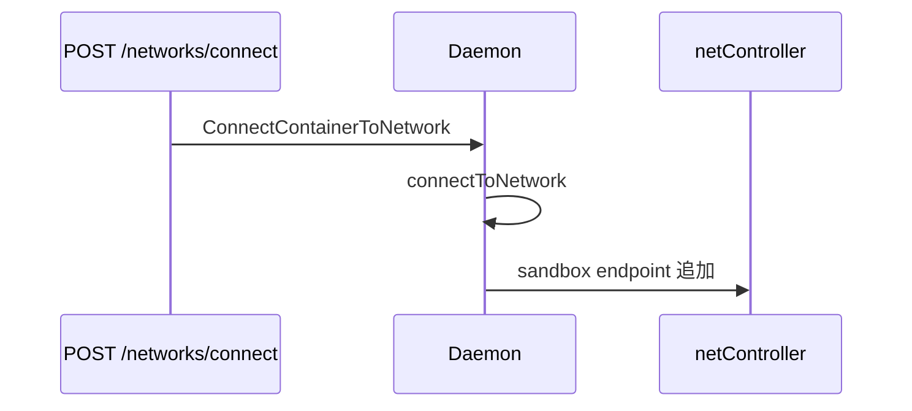

# 第17章 ネットワーク接続 API

> 本章で読むソース
>
> - [`daemon/container_operations.go`](https://github.com/moby/moby/blob/docker-v29.6.1/daemon/container_operations.go)
> - [`daemon/server/router/network/network.go`](https://github.com/moby/moby/blob/docker-v29.6.1/daemon/server/router/network/network.go)

## この章の狙い

起動後の `docker network connect` が `connectToNetwork` と `DisconnectFromNetwork` でどう実装されるかを読む。

## 前提

[第15章](15-network-settings.md)の sandbox モデルを理解していること。

## network ルーター

`network.NewRouter` は daemon と cluster backend を受け取り、ルートを初期化する。

[`daemon/server/router/network/network.go` L14-L27](https://github.com/moby/moby/blob/docker-v29.6.1/daemon/server/router/network/network.go#L14-L27)

```go
func NewRouter(b Backend, c ClusterBackend) router.Router {
	r := &networkRouter{
		backend: b,
		cluster: c,
	}
	r.initRoutes()
	return r
}

func (n *networkRouter) Routes() []router.Route {
	return n.routes
}
```

`buildRouters` では image の次に volume、最後の方で network ルーターが並ぶ。

[`daemon/command/daemon.go` L834-L840](https://github.com/moby/moby/blob/docker-v29.6.1/daemon/command/daemon.go#L834-L840)

```go
		volume.NewRouter(opts.daemon.VolumesService(), opts.cluster),
		build.NewRouter(opts.builder.backend, opts.daemon),
		// ... (中略) ...
		network.NewRouter(opts.daemon, opts.cluster),
		debugrouter.NewRouter(),
```

## connectToNetwork

接続は OpenTelemetry スパン付きで計測され、container 共有ネットワークは拒否される。

[`daemon/container_operations.go` L696-L707](https://github.com/moby/moby/blob/docker-v29.6.1/daemon/container_operations.go#L696-L707)

```go
func (daemon *Daemon) connectToNetwork(ctx context.Context, cfg *config.Config, ctr *container.Container, idOrName string, endpointConfig *network.EndpointSettings) (retErr error) {
	containerName := strings.TrimPrefix(ctr.Name, "/")
	ctx, span := otel.Tracer("").Start(ctx, "daemon.connectToNetwork", trace.WithAttributes(
		attribute.String("container.ID", ctr.ID),
		attribute.String("container.name", containerName),
		attribute.String("network.idOrName", idOrName)))
	defer span.End()

	if ctr.HostConfig.NetworkMode.IsContainer() {
		return cerrdefs.ErrInvalidArgument.WithMessage("container sharing network namespace with another container or host cannot be connected to any other network")
	}
```

## ランタイム中の再接続

チェックポイント復元などの経路でも `connectToNetwork` が再利用される。

[`daemon/container_operations.go` L1082-L1088](https://github.com/moby/moby/blob/docker-v29.6.1/daemon/container_operations.go#L1082-L1088)

```go
			return daemon.connectToNetwork(ctx, &daemon.config().Config, ctr, idOrName, epc)
		}); err != nil {
			return err
		}
	}

	return ctr.CheckpointTo(ctx, daemon.containersReplica)
```

## DisconnectFromNetwork

切断 API は `DisconnectFromNetwork` が force フラグを受け取り、endpoint を外す（実装は同ファイル後半）。



## 高速化・最適化の工夫

接続処理は `start` と API の両方から同じ関数を通し、ポートと DNS 設定の重複実装を避ける。
メトリクス `NetworkActions` で allocate/connect の遅延を分離計測する。

`DisconnectFromNetwork` は force 指定で endpoint を外す（実装は同ファイル後半）。

[`daemon/container_operations.go` L1091-L1095](https://github.com/moby/moby/blob/docker-v29.6.1/daemon/container_operations.go#L1091-L1095)

```go
// DisconnectFromNetwork disconnects container from network n.
func (daemon *Daemon) DisconnectFromNetwork(ctx context.Context, ctr *container.Container, networkName string, force bool) error {
	n, err := daemon.FindNetwork(networkName)
	ctr.Lock()
	defer ctr.Unlock()
```

[`daemon/server/router/network/network.go` L24-L27](https://github.com/moby/moby/blob/docker-v29.6.1/daemon/server/router/network/network.go#L24-L27)

```go
// Routes returns the available routes to the network controller
func (n *networkRouter) Routes() []router.Route {
	return n.routes
}
```

## bridge 無効と endpoint 初期化

[`daemon/container_operations.go` L696-L721](https://github.com/moby/moby/blob/docker-v29.6.1/daemon/container_operations.go#L696-L721)

```go
func (daemon *Daemon) connectToNetwork(ctx context.Context, cfg *config.Config, ctr *container.Container, idOrName string, endpointConfig *network.EndpointSettings) (retErr error) {
	containerName := strings.TrimPrefix(ctr.Name, "/")
	ctx, span := otel.Tracer("").Start(ctx, "daemon.connectToNetwork", trace.WithAttributes(
		attribute.String("container.ID", ctr.ID),
		attribute.String("container.name", containerName),
		attribute.String("network.idOrName", idOrName)))
	defer span.End()

	start := time.Now()

	if ctr.HostConfig.NetworkMode.IsContainer() {
		return cerrdefs.ErrInvalidArgument.WithMessage("container sharing network namespace with another container or host cannot be connected to any other network")
	}
	if cfg.DisableBridge && containertypes.NetworkMode(idOrName).IsBridge() {
		ctr.Config.NetworkDisabled = true
		return nil
	}
	if endpointConfig == nil {
		endpointConfig = &network.EndpointSettings{
			EndpointSettings: &networktypes.EndpointSettings{},
		}
	}

	n, nwCfg, err := daemon.findAndAttachNetwork(ctr, idOrName, endpointConfig.EndpointSettings)
	if err != nil {
		return err
```

## まとめ

ネットワーク接続は libnetwork 操作を `connectToNetwork` に集約し、API はその薄いラッパである。
切断も同じ `container_operations` から force 付きで呼べる。

## 関連する章

- [第15章 ネットワーク設定](15-network-settings.md)
- [第5章 HTTP ルーター](../part01-command/05-http-router.md)
