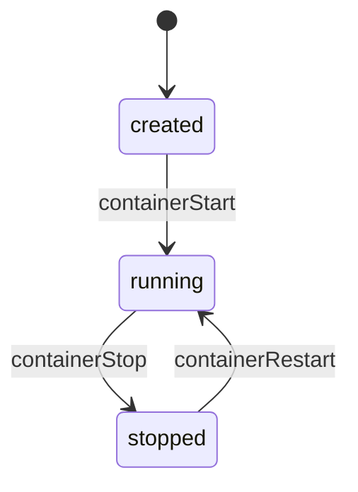

# 第18章 コンテナの start と stop

> 本章で読むソース
>
> - [`daemon/start.go`](https://github.com/moby/moby/blob/docker-v29.6.1/daemon/start.go)
> - [`daemon/stop.go`](https://github.com/moby/moby/blob/docker-v29.6.1/daemon/stop.go)
> - [`daemon/restart.go`](https://github.com/moby/moby/blob/docker-v29.6.1/daemon/restart.go)

## この章の狙い

`containerStart` と `containerStop` が containerd タスクとネットワーク割り当てをどう組み合わせるかを追う。

## 前提

[第9章](../part03-containerd/09-containerd-client.md)と[第15章](../part05-network/15-network-settings.md)を理解していること。

## containerStart

開始処理はコンテナ mutex を取り、既に Running なら再起動経路をスキップする。

[`daemon/start.go` L76-L91](https://github.com/moby/moby/blob/docker-v29.6.1/daemon/start.go#L76-L91)

```go
func (daemon *Daemon) containerStart(ctx context.Context, daemonCfg *configStore, container *container.Container, checkpoint string, checkpointDir string, resetRestartManager bool) (retErr error) {
	ctx, span := otel.Tracer("").Start(ctx, "daemon.containerStart", trace.WithAttributes(append(
		labelsAsOTelAttributes(container.Config.Labels),
		attribute.String("container.ID", container.ID),
		attribute.String("container.Name", container.Name),
	)...))
	// ... (中略) ...
	container.Lock()
	defer container.Unlock()

	if resetRestartManager && container.State.Running {
```

## ContainerStop API

公開 API は名前解決後、非 Running なら 304 相当のエラーを返す。

[`daemon/stop.go` L25-L35](https://github.com/moby/moby/blob/docker-v29.6.1/daemon/stop.go#L25-L35)

```go
func (daemon *Daemon) ContainerStop(ctx context.Context, name string, options backend.ContainerStopOptions) error {
	ctr, err := daemon.GetContainer(name)
	if err != nil {
		return err
	}
	if !ctr.State.IsRunning() {
		return errdefs.NotModified(errors.New("container is already stopped"))
	}
```

## containerStop

リクエスト cancel は stop 処理に伝播させない。
シグナルとタイムアウトはコンテナ設定から決める。

[`daemon/stop.go` L48-L58](https://github.com/moby/moby/blob/docker-v29.6.1/daemon/stop.go#L48-L58)

```go
func (daemon *Daemon) containerStop(ctx context.Context, ctr *container.Container, options backend.ContainerStopOptions) (retErr error) {
	ctx = context.WithoutCancel(ctx)

	if !ctr.State.IsRunning() {
		return nil
	}

	var (
		stopSignal  = ctr.StopSignal()
		stopTimeout = ctr.StopTimeout()
```

## Restart

`containerRestart` も `context.WithoutCancel` で原子性を保つ。

[`daemon/restart.go` L35-L38](https://github.com/moby/moby/blob/docker-v29.6.1/daemon/restart.go#L35-L38)

```go
func (daemon *Daemon) containerRestart(ctx context.Context, daemonCfg *configStore, container *container.Container, options backend.ContainerStopOptions) error {
	ctx = context.WithoutCancel(ctx)
```

## Stop オプション型

API は signal と timeout 秒を `ContainerStopOptions` で受け取る。

[`daemon/server/backend/backend.go` L123-L132](https://github.com/moby/moby/blob/docker-v29.6.1/daemon/server/backend/backend.go#L123-L132)

```go
type ContainerStopOptions struct {
	Signal string `json:",omitempty"`

	// Timeout (optional) is the timeout (in seconds) to wait for the container
	// to stop gracefully before forcibly terminating it with SIGKILL.
```



## 高速化・最適化の工夫

stop/restart は `WithoutCancel` でクライアント切断後も完了させ、半端な状態を残さない。
OpenTelemetry スパンで start/stop フェーズの遅延を分離計測する。

`ContainerStart` は公開 API で名前から `containerStart` へ委譲する。

[`daemon/start.go` L49-L55](https://github.com/moby/moby/blob/docker-v29.6.1/daemon/start.go#L49-L55)

```go
func (daemon *Daemon) ContainerStart(ctx context.Context, name string, checkpoint string, checkpointDir string) error {
	daemonCfg := daemon.config()
	if checkpoint != "" && !daemonCfg.Experimental {
		return errdefs.InvalidParameter(errors.New("checkpoint is only supported in experimental mode"))
	}

	ctr, err := daemon.GetContainer(name)
```

## containerStart の入口

`containerStart` はロック取得後、削除中や dead 状態を弾いてから containerd タスク作成へ進む。

[`daemon/start.go` L76-L97](https://github.com/moby/moby/blob/docker-v29.6.1/daemon/start.go#L76-L97)

```go
func (daemon *Daemon) containerStart(ctx context.Context, daemonCfg *configStore, container *container.Container, checkpoint string, checkpointDir string, resetRestartManager bool) (retErr error) {
	ctx, span := otel.Tracer("").Start(ctx, "daemon.containerStart", trace.WithAttributes(append(
		labelsAsOTelAttributes(container.Config.Labels),
		attribute.String("container.ID", container.ID),
		attribute.String("container.Name", container.Name),
	)...))
	defer func() {
		otelutil.RecordStatus(span, retErr)
		span.End()
	}()

	start := time.Now()
	container.Lock()
	defer container.Unlock()

	if resetRestartManager && container.State.Running { // skip this check if already in restarting step and resetRestartManager==false
		return nil
	}

	if container.State.RemovalInProgress || container.State.Dead {
		return errdefs.Conflict(errors.New("container is marked for removal and cannot be started"))
	}
```

## まとめ

start はネットワーク割り当てと containerd タスク起動を束ね、stop はシグナルとタイムアウトで graceful 終了を試みる。

## 関連する章

- [第10章 コンテナ作成](../part03-containerd/10-container-create.md)
- [第19章 exec/attach](19-exec-attach.md)
