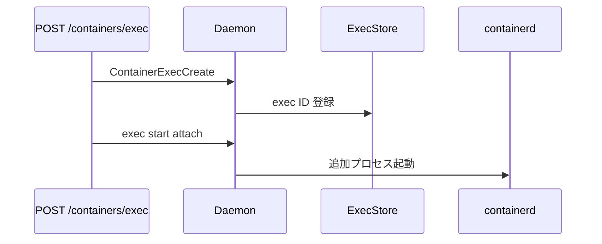

# 第19章 exec と attach

> 本章で読むソース
>
> - [`daemon/exec.go`](https://github.com/moby/moby/blob/docker-v29.6.1/daemon/exec.go)
> - [`daemon/container/store.go`](https://github.com/moby/moby/blob/docker-v29.6.1/daemon/container/store.go)

## この章の狙い

稼働中コンテナへの追加プロセス `exec` がどう登録され、stdio がアタッチされるかを読む。

## 前提

[第7章](../part02-core/07-container-store.md)の `ExecStore` を理解していること。

## ContainerExecCreate

`ContainerExecCreate` は稼働中コンテナを取得し、ユーザー指定があればコンテナ内で名前解決する。

[`daemon/exec.go` L96-L106](https://github.com/moby/moby/blob/docker-v29.6.1/daemon/exec.go#L96-L106)

```go
func (daemon *Daemon) ContainerExecCreate(name string, options *containertypes.ExecCreateRequest) (string, error) {
	cntr, err := daemon.getActiveContainer(name)
	if err != nil {
		return "", err
	}
	if user := options.User; user != "" {
		// Lookup the user inside the container before starting the exec to
		// allow for an early exit.
```

## ExecConfig 生成

`NewExecConfig` で attach フラグとコマンドを載せ、`ExecStore` へ登録する（同一ファイル後半）。

[`daemon/exec.go` L127-L132](https://github.com/moby/moby/blob/docker-v29.6.1/daemon/exec.go#L127-L132)

```go
	execConfig := container.NewExecConfig(cntr)
	execConfig.OpenStdin = options.AttachStdin
	execConfig.OpenStdout = options.AttachStdout
	execConfig.OpenStderr = options.AttachStderr
	execConfig.DetachKeys = keys
	execConfig.Entrypoint, execConfig.Args = options.Cmd[0], options.Cmd[1:]
```

## Daemon の ExecStore

`NewDaemon` は `container.NewExecStore()` で exec ID を管理する（第6章）。

[`daemon/daemon.go` L1105-L1106](https://github.com/moby/moby/blob/docker-v29.6.1/daemon/daemon.go#L1105-L1106)

```go
	d.execCommands = container.NewExecStore()
	d.statsCollector = d.newStatsCollector(1 * time.Second)
```

## ヘルスチェック exec

ヘルスプローブも同じ `NewExecConfig` パターンで stdout のみを開く。

[`daemon/health.go` L77-L82](https://github.com/moby/moby/blob/docker-v29.6.1/daemon/health.go#L77-L82)

```go
	execConfig := container.NewExecConfig(cntr)
	execConfig.OpenStdin = false
	execConfig.OpenStdout = true
	execConfig.OpenStderr = true
	execConfig.DetachKeys = []byte{}
	execConfig.Entrypoint, execConfig.Args = cmd[0], cmd[1:]
```



## 高速化・最適化の工夫

exec 前にユーザー名をコンテナ内で解決し、起動後の失敗を減らす。
attach フラグは exec ごとに独立し、不要な stdio パイプを開かない。

`getActiveContainer` は Running/Paused のみ exec 対象とする。

[`daemon/exec.go` L96-L100](https://github.com/moby/moby/blob/docker-v29.6.1/daemon/exec.go#L96-L100)

```go
func (daemon *Daemon) ContainerExecCreate(name string, options *containertypes.ExecCreateRequest) (string, error) {
	cntr, err := daemon.getActiveContainer(name)
	if err != nil {
		return "", err
	}
```

exec ID は `ExecStore` に登録され、attach API が同じ ID を参照する。

[`daemon/exec.go` L127-L132](https://github.com/moby/moby/blob/docker-v29.6.1/daemon/exec.go#L127-L132)

```go
	execConfig := container.NewExecConfig(cntr)
	execConfig.OpenStdin = options.AttachStdin
	execConfig.OpenStdout = options.AttachStdout
	execConfig.OpenStderr = options.AttachStderr
	execConfig.DetachKeys = keys
	execConfig.Entrypoint, execConfig.Args = options.Cmd[0], options.Cmd[1:]
```

## exec 開始

`ContainerExecStart` は二重実行を拒否し、実行中フラグを立ててから containerd へ渡す。

[`daemon/exec.go` L162-L184](https://github.com/moby/moby/blob/docker-v29.6.1/daemon/exec.go#L162-L184)

```go
func (daemon *Daemon) ContainerExecStart(ctx context.Context, name string, options backend.ExecStartConfig) (retErr error) {
	var (
		cStdin           io.ReadCloser
		cStdout, cStderr io.Writer
	)

	ec, err := daemon.getExecConfig(name)
	if err != nil {
		return err
	}

	ec.Lock()
	if ec.ExitCode != nil {
		ec.Unlock()
		return errdefs.Conflict(fmt.Errorf("exec command %s has already run", ec.ID))
	}

	if ec.Running {
		ec.Unlock()
		return errdefs.Conflict(fmt.Errorf("exec command %s is already running", ec.ID))
	}
	ec.Running = true
	ec.Unlock()
```

## まとめ

exec はメインコンテナプロセスとは別の短命タスクとして containerd へ渡される。

## 関連する章

- [第11章 実行監視](../part03-containerd/11-container-monitor.md)
- [第18章 start/stop](18-start-stop.md)
