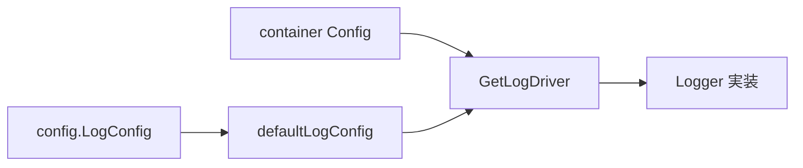

# 第20章 ログドライバ

> 本章で読むソース
>
> - [`daemon/logger/factory.go`](https://github.com/moby/moby/blob/docker-v29.6.1/daemon/logger/factory.go)
> - [`daemon/config/config.go`](https://github.com/moby/moby/blob/docker-v29.6.1/daemon/config/config.go)

## この章の狙い

コンテナログがログドライバ factory 経由でどう生成され、デフォルト設定がどこから来るかを読む。

## 前提

json-file/journald 等のドライバ名を知っていること。

## デフォルト LogConfig

`config.New` はコンテナ既定のログドライバ型を埋める。

[`daemon/config/config.go` L334-L343](https://github.com/moby/moby/blob/docker-v29.6.1/daemon/config/config.go#L334-L343)

```go
func New() (*Config, error) {
	cfg := &Config{
		CommonConfig: CommonConfig{
			ShutdownTimeout: DefaultShutdownTimeout,
			LogConfig: LogConfig{
				Type:   DefaultLogDriver,
				Config: make(map[string]string),
			},
```

## ドライバ factory

`Creator` は `Info` から `Logger` を作る関数型である。
`GetLogDriver` は名前で登録済み creator を返す。

[`daemon/logger/factory.go` L15-L23](https://github.com/moby/moby/blob/docker-v29.6.1/daemon/logger/factory.go#L15-L23)

```go
type Creator func(Info) (Logger, error)

type LogOptValidator func(cfg map[string]string) error

type logdriverFactory struct {
	registry     map[string]Creator
	optValidator map[string]LogOptValidator
```

[`daemon/logger/factory.go` L123-L125](https://github.com/moby/moby/blob/docker-v29.6.1/daemon/logger/factory.go#L123-L125)

```go
func GetLogDriver(name string) (Creator, error) {
	return factory.get(name)
}
```

## 組み込みオプション

`mode` と `max-buffer-size` は全ドライバ共通のビルトインオプションとして扱う。

[`daemon/logger/factory.go` L127-L130](https://github.com/moby/moby/blob/docker-v29.6.1/daemon/logger/factory.go#L127-L130)

```go
var builtInLogOpts = map[string]bool{
	"mode":            true,
	"max-buffer-size": true,
}
```

## Daemon 既定

`Daemon` は `defaultLogConfig` を持ち、コンテナ個別設定が無いときのフォールバックになる（第1章 `Daemon` 構造体）。

[`daemon/daemon.go` L110-L111](https://github.com/moby/moby/blob/docker-v29.6.1/daemon/daemon.go#L110-L111)

```go
	defaultLogConfig  containertypes.LogConfig
	registryService   *registry.Service
```



## 高速化・最適化の工夫

ドライバは名前で遅延解決し、未使用ドライバの初期化コストを避ける。
`max-buffer-size` で非ブロッキングモードのバッファ上限を制御し、メモリ膨張を抑える。

`RegisterLogDriver` は起動時に各ドライバを factory へ登録する。

[`daemon/logger/factory.go` L112-L114](https://github.com/moby/moby/blob/docker-v29.6.1/daemon/logger/factory.go#L112-L114)

```go
func RegisterLogDriver(name string, c Creator) error {
	return factory.register(name, c)
}
```

## コンテナへの接続

`StartLogger` は `HostConfig.LogConfig` から driver を引き、`logger.Info` を組み立てる。

[`daemon/container/container.go` L439-L458](https://github.com/moby/moby/blob/docker-v29.6.1/daemon/container/container.go#L439-L458)

```go
// StartLogger starts a new logger driver for the container.
func (container *Container) StartLogger() (logger.Logger, error) {
	cfg := container.HostConfig.LogConfig
	initDriver, err := logger.GetLogDriver(cfg.Type)
	if err != nil {
		return nil, errors.Wrap(err, "failed to get logging factory")
	}
	info := logger.Info{
		Config:              cfg.Config,
		ContainerID:         container.ID,
		ContainerName:       container.Name,
		ContainerEntrypoint: container.Path,
		ContainerArgs:       container.Args,
		ContainerImageID:    container.ImageID.String(),
		ContainerImageName:  container.Config.Image,
		ContainerCreated:    container.Created,
		ContainerEnv:        container.Config.Env,
		ContainerLabels:     container.Config.Labels,
		DaemonName:          "docker",
	}
```

## ValidateLogOpts

`none` 以外のドライバは登録済み creator のオプション検証へ渡す。

[`daemon/logger/factory.go` L132-L138](https://github.com/moby/moby/blob/docker-v29.6.1/daemon/logger/factory.go#L132-L138)

```go
// ValidateLogOpts checks the options for the given log driver. The
// options supported are specific to the LogDriver implementation.
func ValidateLogOpts(name string, cfg map[string]string) error {
	if name == "none" {
		return nil
	}
```

## まとめ

ログはプラガブルな `Creator` 登録で拡張され、daemon.json がデフォルトを決める。

## 関連する章

- [第4章 設定](../part01-command/04-daemon-config.md)
- [第18章 start/stop](18-start-stop.md)
