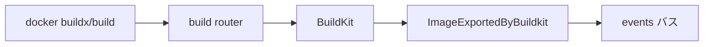

# 第21章 BuildKit 連携

> 本章で読むソース
>
> - [`daemon/build.go`](https://github.com/moby/moby/blob/docker-v29.6.1/daemon/build.go)
> - [`daemon/command/httphandler.go`](https://github.com/moby/moby/blob/docker-v29.6.1/daemon/command/httphandler.go)
> - [`daemon/config/builder.go`](https://github.com/moby/moby/blob/docker-v29.6.1/daemon/config/builder.go)

## この章の狙い

`docker build` が BuildKit バックエンドとどう接続し、イメージイベントが daemon へ戻るかを読む。

## 前提

BuildKit の gRPC API とキャッシュ GC の概念を知っていること。

## イメージイベントコールバック

タグ無し export 時、BuildKit は image service を呼ばないため、daemon が create イベントを補完する。

[`daemon/build.go` L11-L17](https://github.com/moby/moby/blob/docker-v29.6.1/daemon/build.go#L11-L17)

```go
func (daemon *Daemon) ImageExportedByBuildkit(ctx context.Context, id string, desc ocispec.Descriptor) {
	daemon.imageService.LogImageEvent(ctx, id, id, events.ActionCreate)
}
```

タグ付けも containerd image store 経路ではコールバックが必要になる。

[`daemon/build.go` L19-L24](https://github.com/moby/moby/blob/docker-v29.6.1/daemon/build.go#L19-L24)

```go
// ImageNamedByBuildkit is a callback that is called when an image is tagged by buildkit.
// Note: It is only called if the buildkit didn't call the image service itself to perform the tagging.
// Currently this only happens when the containerd image store is used.
func (daemon *Daemon) ImageNamedByBuildkit(ctx context.Context, ref reference.NamedTagged, desc ocispec.Descriptor) {
	daemon.imageService.LogImageEvent(ctx, desc.Digest.String(), reference.FamiliarString(ref), events.ActionTag)
}
```

## gRPC とトレース

`newGRPCServer` は BuildKit 向けにメッセージサイズ上限とエラーインターセプタを設定する。

[`daemon/command/httphandler.go` L44-L51](https://github.com/moby/moby/blob/docker-v29.6.1/daemon/command/httphandler.go#L44-L51)

```go
	tp, _ := otelutil.NewTracerProvider(ctx, false)
	return grpc.NewServer(
		grpc.StatsHandler(tracing.ServerStatsHandler(otelgrpc.WithTracerProvider(tp))),
		grpc.ChainUnaryInterceptor(unaryInterceptor, grpcerrors.UnaryServerInterceptor),
		grpc.StreamInterceptor(grpcerrors.StreamServerInterceptor),
		grpc.MaxRecvMsgSize(defaults.DefaultMaxRecvMsgSize),
		grpc.MaxSendMsgSize(defaults.DefaultMaxSendMsgSize),
	)
```

Trace export RPC は無限ループを避けるためトレース対象外にする。

[`daemon/command/httphandler.go` L55-L60](https://github.com/moby/moby/blob/docker-v29.6.1/daemon/command/httphandler.go#L55-L60)

```go
	if strings.HasSuffix(info.FullMethod, "opentelemetry.proto.collector.trace.v1.TraceService/Export") {
		return handler(ctx, req)
	}
```

## Builder GC 設定

`daemon.json` の builder セクションは BuildKit キャッシュ GC ルールを表す。

[`daemon/config/builder.go` L85-L92](https://github.com/moby/moby/blob/docker-v29.6.1/daemon/config/builder.go#L85-L92)

```go
type BuilderGCConfig struct {
	Enabled              *bool           `json:",omitempty"`
	Policy               []BuilderGCRule `json:",omitempty"`
	DefaultReservedSpace string          `json:",omitempty"`
	DefaultMaxUsedSpace  string          `json:",omitempty"`
	DefaultMinFreeSpace  string          `json:",omitempty"`
}
```

## ルーター統合

`buildRouters` は `build.NewRouter` で BuildKit バックエンドを HTTP に載せる。

[`daemon/command/daemon.go` L835-L835](https://github.com/moby/moby/blob/docker-v29.6.1/daemon/command/daemon.go#L835)

```go
		build.NewRouter(opts.builder.backend, opts.daemon),
```



## 高速化・最適化の工夫

BuildKit キャッシュ GC ポリシーでディスク使用量を上限管理し、ビルド速度と容量を両立する。
gRPC メッセージサイズ上限で巨大レイヤ転送時のメモリピークを抑える。

`BuilderEntitlements` は buildkit の特権ビルド可否を設定する。

[`daemon/config/builder.go` L134-L138](https://github.com/moby/moby/blob/docker-v29.6.1/daemon/config/builder.go#L134-L138)

```go
type BuilderEntitlements struct {
	NetworkHost      *bool `json:"network-host,omitempty"`
	SecurityInsecure *bool `json:"security-insecure,omitempty"`
	Device           *bool `json:"device,omitempty"`
}
```

## BuildKit 初期化

`initBuildkit` は session manager を作り、builder バックエンド初期化へ進む。

[`daemon/command/daemon.go` L447-L453](https://github.com/moby/moby/blob/docker-v29.6.1/daemon/command/daemon.go#L447-L453)

```go
func initBuildkit(ctx context.Context, d *daemon.Daemon, cdiCache *cdi.Cache) (_ builderOptions, closeFn func(), _ error) {
	log.G(ctx).Info("Initializing buildkit")
	closeFn = func() {}

	sm, err := session.NewManager()
	if err != nil {
		return builderOptions{}, closeFn, errors.Wrap(err, "failed to create sessionmanager")
```

## BuilderConfig

`daemon.json` の builder セクションは GC と entitlements を束ねる。

[`daemon/config/builder.go` L142-L146](https://github.com/moby/moby/blob/docker-v29.6.1/daemon/config/builder.go#L142-L146)

```go
type BuilderConfig struct {
	GC           BuilderGCConfig
	Entitlements BuilderEntitlements
	History      *BuilderHistoryConfig `json:",omitempty"`
}
```

## まとめ

ビルドは BuildKit に委譲し、daemon はイメージメタデータとイベント同期だけを担う。

## 関連する章

- [第8章 events](../part02-core/08-events-bus.md)
- [第13章 イメージレイヤ](../part04-storage/13-image-layer.md)
