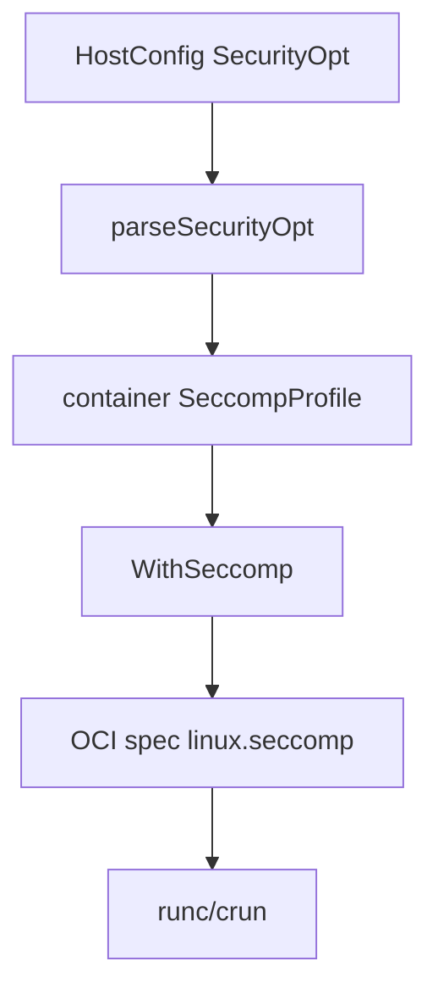

# 第22章 seccomp と cgroup

> 本章で読むソース
>
> - [`daemon/seccomp_linux.go`](https://github.com/moby/moby/blob/docker-v29.6.1/daemon/seccomp_linux.go)
> - [`daemon/daemon.go`](https://github.com/moby/moby/blob/docker-v29.6.1/daemon/daemon.go)

## この章の狙い

コンテナ起動時の seccomp プロファイル適用と、daemon 側に保持する seccomp バイト列を読む。

## 前提

OCI runtime spec の `linux.seccomp` を知っていること。

## WithSeccomp

`WithSeccomp` は `SpecOpts` として OCI spec へ seccomp を書き込む。

[`daemon/seccomp_linux.go` L18-L41](https://github.com/moby/moby/blob/docker-v29.6.1/daemon/seccomp_linux.go#L18-L41)

```go
func WithSeccomp(daemon *Daemon, c *container.Container) coci.SpecOpts {
	return func(ctx context.Context, _ coci.Client, _ *containers.Container, s *coci.Spec) error {
		if c.SeccompProfile == dconfig.SeccompProfileUnconfined {
			return nil
		}
		if c.HostConfig.Privileged {
			var err error
			if c.SeccompProfile != "" {
				s.Linux.Seccomp, err = seccomp.LoadProfile(c.SeccompProfile, s)
			}
			return err
		}
		sysInfo, err := daemon.RawSysInfo()
		if err != nil {
			return err
		}
		if !sysInfo.Seccomp {
			if c.SeccompProfile != "" && c.SeccompProfile != dconfig.SeccompProfileDefault {
				return errors.New("seccomp is not enabled in your kernel, cannot run a custom seccomp profile")
			}
			log.G(ctx).Warn("seccomp is not enabled in your kernel, running container without default profile")
			c.SeccompProfile = dconfig.SeccompProfileUnconfined
			return nil
		}
```

## Daemon のプロファイル保持

`Daemon` はデフォルト seccomp JSON をバイト列で保持する。

[`daemon/daemon.go` L135-L136](https://github.com/moby/moby/blob/docker-v29.6.1/daemon/daemon.go#L135-L136)

```go
	seccompProfile     []byte
	seccompProfilePath string
```

## root key limit

コンテナ数上限に関わる root key limit は `NewDaemon` 冒頭で調整される（cgroup 関連の前提）。

[`daemon/daemon.go` L855-L858](https://github.com/moby/moby/blob/docker-v29.6.1/daemon/daemon.go#L855-L858)

```go
	if err := modifyRootKeyLimit(); err != nil {
		log.G(ctx).Warnf("unable to modify root key limit, number of containers could be limited by this quota: %v", err)
	}
```

## Devices cgroup チェック

Linux では Devices cgroup マウントを起動時に確認する（同ファイル後半）。

[`daemon/daemon.go` L1084-L1087](https://github.com/moby/moby/blob/docker-v29.6.1/daemon/daemon.go#L1084-L1087)

```go
	// Check if Devices cgroup is mounted, it is hard requirement for container security,
	// on Linux.
	//
	// Important: we call getSysInfo() directly here, without storing the results,
```

## SecurityOpt パース

ホスト設定の `seccomp=` は `parseSecurityOpt` でプロファイルパスへ展開される（テスト参照）。



## 高速化・最適化の工夫

デフォルト seccomp は daemon 起動時に1回読み込み、コンテナごとのファイル I/O を避ける。
カーネル非対応時は早期に unconfined へ落とし、起動失敗の切り分けを簡潔にする。

`WithSeccomp` は default プロファイル時に daemon 保持 JSON を使う（同ファイル続き）。

[`daemon/seccomp_linux.go` L46-L47](https://github.com/moby/moby/blob/docker-v29.6.1/daemon/seccomp_linux.go#L46-L47)

```go
		switch {
		case c.SeccompProfile == dconfig.SeccompProfileDefault:
```

`daemon/seccomp_linux.go` の default 分岐は `seccomp.GetDefaultProfile` へ続く。

[`daemon/seccomp_linux.go` L46-L48](https://github.com/moby/moby/blob/docker-v29.6.1/daemon/seccomp_linux.go#L46-L48)

```go
		switch {
		case c.SeccompProfile == dconfig.SeccompProfileDefault:
			s.Linux.Seccomp, err = seccomp.GetDefaultProfile(s)
```

読み取り専用の seccomp JSON は daemon 起動時に `seccompProfile` へ読み込まれる。

## daemon 保持プロファイル

`seccompProfile` バイト列があればファイル読み込みを省略して OCI spec へ載せる。

[`daemon/seccomp_linux.go` L46-L57](https://github.com/moby/moby/blob/docker-v29.6.1/daemon/seccomp_linux.go#L46-L57)

```go
		switch {
		case c.SeccompProfile == dconfig.SeccompProfileDefault:
			s.Linux.Seccomp, err = seccomp.GetDefaultProfile(s)
		case c.SeccompProfile != "":
			s.Linux.Seccomp, err = seccomp.LoadProfile(c.SeccompProfile, s)
		case daemon.seccompProfile != nil:
			s.Linux.Seccomp, err = seccomp.LoadProfile(string(daemon.seccompProfile), s)
		case daemon.seccompProfilePath == dconfig.SeccompProfileUnconfined:
			c.SeccompProfile = dconfig.SeccompProfileUnconfined
		default:
			s.Linux.Seccomp, err = seccomp.GetDefaultProfile(s)
		}
		return err
```

## まとめ

seccomp は OCI spec 生成段階で適用され、cgroup 前提チェックは daemon 起動時に行われる。

## 関連する章

- [第10章 コンテナ作成](../part03-containerd/10-container-create.md)
- [第18章 start/stop](../part06-runtime/18-start-stop.md)
