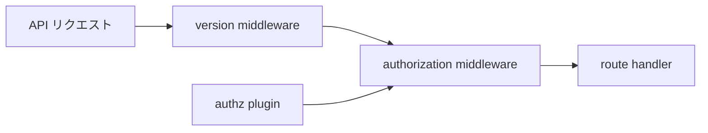

# 第23章 認可プラグイン

> 本章で読むソース
>
> - [`daemon/command/daemon.go`](https://github.com/moby/moby/blob/docker-v29.6.1/daemon/command/daemon.go)
> - [`daemon/pkg/plugin/manager.go`](https://github.com/moby/moby/blob/docker-v29.6.1/daemon/pkg/plugin/manager.go)

## この章の狙い

Authorization プラグインが HTTP ミドルウェアとしてどう載り、リロード時に再検証されるかを読む。

## 前提

Docker 認可プラグインのリクエスト/レスポンスモデルを知っていること。

## initMiddlewares

API サーバは experimental、version、authorization の順でミドルウェアを積む。

[`daemon/command/daemon.go` L861-L873](https://github.com/moby/moby/blob/docker-v29.6.1/daemon/command/daemon.go#L861-L873)

```go
func initMiddlewares(_ context.Context, s *apiserver.Server, cfg *config.Config, pluginStore plugingetter.PluginGetter) (*authorization.Middleware, error) {
	exp := middleware.NewExperimentalMiddleware(cfg.Experimental)
	s.UseMiddleware(exp)

	vm, err := middleware.NewVersionMiddleware(dockerversion.Version, config.MaxAPIVersion, cfg.MinAPIVersion)
	if err != nil {
		return nil, err
	}
	s.UseMiddleware(*vm)

	authzMiddleware := authorization.NewMiddleware(cfg.AuthorizationPlugins, pluginStore)
	s.UseMiddleware(authzMiddleware)
	return authzMiddleware, nil
}
```

## daemonCLI が保持

`authzMiddleware` は動的リロード用に `daemonCLI` フィールドへ残る。

[`daemon/command/daemon.go` L70-L77](https://github.com/moby/moby/blob/docker-v29.6.1/daemon/command/daemon.go#L70-L77)

```go
type daemonCLI struct {
	*config.Config
	configFile *string
	flags      *pflag.FlagSet

	d               *daemon.Daemon
	authzMiddleware *authorization.Middleware
```

## NewDaemon 後の検証

プラグイン有効化は `NewDaemon` のあとで行う。
コメントが順序依存を明示する。

[`daemon/command/daemon.go` L304-L307](https://github.com/moby/moby/blob/docker-v29.6.1/daemon/command/daemon.go#L304-L307)

```go
	// validate after NewDaemon has restored enabled plugins. Don't change order.
	if err := validateAuthzPlugins(cli.Config.AuthorizationPlugins, pluginStore); err != nil {
		return errors.Wrap(err, "failed to validate authorization plugin")
	}
```

## SIGHUP リロード

`reloadConfig` も認可プラグインを先に検証し、失敗時は fatal する。

[`daemon/command/daemon.go` L528-L536](https://github.com/moby/moby/blob/docker-v29.6.1/daemon/command/daemon.go#L528-L536)

```go
	reload := func(cfg *config.Config) {
		if err := validateAuthzPlugins(cfg.AuthorizationPlugins, cli.d.PluginStore); err != nil {
			log.G(ctx).WithError(err).Fatal("Error validating authorization plugin")
			return
		}

		if err := cli.d.Reload(cfg); err != nil {
			log.G(ctx).WithError(err).Error("Error reconfiguring the daemon")
			return
		}
```

## Plugin Manager

プラグインサブシステムは `AuthzMiddleware` 参照を設定で受け取る。

[`daemon/pkg/plugin/manager.go` L71-L72](https://github.com/moby/moby/blob/docker-v29.6.1/daemon/pkg/plugin/manager.go#L71-L72)

```go
	AuthzMiddleware    *authorization.Middleware
}
```



## 高速化・最適化の工夫

ミドルウェアチェーンは起動時に固定し、リクエストごとにプラグイン一覧を再構築しない。
リロードは daemon 本体の再設定成功後だけ CLI 設定を適用し、半端な認可状態を避ける。

`validateAuthzPlugins` は設定のプラグイン名が実在するか検証する。

[`daemon/command/daemon.go` L304-L307](https://github.com/moby/moby/blob/docker-v29.6.1/daemon/command/daemon.go#L304-L307)

```go
	if err := validateAuthzPlugins(cli.Config.AuthorizationPlugins, pluginStore); err != nil {
		return errors.Wrap(err, "failed to validate authorization plugin")
	}
```

## validateAuthzPlugins

設定に列挙されたプラグイン名が `AuthZApiImplements` を実装しているか lookup する。

[`daemon/command/daemon.go` L1065-L1071](https://github.com/moby/moby/blob/docker-v29.6.1/daemon/command/daemon.go#L1065-L1071)

```go
func validateAuthzPlugins(requestedPlugins []string, pg plugingetter.PluginGetter) error {
	for _, reqPlugin := range requestedPlugins {
		if _, err := pg.Get(reqPlugin, authorization.AuthZApiImplements, plugingetter.Lookup); err != nil {
			return err
		}
	}
	return nil
}
```

## Middleware 構造

`authorization.Middleware` はプラグイン一覧を mutex で保護し、リクエストごとに参照する。

[`pkg/authorization/middleware.go` L14-L25](https://github.com/moby/moby/blob/docker-v29.6.1/pkg/authorization/middleware.go#L14-L25)

```go
type Middleware struct {
	mu      sync.Mutex
	plugins []Plugin
}

// NewMiddleware creates a new Middleware
// with a slice of plugins names.
func NewMiddleware(names []string, pg plugingetter.PluginGetter) *Middleware {
	SetPluginGetter(pg)
	return &Middleware{
		plugins: newPlugins(names),
	}
}
```

## まとめ

認可は HTTP 層のミドルウェアで強制され、設定リロードでもプラグイン検証が先に走る。

## 関連する章

- [第5章 HTTP ルーター](../part01-command/05-http-router.md)
- [第4章 設定](../part01-command/04-daemon-config.md)
