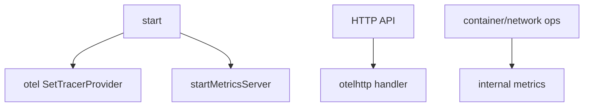

# 第24章 メトリクスと OpenTelemetry

> 本章で読むソース
>
> - [`daemon/command/daemon.go`](https://github.com/moby/moby/blob/docker-v29.6.1/daemon/command/daemon.go)
> - [`daemon/command/metrics.go`](https://github.com/moby/moby/blob/docker-v29.6.1/daemon/command/metrics.go)
> - [`daemon/server/server.go`](https://github.com/moby/moby/blob/docker-v29.6.1/daemon/server/server.go)

## この章の狙い

Prometheus メトリクスサーバと OpenTelemetry トレースが dockerd 起動時にどう初期化されるかを読む。

## 前提

OTEL collector と Prometheus scrape の基本を知っていること。

## OTEL 初期化

`start` は `OTEL_SERVICE_NAME` 未設定時にバイナリ名を入れ、TracerProvider を構築する。

[`daemon/command/daemon.go` L254-L272](https://github.com/moby/moby/blob/docker-v29.6.1/daemon/command/daemon.go#L254-L272)

```go
	const otelServiceNameEnv = "OTEL_SERVICE_NAME"
	if _, ok := os.LookupEnv(otelServiceNameEnv); !ok {
		_ = os.Setenv(otelServiceNameEnv, filepath.Base(os.Args[0]))
	}

	setOTLPProtoDefault()
	otel.SetTextMapPropagator(propagation.NewCompositeTextMapPropagator(propagation.TraceContext{}, propagation.Baggage{}))

	detect.Recorder = detect.NewTraceRecorder()

	tp, otelShutdown := otelutil.NewTracerProvider(ctx, true)
	otel.SetTracerProvider(tp)
	log.G(ctx).Logger.AddHook(tracing.NewLogrusHook())
	opencensus.InstallTraceBridge()
```

終了時は `otelShutdown` でフラッシュする。

[`daemon/command/daemon.go` L417-L419](https://github.com/moby/moby/blob/docker-v29.6.1/daemon/command/daemon.go#L417-L419)

```go
	if err := otelShutdown(context.WithoutCancel(ctx)); err != nil {
		log.G(ctx).WithError(err).Error("Failed to shutdown OTEL tracing")
	}
```

## メトリクスサーバ

`MetricsAddress` が空でなければ TCP リスナを開く。

[`daemon/command/metrics.go` L14-L23](https://github.com/moby/moby/blob/docker-v29.6.1/daemon/command/metrics.go#L14-L23)

```go
func startMetricsServer(addr string) error {
	if addr == "" {
		return nil
	}
	if err := allocateDaemonPort(addr); err != nil {
		return err
	}
	l, err := net.Listen("tcp", addr)
	if err != nil {
		return err
	}
```

`NewDaemon` 成功直後に起動する。

[`daemon/command/daemon.go` L311-L312](https://github.com/moby/moby/blob/docker-v29.6.1/daemon/command/daemon.go#L311-L312)

```go
	if err := startMetricsServer(cli.Config.MetricsAddress); err != nil {
		return errors.Wrap(err, "failed to start metrics server")
```

## HTTP ハンドラのトレース

各 API ルートは `makeHTTPHandler` で `otelhttp` ラップされる。

[`daemon/server/server.go` L49-L52](https://github.com/moby/moby/blob/docker-v29.6.1/daemon/server/server.go#L49-L52)

```go
func (s *Server) makeHTTPHandler(route router.Route) http.HandlerFunc {
	handler := route.Handler()
	operation := route.Method() + " " + route.Path()
	return otelhttp.NewHandler(http.HandlerFunc(func(w http.ResponseWriter, r *http.Request) {
```

## 操作メトリクス

コンテナ作成は `metrics.ContainerActions` でレイテンシを記録する（第10章）。

[`daemon/create.go` L136-L136](https://github.com/moby/moby/blob/docker-v29.6.1/daemon/create.go#L136)

```go
	metrics.ContainerActions.WithValues("create").UpdateSince(start)
```



## 高速化・最適化の工夫

メトリクスアドレス未設定時はサーバを起動せず、小規模環境のオーバーヘッドをゼロにする。
OpenCensus から OTEL へのブリッジで hcsshim 等の既存計測を捨てずに統合する。

`setOTLPProtoDefault` は BuildKit detect パッケージの OTLP 既定を http/protobuf へ揃える。

[`daemon/command/daemon.go` L428-L445](https://github.com/moby/moby/blob/docker-v29.6.1/daemon/command/daemon.go#L428-L445)

```go
func setOTLPProtoDefault() {
	const (
		tracesEnv  = "OTEL_EXPORTER_OTLP_TRACES_PROTOCOL"
		metricsEnv = "OTEL_EXPORTER_OTLP_METRICS_PROTOCOL"
		protoEnv   = "OTEL_EXPORTER_OTLP_PROTOCOL"

		defaultProto = "http/protobuf"
	)

	if os.Getenv(protoEnv) == "" {
		if os.Getenv(tracesEnv) == "" {
			_ = os.Setenv(tracesEnv, defaultProto)
		}
		if os.Getenv(metricsEnv) == "" {
			_ = os.Setenv(metricsEnv, defaultProto)
		}
	}
}
```

## Prometheus ハンドラ

メトリクスサーバは `/metrics` で `go-metrics` を公開する。

[`daemon/command/metrics.go` L25-L27](https://github.com/moby/moby/blob/docker-v29.6.1/daemon/command/metrics.go#L25-L27)

```go
	mux := http.NewServeMux()
	mux.Handle("/metrics", gometrics.Handler())
	go func() {
```

## まとめ

可観測性は起動時に OTEL と Prometheus を初期化し、API と主要操作へ自動計測を載せる。

## 関連する章

- [第2章 dockerd 起動](../part00-overview/02-dockerd-startup.md)
- [第5章 HTTP ルーター](../part01-command/05-http-router.md)
