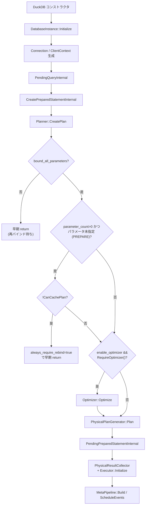

# 第1章 アーキテクチャ全体像

> **本章で読むソース**
>
> - [src/main/database.cpp](https://github.com/duckdb/duckdb/blob/v1.5.4/src/main/database.cpp)
> - [src/main/connection.cpp](https://github.com/duckdb/duckdb/blob/v1.5.4/src/main/connection.cpp)
> - [src/main/client_context.cpp](https://github.com/duckdb/duckdb/blob/v1.5.4/src/main/client_context.cpp)
> - [src/execution/physical_plan_generator.cpp](https://github.com/duckdb/duckdb/blob/v1.5.4/src/execution/physical_plan_generator.cpp)
> - [src/parallel/executor.cpp](https://github.com/duckdb/duckdb/blob/v1.5.4/src/parallel/executor.cpp)
> - [src/include/duckdb/common/vector_size.hpp](https://github.com/duckdb/duckdb/blob/v1.5.4/src/include/duckdb/common/vector_size.hpp)

## この章の狙い

DuckDB のソースを読む前に、プロセス全体の骨格を押さえる。
本章では `DuckDB` と `DatabaseInstance` が担うデータベース単位の共有資源、`ClientContext` が担うセッション単位の状態、そして SQL 文が論理プラン、物理プラン、パイプライン実行へ進む主経路を、`client_context.cpp` の実装に沿って追う。
あわせて、実行エンジンが列単位のバッチ（`STANDARD_VECTOR_SIZE`）で処理する設計思想の入口も示す。

## 前提

読者は C++ の所有権（`shared_ptr`/`unique_ptr`）と、クエリ処理の一般的な段階（パース、バインド、最適化、実行）を知っているものとする。
`Planner` や `Binder` の内部、`Vector` の表現は後続の章で扱う。

## DuckDB と DatabaseInstance の起動

アプリケーションが `DuckDB` オブジェクトを作ると、内部で `DatabaseInstance` が `shared_ptr` として生成され、即座に `Initialize` が呼ばれる。

[src/main/database.cpp L340-L346](https://github.com/duckdb/duckdb/blob/v1.5.4/src/main/database.cpp#L340-L346)

```cpp
DuckDB::DuckDB(const char *path, DBConfig *new_config) : instance(make_shared_ptr<DatabaseInstance>()) {
	instance->Initialize(path, new_config);
	if (instance->config.options.load_extensions) {
		ExtensionHelper::LoadAllExtensions(*this);
	}
	instance->db_manager->FinalizeStartup();
}
```

`DuckDB` は薄いラッパーであり、実体のカタログ、バッファプール、スケジューラはすべて `DatabaseInstance` が所有する。
`Initialize` ではファイルシステム、バッファマネージャ、タスクスケジューラ、接続マネージャ、システムカタログなどが順に立ち上がる。

[src/main/database.cpp L286-L312](https://github.com/duckdb/duckdb/blob/v1.5.4/src/main/database.cpp#L286-L312)

```cpp
	db_file_system = make_uniq<DatabaseFileSystem>(*this);
	local_db_file_system = make_uniq<LocalDatabaseFileSystem>(*this);
	db_manager = make_uniq<DatabaseManager>(*this);
	if (config.buffer_manager) {
		buffer_manager = config.buffer_manager;
	} else {
		buffer_manager = make_uniq<StandardBufferManager>(*this, config.options.temporary_directory);
	}

	log_manager = make_uniq<LogManager>(*this, LogConfig());
	log_manager->Initialize();

	bool enable_external_file_cache = Settings::Get<EnableExternalFileCacheSetting>(config);
	external_file_cache = make_uniq<ExternalFileCache>(*this, enable_external_file_cache);
	result_set_manager = make_uniq<ResultSetManager>(*this);

	scheduler = make_uniq<TaskScheduler>(*this);
	object_cache = make_uniq<ObjectCache>(*config.buffer_pool);
	config.buffer_pool->SetObjectCache(object_cache.get());
	connection_manager = make_uniq<ConnectionManager>();
	extension_manager = make_uniq<ExtensionManager>(*this);

	// initialize the secret manager
	config.secret_manager->Initialize(*this);

	// initialize the system catalog
	db_manager->InitializeSystemCatalog();
```

`BufferManager` と `TaskScheduler` は、後の章で扱う列指向ストレージと並列パイプライン実行の土台になる。
スレッド数の確定はストレージ初期化の後に行われ、カタログ競合を避けるための順序制御が入っている。

## ClientContext と Connection

クライアント接続は `Connection` が表し、実際のセッション状態は `ClientContext` が保持する。
`Connection` のコンストラクタは `DatabaseInstance` への `shared_ptr` を `ClientContext` に渡し、接続マネージャへ登録する。

[src/main/connection.cpp L21-L26](https://github.com/duckdb/duckdb/blob/v1.5.4/src/main/connection.cpp#L21-L26)

```cpp
Connection::Connection(DatabaseInstance &database)
    : context(make_shared_ptr<ClientContext>(database.shared_from_this())) {
	auto &connection_manager = ConnectionManager::Get(database);
	connection_manager.AddConnection(*context);
	connection_manager.AssignConnectionId(*this);
}
```

`ClientContext` は `db`（`DatabaseInstance` への `shared_ptr`）、トランザクション状態、クライアント設定、実行中クエリ（`active_query`）を束ねる。
1つの `DatabaseInstance` に複数の `ClientContext` がぶら下がる形が、マルチクライアント利用の基本構造である。

## クエリ計画の生成

`ClientContext::Query` や `PendingQuery` は、最終的に `CreatePreparedStatementInternal` で論理プランと物理プランを組み立てる。
ここがパーサ以降のコンパイルパイプラインの中心である。

[src/main/client_context.cpp L387-L451](https://github.com/duckdb/duckdb/blob/v1.5.4/src/main/client_context.cpp#L387-L451)

```cpp
shared_ptr<PreparedStatementData> ClientContext::CreatePreparedStatementInternal(ClientContextLock &lock,
                                                                                 const string &query,
                                                                                 unique_ptr<SQLStatement> statement,
                                                                                 PendingQueryParameters parameters) {
	StatementType statement_type = statement->type;
	auto result = make_shared_ptr<PreparedStatementData>(statement_type);

	auto &profiler = QueryProfiler::Get(*this);
	profiler.StartQuery(query, IsExplainAnalyze(statement.get()), true);
	profiler.StartPhase(MetricType::PLANNER);
	Planner logical_planner(*this);
	if (parameters.parameters) {
		auto &parameter_values = *parameters.parameters;
		for (auto &value : parameter_values) {
			logical_planner.parameter_data.emplace(value.first, BoundParameterData(value.second));
		}
	}

	logical_planner.CreatePlan(std::move(statement));
	D_ASSERT(logical_planner.plan || !logical_planner.properties.bound_all_parameters);
	profiler.EndPhase();

	auto logical_plan = std::move(logical_planner.plan);
	// extract the result column names from the plan
	result->properties = logical_planner.properties;
	result->names = logical_planner.names;
	result->types = logical_planner.types;
	result->value_map = std::move(logical_planner.value_map);
	if (!logical_planner.properties.bound_all_parameters) {
		// not all parameters were bound - return
		return result;
	}
#ifdef DEBUG
	logical_plan->Verify(*this);
#endif
	if (result->properties.parameter_count > 0 && !parameters.parameters) {
		// if this is a prepared statement we can choose not to fully plan
		// if we have parameters, we might want to re-bind when they are available as we can then do more optimizations
		// in this situation we check if we want to cache the plan at all
		if (!PreparedStatement::CanCachePlan(*logical_plan)) {
			// we don't - early-out
			result->properties.always_require_rebind = true;
			return result;
		}
	}

	if (config.enable_optimizer && logical_plan->RequireOptimizer()) {
		profiler.StartPhase(MetricType::ALL_OPTIMIZERS);
		Optimizer optimizer(*logical_planner.binder, *this);
		logical_plan = optimizer.Optimize(std::move(logical_plan));
		D_ASSERT(logical_plan);
		profiler.EndPhase();

#ifdef DEBUG
		logical_plan->Verify(*this);
#endif
	}

	// Convert the logical query plan into a physical query plan.
	profiler.StartPhase(MetricType::PHYSICAL_PLANNER);
	PhysicalPlanGenerator physical_planner(*this);
	result->physical_plan = physical_planner.Plan(std::move(logical_plan));
	profiler.EndPhase();
	D_ASSERT(result->physical_plan);
	return result;
}
```

流れは次のとおりである。
`Planner::CreatePlan` で論理演算子木を生成し、条件を満たせば `Optimizer::Optimize` で書き換え、最後に `PhysicalPlanGenerator::Plan` で物理演算子木へ落とす。
プレースホルダが未束縛のときは早期 return し、パラメータ確定後の再バインド余地を残す。

物理プラン生成の本体は `PhysicalPlanGenerator::ResolveAndPlan` にあり、型解決、列参照解決、演算子ごとの `CreatePlan` ディスパッチが続く。

[src/execution/physical_plan_generator.cpp L23-L50](https://github.com/duckdb/duckdb/blob/v1.5.4/src/execution/physical_plan_generator.cpp#L23-L50)

```cpp
unique_ptr<PhysicalPlan> PhysicalPlanGenerator::Plan(unique_ptr<LogicalOperator> op) {
	auto &plan = ResolveAndPlan(std::move(op));
	plan.Verify();
	return std::move(physical_plan);
}

PhysicalOperator &PhysicalPlanGenerator::ResolveAndPlan(unique_ptr<LogicalOperator> op) {
	auto &profiler = QueryProfiler::Get(context);

	// Resolve the types of each operator.
	profiler.StartPhase(MetricType::PHYSICAL_PLANNER_RESOLVE_TYPES);
	op->ResolveOperatorTypes();
	profiler.EndPhase();

	// Resolve the column references.
	profiler.StartPhase(MetricType::PHYSICAL_PLANNER_COLUMN_BINDING);
	ColumnBindingResolver resolver;
	resolver.VisitOperator(*op);
	profiler.EndPhase();

	// Create the main physical plan.
	profiler.StartPhase(MetricType::PHYSICAL_PLANNER_CREATE_PLAN);
	physical_plan = PlanInternal(*op);
	profiler.EndPhase();

	// Return a reference to the root of this plan.
	return physical_plan->Root();
}
```

## クエリ実行の開始

計画ができたあと、実行フェーズでは `PendingQueryInternal` が入口になる。
文を直接渡す経路では `PendingStatementInternal` が `CreatePreparedStatement` を呼び、続けて `PendingPreparedStatementInternal` へ進む。

[src/main/client_context.cpp L845-L867](https://github.com/duckdb/duckdb/blob/v1.5.4/src/main/client_context.cpp#L845-L867)

```cpp
unique_ptr<PendingQueryResult> ClientContext::PendingStatementInternal(ClientContextLock &lock, const string &query,
                                                                       unique_ptr<SQLStatement> statement,
                                                                       const PendingQueryParameters &parameters) {
	// prepare the query for execution
	if (parameters.parameters) {
		PreparedStatement::VerifyParameters(*parameters.parameters, statement->named_param_map);
	}

	auto prepared = CreatePreparedStatement(lock, query, std::move(statement), parameters,
	                                        PreparedStatementMode::PREPARE_AND_EXECUTE);

	idx_t parameter_count = !parameters.parameters ? 0 : parameters.parameters->size();
	if (prepared->properties.parameter_count > 0 && parameter_count == 0) {
		string error_message = StringUtil::Format("Expected %lld parameters, but none were supplied",
		                                          prepared->properties.parameter_count);
		return ErrorResult<PendingQueryResult>(InvalidInputException(error_message), query);
	}
	if (!prepared->properties.bound_all_parameters) {
		return ErrorResult<PendingQueryResult>(InvalidInputException("Not all parameters were bound"), query);
	}
	// execute the prepared statement
	CheckIfPreparedStatementIsExecutable(*prepared);
	return PendingPreparedStatementInternal(lock, std::move(prepared), parameters);
}
```

`PendingPreparedStatementInternal` では `Executor` を生成し、`PhysicalResultCollector::GetResultCollector` が返す sink 演算子を `Initialize` に渡す。
collector は元の `PhysicalPlan` 木へ挿入されない。
`PhysicalResultCollector` のコンストラクタは `PreparedStatementData::physical_plan->Root()` を参照として保持し、`Executor::Initialize(unique_ptr<PhysicalOperator>)` が collector 自体を `owned_plan` として所有する。
`active_query->prepared` が `PreparedStatementData`（物理プランを含む）を保持するため、collector が参照する元 root の寿命は実行中も保たれる。

[src/execution/operator/helper/physical_result_collector.cpp L18-L21](https://github.com/duckdb/duckdb/blob/v1.5.4/src/execution/operator/helper/physical_result_collector.cpp#L18-L21)

```cpp
PhysicalResultCollector::PhysicalResultCollector(PhysicalPlan &physical_plan, PreparedStatementData &data)
    : PhysicalOperator(physical_plan, PhysicalOperatorType::RESULT_COLLECTOR, {LogicalType::BOOLEAN}, 0),
      statement_type(data.statement_type), properties(data.properties), memory_type(data.memory_type),
      plan(data.physical_plan->Root()), names(data.names) {
```

[src/parallel/executor.cpp L377-L380](https://github.com/duckdb/duckdb/blob/v1.5.4/src/parallel/executor.cpp#L377-L380)

```cpp
void Executor::Initialize(unique_ptr<PhysicalOperator> physical_plan_p) {
	Reset();
	owned_plan = std::move(physical_plan_p);
	InitializeInternal(*owned_plan);
}
```

[src/main/client_context.cpp L555-L606](https://github.com/duckdb/duckdb/blob/v1.5.4/src/main/client_context.cpp#L555-L606)

```cpp
unique_ptr<PendingQueryResult>
ClientContext::PendingPreparedStatementInternal(ClientContextLock &lock,
                                                shared_ptr<PreparedStatementData> statement_data_p,
                                                const PendingQueryParameters &parameters) {
	D_ASSERT(active_query);
	auto &statement_data = *statement_data_p;
	BindPreparedStatementParameters(statement_data, parameters);

	// Create the query executor.
	active_query->executor = make_uniq<Executor>(*this);
	auto &executor = *active_query->executor;

	if (config.enable_progress_bar) {
		progress_bar_display_create_func_t display_create_func = nullptr;
		if (config.print_progress_bar) {
			// Use either a custom display function, or the default.
			display_create_func =
			    config.display_create_func ? config.display_create_func : ProgressBar::DefaultProgressBarDisplay;
		}
		active_query->progress_bar =
		    make_uniq<ProgressBar>(executor, NumericCast<idx_t>(config.wait_time), display_create_func);
		active_query->progress_bar->Start();
		query_progress.Restart();
	}

	const auto stream_result = parameters.query_parameters.output_type == QueryResultOutputType::ALLOW_STREAMING &&
	                           statement_data.properties.output_type == QueryResultOutputType::ALLOW_STREAMING;

	// Decide how to get the result collector.
	get_result_collector_t get_collector = PhysicalResultCollector::GetResultCollector;
	auto &client_config = ClientConfig::GetConfig(*this);
	if (!stream_result && client_config.get_result_collector) {
		get_collector = client_config.get_result_collector;
	}
	statement_data.output_type =
	    stream_result ? QueryResultOutputType::ALLOW_STREAMING : QueryResultOutputType::FORCE_MATERIALIZED;
	statement_data.memory_type = parameters.query_parameters.memory_type;

	// Get the result collector and initialize the executor.
	auto collector = get_collector(*this, statement_data);
	D_ASSERT(collector->type == PhysicalOperatorType::RESULT_COLLECTOR);
	executor.Initialize(std::move(collector));

	auto types = executor.GetTypes();
	D_ASSERT(types == statement_data.types);
	D_ASSERT(!active_query->HasOpenResult());

	auto pending_result =
	    make_uniq<PendingQueryResult>(shared_from_this(), *statement_data_p, std::move(types), stream_result);
	active_query->prepared = std::move(statement_data_p);
	active_query->SetOpenResult(*pending_result);
	return pending_result;
}
```

`Executor::Initialize` の内部では、物理プランから `MetaPipeline` を構築し、パイプラインをスケジュールする。

[src/parallel/executor.cpp L388-L427](https://github.com/duckdb/duckdb/blob/v1.5.4/src/parallel/executor.cpp#L388-L427)

```cpp
void Executor::InitializeInternal(PhysicalOperator &plan) {
	auto &scheduler = TaskScheduler::GetScheduler(context);
	{
		lock_guard<mutex> elock(executor_lock);
		physical_plan = &plan;

		this->profiler = ClientData::Get(context).profiler;
		profiler->Initialize(plan);
		this->producer = scheduler.CreateProducer();

		// build and ready the pipelines
		PipelineBuildState state;
		auto root_pipeline = make_shared_ptr<MetaPipeline>(*this, state, nullptr);
		root_pipeline->Build(*physical_plan);
		root_pipeline->Ready();

		// ready recursive cte pipelines too
		for (auto &rec_cte_ref : recursive_ctes) {
			auto &rec_cte = rec_cte_ref.get().Cast<PhysicalRecursiveCTE>();
			rec_cte.recursive_meta_pipeline->Ready();
		}

		// set root pipelines, i.e., all pipelines that end in the final sink
		root_pipeline->GetPipelines(root_pipelines, false);
		root_pipeline_idx = 0;

		// collect all meta-pipelines from the root pipeline
		vector<shared_ptr<MetaPipeline>> to_schedule;
		root_pipeline->GetMetaPipelines(to_schedule, true, true);

		// number of 'PipelineCompleteEvent's is equal to the number of meta pipelines, so we have to set it here
		total_pipelines = to_schedule.size();

		// collect all pipelines from the root pipelines (recursively) for the progress bar and verify them
		root_pipeline->GetPipelines(pipelines, true);

		// finally, verify and schedule
		VerifyPipelines();
		ScheduleEvents(to_schedule);
	}
}
```

ここまでが「コンパイル（計画）」と「実行準備」の境界である。
チャンク単位の実際の演算は、後続章の `PipelineExecutor` と各 `PhysicalOperator` が担う。

## ベクトル化実行の単位

DuckDB の演算子は行単位ではなく、固定長の列ベクトル束（`DataChunk`）を受け渡す。
バッチ長の既定値は `STANDARD_VECTOR_SIZE` で、2の冪に制約されている。

[src/include/duckdb/common/vector_size.hpp L15-L25](https://github.com/duckdb/duckdb/blob/v1.5.4/src/include/duckdb/common/vector_size.hpp#L15-L25)

```cpp
//! The default standard vector size
#define DEFAULT_STANDARD_VECTOR_SIZE 2048U

//! The vector size used in the execution engine
#ifndef STANDARD_VECTOR_SIZE
#define STANDARD_VECTOR_SIZE DEFAULT_STANDARD_VECTOR_SIZE
#endif

#if (STANDARD_VECTOR_SIZE & (STANDARD_VECTOR_SIZE - 1) != 0)
#error The vector size must be a power of two
#endif
```

列指向ストレージ（第5部）から読み出した列データは、このバッチ単位で `Vector` に載り、演算子チェーンへ流れる。
ストレージレイアウトと実行レイアウトがどちらも列中心である点が、分析ワークロード向けの設計の根である。

## 処理の流れ



計画段階で作られる `PreparedStatementData` は `shared_ptr` で保持される。
`PendingPreparedStatement` は `RequireRebind` を確認し、再バインドが不要なら物理プランをそのまま再利用する。
カタログ変更、パラメータ型の変化、`always_require_rebind` などの条件では `RebindPreparedStatement` が計画を作り直す。

[src/main/client_context.cpp L609-L630](https://github.com/duckdb/duckdb/blob/v1.5.4/src/main/client_context.cpp#L609-L630)

```cpp
unique_ptr<PendingQueryResult> ClientContext::PendingPreparedStatement(ClientContextLock &lock, const string &query,
                                                                       shared_ptr<PreparedStatementData> prepared,
                                                                       const PendingQueryParameters &parameters) {
	CheckIfPreparedStatementIsExecutable(*prepared);

	RebindQueryInfo rebind = RebindQueryInfo::DO_NOT_REBIND;
	if (prepared->RequireRebind(*this, parameters.parameters)) {
		rebind = RebindQueryInfo::ATTEMPT_TO_REBIND;
	}
	// ... (中略) ...
	if (rebind == RebindQueryInfo::ATTEMPT_TO_REBIND) {
		RebindPreparedStatement(lock, query, prepared, parameters);
		CheckIfPreparedStatementIsExecutable(*prepared); // rerun this too as modified_databases might have changed
	}
	return PendingPreparedStatementInternal(lock, prepared, parameters);
}
```

実行段階の `Executor` はクエリごとに `unique_ptr` で生成され、終了時に破棄される。

## 高速化と最適化の工夫

プレースホルダ付き文では、パラメータ未確定の段階で物理プランまで進めない選択肢がある。
`CanCachePlan` が false のときは `always_require_rebind` を立てて早期 return し、パラメータ確定後の再バインドでより積極的な最適化をかけられるようにしている。
これは毎回フルコンパイルするより、キャッシュ可能な文だけ計画を温存するための分岐である。

実行エンジン側では `STANDARD_VECTOR_SIZE` の既定値を 2048（2の冪）とし、各ビルドではこの2の冪の固定長バッチで演算子を呼び出すことで行単位の仮想関数呼び出しを償却する。
1行ずつ仮想関数を呼ぶ方式と比べ、演算子が連続メモリ上の数千行をまとめて処理できるため、CPU キャッシュと分岐予測の両方に有利になる。
2の冪制約は `vector_size.hpp` でコンパイル時に検査され、`ValidityMask` は `STANDARD_VECTOR_SIZE` からマスクサイズを定数計算する。

[src/include/duckdb/common/types/validity_mask.hpp L64-L66](https://github.com/duckdb/duckdb/blob/v1.5.4/src/include/duckdb/common/types/validity_mask.hpp#L64-L66)

```cpp
	static constexpr const idx_t BITS_PER_VALUE = ValidityBuffer::BITS_PER_VALUE;
	static constexpr const idx_t STANDARD_ENTRY_COUNT = (STANDARD_VECTOR_SIZE + (BITS_PER_VALUE - 1)) / BITS_PER_VALUE;
	static constexpr const idx_t STANDARD_MASK_SIZE = STANDARD_ENTRY_COUNT * sizeof(V);
```

`Executor::InitializeInternal` では物理プランから `MetaPipeline` を一括構築し、`TaskScheduler` へイベントとして投入する。
演算子ごとにスレッドを立てるのではなく、パイプライン単位でタスクを割り当てるため、並列度と同期コストのバランスを取りやすい。

## まとめ

`DuckDB` は `DatabaseInstance` の共有資源を束ね、`ClientContext` がセッション単位のクエリ状態を持つ。
`CreatePreparedStatementInternal` が `Planner` で論理プランを作り、条件を満たせば `Optimizer` を通し、`PhysicalPlanGenerator` で物理プランへ落とす。
`PendingPreparedStatementInternal` が `PhysicalResultCollector` 経由で `Executor::Initialize` を呼び、パイプライン実行を始める。
実行データは `STANDARD_VECTOR_SIZE` 件の列ベクトルとして流れ、列指向ストレージとベクトル化実行が同じ設計思想で接続される。

## 関連する章

- 第6章（パーサとトランスフォーマ）：`Planner::CreatePlan` の入力となる `SQLStatement` の生成
- 第10章（オプティマイザ全体像）：`Optimizer::Optimize` の pass 順序
- 第14章（物理プラン生成）：`PhysicalPlanGenerator::CreatePlan` の演算子別分岐
- 第15章（パイプライン実行）：`Executor` と `PipelineExecutor` によるチャンク処理
- 第3章（Vector とベクトル化）：`STANDARD_VECTOR_SIZE` と `Vector` の表現
