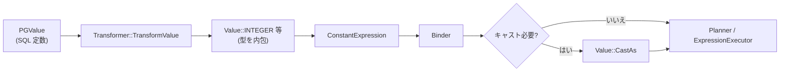

# 第2章 LogicalType と Value

> **本章で読むソース**
>
> - [src/common/types.cpp](https://github.com/duckdb/duckdb/blob/v1.5.4/src/common/types.cpp)
> - [src/common/types/value.cpp](https://github.com/duckdb/duckdb/blob/v1.5.4/src/common/types/value.cpp)
> - [src/include/duckdb/common/types.hpp](https://github.com/duckdb/duckdb/blob/v1.5.4/src/include/duckdb/common/types.hpp)
> - [src/include/duckdb/common/types/value.hpp](https://github.com/duckdb/duckdb/blob/v1.5.4/src/include/duckdb/common/types/value.hpp)

## この章の狙い

DuckDB では、SQL の型（`LogicalType`）、メモリ上の物理表現（`PhysicalType`）、定数1個の値（`Value`）が明確に分かれている。
本章では `common/types.cpp` と `common/types/value.cpp` を追い、型 ID から物理型への対応、スカラー値の所有モデル、キャスト経路を押さえる。
後続の `Vector` や `DataChunk` は、ここで定義された型契約の上に載る。

## 前提

読者は SQL の基本型（整数、浮動小数、文字列、構造体）と、C++ の `shared_ptr` による共有所有を知っているものとする。
`Vector` によるベクトル化表現は第3章で扱う。

## LogicalType の構成

`LogicalType` は論理型 ID（`LogicalTypeId`）、対応する物理型（`physical_type_`）、追加情報（`type_info_`）の3要素で構成される。
コンストラクタは ID を受け取った時点で `GetInternalType` を呼び、物理型をキャッシュする。

[src/common/types.cpp L38-L47](https://github.com/duckdb/duckdb/blob/v1.5.4/src/common/types.cpp#L38-L47)

```cpp
LogicalType::LogicalType() : LogicalType(LogicalTypeId::INVALID) {
}

LogicalType::LogicalType(LogicalTypeId id) : id_(id) {
	physical_type_ = GetInternalType();
}
LogicalType::LogicalType(LogicalTypeId id, shared_ptr<ExtraTypeInfo> type_info_p)
    : id_(id), type_info_(std::move(type_info_p)) {
	physical_type_ = GetInternalType();
}
```

ヘッダ側では、`InternalType()` がキャッシュ済みの `physical_type_` を返す薄いアクセサとして公開される。
ネスト型かどうかは物理型が `STRUCT`/`LIST`/`ARRAY` かで判定する。

[src/include/duckdb/common/types.hpp L255-L285](https://github.com/duckdb/duckdb/blob/v1.5.4/src/include/duckdb/common/types.hpp#L255-L285)

```cpp
struct LogicalType {
	DUCKDB_API LogicalType();
	DUCKDB_API LogicalType(LogicalTypeId id); // NOLINT: Allow implicit conversion from `LogicalTypeId`
	DUCKDB_API LogicalType(LogicalTypeId id, shared_ptr<ExtraTypeInfo> type_info);
	DUCKDB_API LogicalType(const LogicalType &other);
	DUCKDB_API LogicalType(LogicalType &&other) noexcept;

	DUCKDB_API ~LogicalType();

	inline LogicalTypeId id() const { // NOLINT: mimic std casing
		return id_;
	}
	inline PhysicalType InternalType() const {
		return physical_type_;
	}
	inline const optional_ptr<ExtraTypeInfo> AuxInfo() const {
		return type_info_.get();
	}
	inline bool IsNested() const {
		auto internal = InternalType();
		if (internal == PhysicalType::STRUCT) {
			return true;
		}
		if (internal == PhysicalType::LIST) {
			return true;
		}
		if (internal == PhysicalType::ARRAY) {
			return true;
		}
		return false;
	}
```

`ExtraTypeInfo` は DECIMAL の精度、LIST の子型、STRUCT のフィールド名など、ID だけでは表せない情報を担う。
通常の C++ コピーでは `type_info_` を共有し、明示的な `Copy`/`DeepCopy` では `ExtraTypeInfo` を複製できる（ENUM 型は例外）。

[src/common/types.cpp L49-L51](https://github.com/duckdb/duckdb/blob/v1.5.4/src/common/types.cpp#L49-L51)

```cpp
LogicalType::LogicalType(const LogicalType &other)
    : id_(other.id_), physical_type_(other.physical_type_), type_info_(other.type_info_) {
}
```

[src/common/types.cpp L1413-L1428](https://github.com/duckdb/duckdb/blob/v1.5.4/src/common/types.cpp#L1413-L1428)

```cpp
LogicalType LogicalType::Copy() const {
	LogicalType copy = *this;
	if (type_info_ && type_info_->type != ExtraTypeInfoType::ENUM_TYPE_INFO) {
		// We copy (i.e., create new) type info, unless the type is an ENUM, otherwise we have to copy the whole dict
		copy.type_info_ = type_info_->Copy();
	}
	return copy;
}

LogicalType LogicalType::DeepCopy() const {
	LogicalType copy = *this;
	if (type_info_ && type_info_->type != ExtraTypeInfoType::ENUM_TYPE_INFO) {
		// We copy (i.e., create new) type info, unless the type is an ENUM, otherwise we have to copy the whole dict
		copy.type_info_ = type_info_->DeepCopy();
	}
	return copy;
}
```

## LogicalType から PhysicalType への対応

`GetInternalType` は `LogicalTypeId` から `PhysicalType` への写像を switch で定義する。
同じ論理型でも、格納幅の違う物理型へ落とす例（DECIMAL の桁幅に応じた整数型）がここに集約される。

[src/common/types.cpp L61-L99](https://github.com/duckdb/duckdb/blob/v1.5.4/src/common/types.cpp#L61-L99)

```cpp
PhysicalType LogicalType::GetInternalType() {
	switch (id_) {
	case LogicalTypeId::BOOLEAN:
		return PhysicalType::BOOL;
	case LogicalTypeId::TINYINT:
		return PhysicalType::INT8;
	case LogicalTypeId::UTINYINT:
		return PhysicalType::UINT8;
	case LogicalTypeId::SMALLINT:
		return PhysicalType::INT16;
	case LogicalTypeId::USMALLINT:
		return PhysicalType::UINT16;
	case LogicalTypeId::SQLNULL:
	case LogicalTypeId::DATE:
	case LogicalTypeId::INTEGER:
		return PhysicalType::INT32;
	case LogicalTypeId::UINTEGER:
		return PhysicalType::UINT32;
	case LogicalTypeId::BIGINT:
	case LogicalTypeId::TIME:
	case LogicalTypeId::TIME_NS:
	case LogicalTypeId::TIMESTAMP:
	case LogicalTypeId::TIMESTAMP_SEC:
	case LogicalTypeId::TIMESTAMP_NS:
	case LogicalTypeId::TIMESTAMP_MS:
	case LogicalTypeId::TIME_TZ:
	case LogicalTypeId::TIMESTAMP_TZ:
		return PhysicalType::INT64;
	case LogicalTypeId::UBIGINT:
		return PhysicalType::UINT64;
	case LogicalTypeId::UHUGEINT:
		return PhysicalType::UINT128;
	case LogicalTypeId::HUGEINT:
	case LogicalTypeId::UUID:
		return PhysicalType::INT128;
	case LogicalTypeId::FLOAT:
		return PhysicalType::FLOAT;
	case LogicalTypeId::DOUBLE:
		return PhysicalType::DOUBLE;
```

`VARCHAR` や `BLOB` は `PhysicalType::VARCHAR`（可変長ポインタ表現）へ、ネスト型は `STRUCT`/`LIST`/`ARRAY` へ写像される。
論理上は別型でも、実行時のメモリレイアウトが同じ物理型に集約されることで、下位のベクトル演算を共通化できる。

## PhysicalType とメモリサイズ

`PhysicalType` は `LogicalType::InternalType()` が返す実行時の物理表現を表す。
`Value` は固定 `union` のメンバーを `type_.InternalType()` に応じて使い分ける。
`GetTypeIdSize` は物理型ごとのバイトサイズを返し、`VectorCache`、`ColumnSegment`、`TupleDataLayout` など列バッファのレイアウト計算に使われる。

[src/common/types.cpp L320-L358](https://github.com/duckdb/duckdb/blob/v1.5.4/src/common/types.cpp#L320-L358)

```cpp
idx_t GetTypeIdSize(PhysicalType type) {
	switch (type) {
	case PhysicalType::BIT:
	case PhysicalType::BOOL:
		return sizeof(bool);
	case PhysicalType::INT8:
		return sizeof(int8_t);
	case PhysicalType::INT16:
		return sizeof(int16_t);
	case PhysicalType::INT32:
		return sizeof(int32_t);
	case PhysicalType::INT64:
		return sizeof(int64_t);
	case PhysicalType::UINT8:
		return sizeof(uint8_t);
	case PhysicalType::UINT16:
		return sizeof(uint16_t);
	case PhysicalType::UINT32:
		return sizeof(uint32_t);
	case PhysicalType::UINT64:
		return sizeof(uint64_t);
	case PhysicalType::INT128:
		return sizeof(hugeint_t);
	case PhysicalType::UINT128:
		return sizeof(uhugeint_t);
	case PhysicalType::FLOAT:
		return sizeof(float);
	case PhysicalType::DOUBLE:
		return sizeof(double);
	case PhysicalType::VARCHAR:
		return sizeof(string_t);
	case PhysicalType::INTERVAL:
		return sizeof(interval_t);
	case PhysicalType::STRUCT:
	case PhysicalType::UNKNOWN:
	case PhysicalType::ARRAY:
		return 0; // no own payload
	case PhysicalType::LIST:
		return sizeof(list_entry_t); // offset + len
	default:
```

`STRUCT` や `ARRAY` は自身のペイロードを持たず（サイズ 0）、子 `Vector` 側にデータが置かれる。
この分離により、ネスト型でも親列のメタデータ操作を固定長扱いで済ませられる。

型の等価判定は ID の一致に加え、`ExtraTypeInfo` の内容比較を行う。

[src/common/types.cpp L2071-L2076](https://github.com/duckdb/duckdb/blob/v1.5.4/src/common/types.cpp#L2071-L2076)

```cpp
bool LogicalType::operator==(const LogicalType &rhs) const {
	if (id_ != rhs.id_) {
		return false;
	}
	return EqualTypeInfo(rhs);
}
```

## Value の表現

`Value` は「型付きのスカラー1個」を表すクラスである。
プリミティブは `value_` 共用体にインライン格納し、可変長やネスト値は `value_info_`（`shared_ptr<ExtraValueInfo>`）へ逃がす。

[src/common/types/value.cpp L129-L166](https://github.com/duckdb/duckdb/blob/v1.5.4/src/common/types/value.cpp#L129-L166)

```cpp
Value::Value(LogicalType type) : type_(std::move(type)), is_null(true) {
}

Value::Value(int32_t val) : type_(LogicalType::INTEGER), is_null(false) {
	value_.integer = val;
}

Value::Value(bool val) : type_(LogicalType::BOOLEAN), is_null(false) {
	value_.boolean = val;
}

Value::Value(int64_t val) : type_(LogicalType::BIGINT), is_null(false) {
	value_.bigint = val;
}

Value::Value(float val) : type_(LogicalType::FLOAT), is_null(false) {
	value_.float_ = val;
}

Value::Value(double val) : type_(LogicalType::DOUBLE), is_null(false) {
	value_.double_ = val;
}

Value::Value(const char *val) : Value(val ? string(val) : string()) {
}

Value::Value(std::nullptr_t val) : Value(LogicalType::VARCHAR) {
}

Value::Value(string_t val) : Value(val.GetString()) {
}

Value::Value(string val) : type_(LogicalType::VARCHAR), is_null(false) {
	if (!Value::StringIsValid(val.c_str(), val.size())) {
		throw ErrorManager::InvalidUnicodeError(val, "value construction");
	}
	value_info_ = make_shared_ptr<StringValueInfo>(std::move(val));
}
```

文字列は `StringValueInfo` に実体を置き、`value_` にはポインタを持たない。
コピー時は `type_` と `value_info_` を共有するため、大きなネスト値の複製コストを抑えられる。

[src/common/types/value.cpp L178-L180](https://github.com/duckdb/duckdb/blob/v1.5.4/src/common/types/value.cpp#L178-L180)

```cpp
Value::Value(const Value &other)
    : type_(other.type_), is_null(other.is_null), value_(other.value_), value_info_(other.value_info_) {
}
```

[src/include/duckdb/common/types/value.hpp L226-L229](https://github.com/duckdb/duckdb/blob/v1.5.4/src/include/duckdb/common/types/value.hpp#L226-L229)

```cpp
	//! Return a copy of this value
	Value Copy() const {
		return Value(*this);
	}
```

比較演算は `ValueOperations` に委譲され、型ごとのセマンティクスを一箇所に集約する。

[src/common/types/value.cpp L1974-L1976](https://github.com/duckdb/duckdb/blob/v1.5.4/src/common/types/value.cpp#L1974-L1976)

```cpp
bool Value::operator==(const Value &rhs) const {
	return ValueOperations::Equals(*this, rhs);
}
```

## Value のキャスト

定数の型変換は `CastAs` が入口である。
`TryCastAs` は1要素の `Vector` を input/result に作り、`VectorOperations::TryCast`（`count=1`）を呼んで `result.GetValue(0)` を返す。
この経路でバインダや実行時式評価と同じキャスト規則を共有する。

[src/common/types/value.cpp L2022-L2034](https://github.com/duckdb/duckdb/blob/v1.5.4/src/common/types/value.cpp#L2022-L2034)

```cpp
bool Value::TryCastAs(CastFunctionSet &set, GetCastFunctionInput &get_input, const LogicalType &target_type,
                      Value &new_value, string *error_message, bool strict) const {
	if (type_ == target_type) {
		new_value = Copy();
		return true;
	}
	Vector input(*this);
	Vector result(target_type);
	if (!VectorOperations::TryCast(set, get_input, input, result, 1, error_message, strict)) {
		return false;
	}
	new_value = result.GetValue(0);
	return true;
}
```

[src/common/types/value.cpp L2050-L2066](https://github.com/duckdb/duckdb/blob/v1.5.4/src/common/types/value.cpp#L2050-L2066)

```cpp
Value Value::CastAs(CastFunctionSet &set, GetCastFunctionInput &get_input, const LogicalType &target_type,
                    bool strict) const {
	if (target_type.id() == LogicalTypeId::ANY) {
		return *this;
	}
	Value new_value;
	string error_message;
	if (!TryCastAs(set, get_input, target_type, new_value, &error_message, strict)) {
		throw InvalidInputException("Failed to cast value: %s", error_message);
	}
	return new_value;
}

Value Value::CastAs(ClientContext &context, const LogicalType &target_type, bool strict) const {
	GetCastFunctionInput get_input(context);
	return CastAs(CastFunctionSet::Get(context), get_input, target_type, strict);
}
```

`TryCastAs` 系はインプレース更新版もあり、失敗時に元の `Value` を壊さない選択ができる。
プレースホルダ束縛（第1章の `BoundParameterData`）や定数畳み込みで、ここが頻繁に呼ばれる。

## 処理の流れ

型と値がクエリ処理のどこで接するかを、スカラー定数の経路に絞って示す。



SQL リテラルは `TransformValue` が `Value::INTEGER` 等を直接構築し `ConstantExpression` に入れる。
`Value` 自身が `LogicalType` を保持するため、型決定と値構築はこの段階で一体となる。

[src/parser/transform/expression/transform_constant.cpp L12-L19](https://github.com/duckdb/duckdb/blob/v1.5.4/src/parser/transform/expression/transform_constant.cpp#L12-L19)

```cpp
unique_ptr<ConstantExpression> Transformer::TransformValue(duckdb_libpgquery::PGValue val) {
	switch (val.type) {
	case duckdb_libpgquery::T_PGInteger:
		D_ASSERT(val.val.ival <= NumericLimits<int32_t>::Maximum());
		return make_uniq<ConstantExpression>(Value::INTEGER((int32_t)val.val.ival));
	case duckdb_libpgquery::T_PGBitString: // FIXME: this should actually convert to BLOB
	case duckdb_libpgquery::T_PGString:
		return make_uniq<ConstantExpression>(Value(string(val.val.str)));
```

`LogicalType` 作成時に `physical_type_` が確定するため、以降の `Vector` 初期化や `GetTypeIdSize` は ID の再解決なしで進める。
`Value` はスカラー用、`Vector` はバッチ用という役割分担が、この時点で固定される。

## 高速化と最適化の工夫

`LogicalType` は生成時に `physical_type_` をキャッシュする。
実行中に `GetInternalType` の巨大 switch を毎回踏まなくてよいため、演算子やストレージ層が型 ID ではなく `InternalType()` で分岐できる。

DECIMAL は桁幅に応じて `INT16`/`INT32`/`INT64`/`INT128` のいずれかへ落とす（`GetInternalType` の `DECIMAL` 分岐）。
必要最小の整数幅を選ぶことで、固定長列のメモリ占有を減らし、ベクトル命令で同時処理できる要素数を増やし得る。

`Value` の可変長データは `shared_ptr<ExtraValueInfo>` に置く。
コピーはポインタの共有で済み、文字列やネスト構造を含む定数の複製がバインド処理のボトルネックになりにくい。

`GetTypeIdSize` が `STRUCT`/`ARRAY` で 0 を返す設計は、ネストデータを子バッファへ分離する列指向レイアウトと一致する。
親列はメタデータだけを扱い、実データは子 `Vector` 側でベクトル化演算する（第3章、第5章）。

## まとめ

`LogicalType` は SQL 型と `PhysicalType` の対応を保持し、ネストや DECIMAL の追加情報を `ExtraTypeInfo` で持つ。
`Value` はスカラー1個を型付きで表し、プリミティブはインライン、可変長は `value_info_` で共有する。
`CastAs` は内部で `TryCastAs` を呼び、`VectorOperations::TryCast` 経由で実行時と同じ規則を使う。
定数処理と式実行の型変換を一本化する。

## 関連する章

- 第1章（アーキテクチャ全体像）：`Planner` が `logical_planner.types` を埋める流れ
- 第3章（Vector とベクトル化）：`PhysicalType` に基づく `Vector` のバッファ表現
- 第4章（DataChunk と ColumnDataCollection）：複数 `Vector` の束ね方
- 第8章（式のバインド）：定数式から `Value` への変換
- 第17章（式実行）：`Value` と `Vector` の橋渡し
