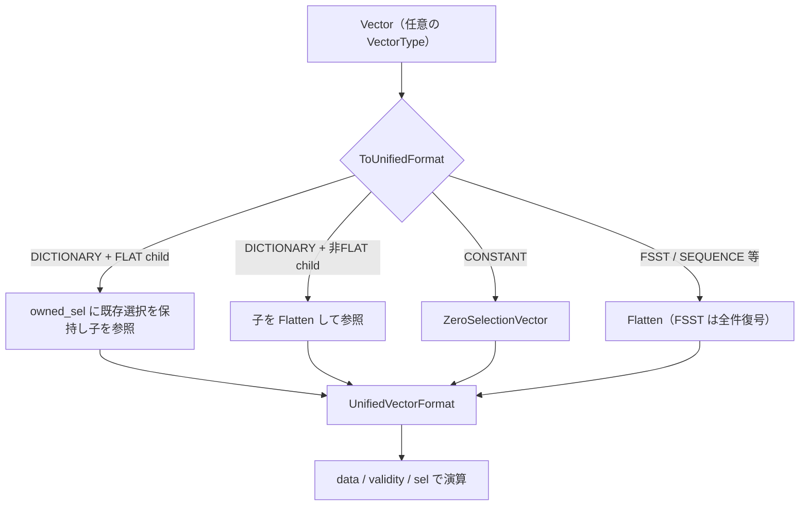

# 第3章 Vector とベクトル化

> **本章で読むソース**
>
> - [src/common/types/vector.cpp](https://github.com/duckdb/duckdb/blob/v1.5.4/src/common/types/vector.cpp)
> - [src/include/duckdb/common/enums/vector_type.hpp](https://github.com/duckdb/duckdb/blob/v1.5.4/src/include/duckdb/common/enums/vector_type.hpp)
> - [src/common/types/validity_mask.cpp](https://github.com/duckdb/duckdb/blob/v1.5.4/src/common/types/validity_mask.cpp)
> - [src/common/types/selection_vector.cpp](https://github.com/duckdb/duckdb/blob/v1.5.4/src/common/types/selection_vector.cpp)

## この章の狙い

`Vector` は DuckDB 実行エンジンが扱う列データの基本単位である。
本章では `VectorType` の5種（FLAT、CONSTANT、DICTIONARY、FSST、SEQUENCE）、`ToUnifiedFormat` と `Flatten` による正規化、`ValidityMask` と `SelectionVector` の役割を、`vector.cpp` を中心に追う。

## 前提

第2章で `LogicalType` と `PhysicalType` の対応を読んでいるものとする。
`DataChunk` が複数 `Vector` を束ねる点は第4章で扱う。

## VectorType の5種

`Vector` は常に FLAT というわけではない。
`VectorType` は圧縮や定数表現を表し、演算子は `ToUnifiedFormat` で共通の読み取り形式へ寄せる。

[src/include/duckdb/common/enums/vector_type.hpp L15-L21](https://github.com/duckdb/duckdb/blob/v1.5.4/src/include/duckdb/common/enums/vector_type.hpp#L15-L21)

```cpp
enum class VectorType : uint8_t {
	FLAT_VECTOR,       // Flat vectors represent a standard uncompressed vector
	FSST_VECTOR,       // Contains string data compressed with FSST
	CONSTANT_VECTOR,   // Constant vector represents a single constant
	DICTIONARY_VECTOR, // Dictionary vector represents a selection vector on top of another vector
	SEQUENCE_VECTOR    // Sequence vector represents a sequence with a start point and an increment
};
```

FLAT は密な配列、CONSTANT は全行同一値、DICTIONARY は子ベクトルへの間接参照、FSST は文字列の FSST 圧縮、SEQUENCE は等差数列をメタデータだけで表す。
新規確保時は FLAT が既定であり、`Reference` や `Slice` で他の表現へ切り替わる。

[src/common/types/vector.cpp L55-L86](https://github.com/duckdb/duckdb/blob/v1.5.4/src/common/types/vector.cpp#L55-L86)

```cpp
Vector::Vector(LogicalType type_p, bool create_data, bool initialize_to_zero, idx_t capacity)
    : vector_type(VectorType::FLAT_VECTOR), type(std::move(type_p)), data(nullptr), validity(capacity) {
	if (create_data) {
		Initialize(initialize_to_zero, capacity);
	}
}

Vector::Vector(LogicalType type_p, idx_t capacity) : Vector(std::move(type_p), true, false, capacity) {
}

Vector::Vector(LogicalType type_p, data_ptr_t dataptr)
    : vector_type(VectorType::FLAT_VECTOR), type(std::move(type_p)), data(dataptr) {
	if (dataptr && !type.IsValid()) {
		throw InternalException("Cannot create a vector of type INVALID!");
	}
}

Vector::Vector(const VectorCache &cache) : type(cache.GetType()) {
	ResetFromCache(cache);
}

Vector::Vector(Vector &other) : type(other.type) {
	Reference(other);
}

Vector::Vector(const Vector &other, const SelectionVector &sel, idx_t count) : type(other.type) {
	Slice(other, sel, count);
}

Vector::Vector(const Vector &other, idx_t offset, idx_t end) : type(other.type) {
	Slice(other, offset, end);
}
```

`Slice` コンストラクタは `SelectionVector` を受け取り、フィルタや結合で「見える行だけ」を DICTIONARY 化する入口になる。

## Flatten による正規化

多くの演算は FLAT 前提で書かれている。
`Flatten` は DICTIONARY や CONSTANT を展開し、必要なら子ベクトルも再帰的に平坦化する。

[src/common/types/vector.cpp L1003-L1024](https://github.com/duckdb/duckdb/blob/v1.5.4/src/common/types/vector.cpp#L1003-L1024)

```cpp
	case VectorType::DICTIONARY_VECTOR: {
		// create a new flat vector of this type
		Vector other(GetType(), count);
		// now copy the data of this vector to the other vector, removing the selection vector in the process
		VectorOperations::Copy(*this, other, count, 0, 0);
		// create a reference to the data in the other vector
		this->Reference(other);
		break;
	}
	case VectorType::CONSTANT_VECTOR: {
		bool is_null = ConstantVector::IsNull(*this);
		// allocate a new buffer for the vector
		auto old_buffer = std::move(buffer);
		auto old_data = data;
		buffer = VectorBuffer::CreateStandardVector(type, MaxValue<idx_t>(STANDARD_VECTOR_SIZE, count));
		if (old_buffer) {
			D_ASSERT(buffer->GetAuxiliaryData() == nullptr);
			// The old buffer might be relying on the auxiliary data, keep it alive
			buffer->MoveAuxiliaryData(*old_buffer);
		}
		data = buffer->GetData();
		vector_type = VectorType::FLAT_VECTOR;
```

DICTIONARY は `VectorOperations::Copy` で選択を解き、CONSTANT は1要素を `count` 行分に複製する。
SEQUENCE は `VectorOperations::GenerateSequence` で数列を具体化してから FLAT へ移行する（同ファイル L1156-L1164）。

## ToUnifiedFormat

式実行や集約の多くは、まず `ToUnifiedFormat` で `UnifiedVectorFormat` を得る。
ここで `format.data`、`format.validity`、`format.sel` が揃い、ベクトル種別の差を吸収する。

[src/common/types/vector.cpp L1199-L1234](https://github.com/duckdb/duckdb/blob/v1.5.4/src/common/types/vector.cpp#L1199-L1234)

```cpp
void Vector::ToUnifiedFormat(idx_t count, UnifiedVectorFormat &format) {
	format.physical_type = GetType().InternalType();
	switch (GetVectorType()) {
	case VectorType::DICTIONARY_VECTOR: {
		auto &sel = DictionaryVector::SelVector(*this);
		format.owned_sel.Initialize(sel);
		format.sel = &format.owned_sel;

		auto &child = DictionaryVector::Child(*this);
		if (child.GetVectorType() == VectorType::FLAT_VECTOR) {
			format.data = FlatVector::GetData(child);
			format.validity = FlatVector::Validity(child);
		} else {
			// dictionary with non-flat child: create a new reference to the child and flatten it
			Vector child_vector(child);
			child_vector.Flatten(sel, count);
			auto new_aux = make_buffer<VectorChildBuffer>(std::move(child_vector));

			format.data = FlatVector::GetData(new_aux->data);
			format.validity = FlatVector::Validity(new_aux->data);
			this->auxiliary = std::move(new_aux);
		}
		break;
	}
	case VectorType::CONSTANT_VECTOR:
		format.sel = ConstantVector::ZeroSelectionVector(count, format.owned_sel);
		format.data = ConstantVector::GetData(*this);
		format.validity = ConstantVector::Validity(*this);
		break;
	default:
		Flatten(count);
		format.sel = FlatVector::IncrementalSelectionVector();
		format.data = FlatVector::GetData(*this);
		format.validity = FlatVector::Validity(*this);
		break;
	}
}
```

DICTIONARY で子が FLAT なら、既に `Slice` で合成済みの選択を `format.owned_sel` に保持し、子の `data`/`validity` をそのまま参照する。
子が FLAT でないときだけ `Flatten(sel, count)` で平坦化してから参照する。
CONSTANT はゼロ選択ベクトル（全行がインデックス0）で FLAT 相当の読み取りに見せる。

二段の DICTIONARY 化で選択を合成するのは `ToUnifiedFormat` ではなく `Vector::Slice` である。
既存の辞書選択に新しい `SelectionVector` を重ねるとき、`SelectionVector::Slice` が `result[i] = target[sel[i]]` を書き出す。

[src/common/types/vector.cpp L238-L244](https://github.com/duckdb/duckdb/blob/v1.5.4/src/common/types/vector.cpp#L238-L244)

```cpp
	if (GetVectorType() == VectorType::DICTIONARY_VECTOR) {
		// already a dictionary, slice the current dictionary
		auto &current_sel = DictionaryVector::SelVector(*this);
		auto dictionary_size = DictionaryVector::DictionarySize(*this);
		auto dictionary_id = DictionaryVector::DictionaryId(*this);
		auto sliced_dictionary = current_sel.Slice(sel, count);
		buffer = make_buffer<DictionaryBuffer>(std::move(sliced_dictionary));
```

## FSST と SEQUENCE の Flatten

`ToUnifiedFormat` の `default` 分岐はまず `Flatten(count)` を呼ぶ。
FSST と SEQUENCE はここで具体化され、その後 FLAT と同じ `IncrementalSelectionVector` で読み取る。

FSST は要求行数 `count` ではなく `FSSTVector::GetCount` の全件を復号する。
`ToUnifiedFormat` 経由の `Flatten` が部分行だけを展開しないよう、圧縮列全体を一度 FLAT へ戻す。

[src/common/types/vector.cpp L991-L1000](https://github.com/duckdb/duckdb/blob/v1.5.4/src/common/types/vector.cpp#L991-L1000)

```cpp
	case VectorType::FSST_VECTOR: {
		// Even though count may only be a part of the vector, we need to flatten the whole thing due to the way
		// ToUnifiedFormat uses flatten
		idx_t total_count = FSSTVector::GetCount(*this);
		// create vector to decompress into
		Vector other(GetType(), total_count);
		// now copy the data of this vector to the other vector, decompressing the strings in the process
		VectorOperations::Copy(*this, other, total_count, 0, 0);
		// create a reference to the data in the other vector
		this->Reference(other);
		break;
	}
```

SEQUENCE はバッファ内の `(start, increment, sequence_count)` を読み、`GenerateSequence` で密な配列へ展開する。
`vector_type` は FLAT に戻り、以降は通常の数値列として扱える。

[src/common/types/vector.cpp L1156-L1164](https://github.com/duckdb/duckdb/blob/v1.5.4/src/common/types/vector.cpp#L1156-L1164)

```cpp
	case VectorType::SEQUENCE_VECTOR: {
		int64_t start, increment, sequence_count;
		SequenceVector::GetSequence(*this, start, increment, sequence_count);
		auto seq_count = NumericCast<idx_t>(sequence_count);

		buffer = VectorBuffer::CreateStandardVector(GetType(), MaxValue<idx_t>(STANDARD_VECTOR_SIZE, seq_count));
		data = buffer->GetData();
		VectorOperations::GenerateSequence(*this, seq_count, start, increment);
		break;
	}
```

`Vector::Sequence` は `SEQUENCE_VECTOR` を生成し、`auxiliary` を解放してメタデータ3要素だけを `buffer` に置く（同ファイル L1265-L1273）。

## ValidityMask

NULL は値配列とは別に `ValidityMask` で管理する。
ビットマスクが未確保（`validity_mask == nullptr`）のときは全行有効とみなす。

[src/common/types/validity_mask.cpp L16-L42](https://github.com/duckdb/duckdb/blob/v1.5.4/src/common/types/validity_mask.cpp#L16-L42)

```cpp
void ValidityMask::Combine(const ValidityMask &other, idx_t count) {
	if (other.AllValid()) {
		// X & 1 = X
		return;
	}
	if (AllValid()) {
		// 1 & Y = Y
		Initialize(other);
		return;
	}
	if (validity_mask == other.validity_mask) {
		// X & X == X
		return;
	}
	// have to merge
	// create a new validity mask that contains the combined mask
	auto owned_data = std::move(validity_data);
	auto data = GetData();
	auto other_data = other.GetData();

	Initialize(count);
	auto result_data = GetData();

	auto entry_count = ValidityData::EntryCount(count);
	for (idx_t entry_idx = 0; entry_idx < entry_count; entry_idx++) {
		result_data[entry_idx] = data[entry_idx] & other_data[entry_idx];
	}
}
```

`Combine` は2つのマスクの論理積を取り、どちらかが全有効ならコピーを省略する。
フィルタ適用後に NULL 情報を合成するときなどに使われる。

選択ベクトル付きコピーでは `CopySel` が行ごとに元の有効ビットを写す。

[src/common/types/validity_mask.cpp L105-L120](https://github.com/duckdb/duckdb/blob/v1.5.4/src/common/types/validity_mask.cpp#L105-L120)

```cpp
void ValidityMask::CopySel(const ValidityMask &other, const SelectionVector &sel, idx_t source_offset,
                           idx_t target_offset, idx_t copy_count) {
	if (!other.IsMaskSet() && !IsMaskSet()) {
		// no need to copy anything if neither has any null values
		return;
	}

	if (!sel.IsSet() && IsAligned(source_offset) && IsAligned(target_offset)) {
		// common case where we are shifting into an aligned mask using a flat vector
		SliceInPlace(other, target_offset, source_offset, copy_count);
		return;
	}
	for (idx_t i = 0; i < copy_count; i++) {
		auto source_idx = sel.get_index(source_offset + i);
		Set(target_offset + i, other.RowIsValid(source_idx));
	}
}
```

両方 NULL なしなら即 return し、フラットかつアライン済みならビット単位の `SliceInPlace` へ寄せる。

## SelectionVector

`SelectionVector` は `sel_t` 配列で「出力行 i が元ベクトルの何行目か」を表す。
DICTIONARY ベクトルの中核でもあり、`Slice` で選択を合成できる。

[src/common/types/selection_vector.cpp L43-L53](https://github.com/duckdb/duckdb/blob/v1.5.4/src/common/types/selection_vector.cpp#L43-L53)

```cpp
buffer_ptr<SelectionData> SelectionVector::Slice(const SelectionVector &sel, idx_t count) const {
	auto data = make_buffer<SelectionData>(count);
	auto result_ptr = reinterpret_cast<sel_t *>(data->owned_data.get());
	// for every element, we perform result[i] = target[new[i]]
	for (idx_t i = 0; i < count; i++) {
		auto new_idx = sel.get_index(i);
		auto idx = this->get_index(new_idx);
		result_ptr[i] = UnsafeNumericCast<sel_t>(idx);
	}
	return data;
}
```

2段の選択はインデックスの合成 `result[i] = target[sel[i]]` として新しい `SelectionData` に書き出す。
DEBUG ビルドでは `Verify` がインデックス範囲を検査する（同ファイル L63-L75）。

## 処理の流れ

ベクトル1列を式実行器が読むまでの典型経路を示す。



ネスト型は `RecursiveToUnifiedFormat` が子 `Vector` を再帰処理する（`vector.cpp` L1237-L1260）。

## 高速化と最適化の工夫

DICTIONARY は元データをコピーせず、子ベクトルへの `SelectionVector` だけで部分集合を表現する。
フィルタで行が減ったとき、値配列全体を再分配するより選択インデックスを付け替える方が安い。

`ValidityMask::AllValid()` が true のときは `validity_mask` を持たず、NULL チェックをスキップできる。
`Combine` や `CopySel` も「相手が全有効なら何もしない」分岐を最初に置き、NULL のない列でのオーバーヘッドを抑える。

CONSTANT_VECTOR は1値を全行に共有する。
リテラル列やバインド直後の定数式は、メモリとキャッシュの両面で FLAT より有利になる。

`ToUnifiedFormat` は DICTIONARY かつ子が FLAT のとき、子の平坦化を避け、`Slice` で既に合成済みの選択をそのまま渡す。
二段 DICTIONARY の合成は `Vector::Slice` 側で済ませ、式実行時の `Flatten` を減らす。

## まとめ

`Vector` は5種の `VectorType` で列データを表し、`ToUnifiedFormat` が演算器向けの統一ビューを提供する。
`ValidityMask` と `SelectionVector` が NULL と行の間接参照を担い、DICTIONARY と組み合わさってコピーを避ける。
`Flatten` は書き込みや一部の演算前に FLAT へ戻す正規化手段である。

## 関連する章

- 第2章（LogicalType と Value）：`Vector` が保持する `LogicalType`
- 第4章（DataChunk と ColumnDataCollection）：複数 `Vector` の束ねと `Slice`
- 第5章（文字列とネスト型）：`FSST_VECTOR` と child buffer
- 第17章（式実行）：`UnifiedVectorFormat` を消費する `ExpressionExecutor`
