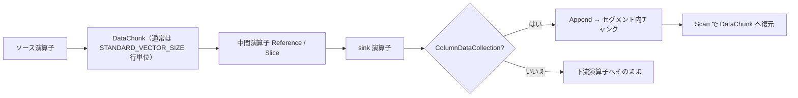

# 第4章 DataChunk と ColumnDataCollection

> **本章で読むソース**
>
> - [src/common/types/data_chunk.cpp](https://github.com/duckdb/duckdb/blob/v1.5.4/src/common/types/data_chunk.cpp)
> - [src/common/types/column/column_data_collection.cpp](https://github.com/duckdb/duckdb/blob/v1.5.4/src/common/types/column/column_data_collection.cpp)
> - [src/execution/join_hashtable.cpp](https://github.com/duckdb/duckdb/blob/v1.5.4/src/execution/join_hashtable.cpp)

## この章の狙い

実行エンジンは演算子間で `DataChunk`（複数 `Vector` の束）を受け渡す。
本章では `DataChunk` の初期化、`Reference`/`Slice`/`Flatten`/`Verify` と `STANDARD_VECTOR_SIZE` 契約、および中間結果の蓄積に使う `ColumnDataCollection` を追う。

## 前提

第3章で `Vector`、`SelectionVector`、`ToUnifiedFormat` を読んでいるものとする。
`STANDARD_VECTOR_SIZE`（既定 2048）は第1章で触れた。

## DataChunk と STANDARD_VECTOR_SIZE

`DataChunk` は列ベクトルの配列 `data` と、有効行数 `count`、容量 `capacity` を持つ。
既定コンストラクタは容量を `STANDARD_VECTOR_SIZE` に置く。

[src/common/types/data_chunk.cpp L22-L23](https://github.com/duckdb/duckdb/blob/v1.5.4/src/common/types/data_chunk.cpp#L22-L23)

```cpp
DataChunk::DataChunk() : count(0), capacity(STANDARD_VECTOR_SIZE) {
}
```

`STANDARD_VECTOR_SIZE`（既定 2048）はパイプラインの通常バッチ粒度であり、`capacity` の不変条件ではない。
`Initialize` は任意の `capacity_p` を受け取り、`Append(..., resize=true)` は `NextPowerOfTwo(new_size)` へ拡張する。

[src/common/types/data_chunk.cpp L50-L56](https://github.com/duckdb/duckdb/blob/v1.5.4/src/common/types/data_chunk.cpp#L50-L56)

```cpp
void DataChunk::Initialize(Allocator &allocator, const vector<LogicalType> &types, const vector<bool> &initialize,
                           idx_t capacity_p) {
	D_ASSERT(types.size() == initialize.size());
	D_ASSERT(data.empty());

	capacity = capacity_p;
	initial_capacity = capacity_p;
```

[src/common/types/data_chunk.cpp L204-L218](https://github.com/duckdb/duckdb/blob/v1.5.4/src/common/types/data_chunk.cpp#L204-L218)

```cpp
void DataChunk::Append(const DataChunk &other, bool resize, SelectionVector *sel, idx_t sel_count) {
	idx_t new_size = sel ? size() + sel_count : size() + other.size();
	if (other.size() == 0) {
		return;
	}
	if (ColumnCount() != other.ColumnCount()) {
		throw InternalException("Column counts of appending chunk doesn't match!");
	}
	if (new_size > capacity) {
		if (resize) {
			auto new_capacity = NextPowerOfTwo(new_size);
			for (idx_t i = 0; i < ColumnCount(); i++) {
				data[i].Resize(size(), new_capacity);
			}
			capacity = new_capacity;
```

`Deserialize` も `MaxValue(row_count, STANDARD_VECTOR_SIZE)` で初期化する（同ファイル L293）。
`count` は実際に有効な行数、`capacity` は各列ベクトルが確保している上限である。

## Initialize と VectorCache

`Initialize` は列型ごとに `VectorCache` を作り、そこから `Vector` を生成する。
`Reset` 時にキャッシュへ戻すことで、繰り返しクエリ実行での再確保を避ける。

[src/common/types/data_chunk.cpp L50-L73](https://github.com/duckdb/duckdb/blob/v1.5.4/src/common/types/data_chunk.cpp#L50-L73)

```cpp
void DataChunk::Initialize(Allocator &allocator, const vector<LogicalType> &types, const vector<bool> &initialize,
                           idx_t capacity_p) {
	D_ASSERT(types.size() == initialize.size());
	D_ASSERT(data.empty());

	capacity = capacity_p;
	initial_capacity = capacity_p;
	for (idx_t i = 0; i < types.size(); i++) {
		// We copy the type here so we don't create another reference to the same shared_ptr<ExtraTypeInfo>
		// Otherwise, threads will constantly increment/decrement the atomic ref count to the same shared_ptr
		// This is necessary to avoid heavy contention on the atomic on many-core machines
		// Note that for nested types, there will still be contention on the atomic(s) one level down,
		// because this is a shallow copy (only copies ExtraTypeInfo to depth=1)
		auto copied_type = types[i].Copy();
		if (!initialize[i]) {
			data.emplace_back(copied_type, nullptr);
			vector_caches.emplace_back();
			continue;
		}

		VectorCache cache(allocator, copied_type, capacity);
		data.emplace_back(cache);
		vector_caches.push_back(std::move(cache));
	}
}
```

`types[i].Copy()` は `shared_ptr<ExtraTypeInfo>` の共有参照を増やさないための浅いコピーである。
多コア環境でのアトミック競合を避ける意図がコメントに明示されている。

## Reference によるゼロコピー共有

`Reference` は他チャンクの先頭 `source.ColumnCount()` 列だけを参照で共有する。
宛先の列数は変わらず、余剰列はそのまま残る。

[src/common/types/data_chunk.cpp L124-L130](https://github.com/duckdb/duckdb/blob/v1.5.4/src/common/types/data_chunk.cpp#L124-L130)

```cpp
void DataChunk::Reference(DataChunk &chunk) {
	D_ASSERT(chunk.ColumnCount() <= ColumnCount());
	SetCapacity(chunk);
	SetCardinality(chunk);
	for (idx_t i = 0; i < chunk.ColumnCount(); i++) {
		data[i].Reference(chunk.data[i]);
	}
}
```

データ複製は起きず、行数と参照する列の対応だけを揃える。

## Slice と SelectionVector

行フィルタや結合の結果、見える行だけを残すときは `Slice` が `SelectionVector` を各列へ適用する。

[src/common/types/data_chunk.cpp L302-L307](https://github.com/duckdb/duckdb/blob/v1.5.4/src/common/types/data_chunk.cpp#L302-L307)

```cpp
void DataChunk::Slice(const SelectionVector &sel_vector, idx_t count_p) {
	this->count = count_p;
	SelCache merge_cache;
	for (idx_t c = 0; c < ColumnCount(); c++) {
		data[c].Slice(sel_vector, count_p, merge_cache);
	}
}
```

列ごとに同じ `sel_vector` を渡すため、行の対応関係は列間で一致する。
既に DICTIONARY 化されている列は `SelCache` で選択の合成を再利用する（`Slice(const DataChunk &other, ...)` L310-L322）。

オフセット指定の `Slice` は連番選択ベクトルを組み立ててから上記へ委譲する（L325-L331）。

## Flatten と Verify

書き込みや一部の演算の前に、全列を FLAT へ揃える。

[src/common/types/data_chunk.cpp L234-L237](https://github.com/duckdb/duckdb/blob/v1.5.4/src/common/types/data_chunk.cpp#L234-L237)

```cpp
void DataChunk::Flatten() {
	for (idx_t i = 0; i < ColumnCount(); i++) {
		data[i].Flatten(size());
	}
}
```

DEBUG ビルドの `Verify` は各行数と列ベクトルの整合を検査し、直列化のラウンドトリップも試す。

[src/common/types/data_chunk.cpp L360-L367](https://github.com/duckdb/duckdb/blob/v1.5.4/src/common/types/data_chunk.cpp#L360-L367)

```cpp
void DataChunk::Verify() {
#ifdef DEBUG
	D_ASSERT(size() <= capacity);

	// verify that all vectors in this chunk have the chunk selection vector
	for (idx_t i = 0; i < ColumnCount(); i++) {
		data[i].Verify(size());
	}
```

`ToUnifiedFormat` は列ごとに `Vector::ToUnifiedFormat` を呼ぶラッパーとしても存在する（L334-L338）。

## ColumnDataCollection と TupleDataCollection

ソートの中間バッファなど、パイプラインをまたいで `DataChunk` を溜めるときに `ColumnDataCollection` を使う。
型ごとのコピー関数を登録し、セグメント単位で `STANDARD_VECTOR_SIZE` チャンクに追記する。

ハッシュ結合の build 側は `JoinHashTable::Build` が `TupleDataCollection`（`sink_collection`）へ `AppendUnified` する。
`ColumnDataCollection` はハッシュ結合では `ProbeSpill` の `global_spill_collection` などに現れる。

[src/execution/join_hashtable.cpp L375-L377](https://github.com/duckdb/duckdb/blob/v1.5.4/src/execution/join_hashtable.cpp#L375-L377)

```cpp
void JoinHashTable::Build(PartitionedTupleDataAppendState &append_state, DataChunk &keys, DataChunk &payload) {
	D_ASSERT(!finalized);
	D_ASSERT(keys.size() == payload.size());
```

[src/execution/join_hashtable.cpp L424-L447](https://github.com/duckdb/duckdb/blob/v1.5.4/src/execution/join_hashtable.cpp#L424-L447)

```cpp
	// ToUnifiedFormat the source chunk
	TupleDataCollection::ToUnifiedFormat(append_state.chunk_state, source_chunk);

	// prepare the keys for processing
	const SelectionVector *current_sel;
	SelectionVector sel(STANDARD_VECTOR_SIZE);
	idx_t added_count = PrepareKeys(keys, append_state.chunk_state.vector_data, current_sel, sel, true);
	if (added_count < keys.size()) {
		has_null = true;
	}
	if (added_count == 0) {
		return;
	}

	// hash the keys and obtain an entry in the list
	// note that we only hash the keys used in the equality comparison
	Hash(keys, *current_sel, added_count, hash_values);

	// Re-reference and ToUnifiedFormat the hash column after computing it
	source_chunk.data[col_offset].Reference(hash_values);
	hash_values.ToUnifiedFormat(source_chunk.size(), append_state.chunk_state.vector_data.back().unified);

	// We already called TupleDataCollection::ToUnifiedFormat, so we can AppendUnified here
	sink_collection->AppendUnified(append_state, source_chunk, *current_sel, added_count);
}
```

[src/common/types/column/column_data_collection.cpp L89-L98](https://github.com/duckdb/duckdb/blob/v1.5.4/src/common/types/column/column_data_collection.cpp#L89-L98)

```cpp
void ColumnDataCollection::Initialize(vector<LogicalType> types_p) {
	this->types = std::move(types_p);
	this->count = 0;
	this->finished_append = false;
	D_ASSERT(!types.empty());
	copy_functions.reserve(types.size());
	for (auto &type : types) {
		copy_functions.push_back(GetCopyFunction(type));
	}
}
```

`GetCopyFunction` は型ごとに `ColumnDataCopyFunction` を返し、ネスト型は専用のコピー経路を持つ。

追記時は入力 `DataChunk` を `ToUnifiedFormat` へ変換し、残行数に応じてセグメント内チャンクへ分割コピーする。

[src/common/types/column/column_data_collection.cpp L973-L1011](https://github.com/duckdb/duckdb/blob/v1.5.4/src/common/types/column/column_data_collection.cpp#L973-L1011)

```cpp
void ColumnDataCollection::Append(ColumnDataAppendState &state, DataChunk &input) {
	D_ASSERT(!finished_append);
	{
		auto input_types = input.GetTypes();
		D_ASSERT(types == input_types);
	}

	auto &segment = *segments.back();
	for (idx_t vector_idx = 0; vector_idx < types.size(); vector_idx++) {
		if (IsComplexType(input.data[vector_idx].GetType())) {
			input.data[vector_idx].Flatten(input.size());
		}
		input.data[vector_idx].ToUnifiedFormat(input.size(), state.vector_data[vector_idx]);
	}

	idx_t remaining = input.size();
	while (remaining > 0) {
		auto &chunk_data = segment.chunk_data.back();
		idx_t append_amount = MinValue<idx_t>(remaining, STANDARD_VECTOR_SIZE - chunk_data.count);
		if (append_amount > 0) {
			idx_t offset = input.size() - remaining;
			for (idx_t vector_idx = 0; vector_idx < types.size(); vector_idx++) {
				ColumnDataMetaData meta_data(copy_functions[vector_idx], segment, state, chunk_data,
				                             chunk_data.vector_data[vector_idx]);
				copy_functions[vector_idx].function(meta_data, state.vector_data[vector_idx], input.data[vector_idx],
				                                    offset, append_amount);
			}
			chunk_data.count += append_amount;
		}
		remaining -= append_amount;
		if (remaining > 0) {
			// more to do
			// allocate a new chunk
			segment.AllocateNewChunk();
			segment.InitializeChunkState(segment.chunk_data.size() - 1, state.current_chunk_state);
		}
	}
	segment.count += input.size();
	count += input.size();
}
```

複雑型は追記前に `Flatten` し、内部チャンクは `STANDARD_VECTOR_SIZE` を上限として埋める。
溢れた分は新チャンクを割り当てる。

スキャンは `InitializeScan` で状態を初期化し、`Scan` で `DataChunk` へ読み戻す（L1023-L1042）。

## 処理の流れ

パイプライン内のチャンクと、コレクションへの蓄積の関係を示す。



`Reference` はパイプライン内、`ColumnDataCollection` は演算子をまたぐバッファリングに使われる。

## 高速化と最適化の工夫

`VectorCache` と `Reset` の組み合わせで、演算子ごとの `DataChunk` 再確保を避ける。
同一パイプラインを何度も回すとき、割り当てコストが支配的になりにくい。

`Reference` と `Slice`（DICTIONARY 化）は値配列のコピーを避ける。
フィルタ後の行だけを次演算子へ渡す典型パターンで、メモリ帯域を節約する。

`ColumnDataCollection::Append` は `STANDARD_VECTOR_SIZE` 単位の内部チャンクに分割する。
スキャン側も同じ粒度で読み出せるため、蓄積とパイプライン実行のバッチサイズが揃う。

`Initialize` の `LogicalType::Copy()` は共有 `ExtraTypeInfo` への参照カウント競合を避ける。
スキーマ列数が多いワイドテーブルでも、チャンク初期化がボトルネックになりにくい。

## まとめ

`DataChunk` は列ベクトル束であり、既定容量は `STANDARD_VECTOR_SIZE` だが `Append` や `Deserialize` で拡張できる。
`Reference`/`Slice`/`Flatten` はコピーと正規化の手段、`ColumnDataCollection` はセグメント化された複数チャンクを保持する物化バッファである。
両者とも `SelectionVector` と `ToUnifiedFormat` を介して列データを扱う。

## 関連する章

- 第3章（Vector とベクトル化）：`DataChunk` が束ねる `Vector`
- 第5章（文字列とネスト型）：`Append` 前の `Flatten` が必要な複雑型
- 第15章（パイプライン実行）：`PipelineExecutor` が `DataChunk` を演算子チェーンへ流す
- 第20章（ハッシュ結合）：build 側の `TupleDataCollection` 利用
- 第22章（ソート）：ソート run のバッファ
