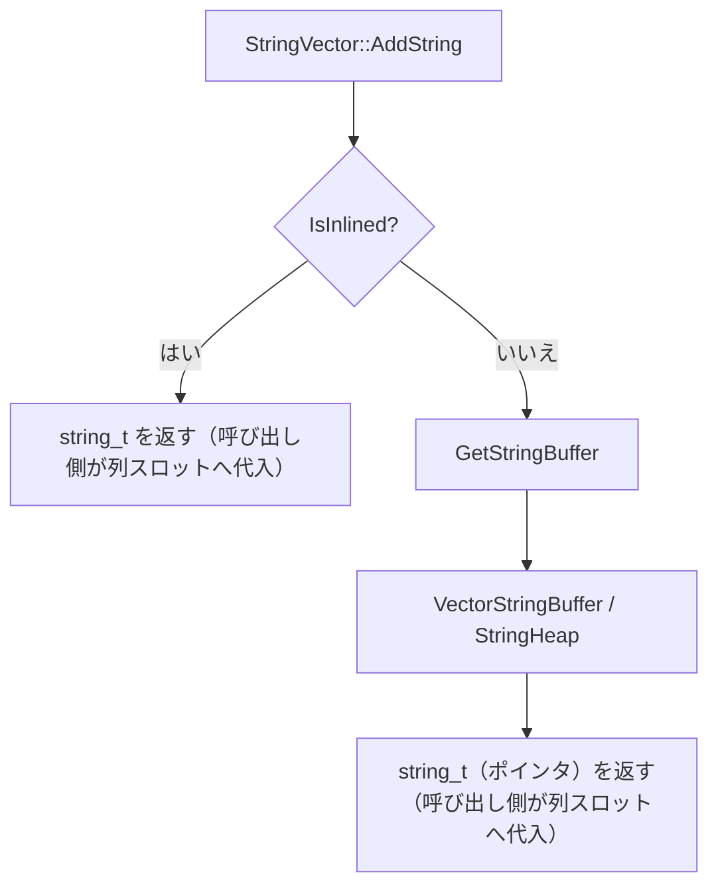

# 第5章 文字列とネスト型

> **本章で読むソース**
>
> - [src/include/duckdb/common/types/string_type.hpp](https://github.com/duckdb/duckdb/blob/v1.5.4/src/include/duckdb/common/types/string_type.hpp)
> - [src/common/types/string_type.cpp](https://github.com/duckdb/duckdb/blob/v1.5.4/src/common/types/string_type.cpp)
> - [src/common/types/string_heap.cpp](https://github.com/duckdb/duckdb/blob/v1.5.4/src/common/types/string_heap.cpp)
> - [src/common/types/vector.cpp](https://github.com/duckdb/duckdb/blob/v1.5.4/src/common/types/vector.cpp)
> - [src/common/types.cpp](https://github.com/duckdb/duckdb/blob/v1.5.4/src/common/types.cpp)

## この章の狙い

可変長文字列とネスト型（LIST、STRUCT、MAP）は、固定長列とは異なる所有権モデルを持つ。
本章では `string_t` のインライン格納とヒープ退避、`StringHeap` と `StringVector` の関係、そして `vector.cpp` にある child buffer（`VectorListBuffer`/`VectorStructBuffer`）を共通軸に追う。

## 前提

第2章の `PhysicalType::VARCHAR`、第3章の `Vector` と `auxiliary` バッファ、第4章の `Flatten` を読んでいるものとする。

## string_t のインラインとポインタ

`string_t` は `PhysicalType::VARCHAR` の1要素表現である。
短い文字列はベクトル配列内にインライン格納し、長い文字列はポインタとプレフィックスを持つ。

[src/include/duckdb/common/types/string_type.hpp L24-L77](https://github.com/duckdb/duckdb/blob/v1.5.4/src/include/duckdb/common/types/string_type.hpp#L24-L77)

```cpp
struct string_t {
	friend struct StringComparisonOperators;

public:
	static constexpr idx_t PREFIX_BYTES = 4 * sizeof(char);
	static constexpr idx_t INLINE_BYTES = 12 * sizeof(char);
	static constexpr idx_t HEADER_SIZE = sizeof(uint32_t) + PREFIX_BYTES;
	static constexpr idx_t MAX_STRING_SIZE = NumericLimits<uint32_t>::Maximum();
#ifndef DUCKDB_DEBUG_NO_INLINE
	static constexpr idx_t PREFIX_LENGTH = PREFIX_BYTES;
	static constexpr idx_t INLINE_LENGTH = INLINE_BYTES;
#else
	static constexpr idx_t PREFIX_LENGTH = 0;
	static constexpr idx_t INLINE_LENGTH = 0;
#endif

	string_t() = default;
	explicit string_t(uint32_t len) {
		value.inlined.length = len;
		memset(value.inlined.inlined, 0, INLINE_BYTES);
	}
	string_t(const char *data, uint32_t len) {
		value.inlined.length = len;
		D_ASSERT(data || GetSize() == 0);
		if (IsInlined()) {
			// zero initialize the prefix first
			// this makes sure that strings with length smaller than 4 still have an equal prefix
			memset(value.inlined.inlined, 0, INLINE_BYTES);
			if (GetSize() == 0) {
				return;
			}
			// small string: inlined
			memcpy(value.inlined.inlined, data, GetSize());
		} else {
			// large string: store pointer
#ifndef DUCKDB_DEBUG_NO_INLINE
			memcpy(value.pointer.prefix, data, PREFIX_LENGTH);
#else
			memset(value.pointer.prefix, 0, PREFIX_BYTES);
#endif
			value.pointer.ptr = (char *)data; // NOLINT
		}
	}

	string_t(const char *data) // NOLINT: Allow implicit conversion from `const char*`
	    : string_t(data, UnsafeNumericCast<uint32_t>(strlen(data))) {
	}
	string_t(const string &value) // NOLINT: Allow implicit conversion from `const char*`
	    : string_t(value.c_str(), UnsafeNumericCast<uint32_t>(value.size())) {
	}

	bool IsInlined() const {
		return GetSize() <= INLINE_LENGTH;
	}
```

`IsInlined()` が true なら `string_t` 自体がペイロードを含み、false なら外部バッファ（ヒープやブロック）を指す。
プレフィックス4バイトは、比較で外部ポインタを追う前に先頭を突き合わせるための工夫である。

## StringHeap

`StringHeap` は `ArenaAllocator::Allocate` で個別領域を確保し、そこへバイト列をコピーして `string_t` ポインタを返す。

[src/common/types/string_heap.cpp L40-L60](https://github.com/duckdb/duckdb/blob/v1.5.4/src/common/types/string_heap.cpp#L40-L60)

```cpp
string_t StringHeap::AddBlob(const char *data, idx_t len) {
	auto insert_string = EmptyString(len);
	auto insert_pos = insert_string.GetDataWriteable();
	memcpy(insert_pos, data, len);
	insert_string.Finalize();
	return insert_string;
}

string_t StringHeap::AddBlob(const string_t &data) {
	return AddBlob(data.GetData(), data.GetSize());
}

string_t StringHeap::EmptyString(idx_t len) {
	D_ASSERT(len > string_t::INLINE_LENGTH);
	if (len > string_t::MAX_STRING_SIZE) {
		throw OutOfRangeException("Cannot create a string of size: '%d', the maximum supported string size is: '%d'",
		                          len, string_t::MAX_STRING_SIZE);
	}
	auto insert_pos = const_char_ptr_cast(allocator.Allocate(len));
	return string_t(insert_pos, UnsafeNumericCast<uint32_t>(len));
}
```

`EmptyString` はインライン閾値を超える長さだけヒープを切る。
`AddString` は UTF-8 検証後に `AddBlob` へ委譲する（L23-L26）。

## StringVector と VectorStringBuffer

`Vector` 列へ文字列を書き込むときは `StringVector::AddString` が入口である。
インライン可能ならヒープを使わず、そのまま `string_t` を返す。

[src/common/types/vector.cpp L2218-L2243](https://github.com/duckdb/duckdb/blob/v1.5.4/src/common/types/vector.cpp#L2218-L2243)

```cpp
VectorStringBuffer &StringVector::GetStringBuffer(Vector &vector) {
	if (vector.GetType().InternalType() != PhysicalType::VARCHAR) {
		throw InternalException("StringVector::GetStringBuffer - vector is not of internal type VARCHAR but of type %s",
		                        vector.GetType());
	}
	if (!vector.auxiliary) {
		auto stored_allocator = vector.buffer ? vector.buffer->GetAllocator() : nullptr;
		if (stored_allocator) {
			vector.auxiliary = make_buffer<VectorStringBuffer>(*stored_allocator);
		} else {
			vector.auxiliary = make_buffer<VectorStringBuffer>();
		}
	}
	D_ASSERT(vector.auxiliary->GetBufferType() == VectorBufferType::STRING_BUFFER);
	return vector.auxiliary.get()->Cast<VectorStringBuffer>();
}

string_t StringVector::AddString(Vector &vector, string_t data) {
	D_ASSERT(vector.GetType().id() == LogicalTypeId::VARCHAR || vector.GetType().id() == LogicalTypeId::BIT);
	if (data.IsInlined()) {
		// string will be inlined: no need to store in string heap
		return data;
	}
	auto &string_buffer = GetStringBuffer(vector);
	return string_buffer.AddString(data);
}
```

`VectorStringBuffer` は内部で `StringHeap` を保持し、列の寿命とともに文字列領域が解放される。
`AddString` は `string_t` を返すだけで、`Vector::data` スロットへの代入は呼び出し側が行う。
`AddHeapReference` で他ベクトルのヒープを共有し、DICTIONARY 経由の参照でもデータが生き続ける（L2275-L2286）。

## child buffer の所有権

ネスト型の親 `Vector` は `Vector::Initialize` で型に応じた `auxiliary` を設置する。
LIST/MAP は `VectorListBuffer` が子 `Vector` と `size`/`capacity` を所有し、STRUCT は `VectorStructBuffer` が `vector<unique_ptr<Vector>>` を所有する。
`Reference` や `Slice` 後も `shared_ptr<VectorBuffer>` が子バッファの寿命を保つ。

[src/common/types/vector.cpp L331-L341](https://github.com/duckdb/duckdb/blob/v1.5.4/src/common/types/vector.cpp#L331-L341)

```cpp
void Vector::Initialize(bool initialize_to_zero, idx_t capacity) {
	auxiliary.reset();
	validity.Reset();
	auto &type = GetType();
	auto internal_type = type.InternalType();
	if (internal_type == PhysicalType::STRUCT) {
		auto struct_buffer = make_uniq<VectorStructBuffer>(type, capacity);
		auxiliary = shared_ptr<VectorBuffer>(struct_buffer.release());
	} else if (internal_type == PhysicalType::LIST) {
		auto list_buffer = make_uniq<VectorListBuffer>(type, capacity);
		auxiliary = shared_ptr<VectorBuffer>(list_buffer.release());
```

[src/include/duckdb/common/types/vector_buffer.hpp L267-L317](https://github.com/duckdb/duckdb/blob/v1.5.4/src/include/duckdb/common/types/vector_buffer.hpp#L267-L317)

```cpp
class VectorStructBuffer : public VectorBuffer {
public:
	VectorStructBuffer();
	explicit VectorStructBuffer(const LogicalType &struct_type, idx_t capacity = STANDARD_VECTOR_SIZE);
	VectorStructBuffer(Vector &other, const SelectionVector &sel, idx_t count);
	~VectorStructBuffer() override;

public:
	const vector<unique_ptr<Vector>> &GetChildren() const {
		return children;
	}
	vector<unique_ptr<Vector>> &GetChildren() {
		return children;
	}

private:
	//! child vectors used for nested data
	vector<unique_ptr<Vector>> children;
};

class VectorListBuffer : public VectorBuffer {
public:
	explicit VectorListBuffer(unique_ptr<Vector> vector, idx_t initial_capacity = STANDARD_VECTOR_SIZE);
	explicit VectorListBuffer(const LogicalType &list_type, idx_t initial_capacity = STANDARD_VECTOR_SIZE);
	~VectorListBuffer() override;

public:
	Vector &GetChild() {
		return *child;
	}
	void Reserve(idx_t to_reserve);

	void Append(const Vector &to_append, idx_t to_append_size, idx_t source_offset = 0);
	void Append(const Vector &to_append, const SelectionVector &sel, idx_t to_append_size, idx_t source_offset = 0);

	void PushBack(const Value &insert);

	idx_t GetSize() {
		return size;
	}

	idx_t GetCapacity() {
		return capacity;
	}

	void SetCapacity(idx_t new_capacity);
	void SetSize(idx_t new_size);

private:
	//! child vectors used for nested data
```

`GetTypeIdSize` では STRUCT/ARRAY は親 `data` サイズ0、LIST は `sizeof(list_entry_t)` である（`types.cpp` L353-L358）。
LIST/MAP の親 `data` は `list_entry_t` の offset/length 配列、STRUCT の親 `data` は確保されず子 `Vector` 群と `validity` が実体を担う。

## LIST の child buffer

LIST 型の親列は `list_entry_t`（オフセットと長さ）の配列であり、要素本体は子 `Vector` に置かれる。
`ListVector::GetEntry` は `VectorListBuffer` から子へ降りる。

[src/common/types/vector.cpp L2502-L2522](https://github.com/duckdb/duckdb/blob/v1.5.4/src/common/types/vector.cpp#L2502-L2522)

```cpp
template <class T>
T &ListVector::GetEntryInternal(T &vector) {
	D_ASSERT(vector.GetType().id() == LogicalTypeId::LIST || vector.GetType().id() == LogicalTypeId::MAP);
	if (vector.GetVectorType() == VectorType::DICTIONARY_VECTOR) {
		auto &child = DictionaryVector::Child(vector);
		return ListVector::GetEntry(child);
	}
	D_ASSERT(vector.GetVectorType() == VectorType::FLAT_VECTOR ||
	         vector.GetVectorType() == VectorType::CONSTANT_VECTOR);
	D_ASSERT(vector.auxiliary);
	D_ASSERT(vector.auxiliary->GetBufferType() == VectorBufferType::LIST_BUFFER);
	return vector.auxiliary->template Cast<VectorListBuffer>().GetChild();
}

const Vector &ListVector::GetEntry(const Vector &vector) {
	return GetEntryInternal<const Vector>(vector);
}

Vector &ListVector::GetEntry(Vector &vector) {
	return GetEntryInternal<Vector>(vector);
}
```

`Reserve` は子ベクトルの容量を先に確保し、リスト追記時の再分配を減らす。

[src/common/types/vector.cpp L2524-L2532](https://github.com/duckdb/duckdb/blob/v1.5.4/src/common/types/vector.cpp#L2524-L2532)

```cpp
void ListVector::Reserve(Vector &vector, idx_t required_capacity) {
	D_ASSERT(vector.GetType().id() == LogicalTypeId::LIST || vector.GetType().id() == LogicalTypeId::MAP);
	D_ASSERT(vector.GetVectorType() == VectorType::FLAT_VECTOR ||
	         vector.GetVectorType() == VectorType::CONSTANT_VECTOR);
	D_ASSERT(vector.auxiliary);
	D_ASSERT(vector.auxiliary->GetBufferType() == VectorBufferType::LIST_BUFFER);
	auto &child_buffer = vector.auxiliary->Cast<VectorListBuffer>();
	child_buffer.Reserve(required_capacity);
}
```

`Flatten` は親だけでなく `ListVector::GetEntry` の子も平坦化する（第3章 L977-L980）。

## STRUCT の child buffer

STRUCT はフィールドごとに子 `Vector` を `VectorStructBuffer` が保持する。

[src/common/types/vector.cpp L2480-L2493](https://github.com/duckdb/duckdb/blob/v1.5.4/src/common/types/vector.cpp#L2480-L2493)

```cpp
vector<unique_ptr<Vector>> &StructVector::GetEntries(Vector &vector) {
	D_ASSERT(vector.GetType().id() == LogicalTypeId::STRUCT || vector.GetType().id() == LogicalTypeId::UNION ||
	         vector.GetType().id() == LogicalTypeId::VARIANT);

	if (vector.GetVectorType() == VectorType::DICTIONARY_VECTOR) {
		auto &child = DictionaryVector::Child(vector);
		return StructVector::GetEntries(child);
	}
	D_ASSERT(vector.GetVectorType() == VectorType::FLAT_VECTOR ||
	         vector.GetVectorType() == VectorType::CONSTANT_VECTOR);
	D_ASSERT(vector.auxiliary);
	D_ASSERT(vector.auxiliary->GetBufferType() == VectorBufferType::STRUCT_BUFFER);
	return vector.auxiliary->Cast<VectorStructBuffer>().GetChildren();
}
```

親行の NULL は `ValidityMask` で表し、各フィールド子ベクトルは同じ行数を共有する。
DICTIONARY 化された STRUCT は子へ透過的に降りる。

## MAP の二段ネスト

MAP は論理型として独立しているが、物理的には LIST of STRUCT（キー列と値列）として格納される。

[src/common/types/vector.cpp L2392-L2401](https://github.com/duckdb/duckdb/blob/v1.5.4/src/common/types/vector.cpp#L2392-L2401)

```cpp
Vector &MapVector::GetKeys(Vector &vector) {
	auto &entries = StructVector::GetEntries(ListVector::GetEntry(vector));
	D_ASSERT(entries.size() == 2);
	return *entries[0];
}
Vector &MapVector::GetValues(Vector &vector) {
	auto &entries = StructVector::GetEntries(ListVector::GetEntry(vector));
	D_ASSERT(entries.size() == 2);
	return *entries[1];
}
```

`MapVector::CheckMapValidity` は `ToUnifiedFormat` で MAP 全体とキー子ベクトルを統一形式にしてから、エントリごとのキー重複を検査する（L2410-L2422）。
可変長所有権の軸は、LIST の子 STRUCT の各フィールドが VARCHAR なら `StringVector` 経由のヒープへ繋がる点にある。

## 処理の流れ

VARCHAR 列に1文字列を書き込むときの所有権の流れを示す。



ネスト型は親 `Vector` の `data` がエントリ配列（LIST）または未使用（STRUCT）、実データは `auxiliary` の child buffer 側に蓄積される。

## 高速化と最適化の工夫

`string_t` のインライン格納（最大12バイト）は、短文字列に対するヒープ分配と間接参照を避ける。
分析クエリで頻出する短いカテゴリ値や短いキーは、列配列内で完結しキャッシュ効率が高い。

プレフィックス4バイトを `string_t` 内に持つ設計は、比較でまず length とプレフィックスを突き合わせ、異なれば外部ポインタの参照を避ける。
ハッシュではインライン文字列だけがプレフィックスから直接計算する fast path を持ち、非インライン文字列は外部バッファ全体を読む。
`string_type.cpp` の `VerifyCharacters` はプレフィックスと実データの一致を DEBUG で検査する（L35-L38）。

LIST は親 `data` に `list_entry_t` 配列を持ち、STRUCT は親 `data` を持たず子バッファへ集約する。
ネストの深さが増えても、親の行操作（NULL マスク、選択、スライス）は固定長列と同じ API で扱える。

`StringVector::AddHeapReference` と DICTIONARY の `AddHeapReference` は、文字列ヒープを複数ベクトル間で共有する。
コピーせず参照だけ増やすことで、辞書エンコード列と展開列の両方から同じバイト列に到達できる。

## まとめ

`string_t` は短い文字列をインライン、長い文字列をヒープ上のポインタで表し、`StringHeap` がバイト列の寿命を管理する。
LIST は親 `data` のエントリ配列と子 `Vector`、STRUCT は `VectorStructBuffer` の子 `Vector` 群が実データを持つ。
MAP は LIST of STRUCT として実装され、`MapVector::GetKeys`/`GetValues` が子へのアクセスを提供する。

## 関連する章

- 第2章（LogicalType と Value）：ネスト型の `ExtraTypeInfo`
- 第3章（Vector とベクトル化）：`FSST_VECTOR` と `Flatten` の再帰
- 第4章（DataChunk と ColumnDataCollection）：複雑型の `Append` 前 `Flatten`
- 第27章（圧縮）：列ストレージ上の文字列圧縮（FSST 等）
