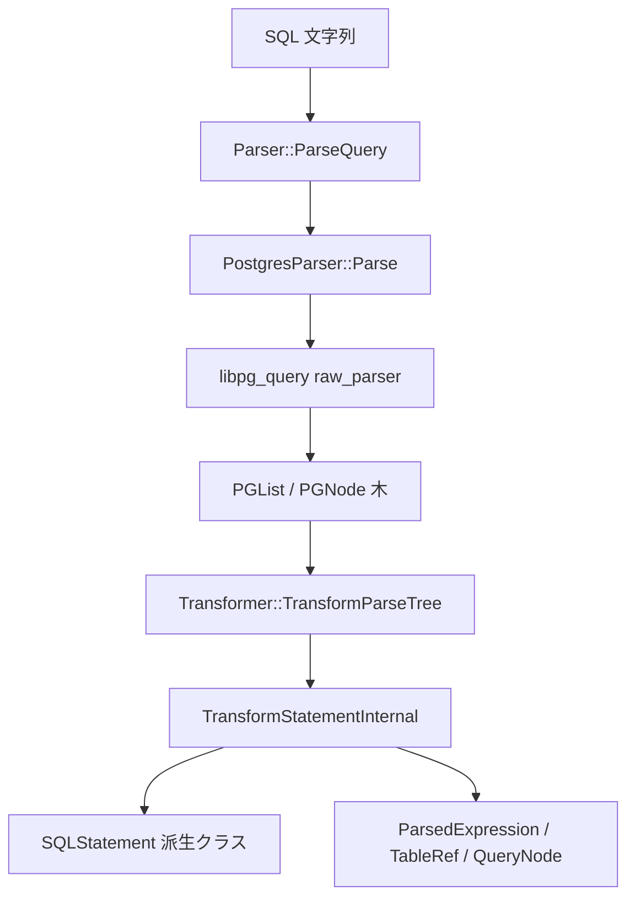

# 第6章 パーサとトランスフォーマ

> **本章で読むソース**
>
> - [src/parser/parser.cpp](https://github.com/duckdb/duckdb/blob/v1.5.4/src/parser/parser.cpp)
> - [third_party/libpg_query/postgres_parser.cpp](https://github.com/duckdb/duckdb/blob/v1.5.4/third_party/libpg_query/postgres_parser.cpp)
> - [third_party/libpg_query/pg_functions.cpp](https://github.com/duckdb/duckdb/blob/v1.5.4/third_party/libpg_query/pg_functions.cpp)
> - [src/parser/transformer.cpp](https://github.com/duckdb/duckdb/blob/v1.5.4/src/parser/transformer.cpp)
> - [src/parser/transform/expression/transform_expression.cpp](https://github.com/duckdb/duckdb/blob/v1.5.4/src/parser/transform/expression/transform_expression.cpp)
> - [src/parser/transform/statement/transform_select.cpp](https://github.com/duckdb/duckdb/blob/v1.5.4/src/parser/transform/statement/transform_select.cpp)
> - [src/parser/transform/statement/transform_select_node.cpp](https://github.com/duckdb/duckdb/blob/v1.5.4/src/parser/transform/statement/transform_select_node.cpp)
> - [src/parser/transform/tableref/transform_from.cpp](https://github.com/duckdb/duckdb/blob/v1.5.4/src/parser/transform/tableref/transform_from.cpp)

## この章の狙い

SQL 文字列が DuckDB 内部表現へ入る最初の段階を追う。
本章では `Parser::ParseQuery` が `third_party/libpg_query` で構文解析し、`Transformer` が `duckdb_libpgquery::PGNode` 木を `SQLStatement` と `ParsedExpression` へ変換する境界と主経路を示す。

## 前提

読者は SQL の基本構文と抽象構文木の概念を知っているものとする。
バインダ以降の名前解決は第7章で扱う。

## libpg_query との境界

字句と構文解析は `third_party/libpg_query` に委譲される。
DuckDB 本体の `PostgresParser` は薄いラッパーで、`pg_parser_parse` を呼んで `parse_tree` を受け取る。

[third_party/libpg_query/postgres_parser.cpp L12-L23](https://github.com/duckdb/duckdb/blob/v1.5.4/third_party/libpg_query/postgres_parser.cpp#L12-L23)

```cpp
void PostgresParser::Parse(const std::string &query) {
	duckdb_libpgquery::pg_parser_init();
	duckdb_libpgquery::parse_result res;
	pg_parser_parse(query.c_str(), &res);
	success = res.success;

	if (success) {
		parse_tree = res.parse_tree;
	} else {
		error_message = std::string(res.error_message);
		error_location = res.error_location;
	}
}
```

`pg_parser_parse` の内部は PostgreSQL 由来の `raw_parser` を呼ぶ。
ここまでが外部ライブラリ側であり、以降は DuckDB の `Transformer` が担当する。

[third_party/libpg_query/pg_functions.cpp L102-L111](https://github.com/duckdb/duckdb/blob/v1.5.4/third_party/libpg_query/pg_functions.cpp#L102-L111)

```cpp
void pg_parser_parse(const char *query, parse_result *res) {
	res->parse_tree = nullptr;
	try {
		res->parse_tree = duckdb_libpgquery::raw_parser(query);
		res->success = pg_parser_state.pg_err_code == PGUNDEFINED;
	} catch (std::exception &ex) {
		res->success = false;
		res->error_message = ex.what();
		res->error_location = pg_parser_state.pg_err_pos;
	}
}
```

`PostgresParser` のデストラクタは `pg_parser_cleanup` でパーサ用メモリを解放する。
コメントにある通り、スコープ内で `PostgresParser` を使い切る設計は、複数デストラクタによるメモリ問題を避けるためである。

## Parser::ParseQuery の流れ

`ClientContext` からのクエリ受付は、最終的に `Parser::ParseQuery` へ至る。
拡張パーサを試したあと、標準経路では `PostgresParser` と `Transformer` が連続して呼ばれる。

[src/parser/parser.cpp L267-L282](https://github.com/duckdb/duckdb/blob/v1.5.4/src/parser/parser.cpp#L267-L282)

```cpp
		PostgresParser::SetPreserveIdentifierCase(options.preserve_identifier_case);
		bool parsing_succeed = false;
		// Creating a new scope to prevent multiple PostgresParser destructors being called
		// which led to some memory issues
		{
			PostgresParser parser;
			parser.Parse(query);
			if (parser.success) {
				if (!parser.parse_tree) {
					// empty statement
					return;
				}

				// if it succeeded, we transform the Postgres parse tree into a list of
				// SQLStatements
				transformer.TransformParseTree(parser.parse_tree, statements);
				parsing_succeed = true;
```

パース失敗時は、パーサ拡張へフォールバックするか `ParserException` を投げる（同ファイル L297-L298）。
通常の複数文は `raw_parser` が `PGList` で一度に返す。
`SplitQueries` によるセミコロン分割は、標準パーサがクエリ全体の解析に失敗し、かつ parser extension が存在するときだけ、各文を標準パーサと extension の `parse_function` で再試行する経路である。

[src/parser/parser.cpp L291-L301](https://github.com/duckdb/duckdb/blob/v1.5.4/src/parser/parser.cpp#L291-L301)

```cpp
		// If DuckDB fails to parse the entire sql string, break the string down into individual statements
		// using ';' as the delimiter so that parser extensions can parse the statement
		if (parsing_succeed) {
			// no-op
			// return here would require refactoring into another function. o.w. will just no-op in order to run wrap up
			// code at the end of this function
		} else if (!options.extensions || !options.extensions->HasParserExtensions()) {
			throw ParserException::SyntaxError(query, parser_error, parser_error_location);
		} else {
			// split sql string into statements and re-parse using extension
			auto queries = SplitQueries(query);
```

## PG 木の所有権と DuckDB AST への移行

`PGNode` と `PGList` は `pg_parser_init` が用意する thread-local アリーナ上で `palloc` される。
`PostgresParser` のデストラクタが `pg_parser_cleanup` を呼び、確保ブロックを一括解放する。

[third_party/libpg_query/postgres_parser.cpp L12-L23](https://github.com/duckdb/duckdb/blob/v1.5.4/third_party/libpg_query/postgres_parser.cpp#L12-L23)

```cpp
void PostgresParser::Parse(const std::string &query) {
	duckdb_libpgquery::pg_parser_init();
	duckdb_libpgquery::parse_result res;
	pg_parser_parse(query.c_str(), &res);
	success = res.success;

	if (success) {
		parse_tree = res.parse_tree;
	} else {
		error_message = std::string(res.error_message);
		error_location = res.error_location;
	}
}
```

[third_party/libpg_query/postgres_parser.cpp L33-L35](https://github.com/duckdb/duckdb/blob/v1.5.4/third_party/libpg_query/postgres_parser.cpp#L33-L35)

```cpp
PostgresParser::~PostgresParser()  {
    duckdb_libpgquery::pg_parser_cleanup();
}
```

`Transformer` は `PostgresParser` のスコープ内で PG 木を読み、`unique_ptr` で所有する DuckDB AST へ情報を写す。
`TransformParseTree` が返ったあと PG ポインタは無効になり、以降は `SQLStatement` が所有権を持つ。

## SQLStatement の生成

`SQLStatement` はパース済み文の基底クラスである。
`StatementType`、`named_param_map`、元クエリ内の位置情報を保持する。

[src/include/duckdb/parser/sql_statement.hpp L18-L38](https://github.com/duckdb/duckdb/blob/v1.5.4/src/include/duckdb/parser/sql_statement.hpp#L18-L38)

```cpp
//! SQLStatement is the base class of any type of SQL statement.
class SQLStatement {
public:
	static constexpr const StatementType TYPE = StatementType::INVALID_STATEMENT;

public:
	explicit SQLStatement(StatementType type) : type(type) {
	}
	virtual ~SQLStatement() {
	}

	//! The statement type
	StatementType type;
	//! The statement location within the query string
	idx_t stmt_location = 0;
	//! The statement length within the query string
	idx_t stmt_length = 0;
	//! The map of named parameter to param index
	case_insensitive_map_t<idx_t> named_param_map;
	//! The query text that corresponds to this SQL statement
	string query;
```

`TransformParseTree` は libpg_query の連結リスト `PGList` を走査し、文ごとに `TransformStatement` を呼ぶ。

[src/parser/transformer.cpp L26-L38](https://github.com/duckdb/duckdb/blob/v1.5.4/src/parser/transformer.cpp#L26-L38)

```cpp
bool Transformer::TransformParseTree(duckdb_libpgquery::PGList *tree, vector<unique_ptr<SQLStatement>> &statements) {
	InitializeStackCheck();
	for (auto entry = tree->head; entry != nullptr; entry = entry->next) {
		Clear();
		auto n = PGPointerCast<duckdb_libpgquery::PGNode>(entry->data.ptr_value);
		auto stmt = TransformStatement(*n);
		D_ASSERT(stmt);
		if (HasPivotEntries()) {
			stmt = CreatePivotStatement(std::move(stmt));
		}
		statements.push_back(std::move(stmt));
	}
	return true;
}
```

文ノードの種別は `TransformStatementInternal` の巨大 switch で振り分ける。
`T_PGSelectStmt` は `TransformSelectStmt`、`T_PGInsertStmt` は `TransformInsert` へ進む。

[src/parser/transformer.cpp L133-L159](https://github.com/duckdb/duckdb/blob/v1.5.4/src/parser/transformer.cpp#L133-L159)

```cpp
unique_ptr<SQLStatement> Transformer::TransformStatementInternal(duckdb_libpgquery::PGNode &stmt) {
	switch (stmt.type) {
	case duckdb_libpgquery::T_PGRawStmt: {
		auto &raw_stmt = PGCast<duckdb_libpgquery::PGRawStmt>(stmt);
		auto result = TransformStatement(*raw_stmt.stmt);
		if (result) {
			result->stmt_location = NumericCast<idx_t>(raw_stmt.stmt_location);
			result->stmt_length = NumericCast<idx_t>(raw_stmt.stmt_len);
		}
		return result;
	}
	case duckdb_libpgquery::T_PGSelectStmt:
		return TransformSelectStmt(PGCast<duckdb_libpgquery::PGSelectStmt>(stmt));
	case duckdb_libpgquery::T_PGCreateStmt:
		return TransformCreateTable(PGCast<duckdb_libpgquery::PGCreateStmt>(stmt));
	case duckdb_libpgquery::T_PGCreateSchemaStmt:
		return TransformCreateSchema(PGCast<duckdb_libpgquery::PGCreateSchemaStmt>(stmt));
	case duckdb_libpgquery::T_PGViewStmt:
		return TransformCreateView(PGCast<duckdb_libpgquery::PGViewStmt>(stmt));
	case duckdb_libpgquery::T_PGCreateSeqStmt:
		return TransformCreateSequence(PGCast<duckdb_libpgquery::PGCreateSeqStmt>(stmt));
	case duckdb_libpgquery::T_PGCreateFunctionStmt:
		return TransformCreateFunction(PGCast<duckdb_libpgquery::PGCreateFunctionStmt>(stmt));
	case duckdb_libpgquery::T_PGDropStmt:
		return TransformDrop(PGCast<duckdb_libpgquery::PGDropStmt>(stmt));
	case duckdb_libpgquery::T_PGInsertStmt:
		return TransformInsert(PGCast<duckdb_libpgquery::PGInsertStmt>(stmt));
```

`parser/transform/` 以下は文種別、式種別、テーブル参照種別ごとにファイルが分割されている。
`transform/statement/`、`transform/expression/`、`transform/tableref/` がそれぞれの責務を担う。

## SELECT と式の変換

`TransformSelectStmt` は `SelectStatement` を組み立て、内部の `QueryNode` を `TransformSelectNodeInternal` が構築する。

[src/parser/transform/statement/transform_select.cpp L35-L38](https://github.com/duckdb/duckdb/blob/v1.5.4/src/parser/transform/statement/transform_select.cpp#L35-L38)

```cpp
unique_ptr<SelectStatement> Transformer::TransformSelectStmt(duckdb_libpgquery::PGSelectStmt &select, bool is_select) {
	auto result = make_uniq<SelectStatement>();
	result->node = TransformSelectNodeInternal(select, is_select);
	return result;
}
```

通常 SELECT の本体は `TransformSelectInternal` が `PGSelectStmt` から `SelectNode` へ写像する。
CTE、`WINDOW`、`DISTINCT`、FROM 順（`from_first`）、`WHERE`、`GROUP BY`、`HAVING`、`QUALIFY`、`SAMPLE`、集合演算、`ORDER BY`/`LIMIT` 修飾を組み立て、SELECT INTO や locking clause は拒否する。

[src/parser/transform/statement/transform_select.cpp L18-L33](https://github.com/duckdb/duckdb/blob/v1.5.4/src/parser/transform/statement/transform_select.cpp#L18-L33)

```cpp
unique_ptr<QueryNode> Transformer::TransformSelectNodeInternal(duckdb_libpgquery::PGSelectStmt &select,
                                                               bool is_select) {
	// Both Insert/Create Table As uses this.
	if (is_select) {
		if (select.intoClause) {
			throw ParserException("SELECT INTO not supported!");
		}
		if (select.lockingClause) {
			throw ParserException("SELECT locking clause is not supported!");
		}
	}
	if (select.pivot) {
		return TransformPivotStatement(select);
	}
	return TransformSelectInternal(select);
}
```

[src/parser/transform/statement/transform_select_node.cpp L105-L167](https://github.com/duckdb/duckdb/blob/v1.5.4/src/parser/transform/statement/transform_select_node.cpp#L105-L167)

```cpp
	case duckdb_libpgquery::PG_SETOP_NONE: {
		node = make_uniq<SelectNode>();
		auto &result = node->Cast<SelectNode>();
		if (stmt.withClause) {
			TransformCTE(*PGPointerCast<duckdb_libpgquery::PGWithClause>(stmt.withClause), node->cte_map);
		}
		if (stmt.windowClause) {
			for (auto window_ele = stmt.windowClause->head; window_ele != nullptr; window_ele = window_ele->next) {
				auto window_def = PGPointerCast<duckdb_libpgquery::PGWindowDef>(window_ele->data.ptr_value);
				D_ASSERT(window_def);
				D_ASSERT(window_def->name);
				string window_name(window_def->name);
				auto it = window_clauses.find(window_name);
				if (it != window_clauses.end()) {
					throw ParserException("window \"%s\" is already defined", window_name);
				}
				window_clauses[window_name] = window_def.get();
			}
		}

		// checks distinct clause
		if (stmt.distinctClause != nullptr) {
			auto modifier = make_uniq<DistinctModifier>();
			// checks distinct on clause
			auto target = PGPointerCast<duckdb_libpgquery::PGNode>(stmt.distinctClause->head->data.ptr_value);
			if (target) {
				//  add the columns defined in the ON clause to the select list
				TransformExpressionList(*stmt.distinctClause, modifier->distinct_on_targets);
			}
			result.modifiers.push_back(std::move(modifier));
		}

		// do this early so the value lists also have a `FROM`
		if (stmt.valuesLists) {
			// VALUES list, create an ExpressionList
			D_ASSERT(!stmt.fromClause);
			result.from_table = TransformValuesList(stmt.valuesLists);
			result.select_list.push_back(make_uniq<StarExpression>());
		} else {
			if (!stmt.targetList) {
				throw ParserException("SELECT clause without selection list");
			}
			// transform in the specified order to ensure positional parameters are correctly set
			if (stmt.from_first) {
				result.from_table = TransformFrom(stmt.fromClause);
				TransformExpressionList(*stmt.targetList, result.select_list);
			} else {
				TransformExpressionList(*stmt.targetList, result.select_list);
				result.from_table = TransformFrom(stmt.fromClause);
			}
		}

		// where
		result.where_clause = TransformExpression(stmt.whereClause);
		// group by
		TransformGroupBy(stmt.groupClause, result);
		// having
		result.having = TransformExpression(stmt.havingClause);
		// qualify
		result.qualify = TransformExpression(stmt.qualifyClause);
		// sample
		result.sample = TransformSampleOptions(stmt.sampleOptions);
		break;
	}
```

式ノードは `TransformExpression` が `PGNode.type` で分岐する。
列参照、定数、関数呼び出し、サブリンクなどが `ParsedExpression` 派生クラスへ写像される。

[src/parser/transform/expression/transform_expression.cpp L27-L38](https://github.com/duckdb/duckdb/blob/v1.5.4/src/parser/transform/expression/transform_expression.cpp#L27-L38)

```cpp
unique_ptr<ParsedExpression> Transformer::TransformExpression(duckdb_libpgquery::PGNode &node) {
	auto stack_checker = StackCheck();

	switch (node.type) {
	case duckdb_libpgquery::T_PGColumnRef:
		return TransformColumnRef(PGCast<duckdb_libpgquery::PGColumnRef>(node));
	case duckdb_libpgquery::T_PGAConst:
		return TransformConstant(PGCast<duckdb_libpgquery::PGAConst>(node));
	case duckdb_libpgquery::T_PGAExpr:
		return TransformAExpr(PGCast<duckdb_libpgquery::PGAExpr>(node));
	case duckdb_libpgquery::T_PGFuncCall:
		return TransformFuncCall(PGCast<duckdb_libpgquery::PGFuncCall>(node));
	case duckdb_libpgquery::T_PGBoolExpr:
		return TransformBoolExpr(PGCast<duckdb_libpgquery::PGBoolExpr>(node));
```

FROM 句は `TransformFrom` が `PGList` を `TableRef` 木へ変換する。
複数テーブルは暗黙クロス結合の `JoinRef` として組み立てられる。

[src/parser/transform/tableref/transform_from.cpp L7-L21](https://github.com/duckdb/duckdb/blob/v1.5.4/src/parser/transform/tableref/transform_from.cpp#L7-L21)

```cpp
unique_ptr<TableRef> Transformer::TransformFrom(optional_ptr<duckdb_libpgquery::PGList> root) {
	if (!root) {
		return make_uniq<EmptyTableRef>();
	}

	if (root->length > 1) {
		// Implicit Cross Product
		auto result = make_uniq<JoinRef>(JoinRefType::CROSS);
		result->is_implicit = true;
		JoinRef *cur_root = result.get();
		idx_t list_size = 0;
		for (auto node = root->head; node != nullptr; node = node->next) {
			auto n = PGPointerCast<duckdb_libpgquery::PGNode>(node->data.ptr_value);
			unique_ptr<TableRef> next = TransformTableRefNode(*n);
```

## 処理の流れ



libpg_query は構文まで、DuckDB は意味に近い自前 AST までを生成する。
型やカタログの解決はこの段階では行わない。

## 高速化と最適化の工夫

構文解析を libpg_query に閉じ込めることで、DuckDB は PostgreSQL 互換の字句規則を自前実装せずに済む。
メンテナンス対象は `Transformer` 側のノード写像に集中できる。

`TransformParseTree` は文ごとに `Clear()` してパラメータ状態をリセットする。
`Clear` は `ClearParameters`（`prepared_statement_parameter_index` と `named_param_map` の初期化）と `pivot_entries.clear` を呼ぶ。
`last_param_type` はリセットされないが、`named_param_map` が次文へ漏れないことは保証される。

[src/parser/transformer.cpp L21-L24](https://github.com/duckdb/duckdb/blob/v1.5.4/src/parser/transformer.cpp#L21-L24)

```cpp
void Transformer::Clear() {
	ClearParameters();
	pivot_entries.clear();
}
```

[src/parser/transformer.cpp L91-L95](https://github.com/duckdb/duckdb/blob/v1.5.4/src/parser/transformer.cpp#L91-L95)

```cpp
void Transformer::ClearParameters() {
	auto &root = RootTransformer();
	root.prepared_statement_parameter_index = 0;
	root.named_param_map.clear();
}
```

`pg_functions.cpp` の `palloc` は 10 KiB 以上のブロック内を bump allocation し、`pfree` は no-op として最後に `pg_parser_cleanup` で一括解放する。
構文木ノードごとの `malloc`/`free` を避け、パース中のアロケータ負荷を抑える。

[third_party/libpg_query/pg_functions.cpp L16-L16](https://github.com/duckdb/duckdb/blob/v1.5.4/third_party/libpg_query/pg_functions.cpp#L16-L16)

```cpp
#define PG_MALLOC_SIZE 10240
```

[third_party/libpg_query/pg_functions.cpp L68-L84](https://github.com/duckdb/duckdb/blob/v1.5.4/third_party/libpg_query/pg_functions.cpp#L68-L84)

```cpp
void *palloc(size_t n) {
	// we need to align our pointers for the sanitizer
	auto allocate_n = n + sizeof(size_t);
	auto aligned_n = ((allocate_n + 7) / 8) * 8;
	if (pg_parser_state.malloc_pos + aligned_n > PG_MALLOC_SIZE) {
		allocate_new(&pg_parser_state, aligned_n);
	}

	// store the length of the allocation
	char *base_ptr = pg_parser_state.malloc_ptrs[pg_parser_state.malloc_ptr_idx - 1] + pg_parser_state.malloc_pos;
	memcpy(base_ptr, &n, sizeof(size_t));
	// store the actual pointer
	char *ptr = (char*) base_ptr + sizeof(size_t);
	memset(ptr, 0, n);
	pg_parser_state.malloc_pos += aligned_n;
	return ptr;
}
```

[third_party/libpg_query/pg_functions.cpp L183-L185](https://github.com/duckdb/duckdb/blob/v1.5.4/third_party/libpg_query/pg_functions.cpp#L183-L185)

```cpp
void pfree(void *ptr) {
	// nop, we free up entire context on parser cleanup
}
```

`StackCheck` は式の再帰深度を `max_expression_depth` で打ち切る（`transformer.cpp` L45-L52）。
深くネストした式によるスタック溢れを、変換段階で早期に拒否できる。

`PostgresParser` をスコープ内に閉じ、`pg_parser_cleanup` を確実に呼ぶ設計は、パーサ用アロケータの寿命を限定する。
長寿命の `ClientContext` とは分離され、パースごとにクリーンな状態から始められる。

## まとめ

`Parser::ParseQuery` は libpg_query で `PGNode` 木を得たあと、`Transformer` で DuckDB 固有の `SQLStatement` と `ParsedExpression` へ変換する。
境界は `PostgresParser`/`pg_parser_parse` と `TransformParseTree` の間にある。
`parser/transform/` は文、式、テーブル参照ごとに分割され、PostgreSQL ノード型から DuckDB AST への写像を担う。

## 関連する章

- 第1章（アーキテクチャ全体像）：`Planner::CreatePlan` への入力
- 第7章（バインダと名前解決）：`SQLStatement` のバインド
- 第8章（式のバインド）：`ParsedExpression` から `BoundExpression` へ
- 第9章（論理演算子とプラン生成）：バインド後の論理プラン木
