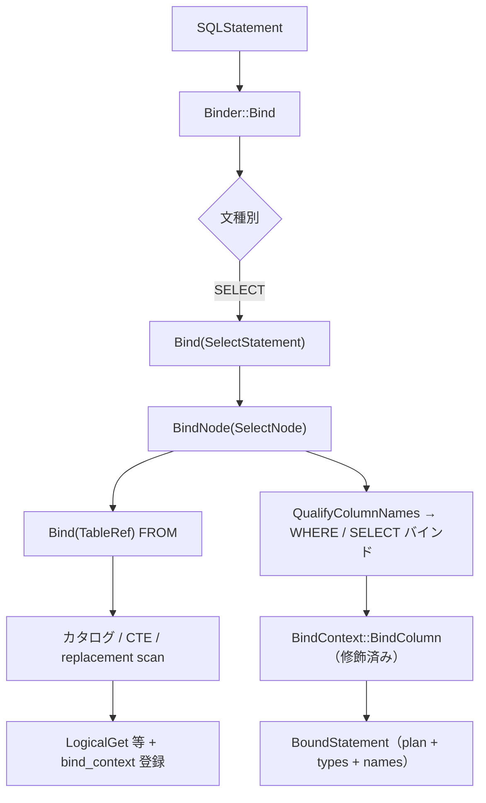

# 第7章 バインダと名前解決

> **本章で読むソース**
>
> - [src/planner/binder.cpp](https://github.com/duckdb/duckdb/blob/v1.5.4/src/planner/binder.cpp)
> - [src/include/duckdb/planner/bound_statement.hpp](https://github.com/duckdb/duckdb/blob/v1.5.4/src/include/duckdb/planner/bound_statement.hpp)
> - [src/planner/binder/statement/bind_select.cpp](https://github.com/duckdb/duckdb/blob/v1.5.4/src/planner/binder/statement/bind_select.cpp)
> - [src/planner/binder/query_node/bind_select_node.cpp](https://github.com/duckdb/duckdb/blob/v1.5.4/src/planner/binder/query_node/bind_select_node.cpp)
> - [src/planner/binder/tableref/bind_basetableref.cpp](https://github.com/duckdb/duckdb/blob/v1.5.4/src/planner/binder/tableref/bind_basetableref.cpp)
> - [src/catalog/catalog_entry_retriever.cpp](https://github.com/duckdb/duckdb/blob/v1.5.4/src/catalog/catalog_entry_retriever.cpp)
> - [src/planner/binder/expression/bind_columnref_expression.cpp](https://github.com/duckdb/duckdb/blob/v1.5.4/src/planner/binder/expression/bind_columnref_expression.cpp)
> - [src/planner/binder/tableref/bind_subqueryref.cpp](https://github.com/duckdb/duckdb/blob/v1.5.4/src/planner/binder/tableref/bind_subqueryref.cpp)
> - [src/planner/bind_context.cpp](https://github.com/duckdb/duckdb/blob/v1.5.4/src/planner/bind_context.cpp)

## この章の狙い

パーサが生成した `SQLStatement` は、まだテーブル名や列名がカタログ上の実体と結び付いていない。
本章では `Binder::Bind` を入口に、カタログ参照、スコープ内の名前解決、型付けの結果として得られる `BoundStatement` を追う。

## 前提

第6章で `SelectStatement`、`ParsedExpression`、`TableRef` のパース結果を読んでいるものとする。
式の詳細なバインド（関数解決、演算子の型推論）は第8章で扱う。

## BoundStatement の形

バインドの出力は `BoundStatement` 構造体にまとめられる。
論理プランの根、結果列の型と名前がここに入る。

[src/include/duckdb/planner/bound_statement.hpp L32-L37](https://github.com/duckdb/duckdb/blob/v1.5.4/src/include/duckdb/planner/bound_statement.hpp#L32-L37)

```cpp
struct BoundStatement {
	unique_ptr<LogicalOperator> plan;
	vector<LogicalType> types;
	vector<string> names;
	ExtraBoundInfo extra_info;
};
```

`plan` は `LogicalOperator` 木の根であり、以降の `Planner` とオプティマイザがこの木を加工する。
`types`/`names` は結果スキーマの契約である。

## Binder::Bind の入口

`Binder::Bind(SQLStatement &)` は文種別の `switch` で各 `Bind(具体Statement&)` へ振り分ける。
SELECT は `SelectStatement`、DDL は `CreateStatement` など、専用ハンドラが `planner/binder/statement/` に置かれる。

[src/planner/binder.cpp L78-L95](https://github.com/duckdb/duckdb/blob/v1.5.4/src/planner/binder.cpp#L78-L95)

```cpp
BoundStatement Binder::Bind(SQLStatement &statement) {
	switch (statement.type) {
	case StatementType::SELECT_STATEMENT:
		return Bind(statement.Cast<SelectStatement>());
	case StatementType::INSERT_STATEMENT:
		return BindWithCTE(statement.Cast<InsertStatement>());
	case StatementType::COPY_STATEMENT:
		return Bind(statement.Cast<CopyStatement>(), CopyToType::COPY_TO_FILE);
	case StatementType::DELETE_STATEMENT:
		return BindWithCTE(statement.Cast<DeleteStatement>());
	case StatementType::UPDATE_STATEMENT:
		return BindWithCTE(statement.Cast<UpdateStatement>());
	case StatementType::RELATION_STATEMENT:
		return Bind(statement.Cast<RelationStatement>());
	case StatementType::CREATE_STATEMENT:
		return Bind(statement.Cast<CreateStatement>());
	case StatementType::DROP_STATEMENT:
		return Bind(statement.Cast<DropStatement>());
	case StatementType::ALTER_STATEMENT:
		return Bind(statement.Cast<AlterStatement>());
```

`Binder` は親子関係を持ち、サブクエリやビュー展開時に子 `Binder` が生成される（`binder.cpp` L50-L64）。
`bind_context` がスコープ内のテーブル別名と列名を管理する。

## テーブル参照のバインド

`TableRef` は `Binder::Bind(TableRef &)` が種別で分岐する。
ベーステーブル、結合、サブクエリ、テーブル関数などが `planner/binder/tableref/` の各 `Bind` へ進む。

[src/planner/binder.cpp L142-L161](https://github.com/duckdb/duckdb/blob/v1.5.4/src/planner/binder.cpp#L142-L161)

```cpp
BoundStatement Binder::Bind(TableRef &ref) {
	BoundStatement result;
	switch (ref.type) {
	case TableReferenceType::BASE_TABLE:
		result = Bind(ref.Cast<BaseTableRef>());
		break;
	case TableReferenceType::JOIN:
		result = Bind(ref.Cast<JoinRef>());
		break;
	case TableReferenceType::SUBQUERY:
		result = Bind(ref.Cast<SubqueryRef>());
		break;
	case TableReferenceType::EMPTY_FROM:
		result = Bind(ref.Cast<EmptyTableRef>());
		break;
	case TableReferenceType::TABLE_FUNCTION:
		result = Bind(ref.Cast<TableFunctionRef>());
		break;
	case TableReferenceType::EXPRESSION_LIST:
		result = Bind(ref.Cast<ExpressionListRef>());
		break;
	case TableReferenceType::COLUMN_DATA:
		result = Bind(ref.Cast<ColumnDataRef>());
		break;
```

`BindWithCTE` は文に CTE があれば `StatementNode` へ包んでからバインドする（`binder.cpp` L66-L75）。

## SELECT のバインド経路

`Bind(SelectStatement &)` は文属性を設定し、ルート `QueryNode` へ委譲する。

[src/planner/binder/statement/bind_select.cpp L7-L12](https://github.com/duckdb/duckdb/blob/v1.5.4/src/planner/binder/statement/bind_select.cpp#L7-L12)

```cpp
BoundStatement Binder::Bind(SelectStatement &stmt) {
	auto &properties = GetStatementProperties();
	properties.output_type = QueryResultOutputType::ALLOW_STREAMING;
	properties.return_type = StatementReturnType::QUERY_RESULT;
	return Bind(*stmt.node);
}
```

`SelectNode` ではまず FROM をバインドし、続けて SELECT リストや WHERE を処理する。

[src/planner/binder/query_node/bind_select_node.cpp L381-L387](https://github.com/duckdb/duckdb/blob/v1.5.4/src/planner/binder/query_node/bind_select_node.cpp#L381-L387)

```cpp
BoundStatement Binder::BindNode(SelectNode &statement) {
	D_ASSERT(statement.from_table);

	// first bind the FROM table statement
	auto from = std::move(statement.from_table);
	auto from_table = Bind(*from);
	return BindSelectNode(statement, std::move(from_table));
}
```

`BindSelectNode` は star 展開、列名修飾、WHERE、modifier、GROUP BY、HAVING、QUALIFY、SELECT リストの各専用 `ExpressionBinder` を経て、最後に `CreatePlan` で `BoundStatement.plan` を組み立てる。

[src/planner/binder/query_node/bind_select_node.cpp L439-L472](https://github.com/duckdb/duckdb/blob/v1.5.4/src/planner/binder/query_node/bind_select_node.cpp#L439-L472)

```cpp
	// visit the select list and expand any "*" statements
	vector<unique_ptr<ParsedExpression>> new_select_list;
	ExpandStarExpressions(statement.select_list, new_select_list);

	if (new_select_list.empty()) {
		throw BinderException("SELECT list is empty after resolving * expressions!");
	}
	statement.select_list = std::move(new_select_list);

	auto &bind_state = result.bind_state;
	for (idx_t i = 0; i < statement.select_list.size(); i++) {
		auto &expr = statement.select_list[i];
		result.names.push_back(expr->GetName());
		ExpressionBinder::QualifyColumnNames(*this, expr);
		if (!expr->GetAlias().empty()) {
			bind_state.alias_map[expr->GetAlias()] = i;
			result.names[i] = expr->GetAlias();
		}
		bind_state.projection_map[*expr] = i;
		bind_state.original_expressions.push_back(expr->Copy());
	}
	result.column_count = statement.select_list.size();

	// first visit the WHERE clause
	// the WHERE clause happens before the GROUP BY, PROJECTION or HAVING clauses
	if (statement.where_clause) {
		// bind any star expressions in the WHERE clause
		BindWhereStarExpression(statement.where_clause);

		ColumnAliasBinder alias_binder(bind_state);
		WhereBinder where_binder(*this, context, &alias_binder);
		unique_ptr<ParsedExpression> condition = std::move(statement.where_clause);
		result.where_clause = where_binder.Bind(condition);
	}
```

[src/planner/binder/query_node/bind_select_node.cpp L560-L574](https://github.com/duckdb/duckdb/blob/v1.5.4/src/planner/binder/query_node/bind_select_node.cpp#L560-L574)

```cpp
	// after that, we bind to the SELECT list
	SelectBinder select_binder(*this, context, result, info);

	// if we expand select-list expressions, e.g., via UNNEST, then we need to possibly
	// adjust the column index of the already bound ORDER BY modifiers, and not only set their types
	vector<idx_t> group_by_all_indexes;
	vector<string> new_names;
	vector<LogicalType> internal_sql_types;

	for (idx_t i = 0; i < statement.select_list.size(); i++) {
		bool is_window = statement.select_list[i]->IsWindow();
		idx_t unnest_count = result.unnests.size();
		LogicalType result_type;
		auto expr = select_binder.Bind(statement.select_list[i], &result_type, true);
```

[src/planner/binder/query_node/bind_select_node.cpp L701-L706](https://github.com/duckdb/duckdb/blob/v1.5.4/src/planner/binder/query_node/bind_select_node.cpp#L701-L706)

```cpp
	BoundStatement result_statement;
	result_statement.types = result.types;
	result_statement.names = result.names;
	result_statement.plan = CreatePlan(result);
	result_statement.extra_info.original_expressions = std::move(result.bind_state.original_expressions);
	return result_statement;
```

## カタログ参照と型の取得

`BaseTableRef` のバインドでは、まず CTE 名かどうかを `bind_context` で確認する。
該当しなければ `entry_retriever` がカタログからテーブルまたはビューを引く。

[src/planner/binder/tableref/bind_basetableref.cpp L155-L162](https://github.com/duckdb/duckdb/blob/v1.5.4/src/planner/binder/tableref/bind_basetableref.cpp#L155-L162)

```cpp
	// not a CTE
	// extract a table or view from the catalog
	auto at_clause = BindAtClause(ref.at_clause);
	auto entry_at_clause = at_clause ? at_clause.get() : entry_retriever.GetAtClause();
	EntryLookupInfo table_lookup(CatalogType::TABLE_ENTRY, ref.table_name, entry_at_clause, error_context);
	BindSchemaOrCatalog(entry_retriever, ref.catalog_name, ref.schema_name);
	auto table_or_view =
	    entry_retriever.GetEntry(ref.catalog_name, ref.schema_name, table_lookup, OnEntryNotFound::RETURN_NULL);
```

テーブルエントリが見つかれば、列の `LogicalType` をカタログから読み、`LogicalGet` 演算子を生成する。

[src/planner/binder/tableref/bind_basetableref.cpp L230-L278](https://github.com/duckdb/duckdb/blob/v1.5.4/src/planner/binder/tableref/bind_basetableref.cpp#L230-L278)

```cpp
	switch (table_or_view->type) {
	case CatalogType::TABLE_ENTRY: {
		// base table
		auto table_index = GenerateTableIndex();
		auto &table = table_or_view->Cast<TableCatalogEntry>();

		auto &properties = GetStatementProperties();
		properties.RegisterDBRead(table.ParentCatalog(), context);

		unique_ptr<FunctionData> bind_data;
		auto scan_function = table.GetScanFunction(context, bind_data, table_lookup);
		if (bind_data && !bind_data->SupportStatementCache()) {
			SetAlwaysRequireRebind();
		}
		// TODO: bundle the type and name vector in a struct (e.g PackedColumnMetadata)
		vector<LogicalType> table_types;
		vector<string> table_names;
		vector<TableColumnType> table_categories;

		vector<LogicalType> return_types;
		vector<string> return_names;
		for (auto &col : table.GetColumns().Logical()) {
			table_types.push_back(col.Type());
			table_names.push_back(col.Name());
			return_types.push_back(col.Type());
			return_names.push_back(col.Name());
		}
		table_names = BindContext::AliasColumnNames(ref.table_name, table_names, ref.column_name_alias);

		virtual_column_map_t virtual_columns;
		if (scan_function.get_virtual_columns) {
			virtual_columns = scan_function.get_virtual_columns(context, bind_data.get());
		} else {
			virtual_columns = table.GetVirtualColumns();
		}
		auto logical_get =
		    make_uniq<LogicalGet>(table_index, scan_function, std::move(bind_data), std::move(return_types),
		                          std::move(return_names), std::move(virtual_columns));
		auto table_entry = logical_get->GetTable();
		auto &col_ids = logical_get->GetMutableColumnIds();
		if (!table_entry) {
			bind_context.AddBaseTable(table_index, ref.alias, table_names, table_types, col_ids, ref.table_name);
		} else {
			bind_context.AddBaseTable(table_index, ref.alias, table_names, table_types, col_ids, *table_entry);
		}
		BoundStatement result;
		result.types = table_types;
		result.names = table_names;
		result.plan = std::move(logical_get);
		return result;
	}
```

カタログに無いパスは replacement scan（`read_parquet` 等への置換）を試す（L187-L203）。
ビューは別 `Binder` で定義クエリを再帰バインドする（L281-L292）。

## BindContext による列名解決

列名解決は二段階である。
未修飾列はまず `ExpressionBinder::QualifyColumnName` が `bind_context.GetMatchingBinding` で一意の `Binding` を探し、`table.column` 形式へ書き換える。
修飾済み列は `BindContext::BindColumn` が `Binding::Bind` へ渡す。
未修飾列を `BindColumn` に直接渡すと `InternalException` になる。

[src/planner/binder/expression/bind_columnref_expression.cpp L449-L469](https://github.com/duckdb/duckdb/blob/v1.5.4/src/planner/binder/expression/bind_columnref_expression.cpp#L449-L469)

```cpp
unique_ptr<ParsedExpression> ExpressionBinder::QualifyColumnName(ColumnRefExpression &col_ref, ErrorData &error) {
	if (!col_ref.IsQualified()) {
		// Try binding as a lambda parameter.
		auto lambda_ref = LambdaRefExpression::FindMatchingBinding(lambda_bindings, col_ref.GetColumnName());
		if (lambda_ref) {
			return lambda_ref;
		}
	}

	idx_t column_parts = col_ref.column_names.size();

	// column names can have an arbitrary amount of dots
	// here is how the resolution works:
	if (column_parts == 1) {
		// no dots (i.e. "part1")
		// -> part1 refers to a column
		// check if we can qualify the column name with the table name
		auto qualified_col_ref = QualifyColumnName(col_ref, col_ref.GetColumnName(), error);
		if (qualified_col_ref) {
			// we could: return it
			return qualified_col_ref;
		}
```

[src/planner/bind_context.cpp L37-L57](https://github.com/duckdb/duckdb/blob/v1.5.4/src/planner/bind_context.cpp#L37-L57)

```cpp
optional_ptr<Binding> BindContext::GetMatchingBinding(const string &column_name, QueryErrorContext context) {
	optional_ptr<Binding> result;
	for (auto &binding_ptr : bindings_list) {
		auto &binding = *binding_ptr;
		auto is_using_binding = GetUsingBinding(column_name, binding.GetBindingAlias());
		if (is_using_binding) {
			continue;
		}
		if (binding.HasMatchingBinding(column_name)) {
			if (result || is_using_binding) {
				throw BinderException(
				    context,
				    "Ambiguous reference to column name \"%s\" (use: \"%s.%s\" "
				    "or \"%s.%s\")",
				    column_name, MinimumUniqueAlias(result->GetBindingAlias(), binding.GetBindingAlias()), column_name,
				    MinimumUniqueAlias(binding.GetBindingAlias(), result->GetBindingAlias()), column_name);
			}
			result = &binding;
		}
	}
	return result;
}
```

[src/planner/bind_context.cpp L397-L408](https://github.com/duckdb/duckdb/blob/v1.5.4/src/planner/bind_context.cpp#L397-L408)

```cpp
BindResult BindContext::BindColumn(ColumnRefExpression &colref, idx_t depth) {
	if (!colref.IsQualified()) {
		throw InternalException("Could not bind alias \"%s\"!", colref.GetColumnName());
	}

	ErrorData error;
	BindingAlias alias;
	auto binding = GetBinding(GetBindingAlias(colref), colref.GetColumnName(), error);
	if (!binding) {
		return BindResult(std::move(error));
	}
	return binding->Bind(colref, depth);
}
```

`GetMatchingBindings` は候補 `Binding` の vector を返すだけで、曖昧さのエラーは `GetMatchingBinding` が投げる。

## 処理の流れ



`BindSelectNode` は `result_statement` を返す前に `CreatePlan(result)` を呼び、その完成した `LogicalOperator` 木を `BoundStatement.plan` に格納する。
`Planner::CreatePlan` はこの戻りから plan を move するため、`BoundStatement` の完成時点で第9章が扱う論理プラン生成も済んでいる。

## 高速化と最適化の工夫

`CatalogEntryRetriever::GetEntry` は `Catalog::GetEntry` を呼び、設定済み `callback` を適用するラッパーである。
エントリキャッシュは持たず、`callback`、`shared_ptr<CatalogSearchPath>`、`optional_ptr<BoundAtClause>` を保持する。

[src/catalog/catalog_entry_retriever.cpp L36-L40](https://github.com/duckdb/duckdb/blob/v1.5.4/src/catalog/catalog_entry_retriever.cpp#L36-L40)

```cpp
optional_ptr<CatalogEntry> CatalogEntryRetriever::GetEntry(const string &catalog, const string &schema,
                                                           const EntryLookupInfo &lookup_info,
                                                           OnEntryNotFound on_entry_not_found) {
	return ReturnAndCallback(Catalog::GetEntry(*this, catalog, schema, lookup_info, on_entry_not_found));
}
```

`LogicalGet` 生成時に `GetScanFunction` が `scan_function` と `bind_data` を束ねる。
`bind_data` が statement cache 非対応なら `SetAlwaysRequireRebind` を設定し、再バインドが必要な文をマークする。

[src/planner/binder/tableref/bind_basetableref.cpp L239-L243](https://github.com/duckdb/duckdb/blob/v1.5.4/src/planner/binder/tableref/bind_basetableref.cpp#L239-L243)

```cpp
		unique_ptr<FunctionData> bind_data;
		auto scan_function = table.GetScanFunction(context, bind_data, table_lookup);
		if (bind_data && !bind_data->SupportStatementCache()) {
			SetAlwaysRequireRebind();
		}
```

replacement scan はカタログにエントリが無いパス文字列を、テーブル関数呼び出しへ置き換える。
`read_csv('file.csv')` を書かなくても、ファイル名から適切な scan を選べる。

子 `Binder` は fresh な `bind_context` を持つ。
`REGULAR_BINDER` の子は親と `query_binder_state` を共有し、`GetCTEBinding` は親 `Binder` を遡って外側 CTE を参照できる。
`ExpressionBinder` は外側スコープへの correlated column binding も試す。
外側 CTE を遮断するのは `VIEW_BINDER` の特別経路である。

[src/planner/binder.cpp L53-L54](https://github.com/duckdb/duckdb/blob/v1.5.4/src/planner/binder.cpp#L53-L54)

```cpp
      query_binder_state(parent && binder_type == BinderType::REGULAR_BINDER ? parent->query_binder_state
                                                                             : make_shared_ptr<QueryBinderState>()),
```

[src/planner/binder.cpp L189-L209](https://github.com/duckdb/duckdb/blob/v1.5.4/src/planner/binder.cpp#L189-L209)

```cpp
optional_ptr<CTEBinding> Binder::GetCTEBinding(const BindingAlias &name) {
	reference<Binder> current_binder(*this);
	optional_ptr<CTEBinding> result;
	while (true) {
		auto &current = current_binder.get();
		auto entry = current.bind_context.GetCTEBinding(name);
		if (entry) {
			// we only directly return the CTE if it can be referenced
			// if it cannot be referenced (circular reference) we keep going up the stack
			// to look for a CTE that can be referenced
			if (entry->CanBeReferenced()) {
				return entry;
			}
			result = entry;
		}
		if (!current.parent || current.binder_type != BinderType::REGULAR_BINDER) {
			break;
		}
		current_binder = *current.parent;
	}
	return result;
}
```

[src/planner/binder/tableref/bind_basetableref.cpp L287-L288](https://github.com/duckdb/duckdb/blob/v1.5.4/src/planner/binder/tableref/bind_basetableref.cpp#L287-L288)

```cpp
		auto view_binder = Binder::CreateBinder(context, this, BinderType::VIEW_BINDER);
		view_binder->can_contain_nulls = true;
```

`BindSelectNode` で `projection_index` などのテーブルインデックスを先に確保する。
後続の式バインドが列参照インデックスを安定して割り当てられ、論理プラン上の列バインディングが一意になる。

## まとめ

`Binder::Bind` は `SQLStatement` を文種別に処理し、`TableRef` と `QueryNode` を再帰的にバインドする。
カタログ参照で `LogicalType` を確定し、`bind_context` で列名をスコープ内のインデックスへ解決する。
成果物 `BoundStatement` は論理プランと結果スキーマを持ち、プランナの入力になる。

## 関連する章

- 第6章（パーサとトランスフォーマ）：バインド対象の `SQLStatement`
- 第2章（LogicalType と Value）：カタログ列の型
- 第8章（式のバインド）：`ParsedExpression` から `BoundExpression`
- 第9章（論理演算子とプラン生成）：`BoundSelectNode` から `LogicalOperator` 木
- 第31章（カタログと依存関係）：`entry_retriever` のカタログ検索
