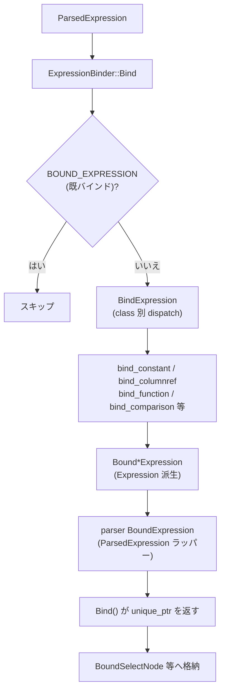

# 第8章 式のバインド

> **本章で読むソース**
>
> - [src/planner/expression_binder.cpp](https://github.com/duckdb/duckdb/blob/v1.5.4/src/planner/expression_binder.cpp)
> - [src/include/duckdb/parser/expression/bound_expression.hpp](https://github.com/duckdb/duckdb/blob/v1.5.4/src/include/duckdb/parser/expression/bound_expression.hpp)
> - [src/include/duckdb/planner/expression.hpp](https://github.com/duckdb/duckdb/blob/v1.5.4/src/include/duckdb/planner/expression.hpp)
> - [src/planner/binder/expression/bind_constant_expression.cpp](https://github.com/duckdb/duckdb/blob/v1.5.4/src/planner/binder/expression/bind_constant_expression.cpp)
> - [src/planner/binder/expression/bind_columnref_expression.cpp](https://github.com/duckdb/duckdb/blob/v1.5.4/src/planner/binder/expression/bind_columnref_expression.cpp)
> - [src/planner/binder/expression/bind_function_expression.cpp](https://github.com/duckdb/duckdb/blob/v1.5.4/src/planner/binder/expression/bind_function_expression.cpp)
> - [src/planner/binder/expression/bind_comparison_expression.cpp](https://github.com/duckdb/duckdb/blob/v1.5.4/src/planner/binder/expression/bind_comparison_expression.cpp)
> - [src/planner/table_binding.cpp](https://github.com/duckdb/duckdb/blob/v1.5.4/src/planner/table_binding.cpp)

## この章の狙い

第6章のパーサは `ParsedExpression` 木を作るが、列参照はまだ名前のままで、関数も未解決である。
本章では `ExpressionBinder` を入口に、定数、列参照、関数呼び出し、比較演算がどの `Bound*Expression`（`Expression` 派生）へ変換されるかを追う。

## 前提

第7章で `Binder::Bind` と `bind_context` によるテーブル参照のバインドを読んでいるものとする。
`LogicalType` と `Value` の契約は第2章、`ColumnBinding` の最終解決は第17章（式実行）で扱う。

## ParsedExpression と Expression の二段構え

バインドの成果物は `Expression`（プランナ側）である。
`BoundConstantExpression`、`BoundColumnRefExpression`、`BoundFunctionExpression`、`BoundComparisonExpression` などが `Expression` を継承し、`return_type` を持つ。

[src/include/duckdb/planner/expression.hpp L18-L25](https://github.com/duckdb/duckdb/blob/v1.5.4/src/include/duckdb/planner/expression.hpp#L18-L25)

```cpp
//!  The Expression class represents a bound Expression with a return type
class Expression : public BaseExpression {
public:
	Expression(ExpressionType type, ExpressionClass expression_class, LogicalType return_type);
	~Expression() override;

	//! The return type of the expression
	LogicalType return_type;
```

一方、`src/include/duckdb/parser/expression/bound_expression.hpp` の `BoundExpression` は名前が紛らわしいが、**bound 式の基底ではない**。
これは `ParsedExpression` を継承したラッパーであり、バインド済みの `unique_ptr<Expression>` を一時的に載せるための中間ノードである。
サブクエリ内で既にバインドした部分を再バインドしない用途にも使われる。

[src/include/duckdb/parser/expression/bound_expression.hpp L17-L27](https://github.com/duckdb/duckdb/blob/v1.5.4/src/include/duckdb/parser/expression/bound_expression.hpp#L17-L27)

```cpp
//! BoundExpression is an intermediate dummy class used by the binder. It is a ParsedExpression but holds an Expression.
//! It represents a successfully bound expression. It is used in the Binder to prevent re-binding of already bound parts
//! when dealing with subqueries.
class BoundExpression : public ParsedExpression {
public:
	static constexpr const ExpressionClass TYPE = ExpressionClass::BOUND_EXPRESSION;

public:
	explicit BoundExpression(unique_ptr<Expression> expr);

	unique_ptr<Expression> expr;
```

`BoundColumnRefExpression` は `ColumnBinding`（テーブルインデックスと列インデックス）を保持するが、まだ実行可能な列参照ではない。
`ColumnBindingResolver` が後段で `BoundReferenceExpression`（チャンク内インデックス）へ置き換える（第9章、第17章）。

## ExpressionBinder の入口

`ExpressionBinder::BindExpression` は `ExpressionClass` の `switch` で `planner/binder/expression/` の各 `BindExpression` へ振り分ける。

[src/planner/expression_binder.cpp L60-L82](https://github.com/duckdb/duckdb/blob/v1.5.4/src/planner/expression_binder.cpp#L60-L82)

```cpp
BindResult ExpressionBinder::BindExpression(unique_ptr<ParsedExpression> &expr, idx_t depth, bool root_expression) {
	auto stack_checker = StackCheck(*expr);

	auto &expr_ref = *expr;
	switch (expr_ref.GetExpressionClass()) {
	case ExpressionClass::BETWEEN:
		return BindExpression(expr_ref.Cast<BetweenExpression>(), depth);
	case ExpressionClass::CASE:
		return BindExpression(expr_ref.Cast<CaseExpression>(), depth);
	case ExpressionClass::CAST:
		return BindExpression(expr_ref.Cast<CastExpression>(), depth);
	case ExpressionClass::COLLATE:
		return BindExpression(expr_ref.Cast<CollateExpression>(), depth);
	case ExpressionClass::COLUMN_REF:
		return BindExpression(expr_ref.Cast<ColumnRefExpression>(), depth, root_expression, expr);
	case ExpressionClass::LAMBDA_REF:
		return BindExpression(expr_ref.Cast<LambdaRefExpression>(), depth);
	case ExpressionClass::COMPARISON:
		return BindExpression(expr_ref.Cast<ComparisonExpression>(), depth);
	case ExpressionClass::CONJUNCTION:
		return BindExpression(expr_ref.Cast<ConjunctionExpression>(), depth);
	case ExpressionClass::CONSTANT:
		return BindExpression(expr_ref.Cast<ConstantExpression>(), depth);
```

`Bind(unique_ptr<ParsedExpression>&)` は成功時に `ParsedExpression` ツリー上のノードを parser 側 `BoundExpression` ラッパーへ差し替える。
最終的に `Bind(..., result_type)` がラッパーから `unique_ptr<Expression>` を取り出して呼び出し元へ返す。

[src/planner/expression_binder.cpp L362-L388](https://github.com/duckdb/duckdb/blob/v1.5.4/src/planner/expression_binder.cpp#L362-L388)

```cpp
ErrorData ExpressionBinder::Bind(unique_ptr<ParsedExpression> &expr, idx_t depth, bool root_expression) {
	// bind the node, but only if it has not been bound yet
	auto query_location = expr->GetQueryLocation();
	auto &expression = *expr;
	auto alias = expression.GetAlias();
	if (expression.GetExpressionClass() == ExpressionClass::BOUND_EXPRESSION) {
		// already bound, don't bind it again
		return ErrorData();
	}
	// ... (中略) ...
	// bind the expression
	BindResult result = BindExpression(expr, depth, root_expression);
	if (result.HasError()) {
		return std::move(result.error);
	}
	// successfully bound: replace the node with a BoundExpression
	result.expression->SetQueryLocation(query_location);
	expr = make_uniq<BoundExpression>(std::move(result.expression));
	auto &be = expr->Cast<BoundExpression>();
	be.SetAlias(alias);
	if (!alias.empty()) {
		be.expr->SetAlias(alias);
	}
	return ErrorData();
}
```

[src/planner/expression/bound_expression.cpp L6-L17](https://github.com/duckdb/duckdb/blob/v1.5.4/src/planner/expression/bound_expression.cpp#L6-L17)

```cpp
BoundExpression::BoundExpression(unique_ptr<Expression> expr_p)
    : ParsedExpression(ExpressionType::INVALID, ExpressionClass::BOUND_EXPRESSION), expr(std::move(expr_p)) {
	this->alias = expr->GetAlias();
}

unique_ptr<Expression> &BoundExpression::GetExpression(ParsedExpression &expr) {
	auto &bound_expr = expr.Cast<BoundExpression>();
	if (!bound_expr.expr) {
		throw InternalException("BoundExpression::GetExpression called on empty bound expression");
	}
	return bound_expr.expr;
}
```

## 定数と列参照

定数は第2章の `Value` をそのまま `BoundConstantExpression` へ載せるだけである。

[src/planner/binder/expression/bind_constant_expression.cpp L7-L9](https://github.com/duckdb/duckdb/blob/v1.5.4/src/planner/binder/expression/bind_constant_expression.cpp#L7-L9)

```cpp
BindResult ExpressionBinder::BindExpression(ConstantExpression &expr, idx_t depth) {
	return BindResult(make_uniq<BoundConstantExpression>(expr.value));
}
```

列参照は `QualifyColumnName` で修飾名を解決したあと、`bind_context` 経由で `TableBinding::Bind` が `BoundColumnRefExpression` を生成する。

[src/planner/binder/expression/bind_columnref_expression.cpp L549-L573](https://github.com/duckdb/duckdb/blob/v1.5.4/src/planner/binder/expression/bind_columnref_expression.cpp#L549-L573)

```cpp
	// the above QualifyColumnName returned an individual column reference
	// expression, which we resolve to either a base table or a subquery expression,
	// and if it was a macro parameter, then we let macro_binding bind it to the argument
	BindResult result;
	auto &col_ref = expr->Cast<ColumnRefExpression>();
	D_ASSERT(col_ref.IsQualified());
	auto &table_name = col_ref.GetTableName();

	if (binder.macro_binding && table_name == binder.macro_binding->GetAlias()) {
		result = binder.macro_binding->Bind(col_ref, depth);
	} else {
		result = binder.bind_context.BindColumn(col_ref, depth);
	}

	if (result.HasError()) {
		result.error.AddQueryLocation(col_ref_p);
		return result;
	}

	// we bound the column reference
	BoundColumnReferenceInfo ref;
	ref.name = col_ref.column_names.back();
	ref.query_location = col_ref.GetQueryLocation();
	bound_columns.push_back(std::move(ref));
	return result;
```

[src/planner/table_binding.cpp L257-L289](https://github.com/duckdb/duckdb/blob/v1.5.4/src/planner/table_binding.cpp#L257-L289)

```cpp
BindResult TableBinding::Bind(ColumnRefExpression &colref, idx_t depth) {
	auto &column_name = colref.GetColumnName();
	column_t column_index;
	bool success = false;
	success = TryGetBindingIndex(column_name, column_index);
	if (!success) {
		return BindResult(ColumnNotFoundError(column_name));
	}
	// ... (中略) ...
	LogicalType col_type;
	auto ventry = virtual_columns.find(column_index);
	if (ventry != virtual_columns.end()) {
		col_type = ventry->second.type;
	} else {
		col_type = types[column_index];
		if (colref.GetAlias().empty()) {
			colref.SetAlias(names[column_index]);
		}
	}
	ColumnBinding binding = GetColumnBinding(column_index);
	return BindResult(make_uniq<BoundColumnRefExpression>(colref.GetName(), col_type, binding, depth));
}
```

## 関数呼び出しと比較

関数式は子を先にバインドし、`BoundExpression::GetExpression` で `unique_ptr<Expression>` を取り出してから `FunctionBinder::BindScalarFunction` へ渡す。
戻り値は多くの場合 `BoundFunctionExpression` である。

[src/planner/binder/expression/bind_function_expression.cpp L173-L210](https://github.com/duckdb/duckdb/blob/v1.5.4/src/planner/binder/expression/bind_function_expression.cpp#L173-L210)

```cpp
BindResult ExpressionBinder::BindFunction(FunctionExpression &function, ScalarFunctionCatalogEntry &func, idx_t depth) {
	// bind the children of the function expression
	ErrorData error;

	// bind of each child
	for (idx_t i = 0; i < function.children.size(); i++) {
		BindChild(function.children[i], depth, error);
	}

	if (error.HasError()) {
		return BindResult(std::move(error));
	}
	// ... (中略) ...
	vector<unique_ptr<Expression>> children;
	for (idx_t i = 0; i < function.children.size(); i++) {
		auto &child = BoundExpression::GetExpression(*function.children[i]);
		children.push_back(std::move(child));
	}

	FunctionBinder function_binder(binder);
	auto result = function_binder.BindScalarFunction(func, std::move(children), error, function.is_operator, &binder);
	if (!result) {
		error.AddQueryLocation(function);
		error.Throw();
	}
	if (result->GetExpressionType() == ExpressionType::BOUND_FUNCTION) {
		auto &bound_function = result->Cast<BoundFunctionExpression>();
		if (bound_function.function.GetStability() == FunctionStability::CONSISTENT_WITHIN_QUERY) {
			binder.SetAlwaysRequireRebind();
		}
	}
	return BindResult(std::move(result));
}
```

比較演算は左右の型を `BoundComparisonExpression::TryBindComparison` で統一し、必要なら `BoundCastExpression::AddCastToType` で暗黙キャストを挿入する。

[src/planner/binder/expression/bind_comparison_expression.cpp L157-L191](https://github.com/duckdb/duckdb/blob/v1.5.4/src/planner/binder/expression/bind_comparison_expression.cpp#L157-L191)

```cpp
BindResult ExpressionBinder::BindExpression(ComparisonExpression &expr, idx_t depth) {
	ErrorData error;
	BindChild(expr.left, depth, error);
	BindChild(expr.right, depth, error);
	if (error.HasError()) {
		return BindResult(std::move(error));
	}

	auto &left = BoundExpression::GetExpression(*expr.left);
	auto &right = BoundExpression::GetExpression(*expr.right);
	auto left_sql_type = ExpressionBinder::GetExpressionReturnType(*left);
	auto right_sql_type = ExpressionBinder::GetExpressionReturnType(*right);
	LogicalType input_type;
	if (!BoundComparisonExpression::TryBindComparison(context, left_sql_type, right_sql_type, input_type,
	                                                  expr.GetExpressionType())) {
		return BindResult(BinderException(expr,
		                                  "Cannot compare values of type %s and type %s - an explicit cast is required",
		                                  left_sql_type.ToString(), right_sql_type.ToString()));
	}
	left = BoundCastExpression::AddCastToType(context, std::move(left), input_type,
	                                          input_type.id() == LogicalTypeId::ENUM);
	right = BoundCastExpression::AddCastToType(context, std::move(right), input_type,
	                                           input_type.id() == LogicalTypeId::ENUM);

	PushCollation(context, left, input_type);
	PushCollation(context, right, input_type);

	return BindResult(
	    make_uniq<BoundComparisonExpression>(expr.GetExpressionType(), std::move(left), std::move(right)));
}
```

## SELECT 句での式バインダ

`BindSelectNode` では句ごとに専用バインダを使い分ける。
WHERE は `WhereBinder` が `ColumnAliasBinder` と組み合わさり、SELECT リストの別名を WHERE 内から参照できる。

[src/planner/binder/query_node/bind_select_node.cpp L462-L471](https://github.com/duckdb/duckdb/blob/v1.5.4/src/planner/binder/query_node/bind_select_node.cpp#L462-L471)

```cpp
	if (statement.where_clause) {
		BindWhereStarExpression(statement.where_clause);

		ColumnAliasBinder alias_binder(bind_state);
		WhereBinder where_binder(*this, context, &alias_binder);
		unique_ptr<ParsedExpression> condition = std::move(statement.where_clause);
		result.where_clause = where_binder.Bind(condition);
	}
```

`where_binder.Bind` の戻り値は `unique_ptr<Expression>` であり、parser 側 `BoundExpression` ラッパーは最終段で剥がれた状態で `BoundSelectNode` に格納される。

## 処理の流れ



列参照は `bind_context` → `BoundColumnRefExpression`、関数は `FunctionBinder` → `BoundFunctionExpression`、比較は型統一後 `BoundComparisonExpression` となる。

## 高速化と最適化の工夫

`ExpressionClass::BOUND_EXPRESSION` が付いたノードは再バインドをスキップする。
サブクエリ展開で同じ `ParsedExpression` 部分木を複数回通るとき、二重のカタログ参照と関数解決を避けられる。

列が見つからないエラーは `CombineMissingColumns` で候補列名をマージし、`StringUtil::SimilarityRating` で類似度順に並べ替える。
誤記に近い列名を1回のエラーで提示でき、再実行の試行回数を減らせる。

相関サブクエリでは `BindCorrelatedColumns` が外側の `ExpressionBinder` スタックを遡り、`depth` 付き `BoundColumnRefExpression` を生成する。
内側バインダだけでは解決できない参照を、外側スコープへ1パスで委譲できる。

`BindingMode::EXTRACT_NAMES` では列参照バインドが `BoundConstantExpression(SQLNULL)` を返す短絡経路がある。
このモードは `ClientContext::GetTableNames` がクエリのテーブル名を収集するために設定する。
関数呼び出しでも `BindAndQualifyFunction` はカタログ検索と関数種別の解決までは行い、省略されるのは子のバインド後の `FunctionBinder::BindScalarFunction`、すなわち scalar overload と戻り型の確定である。

## まとめ

式バインドは `ParsedExpression` から `Expression`（`Bound*Expression`）への変換である。
parser の `BoundExpression` は `ParsedExpression` ラッパーに過ぎず、`BoundFunctionExpression` 等のプランナ側 bound 式と混同してはならない。
`ExpressionBinder` が class 別に dispatch し、列参照は `ColumnBinding`、関数は `FunctionBinder`、比較は暗黙キャスト付き `BoundComparisonExpression` として確定する。

## 関連する章

- 第2章（LogicalType と Value）：`BoundConstantExpression` の `Value`
- 第6章（パーサとトランスフォーマ）：入力の `ParsedExpression`
- 第7章（バインダと名前解決）：`bind_context` と `BoundSelectNode` 生成
- 第9章（論理演算子とプラン生成）：バインド済み式を載せる `LogicalFilter` 等
- 第17章（式実行）：`BoundReferenceExpression` への置換と評価
- 第32章（関数バインドと拡張登録）：`FunctionBinder::BindScalarFunction`
