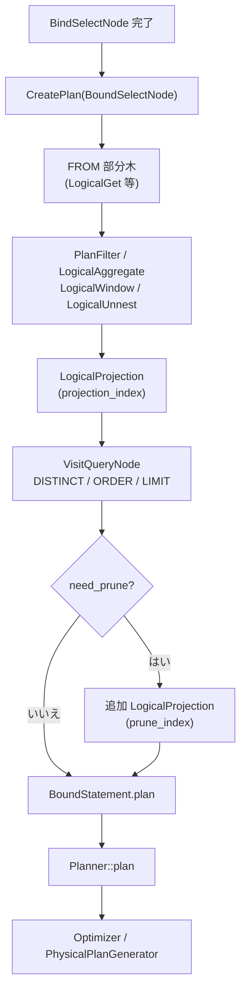

# 第9章 論理演算子とプラン生成

> **本章で読むソース**
>
> - [src/planner/logical_operator.cpp](https://github.com/duckdb/duckdb/blob/v1.5.4/src/planner/logical_operator.cpp)
> - [src/planner/binder/query_node/bind_select_node.cpp](https://github.com/duckdb/duckdb/blob/v1.5.4/src/planner/binder/query_node/bind_select_node.cpp)
> - [src/planner/binder/query_node/plan_select_node.cpp](https://github.com/duckdb/duckdb/blob/v1.5.4/src/planner/binder/query_node/plan_select_node.cpp)
> - [src/planner/binder/query_node/plan_query_node.cpp](https://github.com/duckdb/duckdb/blob/v1.5.4/src/planner/binder/query_node/plan_query_node.cpp)
> - [src/planner/binder/query_node/plan_setop.cpp](https://github.com/duckdb/duckdb/blob/v1.5.4/src/planner/binder/query_node/plan_setop.cpp)
> - [src/planner/planner.cpp](https://github.com/duckdb/duckdb/blob/v1.5.4/src/planner/planner.cpp)

## この章の狙い

第7章、第8章で `BoundStatement` と bound 式が揃ったあと、バインダは `LogicalOperator` 木を組み立てる。
本章では `BoundSelectNode` から `CreatePlan` が `LogicalGet`、`LogicalFilter`、`LogicalAggregate`、`LogicalProjection` などへ展開する経路を追う。

## 前提

第8章で `BoundColumnRefExpression` など bound 式の生成を読んでいるものとする。
`LogicalOperator` の型解決は物理プラン生成（第14章）の前段、`ColumnBindingResolver` は第17章で扱う。

## LogicalOperator の骨格

`LogicalOperator` は論理クエリ木の各ノードの基底クラスである。
子演算子は `vector<unique_ptr<LogicalOperator>> children` で保持し、フィルタ条件や投影式は `vector<unique_ptr<Expression>> expressions` に載る。

[src/planner/logical_operator.cpp L19-L25](https://github.com/duckdb/duckdb/blob/v1.5.4/src/planner/logical_operator.cpp#L19-L25)

```cpp
LogicalOperator::LogicalOperator(LogicalOperatorType type)
    : type(type), estimated_cardinality(0), has_estimated_cardinality(false) {
}

LogicalOperator::LogicalOperator(LogicalOperatorType type, vector<unique_ptr<Expression>> expressions)
    : type(type), expressions(std::move(expressions)), estimated_cardinality(0), has_estimated_cardinality(false) {
}
```

物理プラン生成前に `ResolveOperatorTypes` が子から親へ再帰し、各演算子の出力 `types` を確定する。

[src/planner/logical_operator.cpp L93-L102](https://github.com/duckdb/duckdb/blob/v1.5.4/src/planner/logical_operator.cpp#L93-L102)

```cpp
void LogicalOperator::ResolveOperatorTypes() {
	types.clear();
	// first resolve child types
	for (auto &child : children) {
		child->ResolveOperatorTypes();
	}
	// now resolve the types for this operator
	ResolveTypes();
	D_ASSERT(types.size() == GetColumnBindings().size());
}
```

## バインドからプラン生成への接続

`BindSelectNode` の末尾で `CreatePlan(result)` が呼ばれ、`BoundStatement.plan` に論理木の根が入る。
この時点で SELECT リストや WHERE はすでに `unique_ptr<Expression>` として `BoundSelectNode` に格納済みである。

[src/planner/binder/query_node/bind_select_node.cpp L701-L705](https://github.com/duckdb/duckdb/blob/v1.5.4/src/planner/binder/query_node/bind_select_node.cpp#L701-L705)

```cpp
	BoundStatement result_statement;
	result_statement.types = result.types;
	result_statement.names = result.names;
	result_statement.plan = CreatePlan(result);
	result_statement.extra_info.original_expressions = std::move(result.bind_state.original_expressions);
```

`Planner::CreatePlan` は `binder->Bind(statement)` の戻り `BoundStatement.plan` をそのまま `Planner::plan` へ move する。
バインドと論理プラン生成は同一 `Binder` セッション内で連続して完結する。

[src/planner/planner.cpp L52-L64](https://github.com/duckdb/duckdb/blob/v1.5.4/src/planner/planner.cpp#L52-L64)

```cpp
		profiler.StartPhase(MetricType::PLANNER_BINDING);
		binder->SetParameters(bound_parameters);
		auto bound_statement = binder->Bind(statement);
		profiler.EndPhase();

		RunPostBindExtensions(context, *binder, bound_statement);

		this->names = bound_statement.names;
		this->types = bound_statement.types;
		this->plan = std::move(bound_statement.plan);
```

## SELECT の論理プラン組み立て

`Binder::CreatePlan(BoundSelectNode&)` は FROM 由来の部分木を根に取り、SQL の句順に演算子を積み上げる。
WHERE → 集約 → HAVING → ウィンドウ → QUALIFY → UNNEST → 投影、という順序がコードに反映されている。

[src/planner/binder/query_node/plan_select_node.cpp L18-L51](https://github.com/duckdb/duckdb/blob/v1.5.4/src/planner/binder/query_node/plan_select_node.cpp#L18-L51)

```cpp
unique_ptr<LogicalOperator> Binder::CreatePlan(BoundSelectNode &statement) {
	D_ASSERT(statement.from_table.plan);
	auto root = std::move(statement.from_table.plan);

	if (statement.sample_options) {
		root = make_uniq<LogicalSample>(std::move(statement.sample_options), std::move(root));
	}

	if (statement.where_clause) {
		root = PlanFilter(std::move(statement.where_clause), std::move(root));
	}

	if (!statement.aggregates.empty() || !statement.groups.group_expressions.empty() || statement.having) {
		if (!statement.groups.group_expressions.empty()) {
			for (auto &group : statement.groups.group_expressions) {
				PlanSubqueries(group, root);
			}
		}
		for (auto &expr : statement.aggregates) {
			PlanSubqueries(expr, root);
		}
		auto aggregate = make_uniq<LogicalAggregate>(statement.group_index, statement.aggregate_index,
		                                             std::move(statement.aggregates));
		aggregate->groups = std::move(statement.groups.group_expressions);
		aggregate->groupings_index = statement.groupings_index;
		aggregate->grouping_sets = std::move(statement.groups.grouping_sets);
		aggregate->grouping_functions = std::move(statement.grouping_functions);

		aggregate->AddChild(std::move(root));
		root = std::move(aggregate);
```

`PlanFilter` は条件式中のサブクエリを先に `PlanSubqueries` で論理演算子へ展開し、`LogicalFilter` を子の上に載せる。

[src/planner/binder/query_node/plan_select_node.cpp L11-L15](https://github.com/duckdb/duckdb/blob/v1.5.4/src/planner/binder/query_node/plan_select_node.cpp#L11-L15)

```cpp
unique_ptr<LogicalOperator> Binder::PlanFilter(unique_ptr<Expression> condition, unique_ptr<LogicalOperator> root) {
	PlanSubqueries(condition, root);
	auto filter = make_uniq<LogicalFilter>(std::move(condition));
	filter->AddChild(std::move(root));
	return std::move(filter);
}
```

SELECT リストは `LogicalProjection` として最後に載る。
`projection_index` は第7章で `BindSelectNode` が割り当てたテーブルインデックスであり、投影列の `ColumnBinding` に使われる。

[src/planner/binder/query_node/plan_select_node.cpp L105-L112](https://github.com/duckdb/duckdb/blob/v1.5.4/src/planner/binder/query_node/plan_select_node.cpp#L105-L112)

```cpp
	for (auto &expr : statement.select_list) {
		PlanSubqueries(expr, root);
	}

	auto proj = make_uniq<LogicalProjection>(statement.projection_index, std::move(statement.select_list));
	auto &projection = *proj;
	proj->AddChild(std::move(root));
	root = std::move(proj);
```

## 修飾子と集合演算

DISTINCT、ORDER BY、LIMIT は `VisitQueryNode` が `BoundQueryNode` の修飾子を後置で処理する。
投影のあとに `LogicalDistinct`、`LogicalOrder`、`LogicalLimit` が順に積まれる。

[src/planner/binder/query_node/plan_query_node.cpp L10-L45](https://github.com/duckdb/duckdb/blob/v1.5.4/src/planner/binder/query_node/plan_query_node.cpp#L10-L45)

```cpp
unique_ptr<LogicalOperator> Binder::VisitQueryNode(BoundQueryNode &node, unique_ptr<LogicalOperator> root) {
	D_ASSERT(root);
	for (auto &mod : node.modifiers) {
		switch (mod->type) {
		case ResultModifierType::DISTINCT_MODIFIER: {
			auto &bound = mod->Cast<BoundDistinctModifier>();
			if (bound.target_distincts.empty()) {
				break;
			}
			auto distinct = make_uniq<LogicalDistinct>(std::move(bound.target_distincts), bound.distinct_type);
			distinct->AddChild(std::move(root));
			root = std::move(distinct);
			break;
		}
		case ResultModifierType::ORDER_MODIFIER: {
			auto &bound = mod->Cast<BoundOrderModifier>();
			// ... (中略) ...
			auto order = make_uniq<LogicalOrder>(std::move(bound.orders));
			order->AddChild(std::move(root));
			root = std::move(order);
			break;
		}
		case ResultModifierType::LIMIT_MODIFIER: {
			auto &bound = mod->Cast<BoundLimitModifier>();
			auto limit = make_uniq<LogicalLimit>(std::move(bound.limit_val), std::move(bound.offset_val));
			limit->AddChild(std::move(root));
			root = std::move(limit);
			break;
		}
```

UNION などの集合演算は子 `BoundStatement` ごとに `CreatePlan` 済みの部分木を取り、`LogicalSetOperation` で結合する。
子の列型が一致しない場合は `CastLogicalOperatorToTypes` が投影とキャストを挿入する。

[src/planner/binder/query_node/plan_setop.cpp L95-L132](https://github.com/duckdb/duckdb/blob/v1.5.4/src/planner/binder/query_node/plan_setop.cpp#L95-L132)

```cpp
unique_ptr<LogicalOperator> Binder::CreatePlan(BoundSetOperationNode &node) {
	LogicalOperatorType logical_type = LogicalOperatorType::LOGICAL_INVALID;
	switch (node.setop_type) {
	case SetOperationType::UNION:
	case SetOperationType::UNION_BY_NAME:
		logical_type = LogicalOperatorType::LOGICAL_UNION;
		break;
	case SetOperationType::EXCEPT:
		logical_type = LogicalOperatorType::LOGICAL_EXCEPT;
		break;
	case SetOperationType::INTERSECT:
		logical_type = LogicalOperatorType::LOGICAL_INTERSECT;
		break;
	default:
		throw InternalException("Unsupported logical operator type for set-operation");
	}
	D_ASSERT(node.bound_children.size() >= 2);
	vector<unique_ptr<LogicalOperator>> children;
	for (idx_t child_idx = 0; child_idx < node.bound_children.size(); child_idx++) {
		auto &child = node.bound_children[child_idx];
		auto &child_binder = *node.child_binders[child_idx];

		auto child_node = std::move(child.plan);
		child_node = CastLogicalOperatorToTypes(child.types, node.types, std::move(child_node));
		if (child_binder.has_unplanned_dependent_joins) {
			has_unplanned_dependent_joins = true;
		}
		children.push_back(std::move(child_node));
	}
	auto root = make_uniq<LogicalSetOperation>(node.setop_index, node.types.size(), std::move(children), logical_type,
	                                           node.setop_all);
	return VisitQueryNode(node, std::move(root));
}
```

## 処理の流れ



集合演算は各子ブランチが独立に `CreatePlan` され、`LogicalSetOperation` でマージされる。

## 高速化と最適化の工夫

`CastLogicalOperatorToTypes` は、既存の `LogicalProjection` の直下が `LogicalGet` で、式がすべて `BoundColumnRefExpression` のとき、キャスト用投影を省略して scan 関数へ型プッシュダウンできる。
v1.5.4 で `type_pushdown` callback を登録しているのは `read_csv` だけで、この scan が返却型を target type に変え、投影と後段のキャストを除ける。

[src/planner/binder/query_node/plan_setop.cpp L25-L57](https://github.com/duckdb/duckdb/blob/v1.5.4/src/planner/binder/query_node/plan_setop.cpp#L25-L57)

```cpp
	if (node->type == LogicalOperatorType::LOGICAL_PROJECTION) {
		D_ASSERT(node->expressions.size() == source_types.size());
		if (node->children.size() == 1 && node->children[0]->type == LogicalOperatorType::LOGICAL_GET) {
			auto &logical_get = node->children[0]->Cast<LogicalGet>();
			auto &column_ids = logical_get.GetColumnIds();
			if (logical_get.function.type_pushdown) {
				unordered_map<idx_t, LogicalType> new_column_types;
				bool do_pushdown = true;
				for (idx_t i = 0; i < op->expressions.size(); i++) {
					if (op->expressions[i]->GetExpressionType() == ExpressionType::BOUND_COLUMN_REF) {
						auto &col_ref = op->expressions[i]->Cast<BoundColumnRefExpression>();
						auto column_id = column_ids[col_ref.binding.column_index].GetPrimaryIndex();
						if (new_column_types.find(column_id) != new_column_types.end()) {
							do_pushdown = false;
							break;
						}
						new_column_types[column_id] = target_types[i];
					} else {
						do_pushdown = false;
						break;
					}
				}
				if (do_pushdown) {
					logical_get.function.type_pushdown(context, logical_get.bind_data, new_column_types);
					for (auto &type : new_column_types) {
						logical_get.returned_types[type.first] = type.second;
					}
					return std::move(op->children[0]);
				}
			}
		}
```

`need_prune` が立っているとき、`CreatePlan` は `VisitQueryNode` が DISTINCT や ORDER BY、LIMIT を積んだ後に、もう一段 `LogicalProjection` を挿入する。
修飾子のために `select_list` へ追加した隠し列を、修飾子が消費した後に落とし、`statement.column_count` 個のユーザー向け出力列だけを残して出力スキーマを戻す。

[src/planner/binder/query_node/plan_select_node.cpp L117-L128](https://github.com/duckdb/duckdb/blob/v1.5.4/src/planner/binder/query_node/plan_select_node.cpp#L117-L128)

```cpp
	if (statement.need_prune) {
		D_ASSERT(root);
		vector<unique_ptr<Expression>> prune_expressions;
		for (idx_t i = 0; i < statement.column_count; i++) {
			prune_expressions.push_back(make_uniq<BoundColumnRefExpression>(
			    projection.expressions[i]->return_type, ColumnBinding(statement.projection_index, i)));
		}
		auto prune = make_uniq<LogicalProjection>(statement.prune_index, std::move(prune_expressions));
		prune->AddChild(std::move(root));
		root = std::move(prune);
	}
```

`PlanSubqueries` を各句の演算子追加前に呼ぶ設計により、サブクエリは独立した論理サブプラン（相関 join 等）として先に木へ載る。
式バインド段階では `BoundSubqueryExpression` のまま保持し、プラン生成時に一度だけ展開する。

## まとめ

論理プラン生成は `BoundSelectNode` 等の中間表現から `unique_ptr<LogicalOperator>` 木を bottom-up に組み立てる段階である。
`CreatePlan` は SQL 句順に `LogicalFilter`、`LogicalAggregate`、`LogicalProjection` を積み、`VisitQueryNode` が DISTINCT 以降を後置する。
`Planner::plan` がこの木を受け取り、第10章以降のオプティマイザと物理プラン生成へ渡る。

## 関連する章

- 第7章（バインダと名前解決）：`BoundSelectNode` と `LogicalGet` 生成
- 第8章（式のバインド）：演算子に載る `Expression`
- 第10章（オプティマイザ全体像）：`LogicalOperator` 木の書き換え
- 第14章（物理プラン生成）：`ResolveOperatorTypes` 後の物理演算子 dispatch
- 第15章（パイプライン実行）：物理プラン実行
- 第18章（テーブル走査と table function）：型プッシュダウンの scan 側
