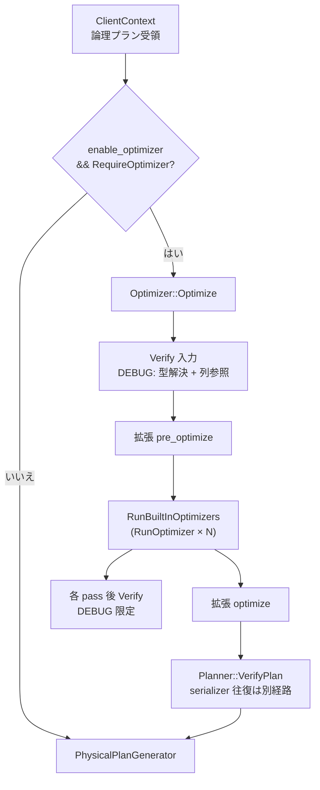

# 第10章 オプティマイザ全体像

> **本章で読むソース**
>
> - [src/optimizer/optimizer.cpp](https://github.com/duckdb/duckdb/blob/v1.5.4/src/optimizer/optimizer.cpp)
> - [src/execution/column_binding_resolver.cpp](https://github.com/duckdb/duckdb/blob/v1.5.4/src/execution/column_binding_resolver.cpp)
> - [src/main/client_context.cpp](https://github.com/duckdb/duckdb/blob/v1.5.4/src/main/client_context.cpp)
> - [src/planner/planner.cpp](https://github.com/duckdb/duckdb/blob/v1.5.4/src/planner/planner.cpp)

## この章の狙い

第9章で組み立てた `LogicalOperator` 木は、そのままでは実行に向かない部分が多い。
本章では `Optimizer::Optimize` を入口に、組み込み pass の呼び出し順、`disabled_optimizers` によるスキップ、各 pass 後と最終段の検証（`Verify` / `VerifyPlan`）を追う。

## 前提

論理プランのノード型と `ColumnBinding` の役割は第9章を前提とする。
フィルタプッシュダウンや統計伝播の個別アルゴリズムは第11章、結合順序は第12章で扱う。

## クエリパイプライン上の位置づけ

`ClientContext` はバインド済み論理プランに対し、`enable_optimizer` が有効かつ `RequireOptimizer()` が真のときだけ `Optimizer` を起動する。
最適化の直後に `PhysicalPlanGenerator::Plan` へ渡る。

[src/main/client_context.cpp L433-L438](https://github.com/duckdb/duckdb/blob/v1.5.4/src/main/client_context.cpp#L433-L438)

```cpp
	if (config.enable_optimizer && logical_plan->RequireOptimizer()) {
		profiler.StartPhase(MetricType::ALL_OPTIMIZERS);
		Optimizer optimizer(*logical_planner.binder, *this);
		logical_plan = optimizer.Optimize(std::move(logical_plan));
		D_ASSERT(logical_plan);
		profiler.EndPhase();
```

`Optimizer` はコンストラクタで `ExpressionRewriter` に簡約ルール群を登録する。
`RunBuiltInOptimizers` の先頭 pass は、この rewriter が式木だけを書き換える段階である。

[src/optimizer/optimizer.cpp L49-L55](https://github.com/duckdb/duckdb/blob/v1.5.4/src/optimizer/optimizer.cpp#L49-L55)

```cpp
Optimizer::Optimizer(Binder &binder, ClientContext &context) : context(context), binder(binder), rewriter(context) {
	rewriter.rules.push_back(make_uniq<ConstantOrderNormalizationRule>(rewriter));
	rewriter.rules.push_back(make_uniq<ConstantFoldingRule>(rewriter));
	rewriter.rules.push_back(make_uniq<DistributivityRule>(rewriter));
	rewriter.rules.push_back(make_uniq<ArithmeticSimplificationRule>(rewriter));
	rewriter.rules.push_back(make_uniq<CaseSimplificationRule>(rewriter));
	rewriter.rules.push_back(make_uniq<ConjunctionSimplificationRule>(rewriter));
```

## disabled optimizer と RunOptimizer

各 pass は `RunOptimizer` でラップされる。
`DBConfig::options.disabled_optimizers` に `OptimizerType` が含まれていれば callback は実行されず、プロファイラのフェーズも記録されない。

[src/optimizer/optimizer.cpp L89-L110](https://github.com/duckdb/duckdb/blob/v1.5.4/src/optimizer/optimizer.cpp#L89-L110)

```cpp
bool Optimizer::OptimizerDisabled(ClientContext &context_p, OptimizerType type) {
	auto &config = DBConfig::GetConfig(context_p);
	return config.options.disabled_optimizers.find(type) != config.options.disabled_optimizers.end();
}

void Optimizer::RunOptimizer(OptimizerType type, const std::function<void()> &callback) {
	if (context.IsInterrupted()) {
		throw InterruptException();
	}

	if (OptimizerDisabled(type)) {
		// optimizer is marked as disabled: skip
		return;
	}
	auto &profiler = QueryProfiler::Get(context);
	profiler.StartPhase(MetricsUtils::GetOptimizerMetricByType(type));
	callback();
	profiler.EndPhase();
	if (plan) {
		Verify(*plan);
	}
}
```

入力時と各 pass 後の `Verify` は `ColumnBindingResolver::Verify` を呼ぶが、本体は `#ifdef DEBUG` の内側にだけある。
先に `op.ResolveOperatorTypes()` で型を解決し、verify_only の resolver と `VerifyInternal` で列参照と binding 集合の整合を確かめる。
`Planner::VerifyPlan` のシリアライザ往復とは別経路である。

[src/optimizer/optimizer.cpp L112-L114](https://github.com/duckdb/duckdb/blob/v1.5.4/src/optimizer/optimizer.cpp#L112-L114)

```cpp
void Optimizer::Verify(LogicalOperator &op) {
	ColumnBindingResolver::Verify(op);
}
```

[src/execution/column_binding_resolver.cpp L238-L244](https://github.com/duckdb/duckdb/blob/v1.5.4/src/execution/column_binding_resolver.cpp#L238-L244)

```cpp
void ColumnBindingResolver::Verify(LogicalOperator &op) {
#ifdef DEBUG
	op.ResolveOperatorTypes();
	ColumnBindingResolver resolver(true);
	resolver.VisitOperator(op);
	VerifyInternal(op);
#endif
}
```

## RunBuiltInOptimizers の pass 順序

`RunBuiltInOptimizers` は `plan->type` が単純な管理系演算子で子が空のとき早期 return する。
それ以外は、式簡約から始まり、CTE インライン、フィルタの pullup/pushdown、結合順序、列ライフタイム、統計伝播、結合フィルタプッシュダウンまで、固定順で pass を積む。

[src/optimizer/optimizer.cpp L116-L161](https://github.com/duckdb/duckdb/blob/v1.5.4/src/optimizer/optimizer.cpp#L116-L161)

```cpp
void Optimizer::RunBuiltInOptimizers() {
	switch (plan->type) {
	case LogicalOperatorType::LOGICAL_TRANSACTION:
	case LogicalOperatorType::LOGICAL_PRAGMA:
	case LogicalOperatorType::LOGICAL_SET:
	case LogicalOperatorType::LOGICAL_ATTACH:
	case LogicalOperatorType::LOGICAL_UPDATE_EXTENSIONS:
	case LogicalOperatorType::LOGICAL_CREATE_SECRET:
	case LogicalOperatorType::LOGICAL_EXTENSION_OPERATOR:
		// skip optimizing simple & often-occurring plans unaffected by rewrites
		if (plan->children.empty()) {
			return;
		}
		break;
	default:
		break;
	}
	// first we perform expression rewrites using the ExpressionRewriter
	// this does not change the logical plan structure, but only simplifies the expression trees
	RunOptimizer(OptimizerType::EXPRESSION_REWRITER, [&]() { rewriter.VisitOperator(*plan); });

	// try to inline CTEs instead of materialization
	RunOptimizer(OptimizerType::CTE_INLINING, [&]() {
		CTEInlining cte_inlining(*this);
		plan = cte_inlining.Optimize(std::move(plan));
	});

	// Rewrites SUM(x + C) into SUM(x) + C * COUNT(x)
	RunOptimizer(OptimizerType::SUM_REWRITER, [&]() {
		SumRewriterOptimizer optimizer(*this);
		optimizer.Optimize(plan);
	});

	// perform filter pullup
	RunOptimizer(OptimizerType::FILTER_PULLUP, [&]() {
		FilterPullup filter_pullup;
		plan = filter_pullup.Rewrite(std::move(plan));
	});

	// perform filter pushdown
	RunOptimizer(OptimizerType::FILTER_PUSHDOWN, [&]() {
		FilterPushdown filter_pushdown(*this);
		unordered_set<idx_t> top_bindings;
		filter_pushdown.CheckMarkToSemi(*plan, top_bindings);
		plan = filter_pushdown.Rewrite(std::move(plan));
	});
```

`CTE_INLINING` は二度呼ばれる。
一度目はフィルタ処理の前でマテリアライズ回避を狙い、二度目は `DELIMINATOR` の直後かつ `EMPTY_RESULT_PULLUP` の前に再度インライン機会を取る。

[src/optimizer/optimizer.cpp L180-L195](https://github.com/duckdb/duckdb/blob/v1.5.4/src/optimizer/optimizer.cpp#L180-L195)

```cpp
	// removes any redundant DelimGets/DelimJoins
	RunOptimizer(OptimizerType::DELIMINATOR, [&]() {
		Deliminator deliminator;
		plan = deliminator.Optimize(std::move(plan));
	});

	// try to inline CTEs instead of materialization
	RunOptimizer(OptimizerType::CTE_INLINING, [&]() {
		CTEInlining cte_inlining(*this);
		plan = cte_inlining.Optimize(std::move(plan));
	});

	// Pulls up empty results
	RunOptimizer(OptimizerType::EMPTY_RESULT_PULLUP, [&]() {
		EmptyResultPullup empty_result_pullup;
		plan = empty_result_pullup.Optimize(std::move(plan));
	});
```

中盤では `JOIN_ORDER` がクロス積とフィルタを結合へ再構成し、後半では `COLUMN_LIFETIME` と `BUILD_SIDE_PROBE_SIDE` が列の生存期間とハッシュ結合の build/probe 側を決める。
統計伝播は `ROW_GROUP_PRUNER`、`TOP_N`、`LATE_MATERIALIZATION` のあとに走る。
その後は `TOP_N_WINDOW_ELIMINATION`、`COMMON_AGGREGATE`、2回目の `COLUMN_LIFETIME`、`REORDER_FILTER` を経てから `JOIN_FILTER_PUSHDOWN` が走る。

[src/optimizer/optimizer.cpp L203-L208](https://github.com/duckdb/duckdb/blob/v1.5.4/src/optimizer/optimizer.cpp#L203-L208)

```cpp
	// then we perform the join ordering optimization
	// this also rewrites cross products + filters into joins and performs filter pushdowns
	RunOptimizer(OptimizerType::JOIN_ORDER, [&]() {
		JoinOrderOptimizer optimizer(context);
		plan = optimizer.Optimize(std::move(plan));
	});
```

[src/optimizer/optimizer.cpp L287-L323](https://github.com/duckdb/duckdb/blob/v1.5.4/src/optimizer/optimizer.cpp#L287-L323)

```cpp
	// perform statistics propagation
	column_binding_map_t<unique_ptr<BaseStatistics>> statistics_map;
	RunOptimizer(OptimizerType::STATISTICS_PROPAGATION, [&]() {
		StatisticsPropagator propagator(*this, *plan);
		propagator.PropagateStatistics(plan);
		statistics_map = propagator.GetStatisticsMap();
	});

	// rewrite row_number window function + filter on row_number to aggregate
	RunOptimizer(OptimizerType::TOP_N_WINDOW_ELIMINATION, [&]() {
		TopNWindowElimination topn_window_elimination(context, *this, &statistics_map);
		plan = topn_window_elimination.Optimize(std::move(plan));
	});

	// remove duplicate aggregates
	RunOptimizer(OptimizerType::COMMON_AGGREGATE, [&]() {
		CommonAggregateOptimizer common_aggregate;
		common_aggregate.VisitOperator(*plan);
	});

	// creates projection maps so unused columns are projected out early
	RunOptimizer(OptimizerType::COLUMN_LIFETIME, [&]() {
		ColumnLifetimeAnalyzer column_lifetime(*this, *plan, true);
		column_lifetime.VisitOperator(*plan);
	});

	// apply simple expression heuristics to get an initial reordering
	RunOptimizer(OptimizerType::REORDER_FILTER, [&]() {
		ExpressionHeuristics expression_heuristics(*this);
		plan = expression_heuristics.Rewrite(std::move(plan));
	});

	// perform join filter pushdown after the dust has settled
	RunOptimizer(OptimizerType::JOIN_FILTER_PUSHDOWN, [&]() {
		JoinFilterPushdownOptimizer join_filter_pushdown(*this);
		join_filter_pushdown.VisitOperator(*plan);
	});
}
```

## Optimize の全体制御と VerifyPlan

`Optimize` は入力プランを `Verify` したうえで、拡張の `pre_optimize_function`、組み込み pass、拡張の `optimize_function` の順に実行する。
すべての pass が終わると `Planner::VerifyPlan` が呼ばれ、設定によっては論理プランのシリアライズ往復検証まで行う。

[src/optimizer/optimizer.cpp L326-L354](https://github.com/duckdb/duckdb/blob/v1.5.4/src/optimizer/optimizer.cpp#L326-L354)

```cpp
unique_ptr<LogicalOperator> Optimizer::Optimize(unique_ptr<LogicalOperator> plan_p) {
	Verify(*plan_p);

	this->plan = std::move(plan_p);

	for (auto &pre_optimizer_extension : OptimizerExtension::Iterate(context)) {
		RunOptimizer(OptimizerType::EXTENSION, [&]() {
			OptimizerExtensionInput input {GetContext(), *this, pre_optimizer_extension.optimizer_info.get()};
			if (pre_optimizer_extension.pre_optimize_function) {
				pre_optimizer_extension.pre_optimize_function(input, plan);
			}
		});
	}

	RunBuiltInOptimizers();

	for (auto &optimizer_extension : OptimizerExtension::Iterate(context)) {
		RunOptimizer(OptimizerType::EXTENSION, [&]() {
			OptimizerExtensionInput input {GetContext(), *this, optimizer_extension.optimizer_info.get()};
			if (optimizer_extension.optimize_function) {
				optimizer_extension.optimize_function(input, plan);
			}
		});
	}

	Planner::VerifyPlan(context, plan);

	return std::move(plan);
}
```

`Planner::VerifyPlan` は `verify_serializer` が無効なら即 return する。
有効時はまず `ColumnBindingResolver::Verify` を実行し、続けて `BinarySerializer` / `BinaryDeserializer` でプランを往復させる。
往復後の `plan` はデシリアライズ結果に置き換わる。

[src/planner/planner.cpp L179-L226](https://github.com/duckdb/duckdb/blob/v1.5.4/src/planner/planner.cpp#L179-L226)

```cpp
void Planner::VerifyPlan(ClientContext &context, unique_ptr<LogicalOperator> &op,
                         optional_ptr<bound_parameter_map_t> map) {
	auto &config = DBConfig::GetConfig(context);
	// ... (中略) ...
	if (!op || !ClientConfig::GetConfig(context).verify_serializer) {
		return;
	}
	//! SELECT only for now
	if (!OperatorSupportsSerialization(*op)) {
		return;
	}
	// verify the column bindings of the plan
	ColumnBindingResolver::Verify(*op);

	// format (de)serialization of this operator
	try {
		MemoryStream stream(Allocator::Get(context));

		SerializationOptions options;
		// ... (中略) ...

		BinarySerializer::Serialize(*op, stream, options);
		stream.Rewind();
		bound_parameter_map_t parameters;
		auto new_plan = BinaryDeserializer::Deserialize<LogicalOperator>(stream, context, parameters);

		if (map) {
			*map = std::move(parameters);
		}
		op = std::move(new_plan);
	} catch (std::exception &ex) {
```

バインド直後の `Planner::CreatePlan` でも同じ `VerifyPlan` が呼ばれるが、オプティマイザ通過後の呼び出しは pass 連鎖で壊れた binding やシリアライズ不能な木を最終段で捕捉する役割を持つ。

## 処理の流れ



## 高速化と最適化の工夫

`RunOptimizer` が pass ごとに `QueryProfiler` のフェーズを切る設計により、どの `OptimizerType` が時間を消費したかを計測できる。
`disabled_optimizers` で個別 pass を切っても他 pass はそのまま走るため、結合順序だけ無効化してフィルタ処理の効果を切り分ける、といった診断が可能になる。

管理系の単純プラン（子のない `LOGICAL_SET` 等）を `RunBuiltInOptimizers` 冒頭で除外する分岐は、毎回の pragma やトランザクション文に対して数十個の pass を無駄に回さないための早期 return である。

## まとめ

`Optimizer::Optimize` は拡張フックと `RunBuiltInOptimizers` の固定パイプラインで論理木を書き換える。
各 pass は `RunOptimizer` 経由で無効化とプロファイリングを共有し、入力時と各 pass 後の `Verify` は DEBUG ビルド限定で型解決と列参照、binding 集合の整合を検査する。
最終的に `Planner::VerifyPlan` が binding 検証と任意のシリアライズ往復を行い、物理プラン生成へ渡す。

## 関連する章

- 第9章（論理演算子とプラン生成）：オプティマイザ入力の `LogicalOperator` 木
- 第11章（フィルタプッシュダウンと統計伝播）：`FILTER_PUSHDOWN` と `STATISTICS_PROPAGATION` pass
- 第12章（結合順序最適化）：`JOIN_ORDER` pass
- 第14章（物理プラン生成）：`Optimizer::Optimize` の直後の `PhysicalPlanGenerator::Plan`
