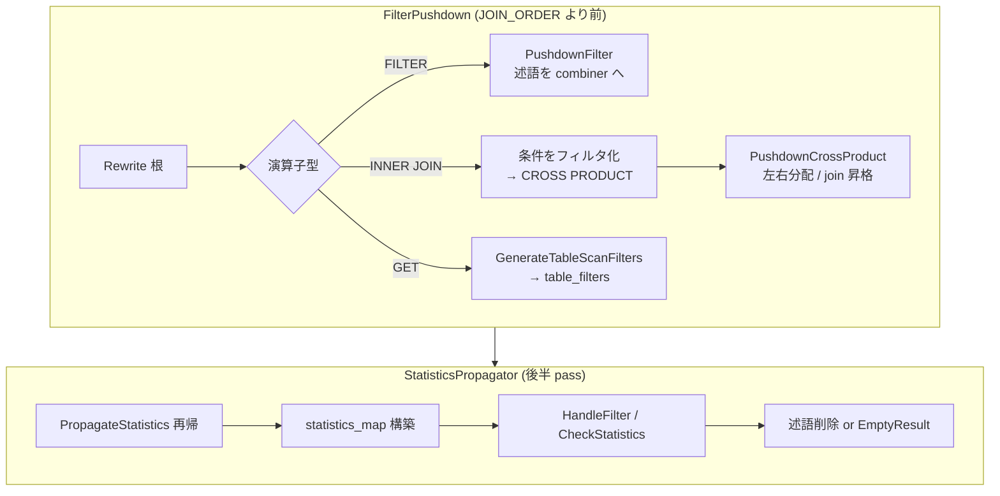

# 第11章 フィルタプッシュダウンと統計伝播

> **本章で読むソース**
>
> - [src/optimizer/filter_pushdown.cpp](https://github.com/duckdb/duckdb/blob/v1.5.4/src/optimizer/filter_pushdown.cpp)
> - [src/optimizer/pushdown/pushdown_filter.cpp](https://github.com/duckdb/duckdb/blob/v1.5.4/src/optimizer/pushdown/pushdown_filter.cpp)
> - [src/optimizer/pushdown/pushdown_inner_join.cpp](https://github.com/duckdb/duckdb/blob/v1.5.4/src/optimizer/pushdown/pushdown_inner_join.cpp)
> - [src/optimizer/pushdown/pushdown_cross_product.cpp](https://github.com/duckdb/duckdb/blob/v1.5.4/src/optimizer/pushdown/pushdown_cross_product.cpp)
> - [src/optimizer/pushdown/pushdown_get.cpp](https://github.com/duckdb/duckdb/blob/v1.5.4/src/optimizer/pushdown/pushdown_get.cpp)
> - [src/optimizer/statistics_propagator.cpp](https://github.com/duckdb/duckdb/blob/v1.5.4/src/optimizer/statistics_propagator.cpp)
> - [src/optimizer/statistics/operator/propagate_filter.cpp](https://github.com/duckdb/duckdb/blob/v1.5.4/src/optimizer/statistics/operator/propagate_filter.cpp)
> - [src/optimizer/statistics/operator/propagate_get.cpp](https://github.com/duckdb/duckdb/blob/v1.5.4/src/optimizer/statistics/operator/propagate_get.cpp)

## この章の狙い

第10章の `FILTER_PUSHDOWN` と `STATISTICS_PROPAGATION` pass の中身を、実装の主経路に沿って読む。
`FilterPushdown` が論理木を再帰的に書き換えて述語を下へ送る仕組みと、`StatisticsPropagator` が列統計を伝播してフィルタや table filter を刈り込む仕組みを対比する。

## 前提

`LogicalFilter`、`LogicalGet`、`LogicalComparisonJoin` の位置づけは第9章を前提とする。
`Optimizer::RunBuiltInOptimizers` での呼び出し順序は第10章を参照する。

## FilterPushdown の入口

`FILTER_PUSHDOWN` pass は `CheckMarkToSemi` で MARK join の semi 変換可否を先に調べ、続けて `Rewrite` を根から呼ぶ（呼び出し元は第10章の `RunBuiltInOptimizers`）。
`Rewrite` は演算子型ごとに `pushdown/` 配下の専用関数へ分岐する。

[src/optimizer/filter_pushdown.cpp L94-L96](https://github.com/duckdb/duckdb/blob/v1.5.4/src/optimizer/filter_pushdown.cpp#L94-L96)

```cpp
FilterPushdown::FilterPushdown(Optimizer &optimizer, bool convert_mark_joins)
    : optimizer(optimizer), combiner(optimizer.context), convert_mark_joins(convert_mark_joins) {
}
```

`Rewrite` の switch は集約、フィルタ、結合、スキャンなど型別のハンドラへ振り分ける。
未対応型は `FinishPushdown` が子を先に再帰し、残った述語を `LogicalFilter` として載せ直す。

[src/optimizer/filter_pushdown.cpp L98-L143](https://github.com/duckdb/duckdb/blob/v1.5.4/src/optimizer/filter_pushdown.cpp#L98-L143)

```cpp
unique_ptr<LogicalOperator> FilterPushdown::Rewrite(unique_ptr<LogicalOperator> op) {
	D_ASSERT(!combiner.HasFilters());
	switch (op->type) {
	case LogicalOperatorType::LOGICAL_AGGREGATE_AND_GROUP_BY:
		return PushdownAggregate(std::move(op));
	case LogicalOperatorType::LOGICAL_FILTER:
		return PushdownFilter(std::move(op));
	case LogicalOperatorType::LOGICAL_CROSS_PRODUCT:
		return PushdownCrossProduct(std::move(op));
	case LogicalOperatorType::LOGICAL_COMPARISON_JOIN:
	case LogicalOperatorType::LOGICAL_ANY_JOIN:
	case LogicalOperatorType::LOGICAL_ASOF_JOIN:
	case LogicalOperatorType::LOGICAL_DELIM_JOIN:
		return PushdownJoin(std::move(op));
	case LogicalOperatorType::LOGICAL_PROJECTION:
		return PushdownProjection(std::move(op));
	// ... (中略) ...
	case LogicalOperatorType::LOGICAL_GET:
		return PushdownGet(std::move(op));
	case LogicalOperatorType::LOGICAL_LIMIT:
		return PushdownLimit(std::move(op));
	case LogicalOperatorType::LOGICAL_WINDOW:
		return PushdownWindow(std::move(op));
	case LogicalOperatorType::LOGICAL_UNNEST:
		return PushdownUnnest(std::move(op));
	default:
		return FinishPushdown(std::move(op));
	}
}
```

述語は `FilterPushdown::Filter` に蓄え、`FilterCombiner` が AND 分解と矛盾検出を担う。
`AddFilter` は `LogicalFilter::SplitPredicates` で conjunct へ割ったあと combiner へ渡し、恒 false なら `UNSATISFIABLE` を返す。

[src/optimizer/filter_pushdown.cpp L225-L239](https://github.com/duckdb/duckdb/blob/v1.5.4/src/optimizer/filter_pushdown.cpp#L225-L239)

```cpp
FilterResult FilterPushdown::AddFilter(unique_ptr<Expression> expr) {
	if (PushFilters() == FilterResult::UNSATISFIABLE) {
		return FilterResult::UNSATISFIABLE;
	}
	// split up the filters by AND predicate
	vector<unique_ptr<Expression>> expressions;
	expressions.push_back(std::move(expr));
	LogicalFilter::SplitPredicates(expressions);
	// push the filters into the combiner
	for (auto &child_expr : expressions) {
		if (combiner.AddFilter(std::move(child_expr)) == FilterResult::UNSATISFIABLE) {
			return FilterResult::UNSATISFIABLE;
		}
	}
	return FilterResult::SUCCESS;
}
```

## フィルタノードと内部結合の処理

`PushdownFilter` は `LogicalFilter` の式を combiner へ取り込み、子演算子だけを `Rewrite` する。
恒 false と判定された述語は木全体を `LogicalEmptyResult` に置き換える。

[src/optimizer/pushdown/pushdown_filter.cpp L9-L24](https://github.com/duckdb/duckdb/blob/v1.5.4/src/optimizer/pushdown/pushdown_filter.cpp#L9-L24)

```cpp
unique_ptr<LogicalOperator> FilterPushdown::PushdownFilter(unique_ptr<LogicalOperator> op) {
	D_ASSERT(op->type == LogicalOperatorType::LOGICAL_FILTER);
	auto &filter = op->Cast<LogicalFilter>();
	if (filter.HasProjectionMap()) {
		return FinishPushdown(std::move(op));
	}
	// filter: gather the filters and remove the filter from the set of operations
	for (auto &expression : filter.expressions) {
		if (AddFilter(std::move(expression)) == FilterResult::UNSATISFIABLE) {
			// filter statically evaluates to false, strip tree
			return make_uniq<LogicalEmptyResult>(std::move(op));
		}
	}
	GenerateFilters();
	return Rewrite(std::move(filter.children[0]));
}
```

内部結合は join 条件をフィルタ集合へ統合し、演算子を `LogicalCrossProduct` に落としてから `PushdownCrossProduct` へ渡す。
これにより結合述語と WHERE 句が同じプッシュダウン経路を共有する。

[src/optimizer/pushdown/pushdown_inner_join.cpp L20-L52](https://github.com/duckdb/duckdb/blob/v1.5.4/src/optimizer/pushdown/pushdown_inner_join.cpp#L20-L52)

```cpp
	// inner join: gather all the conditions of the inner join and add to the filter list
	if (op->type == LogicalOperatorType::LOGICAL_ANY_JOIN) {
		auto &any_join = join.Cast<LogicalAnyJoin>();
		// any join: only one filter to add
		if (AddFilter(std::move(any_join.condition)) == FilterResult::UNSATISFIABLE) {
			// filter statically evaluates to false, strip tree
			return make_uniq<LogicalEmptyResult>(std::move(op));
		}
	} else {
		// comparison join
		D_ASSERT(op->type == LogicalOperatorType::LOGICAL_COMPARISON_JOIN);
		auto &comp_join = join.Cast<LogicalComparisonJoin>();
		// turn the conditions into filters
		for (auto &i : comp_join.conditions) {
			auto condition = JoinCondition::CreateExpression(std::move(i));
			if (AddFilter(std::move(condition)) == FilterResult::UNSATISFIABLE) {
				// filter statically evaluates to false, strip tree
				return make_uniq<LogicalEmptyResult>(std::move(op));
			}
		}
	}
	GenerateFilters();

	// turn the inner join into a cross product
	auto cross_product = make_uniq<LogicalCrossProduct>(std::move(op->children[0]), std::move(op->children[1]));

	// preserve the estimated cardinality of the operator
	if (op->has_estimated_cardinality) {
		cross_product->SetEstimatedCardinality(op->estimated_cardinality);
	}

	// then push down cross product
	return PushdownCrossProduct(std::move(cross_product));
```

## クロス積での左右分割とスキャンへの押し下げ

`PushdownCrossProduct` は各述語の `table_index` 集合を左右の binding と照合し、片側だけに閉じる述語は左右の `FilterPushdown` へ分配する。
両側にまたがる述語は join 条件へ昇格し、条件が残れば `LogicalComparisonJoin` を生成する。

[src/optimizer/pushdown/pushdown_cross_product.cpp L21-L69](https://github.com/duckdb/duckdb/blob/v1.5.4/src/optimizer/pushdown/pushdown_cross_product.cpp#L21-L69)

```cpp
	if (!filters.empty()) {
		// check to see into which side we should push the filters
		// first get the LHS and RHS bindings
		LogicalJoin::GetTableReferences(*op->children[0], left_bindings);
		LogicalJoin::GetTableReferences(*op->children[1], right_bindings);
		// now check the set of filters
		for (auto &f : filters) {
			auto side = JoinSide::GetJoinSide(f->bindings, left_bindings, right_bindings);
			if (side == JoinSide::LEFT) {
				// bindings match left side: push into left
				left_pushdown.filters.push_back(std::move(f));
			} else if (side == JoinSide::RIGHT) {
				right_pushdown.filters.push_back(std::move(f));
			} else {
				D_ASSERT(side == JoinSide::BOTH || side == JoinSide::NONE);
				// bindings match both: turn into join condition
				join_expressions.push_back(std::move(f->filter));
			}
		}
	}

	op->children[0] = left_pushdown.Rewrite(std::move(op->children[0]));
	op->children[1] = right_pushdown.Rewrite(std::move(op->children[1]));

	if (!join_expressions.empty()) {
		// join conditions found: turn into inner join
		// extract join conditions
		vector<JoinCondition> conditions;
		vector<unique_ptr<Expression>> arbitrary_expressions;
		const auto join_type = JoinType::INNER;
		LogicalComparisonJoin::ExtractJoinConditions(GetContext(), join_type, join_ref_type, op->children[0],
		                                             op->children[1], left_bindings, right_bindings, join_expressions,
		                                             conditions, arbitrary_expressions);
		// create the join from the join conditions
		auto new_op = LogicalComparisonJoin::CreateJoin(join_type, join_ref_type, std::move(op->children[0]),
		                                                std::move(op->children[1]), std::move(conditions),
		                                                std::move(arbitrary_expressions));
```

`LogicalGet` まで到達した述語は、table function が `filter_pushdown` を実装していれば `FilterCombiner::GenerateTableScanFilters` で `TableFilter` へ変換される。
`pushdown_complex_filter` を持つ scan 関数には残り式をまとめて渡し、scan 側でさらに削る。

[src/optimizer/pushdown/pushdown_get.cpp L48-L59](https://github.com/duckdb/duckdb/blob/v1.5.4/src/optimizer/pushdown/pushdown_get.cpp#L48-L59)

```cpp
	if (!get.table_filters.filters.empty() || !get.function.filter_pushdown) {
		// the table function does not support filter pushdown: push a LogicalFilter on top
		return FinishPushdown(std::move(op));
	}
	if (PushFilters() == FilterResult::UNSATISFIABLE) {
		return make_uniq<LogicalEmptyResult>(std::move(op));
	}

	auto &column_ids = get.GetColumnIds();
	//! We generate the table filters that will be executed during the table scan
	vector<FilterPushdownResult> pushdown_results;
	get.table_filters = combiner.GenerateTableScanFilters(column_ids, pushdown_results);
```

## StatisticsPropagator の骨格

統計伝播 pass は `StatisticsPropagator` を構築し、根から `PropagateStatistics` を再帰する。
演算子型ごとの実装は `statistics/operator/` に分かれ、各ノード処理の末尾で `CompressedMaterialization` が統計に基づく圧縮を試みる。

[src/optimizer/statistics_propagator.cpp L40-L91](https://github.com/duckdb/duckdb/blob/v1.5.4/src/optimizer/statistics_propagator.cpp#L40-L91)

```cpp
unique_ptr<NodeStatistics> StatisticsPropagator::PropagateStatistics(LogicalOperator &node,
                                                                     unique_ptr<LogicalOperator> &node_ptr) {
	unique_ptr<NodeStatistics> result;
	switch (node.type) {
	case LogicalOperatorType::LOGICAL_AGGREGATE_AND_GROUP_BY:
		result = PropagateStatistics(node.Cast<LogicalAggregate>(), node_ptr);
		break;
	case LogicalOperatorType::LOGICAL_CROSS_PRODUCT:
		result = PropagateStatistics(node.Cast<LogicalCrossProduct>(), node_ptr);
		break;
	case LogicalOperatorType::LOGICAL_FILTER:
		result = PropagateStatistics(node.Cast<LogicalFilter>(), node_ptr);
		break;
	case LogicalOperatorType::LOGICAL_GET:
		result = PropagateStatistics(node.Cast<LogicalGet>(), node_ptr);
		break;
	// ... (中略) ...
	default:
		result = PropagateChildren(node, node_ptr);
	}

	if (!optimizer.OptimizerDisabled(OptimizerType::COMPRESSED_MATERIALIZATION)) {
		// compress data based on statistics for materializing operators
		CompressedMaterialization compressed_materialization(optimizer, *root, statistics_map);
		compressed_materialization.Compress(node_ptr);
	}

	return result;
}
```

## フィルタノードでの統計更新とプルーニング

`propagate_filter.cpp` の `HandleFilter` は式を先に伝播し、定数に畳めるなら `FILTER_ALWAYS_TRUE` / `FILTER_FALSE_OR_NULL` を返す。
比較式は `UpdateFilterStatistics` で min/max や NOT NULL 情報を列統計へ反映する。

[src/optimizer/statistics/operator/propagate_filter.cpp L227-L283](https://github.com/duckdb/duckdb/blob/v1.5.4/src/optimizer/statistics/operator/propagate_filter.cpp#L227-L283)

```cpp
FilterPropagateResult StatisticsPropagator::HandleFilter(unique_ptr<Expression> &condition) {
	PropagateExpression(condition);

	if (ExpressionIsConstant(*condition, Value::BOOLEAN(true))) {
		return FilterPropagateResult::FILTER_ALWAYS_TRUE;
	}

	if (ExpressionIsConstantOrNull(*condition, Value::BOOLEAN(true))) {
		return FilterPropagateResult::FILTER_TRUE_OR_NULL;
	}

	if (ExpressionIsConstant(*condition, Value::BOOLEAN(false)) ||
	    ExpressionIsConstantOrNull(*condition, Value::BOOLEAN(false))) {
		return FilterPropagateResult::FILTER_FALSE_OR_NULL;
	}

	// cannot prune this filter: propagate statistics from the filter
	UpdateFilterStatistics(*condition);
	return FilterPropagateResult::NO_PRUNING_POSSIBLE;
}

unique_ptr<NodeStatistics> StatisticsPropagator::PropagateStatistics(LogicalFilter &filter,
                                                                     unique_ptr<LogicalOperator> &node_ptr) {
	// first propagate to the child
	node_stats = PropagateStatistics(filter.children[0]);
	if (filter.children[0]->type == LogicalOperatorType::LOGICAL_EMPTY_RESULT) {
		ReplaceWithEmptyResult(node_ptr);
		return make_uniq<NodeStatistics>(0U, 0U);
	}

	// then propagate to each of the expressions
	for (idx_t i = 0; i < filter.expressions.size(); i++) {
		auto &condition = filter.expressions[i];
		auto prune_result = HandleFilter(condition);
		if (prune_result == FilterPropagateResult::FILTER_ALWAYS_TRUE) {
			// filter is always true; it is useless to execute it
			// erase this condition
			filter.expressions.erase_at(i);
			i--;
			if (filter.expressions.empty()) {
				// if there is a projection map, we should keep the filter
				// the physical planner will eventually skip the filter, but will keep
				// the correct columns.
				if (filter.projection_map.empty()) {
					node_ptr = std::move(filter.children[0]);
				}
				break;
			}
		} else if (prune_result == FilterPropagateResult::FILTER_FALSE_OR_NULL) {
			// filter is always false or null; this entire filter should be replaced by an empty result block
			ReplaceWithEmptyResult(node_ptr);
			return make_uniq<NodeStatistics>(0U, 0U);
		}
	}
	// the max cardinality of a filter is the cardinality of the input (i.e. no tuples get filtered)
	return std::move(node_stats);
}
```

数値列の `col < constant` では `NumericStats::SetMax` が呼ばれ、以降のノードはより狭い値域を前提にできる。

[src/optimizer/statistics/operator/propagate_filter.cpp L49-L69](https://github.com/duckdb/duckdb/blob/v1.5.4/src/optimizer/statistics/operator/propagate_filter.cpp#L49-L69)

```cpp
void StatisticsPropagator::UpdateFilterStatistics(BaseStatistics &stats, ExpressionType comparison_type,
                                                  const Value &constant) {
	// regular comparisons removes all null values
	if (!IsCompareDistinct(comparison_type)) {
		stats.Set(StatsInfo::CANNOT_HAVE_NULL_VALUES);
	}
	if (!stats.GetType().IsNumeric()) {
		// don't handle non-numeric columns here (yet)
		return;
	}
	if (!NumericStats::HasMinMax(stats)) {
		// no stats available: skip this
		return;
	}
	switch (comparison_type) {
	case ExpressionType::COMPARE_LESSTHAN:
	case ExpressionType::COMPARE_LESSTHANOREQUALTO:
		// X < constant OR X <= constant
		// max becomes the constant
		NumericStats::SetMax(stats, constant);
		break;
```

## LogicalGet と table filter の統計検査

`propagate_get.cpp` は scan 関数の `statistics` / `statistics_extended` から列統計を `statistics_map` へ登録する。
第11章前半で `FilterPushdown` が載せた `table_filters` について、`PropagateTableFilter` と `filter.CheckStatistics` で恒真と恒偽を判定し、不要 filter を削るか `LogicalEmptyResult` へ置き換える。

[src/optimizer/statistics/operator/propagate_get.cpp L117-L196](https://github.com/duckdb/duckdb/blob/v1.5.4/src/optimizer/statistics/operator/propagate_get.cpp#L117-L196)

```cpp
unique_ptr<NodeStatistics> StatisticsPropagator::PropagateStatistics(LogicalGet &get,
                                                                     unique_ptr<LogicalOperator> &node_ptr) {
	if (get.function.cardinality) {
		node_stats = get.function.cardinality(context, get.bind_data.get());
	}
	if (!get.function.statistics && !get.function.statistics_extended) {
		// no column statistics to get
		return std::move(node_stats);
	}
	auto &column_ids = get.GetColumnIds();
	for (idx_t i = 0; i < column_ids.size(); i++) {
		unique_ptr<BaseStatistics> stats;
		if (get.function.statistics_extended) {
			TableFunctionGetStatisticsInput input(get.bind_data.get(), column_ids[i]);
			stats = get.function.statistics_extended(context, input);
		} else {
			stats = get.function.statistics(context, get.bind_data.get(), column_ids[i].GetPrimaryIndex());
		}

		if (stats) {
			ColumnBinding binding(get.table_index, i);
			statistics_map.insert(make_pair(binding, std::move(stats)));
		}
	}
	// push table filters into the statistics
	// ... (中略) ...
		auto propagate_result = PropagateTableFilter(stats_binding, stats, *filter);
		switch (propagate_result) {
		case FilterPropagateResult::FILTER_ALWAYS_TRUE:
			// filter is always true; it is useless to execute it
			// erase this condition
			get.table_filters.filters.erase(table_filter_column);
			break;
		// ... (中略) ...
		case FilterPropagateResult::FILTER_FALSE_OR_NULL:
		case FilterPropagateResult::FILTER_ALWAYS_FALSE:
			// filter is always false; this entire filter should be replaced by an empty result block
			ReplaceWithEmptyResult(node_ptr);
			return make_uniq<NodeStatistics>(0U, 0U);
		default:
			// general case: filter can be true or false, update this columns' statistics
			UpdateFilterStatistics(stats, *filter);
			break;
		}
	}
	return std::move(node_stats);
}
```

伝播結果の `statistics_map` は第10章で示したとおり、直後の `TOP_N_WINDOW_ELIMINATION` へだけ渡される。

## 処理の流れ



## 高速化と最適化の工夫

フィルタプッシュダウンは述語を `LogicalGet` の `table_filters` まで落とし、ストレージや Parquet 側の zonemap 判定を実行時に使えるようにする。
`FilterCombiner` が AND 統合と矛盾検出をまとめて行うため、複数の WHERE 句を個別演算子として残さず、scan 起動前に述語集合を圧縮できる。

統計伝播は min/max と NOT NULL 情報を更新し、恒真フィルタを木から除去する。
`LogicalGet` では統計と矛盾する table filter を `LogicalEmptyResult` に落とし、後続の結合や集約を実行しない。

## まとめ

`FilterPushdown` は `Rewrite` と `pushdown/` の型別ハンドラで述語を下へ送り、内部結合は一旦クロス積に戻してから左右へ分配する。
`StatisticsPropagator` は `statistics/operator/` で列統計を伝播し、フィルタと table filter を統計的に刈り込む。
前者は主に I/O と中間結果の削減、後者はプラン簡約と後続 pass 向けの統計提供を担う。

## 関連する章

- 第10章（オプティマイザ全体像）：pass 順序と `RunOptimizer`
- 第12章（結合順序最適化）：`JOIN_ORDER` とクロス積の再構成
- 第18章（テーブル走査と table function）：`table_filters` の実行時適用
- 第26章（row group と列データ）：zonemap と統計のストレージ側
