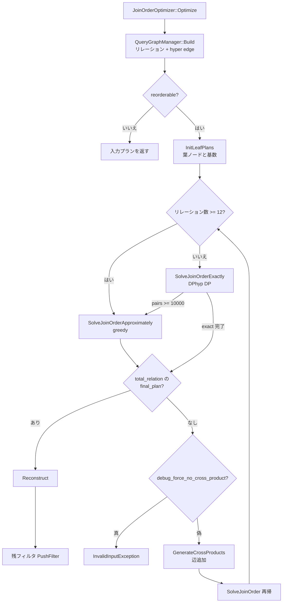

# 第12章 結合順序最適化

> **本章で読むソース**
>
> - [src/optimizer/join_order/join_order_optimizer.cpp](https://github.com/duckdb/duckdb/blob/v1.5.4/src/optimizer/join_order/join_order_optimizer.cpp)
> - [src/optimizer/join_order/query_graph_manager.cpp](https://github.com/duckdb/duckdb/blob/v1.5.4/src/optimizer/join_order/query_graph_manager.cpp)
> - [src/optimizer/join_order/query_graph.cpp](https://github.com/duckdb/duckdb/blob/v1.5.4/src/optimizer/join_order/query_graph.cpp)
> - [src/optimizer/join_order/plan_enumerator.cpp](https://github.com/duckdb/duckdb/blob/v1.5.4/src/optimizer/join_order/plan_enumerator.cpp)
> - [src/optimizer/join_order/cost_model.cpp](https://github.com/duckdb/duckdb/blob/v1.5.4/src/optimizer/join_order/cost_model.cpp)
> - [src/optimizer/join_order/cardinality_estimator.cpp](https://github.com/duckdb/duckdb/blob/v1.5.4/src/optimizer/join_order/cardinality_estimator.cpp)
> - [src/optimizer/join_order/relation_manager.cpp](https://github.com/duckdb/duckdb/blob/v1.5.4/src/optimizer/join_order/relation_manager.cpp)

## この章の狙い

第11章までのフィルタプッシュダウンで述語は木の下へ寄ったが、多表結合では結合順序が中間結果の大きさを左右する。
本章では `JOIN_ORDER` pass の核である `JoinOrderOptimizer` を追い、query graph の構築、カーディナリティとコスト見積り、`PlanEnumerator` による結合順探索（exact DP と greedy フォールバック）を読む。

## 前提

`LogicalComparisonJoin` と `ColumnBinding` は第9章、フィルタプッシュダウンは第11章を前提とする。
`JOIN_ORDER` pass が `Optimizer::RunBuiltInOptimizers` のどこで呼ばれるかは第10章を参照する。

## JoinOrderOptimizer の全体制御

`JoinOrderOptimizer::Optimize` はまず `QueryGraphManager::Build` で論理木から結合可能なリレーション集合とフィルタ辺を抽出する。
`reorderable` が真のときだけ `PlanEnumerator` が DP 表を埋め、最後に `Reconstruct` で論理木へ書き戻す。

[src/optimizer/join_order/join_order_optimizer.cpp L27-L68](https://github.com/duckdb/duckdb/blob/v1.5.4/src/optimizer/join_order/join_order_optimizer.cpp#L27-L68)

```cpp
unique_ptr<LogicalOperator> JoinOrderOptimizer::Optimize(unique_ptr<LogicalOperator> plan,
                                                         optional_ptr<RelationStats> stats) {
	auto max_expression_depth = Settings::Get<MaxExpressionDepthSetting>(query_graph_manager.context);
	if (depth > max_expression_depth) {
		// Very deep plans will eventually consume quite some stack space
		// Returning the current plan is always a valid choice
		return plan;
	}

	// make sure query graph manager has not extracted a relation graph already
	LogicalOperator *op = plan.get();

	// extract the relations that go into the hyper graph.
	// We optimize the children of any non-reorderable operations we come across.
	bool reorderable = query_graph_manager.Build(*this, *op);

	// get relation_stats here since the reconstruction process will move all relations.
	auto relation_stats = query_graph_manager.relation_manager.GetRelationStats();
	unique_ptr<LogicalOperator> new_logical_plan = nullptr;

	if (reorderable) {
		// query graph now has filters and relations
		auto cost_model = CostModel(query_graph_manager);

		// Initialize a plan enumerator.
		auto plan_enumerator =
		    PlanEnumerator(query_graph_manager, cost_model, query_graph_manager.GetQueryGraphEdges());

		// Initialize the leaf/single node plans
		plan_enumerator.InitLeafPlans();
		plan_enumerator.SolveJoinOrder();
		// now reconstruct a logical plan from the query graph plan
		query_graph_manager.plans = &plan_enumerator.GetPlans();

		new_logical_plan = query_graph_manager.Reconstruct(std::move(plan));
	} else {
		new_logical_plan = std::move(plan);
```

再帰深度が `MaxExpressionDepthSetting` を超えた場合は書き換えを諦めて入力プランを返す。
ネストしたサブプランでは `CreateChildOptimizer` が `depth` を増やして同じ制限を共有する。

## リレーション抽出と query graph

`RelationManager::ExtractJoinRelations` は単一子の投影やフィルタを辿りながら、結合の左右から再帰的にリレーションを登録する。
`LOGICAL_FILTER` は `filter_operators` に蓄え、後段の hyper edge 生成の材料になる。

[src/optimizer/join_order/relation_manager.cpp L205-L223](https://github.com/duckdb/duckdb/blob/v1.5.4/src/optimizer/join_order/relation_manager.cpp#L205-L223)

```cpp
bool RelationManager::ExtractJoinRelations(JoinOrderOptimizer &optimizer, LogicalOperator &input_op,
                                           vector<reference<LogicalOperator>> &filter_operators,
                                           optional_ptr<LogicalOperator> parent) {
	optional_ptr<LogicalOperator> op = &input_op;
	vector<reference<LogicalOperator>> datasource_filters;
	optional_ptr<LogicalOperator> limit_op = nullptr;
	// pass through single child operators
	while (op->children.size() == 1 && !OperatorNeedsRelation(op->type)) {
		if (op->type == LogicalOperatorType::LOGICAL_FILTER) {
			if (HasNonReorderableChild(*op)) {
				datasource_filters.push_back(*op);
			}
			filter_operators.push_back(*op);
		}
		if (op->type == LogicalOperatorType::LOGICAL_LIMIT) {
			limit_op = op;
		}
		op = op->children[0].get();
	}
```

`QueryGraphManager::Build` はリレーション数が2未満、または並べ替え不可なら `false` を返す。
比較式フィルタの左右 binding が異なるリレーションに分かれるとき、`CreateHyperGraphEdges` が query graph に双方向の辺を張る。

[src/optimizer/join_order/query_graph_manager.cpp L22-L36](https://github.com/duckdb/duckdb/blob/v1.5.4/src/optimizer/join_order/query_graph_manager.cpp#L22-L36)

```cpp
bool QueryGraphManager::Build(JoinOrderOptimizer &optimizer, LogicalOperator &op) {
	// have the relation manager extract the join relations and create a reference list of all the
	// filter operators.
	auto can_reorder = relation_manager.ExtractJoinRelations(optimizer, op, filter_operators);
	auto num_relations = relation_manager.NumRelations();
	if (num_relations <= 1 || !can_reorder) {
		// nothing to optimize/reorder
		return false;
	}
	// extract the edges of the hypergraph, creating a list of filters and their associated bindings.
	filters_and_bindings = relation_manager.ExtractEdges(op, filter_operators, set_manager);
	// Create the query_graph hyper edges
	CreateHyperGraphEdges();
	return true;
}
```

`QueryGraphEdges::CreateEdge` は左リレーション集合を trie 状に辿り、右集合への `NeighborInfo` を追加する。
同一ペアに複数フィルタが載ると `filters` ベクタへ追記される。

[src/optimizer/join_order/query_graph.cpp L56-L78](https://github.com/duckdb/duckdb/blob/v1.5.4/src/optimizer/join_order/query_graph.cpp#L56-L78)

```cpp
void QueryGraphEdges::CreateEdge(JoinRelationSet &left, JoinRelationSet &right, optional_ptr<FilterInfo> filter_info) {
	D_ASSERT(left.count > 0 && right.count > 0);
	// find the EdgeInfo corresponding to the left set
	auto info = GetQueryEdge(left);
	// now insert the edge to the right relation, if it does not exist
	for (idx_t i = 0; i < info->neighbors.size(); i++) {
		if (info->neighbors[i]->neighbor == &right) {
			if (filter_info) {
				// neighbor already exists just add the filter, if we have any
				info->neighbors[i]->filters.push_back(filter_info);
			}
			return;
		}
	}
	// neighbor does not exist, create it
	auto n = make_uniq<NeighborInfo>(&right);
	// if the edge represents a cross product, filter_info is null. The easiest way then to determine
	// if an edge is for a cross product is if the filters are empty
	if (info && filter_info) {
		n->filters.push_back(filter_info);
	}
	info->neighbors.push_back(std::move(n));
}
```

## カーディナリティとコスト見積り

`PlanEnumerator::InitLeafPlans` は各リレーションを葉ノードとして DP 表 `plans` に登録し、`CardinalityEstimator` に同等リレーション集合と基数を渡す。

`CostModel::ComputeCost` は現状、結合後カーディナリティをコストとみなし、左右部分木のコストを加算する。
結合アルゴリズムの種別はまだここでは区別しない。

[src/optimizer/join_order/cost_model.cpp L11-L18](https://github.com/duckdb/duckdb/blob/v1.5.4/src/optimizer/join_order/cost_model.cpp#L11-L18)

```cpp
// Currently cost of a join only factors in the cardinalities.
// If join types and join algorithms are to be considered, they should be added here.
double CostModel::ComputeCost(DPJoinNode &left, DPJoinNode &right) {
	auto &combination = query_graph_manager.set_manager.Union(left.set, right.set);
	auto join_card = cardinality_estimator.EstimateCardinalityWithSet<double>(combination);
	auto join_cost = join_card;
	return join_cost + left.cost + right.cost;
}
```

結合後集合の基数は、分子（参加リレーションの積）を分母（結合述語の推定 distinct 数）で割る形で推定する。
結果は `relation_set_2_cardinality` にキャッシュされる。

[src/optimizer/join_order/cardinality_estimator.cpp L411-L425](https://github.com/duckdb/duckdb/blob/v1.5.4/src/optimizer/join_order/cardinality_estimator.cpp#L411-L425)

```cpp
double CardinalityEstimator::EstimateCardinalityWithSet(JoinRelationSet &new_set) {
	if (relation_set_2_cardinality.find(new_set.ToString()) != relation_set_2_cardinality.end()) {
		return relation_set_2_cardinality[new_set.ToString()].cardinality_before_filters;
	}

	// can happen if a table has cardinality 0, or a tdom is set to 0
	auto denom = GetDenominator(new_set);
	// we pass numerator relations, because for semi and anti joins, we don't want to
	// include cardinalities of relations on the RHS of a semi/anti join.
	auto numerator = GetNumerator(denom.numerator_relations);

	double result = numerator / denom.denominator;
	auto new_entry = CardinalityHelper(result);
	relation_set_2_cardinality[new_set.ToString()] = new_entry;
	return result;
}
```

## PlanEnumerator: exact DP と greedy フォールバック

`SolveJoinOrderExactly` は DPhyp 系の列挙（`EmitCSG` / `EnumerateCSGRecursive`）で部分結合を DP 表へ登録する。
`TryEmitPair` は生成したペア数 `pairs` を数え、10000 に達したら exact 探索を打ち切り `false` を返す。

[src/optimizer/join_order/plan_enumerator.cpp L168-L181](https://github.com/duckdb/duckdb/blob/v1.5.4/src/optimizer/join_order/plan_enumerator.cpp#L168-L181)

```cpp
bool PlanEnumerator::TryEmitPair(JoinRelationSet &left, JoinRelationSet &right,
                                 const vector<reference<NeighborInfo>> &info) {
	pairs++;
	// If a full plan is created, it's possible a node in the plan gets updated. When this happens, make sure you keep
	// emitting pairs until you emit another final plan. Another final plan is guaranteed to be produced because of
	// our symmetry guarantees.
	if (pairs >= 10000) {
		// when the amount of pairs gets too large we exit the dynamic programming and resort to a greedy algorithm
		// FIXME: simple heuristic currently
		// at 10K pairs stop searching exactly and switch to heuristic
		return false;
	}
	EmitPair(left, right, info);
	return true;
}
```

`SolveJoinOrder` はリレーション数が `THRESHOLD_TO_SWAP_TO_APPROXIMATE`（12）以上なら最初から greedy（`SolveJoinOrderApproximately`）へ入る。
それ未満では exact を試し、`TryEmitPair` が `pairs >= 10000` で打ち切って `false` を返したときだけ greedy へフォールバックする。

[src/optimizer/join_order/plan_enumerator.cpp L472-L501](https://github.com/duckdb/duckdb/blob/v1.5.4/src/optimizer/join_order/plan_enumerator.cpp#L472-L501)

```cpp
void PlanEnumerator::SolveJoinOrder() {
	bool force_no_cross_product = Settings::Get<DebugForceNoCrossProductSetting>(query_graph_manager.context);
	// first try to solve the join order exactly
	if (query_graph_manager.relation_manager.NumRelations() >= THRESHOLD_TO_SWAP_TO_APPROXIMATE) {
		SolveJoinOrderApproximately();
	} else if (!SolveJoinOrderExactly()) {
		// otherwise, if that times out we resort to a greedy algorithm
		SolveJoinOrderApproximately();
	}

	// now the optimal join path should have been found
	// get it from the node
	unordered_set<idx_t> bindings;
	for (idx_t i = 0; i < query_graph_manager.relation_manager.NumRelations(); i++) {
		bindings.insert(i);
	}
	auto &total_relation = query_graph_manager.set_manager.GetJoinRelation(bindings);
	auto final_plan = plans.find(total_relation);
	if (final_plan == plans.end()) {
		// could not find the final plan
		// this should only happen in case the sets are actually disjunct
		// in this case we need to generate cross product to connect the disjoint sets
		if (force_no_cross_product) {
			throw InvalidInputException(
			    "Query requires a cross-product, but 'force_no_cross_product' PRAGMA is enabled");
		}
		GenerateCrossProducts();
		//! solve the join order again, returning the final plan
		return SolveJoinOrder();
	}
}
```

exact / greedy のどちらでも、全リレーションを束ねた `total_relation` の最終プランが `plans` に無いことがある。
切断された query graph（互いに辺のない集合）では exact が `true` を返しても `final_plan` が無い。
そのとき `GenerateCrossProducts` でクロス積辺を追加してから `SolveJoinOrder` を再帰呼び出しでやり直す。
`DebugForceNoCrossProductSetting`（`force_no_cross_product`）が真なら `InvalidInputException` を投げる。

[src/optimizer/join_order/plan_enumerator.cpp L78-L95](https://github.com/duckdb/duckdb/blob/v1.5.4/src/optimizer/join_order/plan_enumerator.cpp#L78-L95)

```cpp
void PlanEnumerator::GenerateCrossProducts() {
	// generate a set of cross products to combine the currently available plans into a full join plan
	// we create edges between every relation with a high cost
	for (idx_t i = 0; i < query_graph_manager.relation_manager.NumRelations(); i++) {
		auto &left = query_graph_manager.set_manager.GetJoinRelation(i);
		for (idx_t j = 0; j < query_graph_manager.relation_manager.NumRelations(); j++) {
			auto cross_product_allowed = query_graph_manager.relation_manager.CrossProductWithRelationAllowed(i) &&
			                             query_graph_manager.relation_manager.CrossProductWithRelationAllowed(j);
			if (i != j && cross_product_allowed) {
				auto &right = query_graph_manager.set_manager.GetJoinRelation(j);
				query_graph_manager.CreateQueryGraphCrossProduct(left, right);
			}
		}
	}
	// Now that the query graph has new edges, we need to re-initialize our query graph.
	// TODO: do we need to initialize our qyery graph again?
	// query_graph = query_graph_manager.GetQueryGraph();
}
```

greedy 段階では残りリレーション集合の全ペアを走査し、接続可能かつコスト最小の結合を逐次選ぶ。
接続が見つからない場合は最小コストの2リレーション間にクロス積辺を追加してから結合する。

[src/optimizer/join_order/plan_enumerator.cpp L349-L377](https://github.com/duckdb/duckdb/blob/v1.5.4/src/optimizer/join_order/plan_enumerator.cpp#L349-L377)

```cpp
	while (join_relations.size() > 1) {
		// now in every step of the algorithm, we greedily pick the join between the to-be-joined relations that has the
		// smallest cost. This is O(r^2) per step, and every step will reduce the total amount of relations to-be-joined
		// by 1, so the total cost is O(r^3) in the amount of relations
		// long is needed to prevent clang-tidy complaints. (idx_t) cannot be added to an iterator position because it
		// is unsigned.
		idx_t best_left = 0, best_right = 0;
		optional_ptr<DPJoinNode> best_connection;
		for (idx_t i = 0; i < join_relations.size(); i++) {
			auto left = join_relations[i];
			for (idx_t j = i + 1; j < join_relations.size(); j++) {
				auto right = join_relations[j];
				// check if we can connect these two relations
				auto connection = query_graph.GetConnections(left, right);
				if (!connection.empty()) {
					// we can check the cost of this connection
					auto node = EmitPair(left, right, connection);

					// update the DP tree in case a plan created by the DP algorithm uses the node
					// that was potentially just updated by EmitPair. You will get a use-after-free
					// error if future plans rely on the old node that was just replaced.
					// if node in FullPath, then updateDP tree.

					if (!best_connection || node.cost < best_connection->cost) {
						// best pair found so far
						best_connection = &EmitPair(left, right, connection);
						best_left = i;
						best_right = j;
					}
				}
			}
		}
```

## 論理プランへの再構成

`Reconstruct` は各リレーションの部分木を `ExtractJoinRelation` で抜き出し、選択された最終結合木を `GenerateJoins` で再結合する。
リレーション数 12 以上、または pair 上限到達後の greedy 経路では `plans` を更新するため、この木に最適性の保証はない。
まだ消費されていないフィルタは最後に `PushFilter` で木の上へ載せる。

[src/optimizer/join_order/query_graph_manager.cpp L170-L197](https://github.com/duckdb/duckdb/blob/v1.5.4/src/optimizer/join_order/query_graph_manager.cpp#L170-L197)

```cpp
unique_ptr<LogicalOperator> QueryGraphManager::Reconstruct(unique_ptr<LogicalOperator> plan) {
	// now we have to rewrite the plan
	bool root_is_join = plan->children.size() > 1;

	unordered_set<idx_t> bindings;
	for (idx_t i = 0; i < relation_manager.NumRelations(); i++) {
		bindings.insert(i);
	}
	auto &total_relation = set_manager.GetJoinRelation(bindings);

	// first we will extract all relations from the main plan
	vector<unique_ptr<LogicalOperator>> extracted_relations;
	extracted_relations.reserve(relation_manager.NumRelations());
	for (auto &relation : relation_manager.GetRelations()) {
		extracted_relations.push_back(ExtractJoinRelation(relation));
	}

	// now we generate the actual joins
	auto join_tree = GenerateJoins(extracted_relations, total_relation);

	// perform the final pushdown of remaining filters
	for (auto &filter : filters_and_bindings) {
		// check if the filter has already been extracted
		if (filter->filter) {
			// if not we need to push it
			join_tree.op = PushFilter(std::move(join_tree.op), std::move(filter->filter));
		}
	}
```

## 処理の流れ



## 高速化と最適化の工夫

結合順探索は中間結果の推定カーディナリティをコストに使うため、早い段階で大きい結合を避ける順序が選ばれる。
リレーション数 12 以上と DP ペア数 10000 以上の二段フォールバックにより、テーブル数が多いクエリでもオプティマイザがスタックや時間を使い切らない。

semi/anti join の右側は `RelationManager` が単一の非並べ替えリレーションとして扱い、列 binding が失われる並べ替えを禁止する。
これにより最適化で得た結合順が相関サブクエリの意味を壊さない。

## まとめ

`JoinOrderOptimizer` は論理木から query graph を構築し、`PlanEnumerator` がカーディナリティベースのコストで結合順を決める。
exact DP は最大 10000 ペアまで、リレーション数 12 以上は最初から greedy へ切り替わる。
切断 graph ではクロス積辺を足して再探索し、`debug_force_no_cross_product` が真ならエラーになる。
決まった `DPJoinNode` 木を `Reconstruct` が `LogicalComparisonJoin` 列へ戻し、未消費フィルタを載せ直す。
greedy 経路の最終木に最適性の保証はない。

## 関連する章

- 第10章（オプティマイザ全体像）：`JOIN_ORDER` pass の位置
- 第11章（フィルタプッシュダウンと統計伝播）：`JOIN_ORDER` 前の述語配置
- 第13章（式の書き換え）：結合条件に載る式の簡約
- 第20章（ハッシュ結合）：build/probe 側決定（`BUILD_SIDE_PROBE_SIDE` pass）
